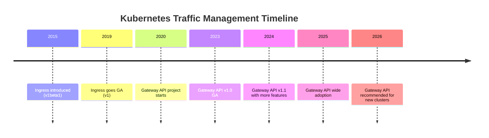
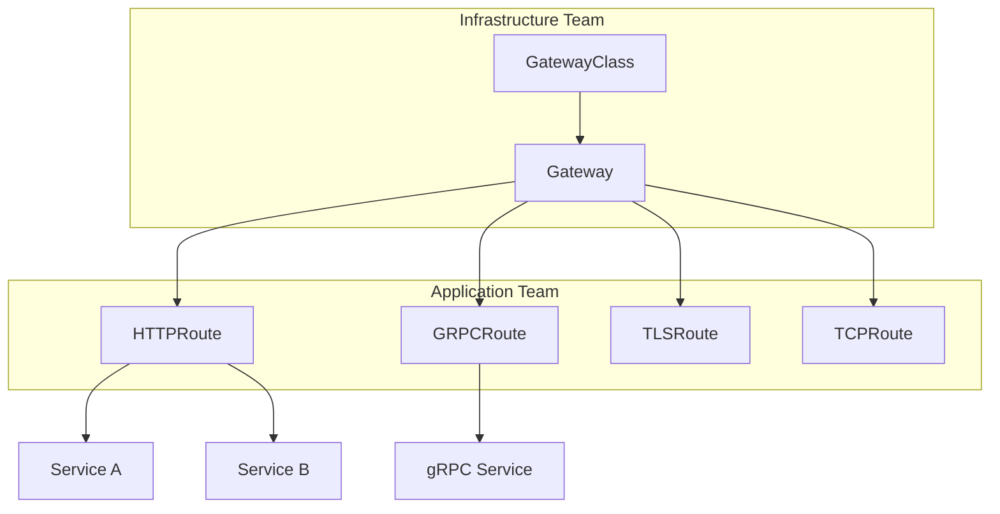
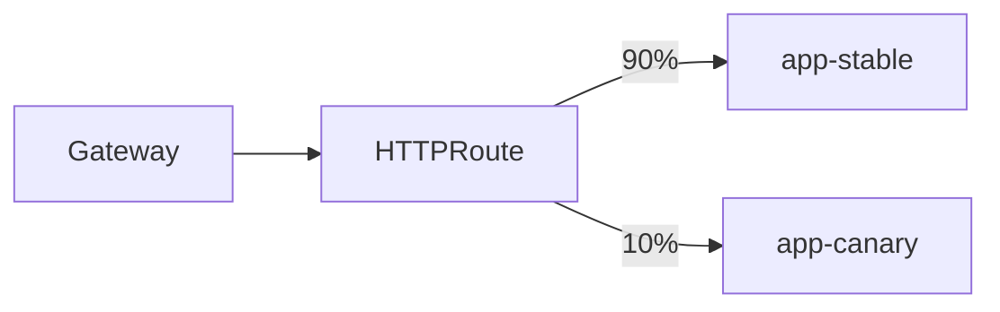
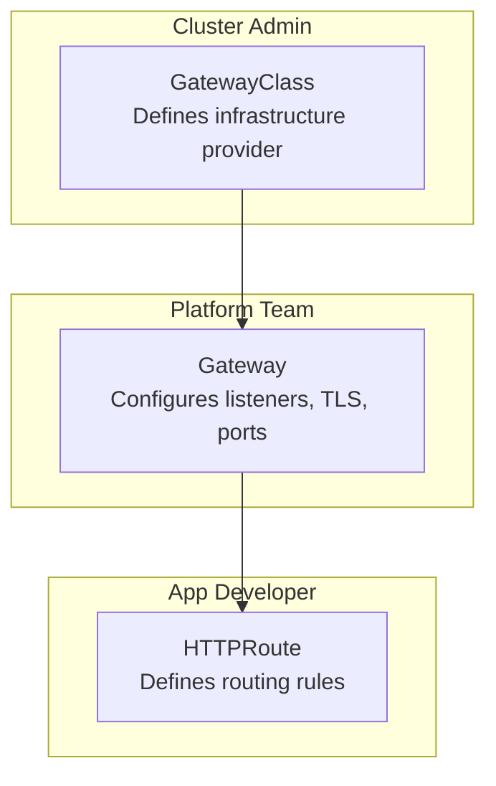

# Kubernetes Ingress vs Gateway API: What to Use in 2026

Author: [nawazdhandala](https://www.github.com/nawazdhandala)

Tags: Kubernetes, Ingress, Gateway API, Networking, HTTP Routing

Description: Compare Kubernetes Ingress and Gateway API features, migration paths, and when to adopt Gateway API for HTTP routing.

---

## The Evolution of Kubernetes Traffic Management

Kubernetes Ingress has been the standard way to expose HTTP services since Kubernetes 1.1. It works, but it has limitations. The Gateway API was designed as its successor, offering more expressive routing, better role separation, and a standardized extension model.

As of 2026, the Gateway API has reached GA (General Availability) and is production-ready. But does that mean you should migrate immediately?



## How Ingress Works

Ingress defines rules that route external HTTP/HTTPS traffic to services inside the cluster.

```yaml
# simple-ingress.yaml
# Route traffic based on hostname
apiVersion: networking.k8s.io/v1
kind: Ingress
metadata:
  name: app-ingress
  annotations:
    # Annotations are controller-specific (not portable)
    nginx.ingress.kubernetes.io/rewrite-target: /
spec:
  ingressClassName: nginx
  rules:
    - host: app.example.com
      http:
        paths:
          - path: /
            pathType: Prefix
            backend:
              service:
                name: frontend
                port:
                  number: 80
  tls:
    - hosts:
        - app.example.com
      secretName: app-tls
```

### Ingress Limitations

1. **Annotation overload** - Advanced features require controller-specific annotations that are not portable.
2. **No role separation** - The same resource defines infrastructure and application routing.
3. **Limited protocol support** - Only HTTP/HTTPS. No TCP, UDP, or gRPC-native routing.
4. **No header-based routing** - Cannot route based on headers without annotations.
5. **No traffic splitting** - Canary deployments require non-standard annotations.

## How Gateway API Works

The Gateway API splits traffic management into multiple resources with clear role boundaries.



```yaml
# gateway.yaml
# Infrastructure team creates the Gateway
apiVersion: gateway.networking.k8s.io/v1
kind: Gateway
metadata:
  name: main-gateway
  namespace: gateway-system
spec:
  gatewayClassName: istio  # or nginx, cilium, envoy, etc.
  listeners:
    - name: http
      protocol: HTTP
      port: 80
    - name: https
      protocol: HTTPS
      port: 443
      tls:
        mode: Terminate
        certificateRefs:
          - name: wildcard-tls
---
# httproute.yaml
# Application team creates routes
apiVersion: gateway.networking.k8s.io/v1
kind: HTTPRoute
metadata:
  name: app-routes
  namespace: default
spec:
  parentRefs:
    - name: main-gateway
      namespace: gateway-system
  hostnames:
    - "app.example.com"
  rules:
    - matches:
        - path:
            type: PathPrefix
            value: /api
      backendRefs:
        - name: api-service
          port: 8080
    - matches:
        - path:
            type: PathPrefix
            value: /
      backendRefs:
        - name: frontend-service
          port: 80
```

## Feature Comparison

| Feature | Ingress | Gateway API |
|---------|---------|-------------|
| HTTP Routing | Yes | Yes |
| HTTPS/TLS | Yes | Yes |
| Header-Based Routing | Via annotations | Native |
| Traffic Splitting | Via annotations | Native |
| TCP/UDP Routing | No | Yes (TCPRoute/UDPRoute) |
| gRPC Routing | Via annotations | Native (GRPCRoute) |
| Role Separation | No | Yes (GatewayClass/Gateway/Route) |
| Cross-Namespace Routing | Limited | Native (ReferenceGrant) |
| Portable Configuration | No (annotations) | Yes (standard spec) |
| Request/Response Manipulation | Via annotations | Native (HTTPRoute filters) |
| Status Reporting | Basic | Detailed per-route status |

## Native Header-Based Routing

Gateway API supports header matching without any annotations:

```yaml
# header-routing.yaml
# Route based on HTTP headers - no annotations needed
apiVersion: gateway.networking.k8s.io/v1
kind: HTTPRoute
metadata:
  name: header-routing
spec:
  parentRefs:
    - name: main-gateway
  rules:
    # Route requests with X-Version: v2 to the new service
    - matches:
        - headers:
            - name: X-Version
              value: v2
      backendRefs:
        - name: api-v2
          port: 8080
    # Default route goes to v1
    - backendRefs:
        - name: api-v1
          port: 8080
```

## Native Traffic Splitting

Canary deployments are built into the Gateway API:

```yaml
# canary-route.yaml
# Split traffic between two versions
apiVersion: gateway.networking.k8s.io/v1
kind: HTTPRoute
metadata:
  name: canary-deploy
spec:
  parentRefs:
    - name: main-gateway
  hostnames:
    - "app.example.com"
  rules:
    - backendRefs:
        # Send 90% of traffic to stable
        - name: app-stable
          port: 8080
          weight: 90
        # Send 10% to canary
        - name: app-canary
          port: 8080
          weight: 10
```



## Role Separation

The Gateway API's biggest advantage is clear role separation:



- **Cluster Admin** installs the GatewayClass (e.g., Istio, Cilium, Nginx)
- **Platform Team** creates Gateways with listeners, TLS, and allowed routes
- **App Developers** create HTTPRoutes that attach to Gateways

This means app developers do not need access to infrastructure configuration.

## Migration from Ingress to Gateway API

You do not have to migrate all at once. Both can coexist in the same cluster.

```bash
# Check if Gateway API CRDs are installed
kubectl get crd | grep gateway

# Install Gateway API CRDs if not present
kubectl apply -f https://github.com/kubernetes-sigs/gateway-api/releases/download/v1.2.0/standard-install.yaml

# Verify the installation
kubectl get gatewayclass
```

Many controllers support both Ingress and Gateway API simultaneously:

```bash
# Example: Install Nginx Gateway Fabric (supports Gateway API)
kubectl apply -f https://github.com/nginx/nginx-gateway-fabric/releases/download/v1.5.0/nginx-gateway-fabric.yaml
```

## When to Stick with Ingress

- Your cluster uses a single controller and simple routing rules
- Your team is familiar with Ingress and has no pain points
- Your controller does not yet support Gateway API
- You have extensive automation built around Ingress resources

## When to Adopt Gateway API

- You need header-based routing, traffic splitting, or gRPC routing
- You want portable configuration across different controllers
- You need role separation between infrastructure and application teams
- You are setting up a new cluster in 2026
- You need cross-namespace routing with fine-grained access control

## Monitoring Your Traffic Layer

Regardless of whether you use Ingress or Gateway API, monitoring your traffic routing is essential. OneUptime (https://oneuptime.com) provides HTTP endpoint monitoring, latency tracking, and alerting for your Kubernetes services, ensuring your routing configuration works correctly and your services remain accessible.
