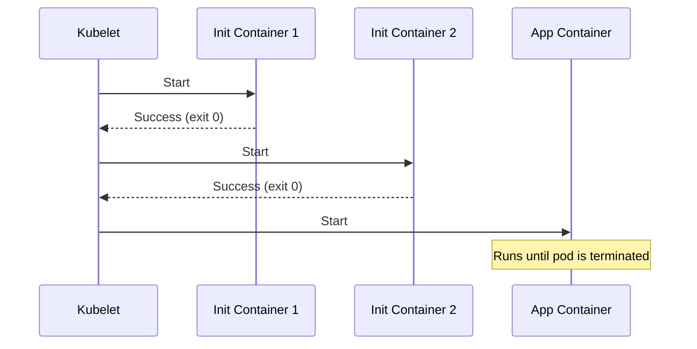
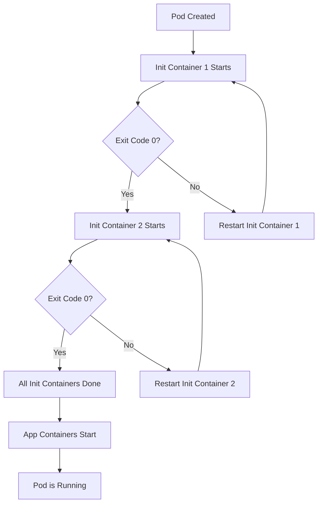

# How to Use Kubernetes Init Containers for Pod Initialization

Author: [nawazdhandala](https://www.github.com/nawazdhandala)

Tags: Kubernetes, Init Containers, Pod Lifecycle, Setup, Initialization

Description: Learn how to use init containers to run setup tasks before main containers start including database migrations and config loading.

---

Sometimes your application needs something to happen before it starts. Maybe a database needs to be reachable, a config file needs to be downloaded, or a migration needs to run first. Kubernetes init containers let you run setup tasks in sequence before your main application container starts. This post covers how init containers work, common patterns, and practical examples.

## How Init Containers Work

Init containers run before app containers and must complete successfully. If an init container fails, Kubernetes restarts it until it succeeds (respecting the restart policy). App containers do not start until all init containers have completed.



Key differences from regular containers:

- Init containers run sequentially, one at a time.
- Init containers must exit with code 0 to succeed.
- Init containers do not support readiness probes (they are not long-running).
- Init containers can use different images from the app container.
- Init containers share volumes with the app container.

## Basic Init Container Example

```yaml
# pod-with-init.yaml
# A pod that waits for a database to be reachable
# before starting the application.
apiVersion: v1
kind: Pod
metadata:
  name: web-app
spec:
  initContainers:
    # First init container: wait for the database
    - name: wait-for-db
      image: busybox:1.36
      command:
        - sh
        - -c
        # Loop until the PostgreSQL port responds
        - |
          echo "Waiting for database..."
          until nc -z postgres-svc 5432; do
            echo "Database not ready, retrying in 3 seconds..."
            sleep 3
          done
          echo "Database is ready!"

    # Second init container: run migrations
    - name: run-migrations
      image: myregistry/db-migrate:latest
      command: ["python", "migrate.py", "--auto"]
      env:
        - name: DATABASE_URL
          valueFrom:
            secretKeyRef:
              name: db-credentials
              key: url

  containers:
    # Main application starts only after both init containers succeed
    - name: web-app
      image: myregistry/web-app:latest
      ports:
        - containerPort: 8080
```

## Common Init Container Patterns

### Wait for a Dependency

The most common pattern is waiting for an upstream service to become available.

```yaml
# wait-for-services.yaml
# Wait for both the database and Redis cache
# to be reachable before starting the app.
spec:
  initContainers:
    - name: wait-for-db
      image: busybox:1.36
      command:
        - sh
        - -c
        - |
          until nc -z postgres-svc.default 5432; do
            sleep 2
          done

    - name: wait-for-cache
      image: busybox:1.36
      command:
        - sh
        - -c
        - |
          until nc -z redis-svc.default 6379; do
            sleep 2
          done
```

### Download Configuration

```yaml
# download-config.yaml
# Download configuration from a remote source
# and write it to a shared volume.
spec:
  initContainers:
    - name: fetch-config
      image: curlimages/curl:8.4.0
      command:
        - sh
        - -c
        # Download the config file and save it to the shared volume
        - |
          curl -sSL https://config.example.com/app/settings.yaml \
            -o /config/settings.yaml
          echo "Config downloaded successfully"
      volumeMounts:
        - name: config
          mountPath: /config

  containers:
    - name: app
      image: myregistry/app:latest
      # The app reads the config from the shared volume
      volumeMounts:
        - name: config
          mountPath: /app/config
          readOnly: true

  volumes:
    # emptyDir volume shared between init and app containers
    - name: config
      emptyDir: {}
```

### Set File Permissions

```yaml
# fix-permissions.yaml
# Fix file permissions on a persistent volume before
# the main container starts. Useful for databases
# that require specific ownership.
spec:
  initContainers:
    - name: fix-permissions
      image: busybox:1.36
      command:
        - sh
        - -c
        # Change ownership to the user the database runs as
        - |
          chown -R 999:999 /data
          chmod 700 /data
      volumeMounts:
        - name: data
          mountPath: /data
      # Run as root to change ownership
      securityContext:
        runAsUser: 0

  containers:
    - name: postgres
      image: postgres:16
      # Run as the postgres user (UID 999)
      securityContext:
        runAsUser: 999
      volumeMounts:
        - name: data
          mountPath: /var/lib/postgresql/data
```

## Init Container Lifecycle



## Resource Management

Init containers can have their own resource requests and limits. Kubernetes takes the maximum of init container resources and the sum of app container resources when scheduling.

```yaml
# init-resources.yaml
# The init container needs more CPU for a migration,
# but the app container needs more memory at runtime.
spec:
  initContainers:
    - name: migrate
      image: myregistry/migrate:latest
      resources:
        requests:
          cpu: 500m
          memory: 256Mi
        limits:
          cpu: 1000m
          memory: 512Mi

  containers:
    - name: app
      image: myregistry/app:latest
      resources:
        requests:
          cpu: 200m
          memory: 512Mi
        limits:
          cpu: 500m
          memory: 1Gi
```

## Debugging Init Containers

When an init container fails, the pod stays in the `Init:CrashLoopBackOff` or `Init:Error` state.

```bash
# Check which init container failed
kubectl describe pod web-app

# View logs from a specific init container
kubectl logs web-app -c wait-for-db

# View logs from a previous (crashed) init container attempt
kubectl logs web-app -c wait-for-db --previous
```

## Security Considerations

Init containers can run with elevated privileges that your app container does not need. This follows the principle of least privilege.

```yaml
# secure-init.yaml
# The init container runs as root to set up files,
# but the app container runs as a non-root user.
spec:
  initContainers:
    - name: setup
      image: busybox:1.36
      command: ["sh", "-c", "chown 1000:1000 /data"]
      securityContext:
        runAsUser: 0
      volumeMounts:
        - name: data
          mountPath: /data

  containers:
    - name: app
      image: myregistry/app:latest
      securityContext:
        runAsUser: 1000
        runAsNonRoot: true
        readOnlyRootFilesystem: true
      volumeMounts:
        - name: data
          mountPath: /app/data
```

## Best Practices

1. Keep init containers lightweight. Use small images like `busybox` or `alpine` for simple tasks.
2. Set timeouts in your wait loops to avoid pods stuck forever in init.
3. Use separate init containers for separate concerns rather than one large script.
4. Share data between init and app containers using `emptyDir` volumes.
5. Set resource requests on init containers so they get scheduled properly.
6. Log clearly in init containers so failures are easy to debug.

## Monitoring Pod Initialization with OneUptime

Slow or failing init containers can delay your application start and cause cascading issues. [OneUptime](https://oneuptime.com) monitors pod readiness and startup times, alerting you when init containers take too long or fail repeatedly. With OneUptime's dashboards, you can track initialization patterns across your deployments and catch dependency issues early.
