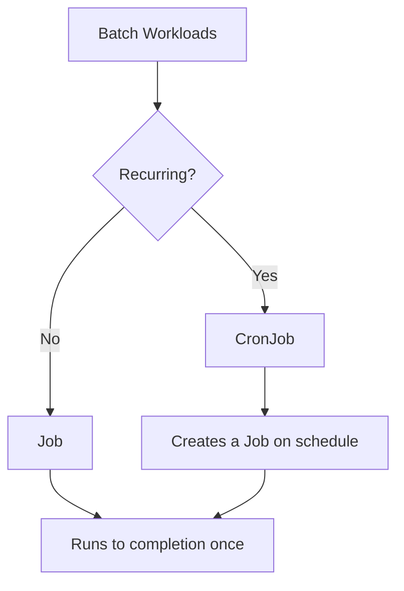
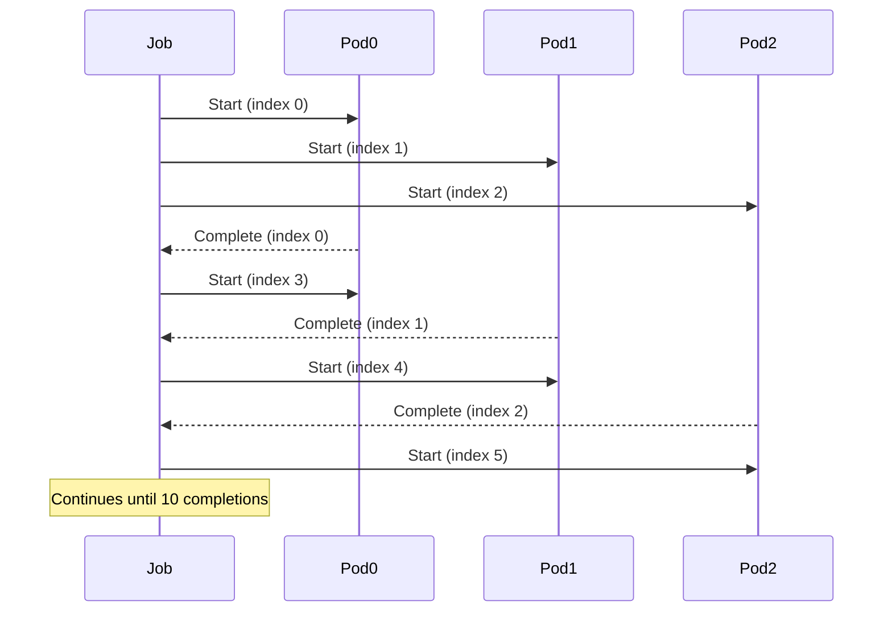
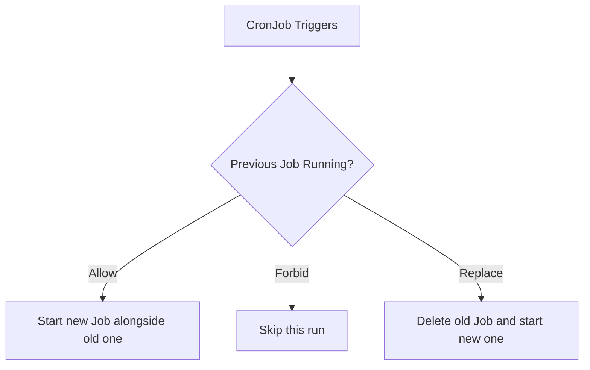

# How to Use Kubernetes Jobs and CronJobs for Batch Processing

Author: [nawazdhandala](https://www.github.com/nawazdhandala)

Tags: Kubernetes, Jobs, CronJobs, Batch Processing, Scheduling

Description: Learn how to use Kubernetes Jobs for one-time tasks and CronJobs for scheduled batch processing with proper error handling.

---

Not every workload runs forever. Database migrations, report generation, data pipelines, and cleanup tasks all need to run to completion and then stop. Kubernetes Jobs handle one-time tasks, and CronJobs schedule them to run on a recurring basis. This post covers how to configure both, handle failures, and set up parallelism.

## Jobs vs CronJobs



- **Job**: Runs one or more pods to completion. Once all pods succeed, the Job is complete.
- **CronJob**: Creates a new Job on a schedule, like a cron daemon in Linux.

## Basic Job

Here is a Job that runs a database migration:

```yaml
# migration-job.yaml
# A Job that runs a database migration script.
# It will retry up to 3 times on failure.
apiVersion: batch/v1
kind: Job
metadata:
  name: db-migration
spec:
  # Number of times to retry on failure
  backoffLimit: 3
  # Automatically clean up the Job after 1 hour
  ttlSecondsAfterFinished: 3600
  template:
    spec:
      containers:
        - name: migrate
          image: myregistry/db-migrate:v1.2.0
          command: ["python", "migrate.py"]
          env:
            - name: DATABASE_URL
              valueFrom:
                secretKeyRef:
                  name: db-credentials
                  key: url
      # Jobs should never restart on their own
      restartPolicy: Never
```

## Job Completion Modes

Jobs can require one successful completion or many.

```yaml
# parallel-job.yaml
# A Job that processes 10 items with 3 pods running in parallel.
apiVersion: batch/v1
kind: Job
metadata:
  name: data-processor
spec:
  # Total number of successful completions needed
  completions: 10
  # Number of pods running at the same time
  parallelism: 3
  # Each pod gets a unique index (0 through 9)
  completionMode: Indexed
  backoffLimit: 5
  template:
    spec:
      containers:
        - name: processor
          image: myregistry/data-processor:latest
          command: ["python", "process.py"]
          env:
            # JOB_COMPLETION_INDEX is set automatically
            # for Indexed completion mode
            - name: BATCH_INDEX
              valueFrom:
                fieldRef:
                  fieldPath: metadata.annotations['batch.kubernetes.io/job-completion-index']
      restartPolicy: Never
```



## Handling Failures

### Backoff Limit

The `backoffLimit` controls how many times a Job retries failed pods before marking the Job as failed. Kubernetes uses exponential backoff between retries (10s, 20s, 40s, capped at 6 minutes).

```yaml
# failure-handling.yaml
# A Job with strict failure handling.
spec:
  # Stop retrying after 4 failures
  backoffLimit: 4
  # Kill the Job if it has not finished in 10 minutes
  activeDeadlineSeconds: 600
  template:
    spec:
      containers:
        - name: task
          image: myregistry/task:latest
      restartPolicy: Never
```

### Pod Failure Policy (Kubernetes 1.26+)

You can define rules for how to handle specific exit codes:

```yaml
# pod-failure-policy.yaml
# Treat exit code 42 as a non-retryable failure
# and exit code 137 (OOMKilled) as retryable.
spec:
  backoffLimit: 3
  podFailurePolicy:
    rules:
      # Do not retry on known non-recoverable errors
      - action: FailJob
        onExitCodes:
          containerName: task
          operator: In
          values: [42]
      # Ignore OOM kills and retry
      - action: Ignore
        onPodConditions:
          - type: DisruptionTarget
  template:
    spec:
      containers:
        - name: task
          image: myregistry/task:latest
      restartPolicy: Never
```

## CronJobs

CronJobs create Jobs on a schedule using standard cron syntax.

```yaml
# report-cronjob.yaml
# Generate a daily report at 2:00 AM UTC.
apiVersion: batch/v1
kind: CronJob
metadata:
  name: daily-report
spec:
  # Cron schedule: minute hour day-of-month month day-of-week
  schedule: "0 2 * * *"
  # Timezone support (Kubernetes 1.27+)
  timeZone: "America/New_York"
  # What to do if the previous Job is still running
  concurrencyPolicy: Forbid
  # Keep the last 3 successful and 1 failed Job for debugging
  successfulJobsHistoryLimit: 3
  failedJobsHistoryLimit: 1
  # If the Job misses its schedule by more than 5 minutes, skip it
  startingDeadlineSeconds: 300
  jobTemplate:
    spec:
      backoffLimit: 2
      ttlSecondsAfterFinished: 86400
      template:
        spec:
          containers:
            - name: report
              image: myregistry/report-generator:latest
              command: ["python", "generate_report.py"]
              env:
                - name: REPORT_DATE
                  value: "yesterday"
          restartPolicy: OnFailure
```

## Concurrency Policies



- **Allow**: Multiple Jobs can run concurrently. Use when Jobs are independent.
- **Forbid**: Skip the new Job if the previous one is still running. Use when Jobs should not overlap.
- **Replace**: Delete the running Job and start a new one. Use when only the latest run matters.

## Practical Example: Data Pipeline

```yaml
# data-pipeline-cronjob.yaml
# A CronJob that runs a data pipeline every 6 hours.
# Uses init containers to check dependencies before starting.
apiVersion: batch/v1
kind: CronJob
metadata:
  name: data-pipeline
spec:
  schedule: "0 */6 * * *"
  concurrencyPolicy: Forbid
  jobTemplate:
    spec:
      backoffLimit: 2
      activeDeadlineSeconds: 7200
      template:
        spec:
          # Wait for the database to be reachable before starting
          initContainers:
            - name: wait-for-db
              image: busybox:1.36
              command:
                - sh
                - -c
                # Loop until the database port responds
                - |
                  until nc -z postgres-svc 5432; do
                    echo "Waiting for database..."
                    sleep 5
                  done
          containers:
            - name: pipeline
              image: myregistry/data-pipeline:latest
              command: ["python", "pipeline.py"]
              resources:
                requests:
                  memory: 512Mi
                  cpu: 250m
                limits:
                  memory: 1Gi
                  cpu: 500m
          restartPolicy: Never
```

## Monitoring and Debugging

Check the status of Jobs and CronJobs with these commands:

```bash
# List all Jobs
kubectl get jobs

# List all CronJobs
kubectl get cronjobs

# Check logs of a Job's pod
kubectl logs job/db-migration

# Describe a CronJob to see its schedule and history
kubectl describe cronjob daily-report

# Manually trigger a CronJob for testing
kubectl create job --from=cronjob/daily-report manual-test-run
```

## Best Practices

1. Always set `backoffLimit` to prevent infinite retries.
2. Use `activeDeadlineSeconds` to kill Jobs that run too long.
3. Set `ttlSecondsAfterFinished` to automatically clean up completed Jobs.
4. Use `concurrencyPolicy: Forbid` for CronJobs that should never overlap.
5. Set `successfulJobsHistoryLimit` and `failedJobsHistoryLimit` to keep your namespace clean.
6. Use `startingDeadlineSeconds` on CronJobs to skip missed runs instead of queuing them up.

## Tracking Batch Jobs with OneUptime

Batch jobs can fail silently. A CronJob that stops running or a Job that keeps failing can go unnoticed for days. [OneUptime](https://oneuptime.com) lets you monitor Job completion status, track CronJob schedules, and get alerted when a batch task fails or misses its window. With OneUptime, your scheduled workloads are always accounted for.
