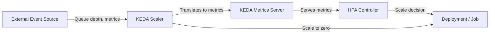
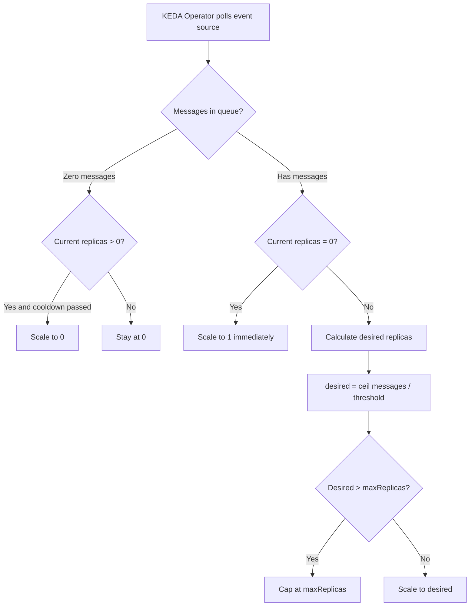

# How to Use KEDA for Event-Driven Autoscaling in Kubernetes

Author: [nawazdhandala](https://www.github.com/nawazdhandala)

Tags: Kubernetes, KEDA, Event-Driven, Autoscaling, Scalers

Description: Learn how to use KEDA to scale Kubernetes workloads based on external event sources like Kafka, RabbitMQ, and custom metrics.

---

Standard Kubernetes HPA works well for CPU and memory, but modern applications often need to scale based on external signals - message queue depth, database connection count, or incoming event rate. KEDA (Kubernetes Event-Driven Autoscaling) extends Kubernetes with 60+ scalers that connect to external event sources and drive autoscaling decisions. This post shows how to install and use KEDA with common event sources.

## What is KEDA?

KEDA is a lightweight component that sits alongside your Kubernetes cluster. It does not replace HPA - it extends it by feeding custom metrics from external sources into the HPA mechanism.



The key advantage of KEDA over plain custom metrics HPA is that KEDA can scale deployments to zero replicas and back up when events arrive.

## Step 1: Install KEDA

```bash
# Install KEDA using Helm
helm repo add kedacore https://kedacore.github.io/charts
helm repo update

helm install keda kedacore/keda \
  --namespace keda \
  --create-namespace \
  --set watchNamespace=""  # Watch all namespaces

# Verify KEDA components are running
kubectl get pods -n keda
# You should see:
# keda-operator
# keda-metrics-apiserver
```

## Step 2: Scale Based on RabbitMQ Queue Length

A common use case is scaling workers based on message queue depth.

```yaml
# rabbitmq-deployment.yaml
# Worker deployment that processes messages from RabbitMQ
apiVersion: apps/v1
kind: Deployment
metadata:
  name: order-processor
  labels:
    app: order-processor
spec:
  replicas: 1  # KEDA will manage this
  selector:
    matchLabels:
      app: order-processor
  template:
    metadata:
      labels:
        app: order-processor
    spec:
      containers:
        - name: processor
          image: your-registry/order-processor:latest
          env:
            - name: RABBITMQ_URL
              valueFrom:
                secretKeyRef:
                  name: rabbitmq-secret
                  key: connection-string
          resources:
            requests:
              cpu: "200m"
              memory: "256Mi"
```

Now create a KEDA ScaledObject to watch the RabbitMQ queue:

```yaml
# rabbitmq-scaledobject.yaml
# KEDA ScaledObject that watches a RabbitMQ queue and scales the worker
apiVersion: keda.sh/v1alpha1
kind: ScaledObject
metadata:
  name: order-processor-scaler
spec:
  scaleTargetRef:
    name: order-processor         # Target deployment to scale
  pollingInterval: 10              # Check queue every 10 seconds
  cooldownPeriod: 60               # Wait 60s before scaling to zero
  minReplicaCount: 0               # Allow scaling to zero when queue is empty
  maxReplicaCount: 20              # Maximum 20 worker pods
  triggers:
    - type: rabbitmq
      metadata:
        protocol: amqp
        queueName: orders          # Name of the queue to monitor
        mode: QueueLength          # Scale based on total queue length
        value: "5"                 # Target 5 messages per pod
      authenticationRef:
        name: rabbitmq-auth        # Reference to authentication
---
# TriggerAuthentication stores the RabbitMQ connection credentials
apiVersion: keda.sh/v1alpha1
kind: TriggerAuthentication
metadata:
  name: rabbitmq-auth
spec:
  secretTargetRef:
    - parameter: host
      name: rabbitmq-secret        # Kubernetes secret name
      key: connection-string       # Key within the secret
```

## Step 3: Scale Based on Kafka Consumer Lag

```yaml
# kafka-scaledobject.yaml
# KEDA ScaledObject that scales based on Kafka consumer group lag
apiVersion: keda.sh/v1alpha1
kind: ScaledObject
metadata:
  name: kafka-consumer-scaler
spec:
  scaleTargetRef:
    name: kafka-consumer
  pollingInterval: 15
  cooldownPeriod: 120
  minReplicaCount: 1               # Keep at least 1 consumer running
  maxReplicaCount: 50
  triggers:
    - type: kafka
      metadata:
        bootstrapServers: kafka-broker:9092
        consumerGroup: my-consumer-group
        topic: events
        lagThreshold: "100"        # Scale when lag exceeds 100 per pod
        offsetResetPolicy: latest
```

## KEDA Scaling Flow



## Step 4: Scale Based on Prometheus Metrics

KEDA can also use Prometheus as a scaler, which is simpler than setting up the Prometheus Adapter.

```yaml
# prometheus-scaledobject.yaml
# KEDA ScaledObject using Prometheus query for scaling decisions
apiVersion: keda.sh/v1alpha1
kind: ScaledObject
metadata:
  name: api-gateway-scaler
spec:
  scaleTargetRef:
    name: api-gateway
  pollingInterval: 15
  cooldownPeriod: 60
  minReplicaCount: 2
  maxReplicaCount: 30
  triggers:
    - type: prometheus
      metadata:
        # Prometheus server URL
        serverAddress: http://prometheus.monitoring.svc:9090
        # PromQL query that returns the scaling metric
        query: |
          sum(rate(http_requests_total{service="api-gateway"}[2m]))
        threshold: "100"           # Scale when request rate exceeds 100 req/s per pod
        activationThreshold: "5"   # Only activate scaling when rate is above 5 req/s
```

## Step 5: Scale Based on Cron Schedule

KEDA supports time-based scaling for predictable traffic patterns.

```yaml
# cron-scaledobject.yaml
# KEDA ScaledObject that pre-scales based on a cron schedule
apiVersion: keda.sh/v1alpha1
kind: ScaledObject
metadata:
  name: web-app-cron-scaler
spec:
  scaleTargetRef:
    name: web-app
  minReplicaCount: 2
  maxReplicaCount: 20
  triggers:
    # Scale up during business hours (Mon-Fri 8am-6pm UTC)
    - type: cron
      metadata:
        timezone: UTC
        start: "0 8 * * 1-5"      # 8:00 AM on weekdays
        end: "0 18 * * 1-5"       # 6:00 PM on weekdays
        desiredReplicas: "10"      # Run 10 replicas during business hours
    # Scale up for weekend batch processing
    - type: cron
      metadata:
        timezone: UTC
        start: "0 2 * * 6"        # Saturday 2:00 AM
        end: "0 6 * * 6"          # Saturday 6:00 AM
        desiredReplicas: "15"      # Run 15 replicas for batch processing
```

## Step 6: Scale Jobs with ScaledJob

KEDA can also create Kubernetes Jobs for one-shot processing.

```yaml
# scaled-job.yaml
# KEDA ScaledJob creates a Job per message in the queue
apiVersion: keda.sh/v1alpha1
kind: ScaledJob
metadata:
  name: email-sender-job
spec:
  jobTargetRef:
    template:
      spec:
        containers:
          - name: email-sender
            image: your-registry/email-sender:latest
            env:
              - name: QUEUE_URL
                value: "amqp://rabbitmq:5672"
        restartPolicy: Never
  pollingInterval: 10
  maxReplicaCount: 50              # Maximum 50 concurrent jobs
  successfulJobsHistoryLimit: 10   # Keep last 10 completed jobs
  failedJobsHistoryLimit: 5        # Keep last 5 failed jobs
  triggers:
    - type: rabbitmq
      metadata:
        queueName: emails
        mode: QueueLength
        value: "1"                 # One job per message
      authenticationRef:
        name: rabbitmq-auth
```

## Debugging KEDA

```bash
# Check ScaledObject status
kubectl get scaledobject
kubectl describe scaledobject order-processor-scaler

# Check KEDA operator logs for errors
kubectl logs -l app=keda-operator -n keda --tail=50

# Verify the HPA created by KEDA
kubectl get hpa

# Check if triggers are active
kubectl get scaledobject order-processor-scaler -o jsonpath='{.status}'
```

## Summary

KEDA brings event-driven autoscaling to Kubernetes with minimal setup. Whether you are processing messages from a queue, handling webhook events, or pre-scaling for known traffic patterns, KEDA has a scaler for it. The ability to scale to zero makes it especially valuable for cost-sensitive workloads.

To monitor your KEDA-scaled workloads, track event source health, and get alerted when scaling issues occur, try [OneUptime](https://oneuptime.com). OneUptime provides end-to-end monitoring and incident management that complements your event-driven architecture, helping you ensure that your autoscaling pipelines are reliable and responsive.
