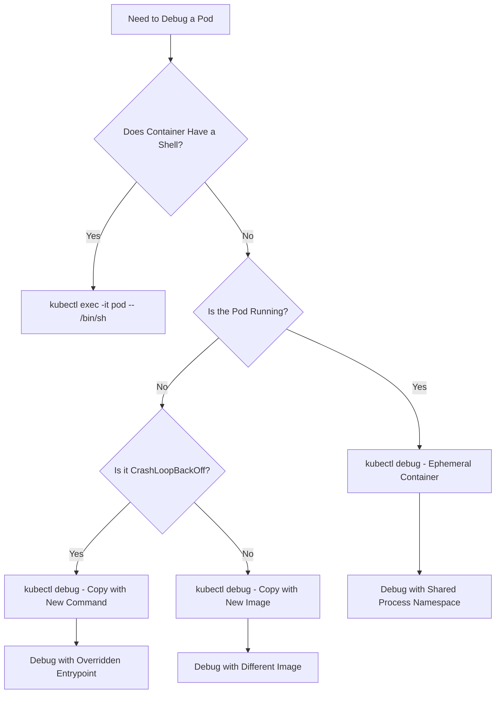
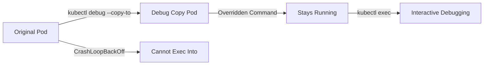
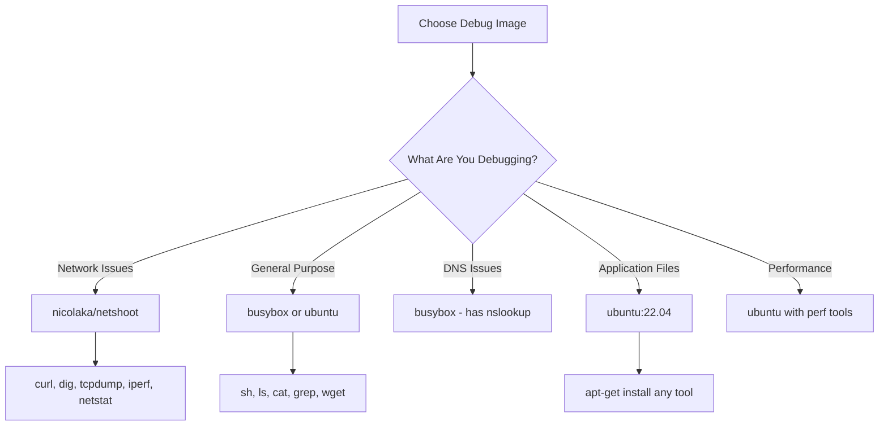

# How to Use kubectl debug for Kubernetes Pod Troubleshooting

Author: [nawazdhandala](https://www.github.com/nawazdhandala)

Tags: Kubernetes, kubectl, Debug, Troubleshooting, Ephemeral Containers

Description: Learn how to use kubectl debug to troubleshoot running pods, crashed pods, and node issues with ephemeral debug containers.

---

`kubectl debug` is a powerful troubleshooting tool that lets you attach debug containers to running pods, create copies of pods for debugging, and debug node-level issues. It is especially useful when your production containers do not include debugging tools like shells, curl, or network utilities.

## Why kubectl debug?

Production containers are often built with minimal images (distroless, scratch) that contain only the application binary. When something goes wrong, you cannot exec into them because there is no shell. `kubectl debug` solves this by injecting an ephemeral container with the tools you need.



## Method 1: Ephemeral Debug Containers

Attach a debug container to a running pod. The debug container shares the pod network namespace, so you can inspect network issues.

```bash
# Attach a busybox debug container to a running pod
kubectl debug -it my-pod --image=busybox --target=my-container

# Use a more full-featured debug image
kubectl debug -it my-pod --image=nicolaka/netshoot --target=my-container

# Specify a custom container name for the debug container
kubectl debug -it my-pod --image=busybox --container=debugger --target=my-container
```

The `--target` flag enables process namespace sharing with the specified container, allowing you to see its processes.

### What You Can Do Inside an Ephemeral Container

```bash
# Once inside the ephemeral container:

# Check network connectivity from the pod
ping google.com
curl -v http://my-service:8080/healthz
nslookup my-service.my-namespace.svc.cluster.local

# Check DNS resolution
cat /etc/resolv.conf
nslookup kubernetes.default.svc.cluster.local

# Inspect the file system of the target container
# (requires process namespace sharing)
ls /proc/1/root/app/

# Check environment variables of the target process
cat /proc/1/environ | tr '\0' '\n'

# Check open network connections
netstat -tlnp
ss -tlnp

# Check mounted volumes
mount | grep -v "proc\|sys\|cgroup"
```

## Method 2: Copy Pod with Modified Command

When a pod keeps crashing, you cannot exec into it or attach ephemeral containers reliably. Instead, create a copy of the pod with a different command that keeps it alive.

```bash
# Create a copy of a crashing pod with the command overridden to sleep
kubectl debug my-crashing-pod -it --copy-to=debug-pod --container=my-container -- /bin/sh

# If the container does not have a shell, use a different image
kubectl debug my-crashing-pod -it --copy-to=debug-pod \
  --set-image=my-container=ubuntu:22.04 -- /bin/bash
```



### Debugging a Crashing Pod Step by Step

```bash
# Step 1: Create a debug copy with sleep command
kubectl debug my-crashing-pod -it --copy-to=debug-pod \
  --container=my-container -- sleep infinity

# Step 2: Exec into the debug copy
kubectl exec -it debug-pod -c my-container -- /bin/sh

# Step 3: Inside the container, check the environment
env | sort

# Step 4: Check if config files exist and have correct content
cat /app/config.yaml

# Step 5: Try starting the application manually
/app/start.sh

# Step 6: Clean up when done
kubectl delete pod debug-pod
```

## Method 3: Copy Pod with Different Image

Replace the container image entirely with a debug image. This is useful when the original image is distroless or scratch-based.

```bash
# Replace the container image in the copy
kubectl debug my-pod -it --copy-to=debug-pod \
  --set-image=my-container=ubuntu:22.04

# Replace multiple container images
kubectl debug my-pod -it --copy-to=debug-pod \
  --set-image=my-container=ubuntu:22.04 \
  --set-image=sidecar=busybox
```

## Method 4: Debug Nodes

Debug node-level issues by creating a pod that runs directly in the node host namespaces.

```bash
# Create a debug pod on a specific node
kubectl debug node/my-node -it --image=ubuntu:22.04
```

This creates a privileged pod with the node root filesystem mounted at `/host`.

```bash
# Once inside the node debug pod:

# Access the host filesystem
chroot /host

# Check kubelet logs
journalctl -u kubelet --since "10 minutes ago"

# Check container runtime logs
journalctl -u containerd --since "10 minutes ago"

# Check system resources
top
free -h
df -h

# Check network interfaces
ip addr show
ip route show

# Check iptables rules (for service routing)
iptables -t nat -L KUBE-SERVICES

# Check running containers
crictl ps
crictl logs <container-id>

# Exit chroot and clean up
exit
```

## Useful Debug Images

Different debug images provide different tools. Choose the right one for your debugging scenario.



| Image | Size | Best For |
|-------|------|----------|
| `busybox` | 4MB | Quick checks, DNS, basic commands |
| `alpine` | 7MB | General purpose with package manager |
| `ubuntu:22.04` | 77MB | Full tooling, apt-get available |
| `nicolaka/netshoot` | 400MB | Network debugging (tcpdump, dig, curl) |

## Practical Debugging Recipes

### Debug DNS Resolution

```bash
# Attach a debug container and test DNS
kubectl debug -it my-pod --image=busybox --target=my-container

# Inside the debug container:
# Check if the cluster DNS is working
nslookup kubernetes.default.svc.cluster.local

# Check if your service resolves
nslookup my-service.my-namespace.svc.cluster.local

# Check what DNS server is being used
cat /etc/resolv.conf
```

### Debug Network Connectivity

```bash
# Use netshoot for comprehensive network debugging
kubectl debug -it my-pod --image=nicolaka/netshoot --target=my-container

# Inside the debug container:
# Test TCP connectivity to a service
curl -v http://my-service:8080/healthz

# Trace the network path
traceroute my-service

# Capture network traffic
tcpdump -i eth0 -n port 8080

# Check if a port is open
nc -zv my-service 8080
```

### Debug File System Issues

```bash
# Create a copy with ubuntu to inspect volumes
kubectl debug my-pod -it --copy-to=debug-pod \
  --set-image=my-container=ubuntu:22.04 -- bash

# Inside the container:
# Check mounted volumes
df -h
mount

# Check file permissions
ls -la /app/data/

# Check disk usage
du -sh /app/data/*
```

### Debug Resource Limits

```bash
# Check cgroup limits inside a running container
kubectl debug -it my-pod --image=busybox --target=my-container

# Inside the debug container:
# Check memory limit
cat /sys/fs/cgroup/memory.max

# Check current memory usage
cat /sys/fs/cgroup/memory.current

# Check CPU limit
cat /sys/fs/cgroup/cpu.max
```

## Cleaning Up Debug Resources

```bash
# List debug pods (they usually have a naming pattern)
kubectl get pods | grep debug

# Delete debug pods when done
kubectl delete pod debug-pod

# Ephemeral containers are cleaned up automatically when the pod is deleted
```

## Conclusion

`kubectl debug` is an essential tool for Kubernetes troubleshooting. It lets you debug pods without modifying the original pod spec, without needing debugging tools in your production images, and without stopping the running workload. Use ephemeral containers for running pods, pod copies for crashing pods, and node debugging for infrastructure issues.

For comprehensive Kubernetes monitoring that reduces the need for manual debugging, check out [OneUptime](https://oneuptime.com). OneUptime provides real-time alerting, distributed tracing, and log aggregation so you can detect and diagnose issues before they require hands-on troubleshooting.
