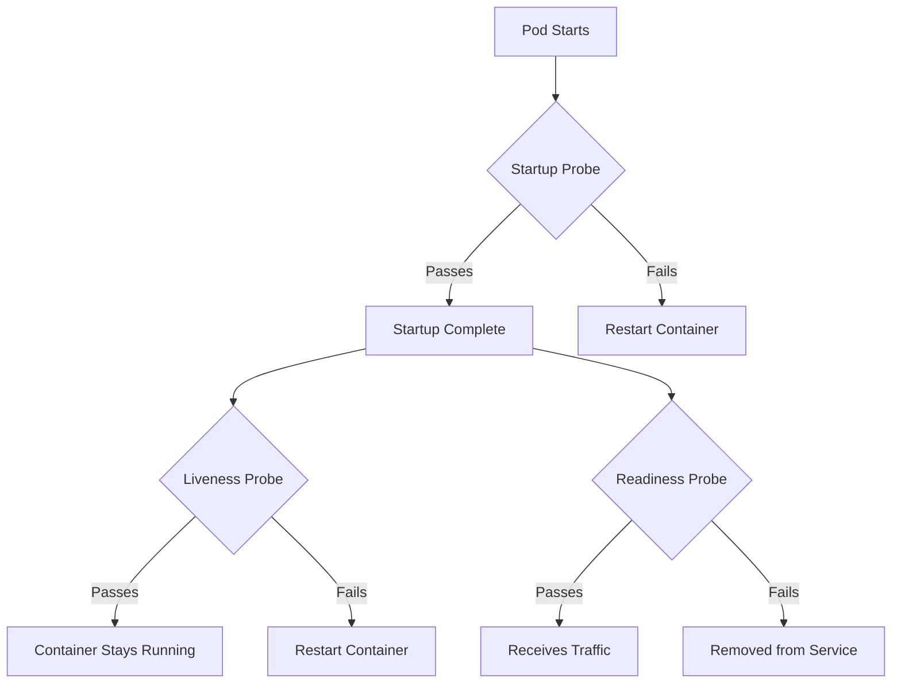
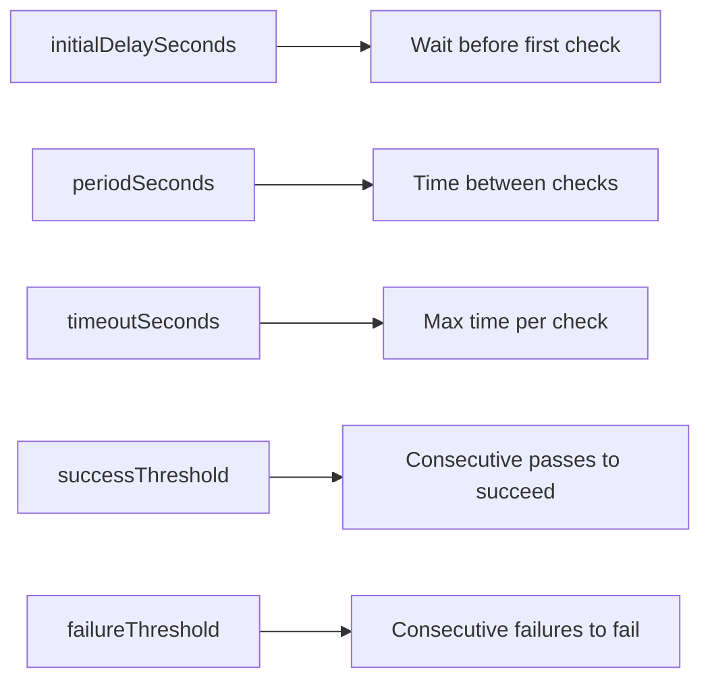

# How to Configure Kubernetes Liveness, Readiness, and Startup Probes

Author: [nawazdhandala](https://www.github.com/nawazdhandala)

Tags: Kubernetes, Probes, Health Checks, Liveness, Readiness

Description: Best practices for configuring Kubernetes liveness, readiness, and startup probes to keep your applications healthy.

---

Health checks are how Kubernetes knows whether your application is alive, ready for traffic, or still starting up. Misconfigured probes are one of the most common causes of unnecessary restarts and dropped traffic. This post explains each probe type, when to use them, and how to configure them correctly.

## The Three Probe Types



- **Startup Probe**: Checks if the application has finished starting. No other probes run until this passes.
- **Liveness Probe**: Checks if the application is still alive. If it fails, Kubernetes restarts the container.
- **Readiness Probe**: Checks if the application is ready to receive traffic. If it fails, the pod is removed from Service endpoints.

## Probe Mechanisms

Kubernetes supports three ways to check health:

### HTTP GET

```yaml
# http-probe.yaml
# Check health by sending an HTTP GET request.
# The probe passes if the response status code is 200-399.
readinessProbe:
  httpGet:
    path: /healthz
    port: 8080
    httpHeaders:
      - name: Accept
        value: application/json
  initialDelaySeconds: 5
  periodSeconds: 10
  timeoutSeconds: 3
  successThreshold: 1
  failureThreshold: 3
```

### TCP Socket

```yaml
# tcp-probe.yaml
# Check health by opening a TCP connection.
# The probe passes if the connection is established.
readinessProbe:
  tcpSocket:
    port: 3306
  initialDelaySeconds: 15
  periodSeconds: 10
```

### Exec Command

```yaml
# exec-probe.yaml
# Check health by running a command inside the container.
# The probe passes if the command exits with code 0.
livenessProbe:
  exec:
    command:
      - cat
      - /tmp/healthy
  initialDelaySeconds: 5
  periodSeconds: 5
```

### gRPC (Kubernetes 1.27+)

```yaml
# grpc-probe.yaml
# Check health using the gRPC health checking protocol.
readinessProbe:
  grpc:
    port: 50051
    service: my.service.Health
  initialDelaySeconds: 10
  periodSeconds: 10
```

## Probe Parameters Explained

Every probe has these tuning parameters:



| Parameter | Default | Description |
|-----------|---------|-------------|
| `initialDelaySeconds` | 0 | Seconds to wait before running the first probe |
| `periodSeconds` | 10 | How often to run the probe |
| `timeoutSeconds` | 1 | Seconds before the probe times out |
| `successThreshold` | 1 | Consecutive successes needed after a failure |
| `failureThreshold` | 3 | Consecutive failures before taking action |

## Configuring Startup Probes

Startup probes are designed for slow-starting applications. Without a startup probe, you would need to set a large `initialDelaySeconds` on the liveness probe, which delays failure detection after startup.

```yaml
# startup-probe.yaml
# The startup probe gives the app up to 5 minutes to start
# (30 failures x 10 seconds each).
# Once it passes, liveness and readiness probes take over.
spec:
  containers:
    - name: legacy-app
      image: myregistry/legacy-app:latest
      ports:
        - containerPort: 8080
      # Startup probe: generous timeout for initial startup
      startupProbe:
        httpGet:
          path: /healthz
          port: 8080
        # Check every 10 seconds
        periodSeconds: 10
        # Allow 30 failures before killing the container
        # Total startup budget: 30 x 10 = 300 seconds (5 minutes)
        failureThreshold: 30
      # Liveness probe: only runs after startup probe passes
      livenessProbe:
        httpGet:
          path: /healthz
          port: 8080
        periodSeconds: 10
        failureThreshold: 3
      # Readiness probe: only runs after startup probe passes
      readinessProbe:
        httpGet:
          path: /ready
          port: 8080
        periodSeconds: 5
        failureThreshold: 3
```

## Writing Good Health Check Endpoints

Your health endpoints should check the right things for each probe type.

```python
# health.py
# Health check endpoints for a FastAPI application.
# The liveness endpoint is lightweight.
# The readiness endpoint checks dependencies.
from fastapi import FastAPI, Response
import asyncpg
import aioredis

app = FastAPI()

# Global connection references
db_pool = None
redis_client = None

@app.get("/healthz")
async def liveness():
    """Liveness check: is the process alive and responsive?
    Keep this lightweight. Do NOT check external dependencies here.
    If this fails, Kubernetes restarts the container.
    """
    return {"status": "alive"}

@app.get("/ready")
async def readiness(response: Response):
    """Readiness check: can this pod handle requests?
    Check all critical dependencies. If any are down,
    return 503 so traffic is routed to other pods.
    """
    checks = {}

    # Check database connectivity
    try:
        async with db_pool.acquire() as conn:
            await conn.fetchval("SELECT 1")
        checks["database"] = "ok"
    except Exception as e:
        checks["database"] = str(e)
        response.status_code = 503

    # Check Redis connectivity
    try:
        await redis_client.ping()
        checks["redis"] = "ok"
    except Exception as e:
        checks["redis"] = str(e)
        response.status_code = 503

    return {"status": "ready" if response.status_code != 503 else "not_ready", "checks": checks}
```

## Common Mistakes

### Mistake 1: Liveness Probe Checks Dependencies

```yaml
# BAD: If the database goes down, ALL pods get restarted,
# making the problem worse.
livenessProbe:
  httpGet:
    path: /ready  # Checks DB and Redis
    port: 8080
```

```yaml
# GOOD: Liveness only checks the process itself.
# Readiness handles dependency checks.
livenessProbe:
  httpGet:
    path: /healthz  # Only checks if the process is alive
    port: 8080
readinessProbe:
  httpGet:
    path: /ready  # Checks DB and Redis
    port: 8080
```

### Mistake 2: Too Aggressive Liveness Probe

```yaml
# BAD: Restarts the container after just 3 seconds of slowness.
livenessProbe:
  httpGet:
    path: /healthz
    port: 8080
  timeoutSeconds: 1
  failureThreshold: 3
  periodSeconds: 1
```

```yaml
# GOOD: Gives the container 30 seconds before restarting.
livenessProbe:
  httpGet:
    path: /healthz
    port: 8080
  timeoutSeconds: 3
  failureThreshold: 5
  periodSeconds: 10
```

### Mistake 3: No Startup Probe for Slow Apps

```yaml
# BAD: Sets a long initial delay, wasting time on fast starts
# and still possibly too short for slow starts.
livenessProbe:
  httpGet:
    path: /healthz
    port: 8080
  initialDelaySeconds: 120
```

```yaml
# GOOD: Startup probe handles the variable startup time.
startupProbe:
  httpGet:
    path: /healthz
    port: 8080
  periodSeconds: 10
  failureThreshold: 30
livenessProbe:
  httpGet:
    path: /healthz
    port: 8080
  periodSeconds: 10
  failureThreshold: 3
```

## Full Example

```yaml
# complete-probes.yaml
# A production-ready pod with all three probes configured correctly.
apiVersion: v1
kind: Pod
metadata:
  name: web-app
spec:
  containers:
    - name: web-app
      image: myregistry/web-app:v3.0.0
      ports:
        - containerPort: 8080
      startupProbe:
        httpGet:
          path: /healthz
          port: 8080
        periodSeconds: 5
        failureThreshold: 60
      livenessProbe:
        httpGet:
          path: /healthz
          port: 8080
        periodSeconds: 15
        timeoutSeconds: 3
        failureThreshold: 3
      readinessProbe:
        httpGet:
          path: /ready
          port: 8080
        periodSeconds: 5
        timeoutSeconds: 3
        failureThreshold: 3
        successThreshold: 1
```

## Monitoring Probe Failures with OneUptime

Probe failures often indicate deeper issues like memory leaks, deadlocked threads, or misconfigured dependencies. [OneUptime](https://oneuptime.com) monitors your application health alongside Kubernetes probe status, giving you a complete picture. When a readiness probe starts failing, OneUptime alerts you and helps correlate it with deployment changes, traffic spikes, or dependency outages so you can fix the root cause instead of just restarting pods.
