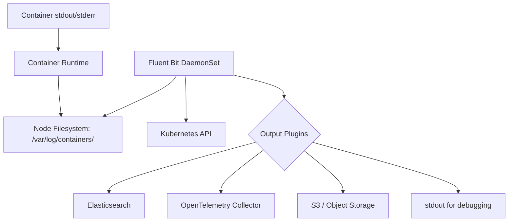
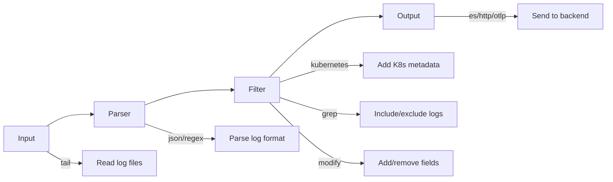

# How to Set Up Centralized Logging in Kubernetes with Fluent Bit

Author: [nawazdhandala](https://www.github.com/nawazdhandala)

Tags: Kubernetes, Fluent Bit, Logging, Centralized Logs, Observability

Description: Learn how to deploy Fluent Bit as a DaemonSet on Kubernetes for centralized log collection and forwarding.

---

Fluent Bit is a lightweight log processor and forwarder designed for Kubernetes environments. It runs as a DaemonSet on every node, collects container logs, enriches them with Kubernetes metadata, and forwards them to your log backend. This guide covers deploying Fluent Bit for production-ready centralized logging.

## Architecture Overview

Fluent Bit collects logs from the node filesystem where the container runtime writes them, enriches them with Kubernetes metadata, and forwards them to one or more destinations.





## Step 1: Install Fluent Bit with Helm

```bash
# Add the Fluent Helm chart repository
helm repo add fluent https://fluent.github.io/helm-charts
helm repo update

# Create a namespace for logging
kubectl create namespace logging
```

Create a values file with your configuration:

```yaml
# fluent-bit-values.yaml - Production configuration
# DaemonSet configuration
kind: DaemonSet

# Resource limits for each Fluent Bit pod
resources:
  requests:
    cpu: 50m
    memory: 64Mi
  limits:
    cpu: 200m
    memory: 256Mi

# Tolerations to run on all nodes including control plane
tolerations:
  - operator: Exists

# Service account for Kubernetes API access
serviceAccount:
  create: true
  name: fluent-bit

# RBAC configuration
rbac:
  create: true

# Volume mounts for accessing container logs
extraVolumes:
  - name: varlog
    hostPath:
      path: /var/log
  - name: varlibcontainers
    hostPath:
      path: /var/lib/docker/containers

extraVolumeMounts:
  - name: varlog
    mountPath: /var/log
    readOnly: true
  - name: varlibcontainers
    mountPath: /var/lib/docker/containers
    readOnly: true
```

## Step 2: Configure the Fluent Bit Pipeline

```yaml
# fluent-bit-config.yaml - ConfigMap with the full pipeline configuration
apiVersion: v1
kind: ConfigMap
metadata:
  name: fluent-bit-config
  namespace: logging
data:
  # Main service configuration
  fluent-bit.conf: |
    [SERVICE]
        # Flush logs every 5 seconds
        Flush         5
        # Log level for Fluent Bit itself
        Log_Level     info
        # Enable the built-in HTTP server for monitoring
        HTTP_Server   On
        HTTP_Listen   0.0.0.0
        HTTP_Port     2020
        # Parse configuration files
        Parsers_File  parsers.conf

    # Input: Tail container log files from the node
    [INPUT]
        Name              tail
        # Match all container log files
        Path              /var/log/containers/*.log
        # Exclude Fluent Bit own logs to avoid loops
        Exclude_Path      /var/log/containers/*fluent-bit*.log
        # Use the CRI parser for container runtime logs
        Parser            cri
        # Tag with the filename for routing
        Tag               kube.*
        # Remember file position between restarts
        DB                /var/log/fluent-bit-kube.db
        # Skip long lines instead of crashing
        Skip_Long_Lines   On
        # Read from the tail of files on first start
        Read_from_Head    false
        # Buffer size for reading log lines
        Buffer_Max_Size   1MB
        # Rotate the database file to prevent it from growing too large
        DB.locking        true
        # Memory buffer limit per monitored file
        Mem_Buf_Limit     10MB

    # Filter: Add Kubernetes metadata to each log record
    [FILTER]
        Name                kubernetes
        Match               kube.*
        # Kubernetes API endpoint
        Kube_URL            https://kubernetes.default.svc:443
        # Path to the service account token
        Kube_CA_File        /var/run/secrets/kubernetes.io/serviceaccount/ca.crt
        Kube_Token_File     /var/run/secrets/kubernetes.io/serviceaccount/token
        # Merge the log field into the top level
        Merge_Log           On
        # Keep the original log field
        Keep_Log            Off
        # Cache Kubernetes metadata to reduce API calls
        K8S-Logging.Parser  On
        K8S-Logging.Exclude On
        # Buffer size for API responses
        Buffer_Size         32k
        # Cache TTL for metadata lookups
        Kube_Meta_Cache_TTL 300s

    # Filter: Remove unwanted fields to reduce log volume
    [FILTER]
        Name          modify
        Match         kube.*
        # Remove noisy fields
        Remove        stream
        Remove        logtag

    # Filter: Exclude health check logs (they are too noisy)
    [FILTER]
        Name          grep
        Match         kube.*
        # Exclude lines containing health check paths
        Exclude       log /healthz|/readyz|/livez/

  # Parser definitions
  parsers.conf: |
    # CRI log format parser (used by containerd)
    [PARSER]
        Name        cri
        Format      regex
        Regex       ^(?<time>[^ ]+) (?<stream>stdout|stderr) (?<logtag>[^ ]*) (?<log>.*)$
        Time_Key    time
        Time_Format %Y-%m-%dT%H:%M:%S.%L%z

    # JSON parser for structured application logs
    [PARSER]
        Name        json
        Format      json
        Time_Key    timestamp
        Time_Format %Y-%m-%dT%H:%M:%S.%L%z
```

## Step 3: Configure Output Destinations

### Output to Elasticsearch

```yaml
  # Add to fluent-bit.conf
  output-elasticsearch.conf: |
    [OUTPUT]
        Name            es
        Match           kube.*
        # Elasticsearch endpoint
        Host            elasticsearch.logging.svc.cluster.local
        Port            9200
        # Index name with date rotation
        Index           kubernetes-logs
        # Use Logstash format for time-based indices
        Logstash_Format On
        Logstash_Prefix kubernetes
        # Retry on failure
        Retry_Limit     5
        # Replace dots in field names (ES does not allow dots)
        Replace_Dots    On
        # Suppress type name (required for ES 8+)
        Suppress_Type_Name On
        # TLS configuration for secure connections
        tls             On
        tls.verify      Off
```

### Output to OpenTelemetry Collector

```yaml
  # Add to fluent-bit.conf
  output-otel.conf: |
    [OUTPUT]
        Name                 opentelemetry
        Match                kube.*
        # OpenTelemetry Collector endpoint
        Host                 otel-gateway-collector.observability.svc.cluster.local
        Port                 4318
        # Use the logs signal
        Logs_uri             /v1/logs
        # Add resource attributes
        Add_label            cluster my-cluster
        Add_label            environment production
        # TLS configuration
        tls                  Off
```

### Output to S3 for Long-Term Storage

```yaml
  # Add to fluent-bit.conf
  output-s3.conf: |
    [OUTPUT]
        Name                 s3
        Match                kube.*
        # S3 bucket name
        bucket               my-kubernetes-logs
        # Region
        region               us-east-1
        # Organize logs by date and namespace
        s3_key_format        /logs/$TAG[4]/%Y/%m/%d/$UUID.gz
        # Total file size before uploading
        total_file_size      50M
        # Upload timeout
        upload_timeout       10m
        # Use gzip compression
        use_put_object       On
        compression          gzip
```

## Step 4: Deploy Fluent Bit

```bash
# Install Fluent Bit with Helm using your custom values
helm install fluent-bit fluent/fluent-bit \
  --namespace logging \
  --values fluent-bit-values.yaml \
  --wait

# Verify Fluent Bit pods are running on every node
kubectl get pods -n logging -o wide

# Check the number of pods matches the number of nodes
echo "Fluent Bit pods: $(kubectl get pods -n logging -l app.kubernetes.io/name=fluent-bit --no-headers | wc -l)"
echo "Nodes: $(kubectl get nodes --no-headers | wc -l)"
```

## Step 5: Monitor Fluent Bit

Fluent Bit exposes metrics through its built-in HTTP server.

```bash
# Port-forward to the Fluent Bit metrics endpoint
kubectl port-forward -n logging daemonset/fluent-bit 2020:2020

# Check Fluent Bit metrics
curl http://localhost:2020/api/v1/metrics

# Check the health endpoint
curl http://localhost:2020/api/v1/health

# Check the uptime
curl http://localhost:2020/api/v1/uptime
```

```yaml
# service-monitor.yaml - Scrape Fluent Bit metrics with Prometheus
apiVersion: monitoring.coreos.com/v1
kind: ServiceMonitor
metadata:
  name: fluent-bit
  namespace: logging
  labels:
    release: prometheus
spec:
  selector:
    matchLabels:
      app.kubernetes.io/name: fluent-bit
  endpoints:
  - port: http
    path: /api/v1/metrics/prometheus
    interval: 30s
```

## Step 6: Application-Level Log Configuration

Applications can control how Fluent Bit handles their logs using pod annotations.

```yaml
# app-deployment.yaml - Configure logging via annotations
apiVersion: apps/v1
kind: Deployment
metadata:
  name: my-app
spec:
  replicas: 2
  selector:
    matchLabels:
      app: my-app
  template:
    metadata:
      labels:
        app: my-app
      annotations:
        # Tell Fluent Bit to use the JSON parser for this pod
        fluentbit.io/parser: "json"
        # Exclude this pod from log collection (useful for noisy pods)
        # fluentbit.io/exclude: "true"
    spec:
      containers:
      - name: my-app
        image: my-app:latest
```

## Troubleshooting

```bash
# Check Fluent Bit logs for errors
kubectl logs -n logging -l app.kubernetes.io/name=fluent-bit --tail=100

# Check if Fluent Bit can access log files
kubectl exec -n logging daemonset/fluent-bit -- ls /var/log/containers/ | head -10

# Check the position database (which files have been read)
kubectl exec -n logging daemonset/fluent-bit -- cat /var/log/fluent-bit-kube.db | head

# Check memory usage
kubectl top pods -n logging

# Verify Kubernetes metadata enrichment is working
# Look for kubernetes.pod_name, kubernetes.namespace_name in your logs
```

## Conclusion

Fluent Bit provides efficient, lightweight log collection for Kubernetes. Its DaemonSet deployment model ensures every node has log collection coverage, and the Kubernetes filter automatically enriches logs with pod and namespace metadata. Start with a simple configuration, test with the stdout output, then add your production destinations.

For a complete observability platform that integrates with Fluent Bit for log management, monitoring, and incident response, check out [OneUptime](https://oneuptime.com). OneUptime accepts logs via OpenTelemetry and provides unified search, alerting, and dashboards for all your telemetry data.
