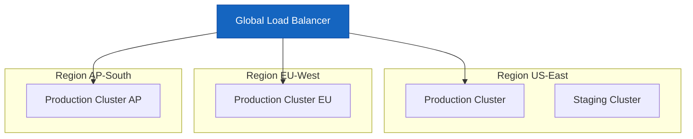
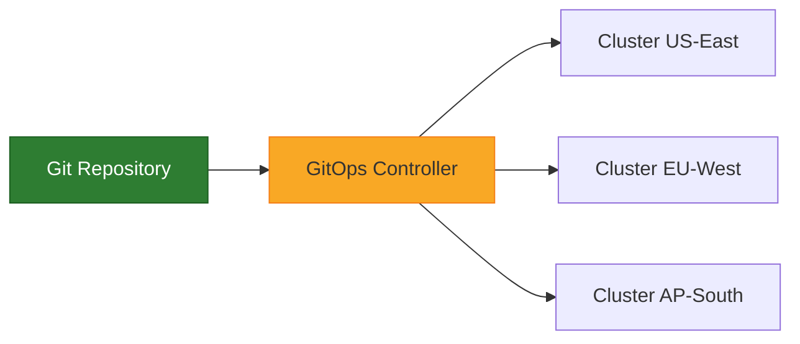
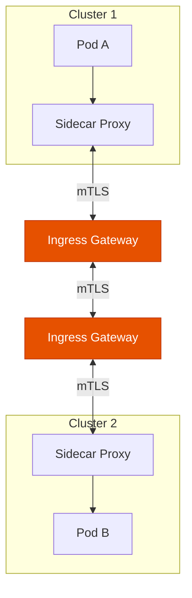
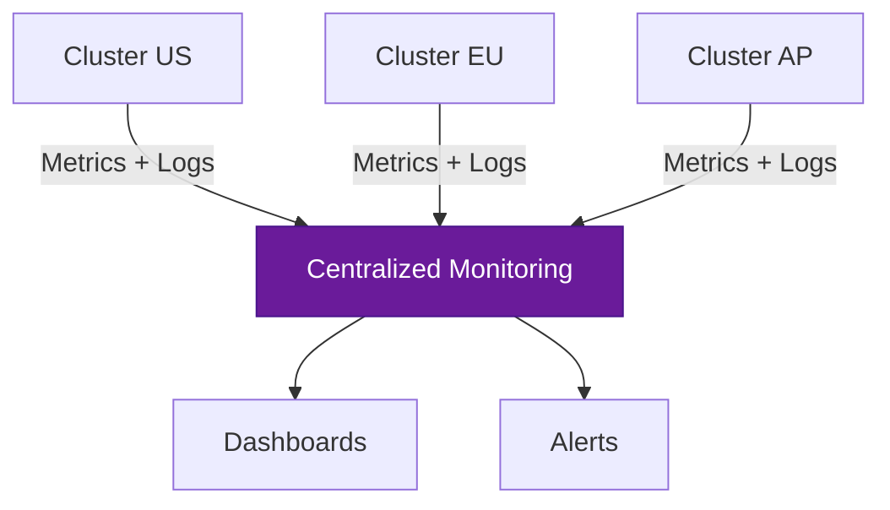

# How to Manage Multiple Kubernetes Clusters

Author: [nawazdhandala](https://www.github.com/nawazdhandala)

Tags: Kubernetes, Multi-Cluster, Federation, Management, Operations

Description: Learn strategies for managing multiple Kubernetes clusters including federation, service mesh, and centralized management tools.

---

As organizations grow, a single Kubernetes cluster is rarely enough. You may need multiple clusters for disaster recovery, geographic distribution, environment isolation, or compliance. Managing them consistently becomes a major operational challenge. This guide covers strategies and tools for effective multi-cluster Kubernetes management.

## Why Multiple Clusters?

There are several reasons organizations run more than one cluster:

- **High availability** - survive the failure of an entire cluster or region
- **Geographic distribution** - serve users from the nearest cluster
- **Environment isolation** - separate production, staging, and development
- **Compliance** - keep data in specific regions due to regulatory requirements
- **Blast radius reduction** - limit the impact of misconfigurations or failures
- **Team autonomy** - give teams their own clusters to manage independently



## Managing kubeconfig for Multiple Clusters

The first challenge is simply connecting to multiple clusters. The kubeconfig file supports multiple cluster contexts.

```yaml
# kubeconfig with multiple clusters
apiVersion: v1
kind: Config
clusters:
  - name: prod-us
    cluster:
      server: https://k8s-prod-us.example.com
      certificate-authority-data: <CA_DATA>
  - name: prod-eu
    cluster:
      server: https://k8s-prod-eu.example.com
      certificate-authority-data: <CA_DATA>
  - name: staging
    cluster:
      server: https://k8s-staging.example.com
      certificate-authority-data: <CA_DATA>
contexts:
  - name: prod-us
    context:
      cluster: prod-us
      user: admin-us
      namespace: default
  - name: prod-eu
    context:
      cluster: prod-eu
      user: admin-eu
      namespace: default
  - name: staging
    context:
      cluster: staging
      user: admin-staging
      namespace: default
current-context: prod-us
users:
  - name: admin-us
    user:
      token: <TOKEN>
  - name: admin-eu
    user:
      token: <TOKEN>
  - name: admin-staging
    user:
      token: <TOKEN>
```

```bash
# Switch between clusters using context
kubectl config use-context prod-us

# Run a command against a specific cluster without switching
kubectl --context=prod-eu get pods

# List all available contexts
kubectl config get-contexts
```

## GitOps for Multi-Cluster Management

GitOps is the most scalable approach to multi-cluster management. You define the desired state of every cluster in a Git repository, and a GitOps tool applies changes automatically.



### Repository Structure

```bash
# A well-organized GitOps repository for multi-cluster management
clusters/
  prod-us/
    kustomization.yaml       # Cluster-specific overrides
    ingress-values.yaml
  prod-eu/
    kustomization.yaml
    ingress-values.yaml
  staging/
    kustomization.yaml
    ingress-values.yaml
base/
  namespaces/
    monitoring.yaml
    app.yaml
  rbac/
    cluster-roles.yaml
  network-policies/
    default-deny.yaml
apps/
  api-server/
    deployment.yaml
    service.yaml
    kustomization.yaml
  web-frontend/
    deployment.yaml
    service.yaml
    kustomization.yaml
```

### Kustomize Overlay for Cluster-Specific Configuration

```yaml
# clusters/prod-us/kustomization.yaml
# Applies base resources with US-specific overrides
apiVersion: kustomize.config.k8s.io/v1beta1
kind: Kustomization

resources:
  - ../../base/namespaces/
  - ../../base/rbac/
  - ../../base/network-policies/
  - ../../apps/api-server/
  - ../../apps/web-frontend/

# Cluster-specific patches
patches:
  - target:
      kind: Deployment
      name: api-server
    patch: |
      - op: replace
        path: /spec/replicas
        value: 5
      - op: add
        path: /spec/template/spec/containers/0/env/-
        value:
          name: REGION
          value: us-east-1

# Cluster-specific labels
commonLabels:
  cluster: prod-us
  region: us-east
```

## Cross-Cluster Service Discovery

When services in one cluster need to communicate with services in another, you need cross-cluster service discovery.

### DNS-Based Approach

```yaml
# external-service.yaml
# Points to a service in another cluster using ExternalName
apiVersion: v1
kind: Service
metadata:
  name: auth-service
  namespace: app
spec:
  type: ExternalName
  # DNS name that resolves to the auth service in the US cluster
  externalName: auth.prod-us.example.com
```

### Service Mesh Approach

A service mesh like Istio or Linkerd can provide cross-cluster connectivity with mTLS, load balancing, and observability.



## Multi-Cluster Deployment Script

```python
import subprocess
import yaml
import sys

class MultiClusterDeployer:
    """
    Deploys resources to multiple Kubernetes clusters.
    Applies manifests in a controlled order with health checks.
    """

    def __init__(self, clusters: list):
        # List of kubectl context names
        self.clusters = clusters

    def deploy_to_all(self, manifest_path: str, namespace: str = "default"):
        """Deploy a manifest to all clusters."""
        results = {}
        for cluster in self.clusters:
            print(f"Deploying to {cluster}...")
            success = self._deploy(cluster, manifest_path, namespace)
            results[cluster] = "success" if success else "failed"

            if not success:
                print(f"Deployment failed on {cluster} - stopping rollout")
                break

        return results

    def _deploy(self, context: str, manifest_path: str, namespace: str) -> bool:
        """Deploy a manifest to a single cluster."""
        try:
            # Apply the manifest
            result = subprocess.run(
                [
                    "kubectl", "--context", context,
                    "apply", "-f", manifest_path,
                    "-n", namespace
                ],
                capture_output=True, text=True, check=True
            )
            print(result.stdout)

            # Wait for rollout to complete
            result = subprocess.run(
                [
                    "kubectl", "--context", context,
                    "rollout", "status", "deployment",
                    "-n", namespace, "--timeout=300s"
                ],
                capture_output=True, text=True, check=True
            )
            print(f"Rollout complete on {context}")
            return True

        except subprocess.CalledProcessError as e:
            print(f"Error on {context}: {e.stderr}")
            return False

    def check_health(self, context: str, namespace: str) -> dict:
        """Check the health of deployments in a cluster."""
        result = subprocess.run(
            [
                "kubectl", "--context", context,
                "get", "deployments", "-n", namespace,
                "-o", "json"
            ],
            capture_output=True, text=True
        )
        deployments = yaml.safe_load(result.stdout)
        health = {}
        for dep in deployments.get("items", []):
            name = dep["metadata"]["name"]
            desired = dep["spec"]["replicas"]
            ready = dep["status"].get("readyReplicas", 0)
            health[name] = {
                "desired": desired,
                "ready": ready,
                "healthy": desired == ready
            }
        return health


# Usage example
if __name__ == "__main__":
    deployer = MultiClusterDeployer([
        "prod-us", "prod-eu", "prod-ap"
    ])

    results = deployer.deploy_to_all("apps/api-server/deployment.yaml", "app")
    print("Deployment results:", results)
```

## Comparing Multi-Cluster Tools

| Tool | Approach | Best For |
|------|----------|----------|
| ArgoCD | GitOps | Declarative multi-cluster deployments |
| Fleet (Rancher) | GitOps | Large-scale cluster management |
| Karmada | Federation | Kubernetes-native multi-cluster |
| Admiralty | Virtual kubelet | Cross-cluster scheduling |
| Submariner | Networking | Cross-cluster pod connectivity |

## Challenges and Solutions

| Challenge | Solution |
|-----------|----------|
| Configuration drift | GitOps with automated reconciliation |
| Cross-cluster networking | Service mesh or VPN tunnels |
| Centralized logging | Ship logs to a central aggregator |
| Consistent RBAC | Policy-as-code across clusters |
| Certificate management | Centralized CA with automated rotation |

## Monitoring Multiple Clusters

Monitoring becomes exponentially more complex with multiple clusters. You need a single pane of glass to view the health of all clusters simultaneously.



OneUptime provides centralized monitoring across all your Kubernetes clusters. Track cluster health, deployment status, and service availability from a single dashboard. Set up cross-cluster alerts that notify you when any cluster experiences issues, whether it is node failures, pod crashes, or service degradation. With support for multiple environments and regions, OneUptime scales with your multi-cluster infrastructure. Start monitoring at [https://oneuptime.com](https://oneuptime.com).
