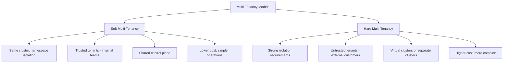
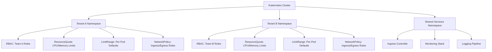
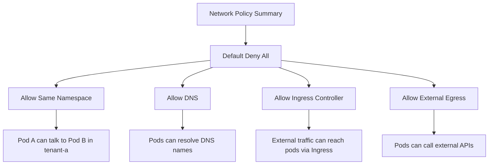

# How to Implement Multi-Tenancy in Kubernetes

Author: [nawazdhandala](https://www.github.com/nawazdhandala)

Tags: Kubernetes, Multi-Tenancy, Namespaces, Security, Isolation

Description: A comprehensive guide to implementing multi-tenancy in Kubernetes using namespaces, RBAC, network policies, and resource quotas.

---

Multi-tenancy in Kubernetes means running workloads for multiple teams, customers, or environments on the same cluster while keeping them isolated from each other. This guide covers the key building blocks for implementing multi-tenancy: namespaces, RBAC, network policies, resource quotas, and pod security.

## Multi-Tenancy Models

There are two main approaches to multi-tenancy in Kubernetes. The right choice depends on your isolation requirements.



This guide focuses on soft multi-tenancy, which is the most common pattern for internal teams and trusted workloads.

## Architecture Overview



## Step 1: Create Tenant Namespaces

Each tenant gets a dedicated namespace with labels for identification and policy enforcement.

```yaml
# tenant-namespace.yaml - Namespace for Tenant A
apiVersion: v1
kind: Namespace
metadata:
  name: tenant-a
  labels:
    # Identify the tenant for network policies and RBAC
    tenant: tenant-a
    # Environment label for additional filtering
    environment: production
    # Enable pod security standards
    pod-security.kubernetes.io/enforce: restricted
    pod-security.kubernetes.io/audit: restricted
    pod-security.kubernetes.io/warn: restricted
---
# Namespace for Tenant B
apiVersion: v1
kind: Namespace
metadata:
  name: tenant-b
  labels:
    tenant: tenant-b
    environment: production
    pod-security.kubernetes.io/enforce: restricted
    pod-security.kubernetes.io/audit: restricted
    pod-security.kubernetes.io/warn: restricted
```

```bash
# Apply the namespaces
kubectl apply -f tenant-namespace.yaml

# Verify the namespaces
kubectl get namespaces -l tenant
```

## Step 2: Configure RBAC

Create roles that limit what each tenant can do within their namespace.

```yaml
# tenant-rbac.yaml - RBAC for Tenant A
# Role defines what actions are allowed in the namespace
apiVersion: rbac.authorization.k8s.io/v1
kind: Role
metadata:
  name: tenant-developer
  namespace: tenant-a
rules:
# Allow managing deployments, statefulsets, and daemonsets
- apiGroups: ["apps"]
  resources: ["deployments", "statefulsets", "daemonsets", "replicasets"]
  verbs: ["get", "list", "watch", "create", "update", "patch", "delete"]
# Allow managing pods and pod logs
- apiGroups: [""]
  resources: ["pods", "pods/log", "pods/exec"]
  verbs: ["get", "list", "watch", "create", "delete"]
# Allow managing services and configmaps
- apiGroups: [""]
  resources: ["services", "configmaps", "secrets"]
  verbs: ["get", "list", "watch", "create", "update", "patch", "delete"]
# Allow managing PVCs
- apiGroups: [""]
  resources: ["persistentvolumeclaims"]
  verbs: ["get", "list", "watch", "create", "update", "patch", "delete"]
# Allow viewing events
- apiGroups: [""]
  resources: ["events"]
  verbs: ["get", "list", "watch"]
# Allow managing ingresses
- apiGroups: ["networking.k8s.io"]
  resources: ["ingresses"]
  verbs: ["get", "list", "watch", "create", "update", "patch", "delete"]
# Deny access to resource quotas and limit ranges (admin only)
# These are not listed, so they are denied by default
---
# RoleBinding associates the role with a group
apiVersion: rbac.authorization.k8s.io/v1
kind: RoleBinding
metadata:
  name: tenant-a-developers
  namespace: tenant-a
subjects:
# Bind to a group from your identity provider
- kind: Group
  name: "team-a-developers"
  apiGroup: rbac.authorization.k8s.io
roleRef:
  kind: Role
  name: tenant-developer
  apiGroup: rbac.authorization.k8s.io
---
# Read-only role for monitoring and auditing
apiVersion: rbac.authorization.k8s.io/v1
kind: Role
metadata:
  name: tenant-viewer
  namespace: tenant-a
rules:
- apiGroups: ["", "apps", "networking.k8s.io"]
  resources: ["*"]
  verbs: ["get", "list", "watch"]
---
apiVersion: rbac.authorization.k8s.io/v1
kind: RoleBinding
metadata:
  name: tenant-a-viewers
  namespace: tenant-a
subjects:
- kind: Group
  name: "team-a-viewers"
  apiGroup: rbac.authorization.k8s.io
roleRef:
  kind: Role
  name: tenant-viewer
  apiGroup: rbac.authorization.k8s.io
```

Verify RBAC is working:

```bash
# Test what a user can do in the namespace
kubectl auth can-i create deployments --namespace=tenant-a --as=user@example.com

# Test that cross-namespace access is denied
kubectl auth can-i get pods --namespace=tenant-b --as=user@example.com

# List all role bindings in a namespace
kubectl get rolebindings -n tenant-a
```

## Step 3: Set Resource Quotas

Resource quotas limit the total resources a tenant can consume.

```yaml
# resource-quota.yaml - Resource limits for Tenant A
apiVersion: v1
kind: ResourceQuota
metadata:
  name: tenant-a-quota
  namespace: tenant-a
spec:
  hard:
    # Compute resource limits
    requests.cpu: "8"             # Total CPU requests across all pods
    requests.memory: "16Gi"       # Total memory requests across all pods
    limits.cpu: "16"              # Total CPU limits across all pods
    limits.memory: "32Gi"         # Total memory limits across all pods

    # Object count limits
    pods: "50"                    # Maximum number of pods
    services: "20"                # Maximum number of services
    configmaps: "50"              # Maximum number of configmaps
    secrets: "50"                 # Maximum number of secrets
    persistentvolumeclaims: "10"  # Maximum number of PVCs

    # Storage limits
    requests.storage: "100Gi"     # Total storage across all PVCs
```

## Step 4: Set Limit Ranges

LimitRange sets default resource requests and limits for pods that do not specify them.

```yaml
# limit-range.yaml - Default and maximum limits for Tenant A
apiVersion: v1
kind: LimitRange
metadata:
  name: tenant-a-limits
  namespace: tenant-a
spec:
  limits:
  - type: Container
    # Default limits applied if none are specified
    default:
      cpu: "500m"
      memory: "512Mi"
    # Default requests applied if none are specified
    defaultRequest:
      cpu: "100m"
      memory: "128Mi"
    # Maximum limits a container can request
    max:
      cpu: "4"
      memory: "8Gi"
    # Minimum limits a container must request
    min:
      cpu: "50m"
      memory: "64Mi"
  - type: Pod
    # Maximum total resources for a single pod
    max:
      cpu: "8"
      memory: "16Gi"
```

## Step 5: Configure Network Policies

Network policies control traffic flow between tenant namespaces.

```yaml
# network-policy.yaml - Isolate Tenant A from other tenants
# Default deny all ingress and egress traffic
apiVersion: networking.k8s.io/v1
kind: NetworkPolicy
metadata:
  name: default-deny-all
  namespace: tenant-a
spec:
  podSelector: {}
  policyTypes:
  - Ingress
  - Egress
---
# Allow traffic within the same namespace
apiVersion: networking.k8s.io/v1
kind: NetworkPolicy
metadata:
  name: allow-same-namespace
  namespace: tenant-a
spec:
  podSelector: {}
  policyTypes:
  - Ingress
  - Egress
  ingress:
  # Allow ingress from pods in the same namespace
  - from:
    - podSelector: {}
  egress:
  # Allow egress to pods in the same namespace
  - to:
    - podSelector: {}
---
# Allow DNS resolution (required for service discovery)
apiVersion: networking.k8s.io/v1
kind: NetworkPolicy
metadata:
  name: allow-dns
  namespace: tenant-a
spec:
  podSelector: {}
  policyTypes:
  - Egress
  egress:
  - to:
    # Allow egress to kube-dns in the kube-system namespace
    - namespaceSelector:
        matchLabels:
          kubernetes.io/metadata.name: kube-system
      podSelector:
        matchLabels:
          k8s-app: kube-dns
    ports:
    - protocol: UDP
      port: 53
    - protocol: TCP
      port: 53
---
# Allow ingress from the ingress controller
apiVersion: networking.k8s.io/v1
kind: NetworkPolicy
metadata:
  name: allow-ingress-controller
  namespace: tenant-a
spec:
  podSelector: {}
  policyTypes:
  - Ingress
  ingress:
  - from:
    - namespaceSelector:
        matchLabels:
          kubernetes.io/metadata.name: ingress-nginx
---
# Allow egress to external services (internet)
apiVersion: networking.k8s.io/v1
kind: NetworkPolicy
metadata:
  name: allow-external-egress
  namespace: tenant-a
spec:
  podSelector: {}
  policyTypes:
  - Egress
  egress:
  # Allow traffic to IPs outside the cluster
  - to:
    - ipBlock:
        cidr: 0.0.0.0/0
        # Exclude internal cluster and private network ranges
        except:
        - 10.0.0.0/8
        - 172.16.0.0/12
        - 192.168.0.0/16
```



## Step 6: Automate Tenant Provisioning

Create a script or controller to provision new tenants consistently.

```bash
#!/bin/bash
# provision-tenant.sh - Create a new tenant with all isolation controls

# Tenant name passed as argument
TENANT_NAME=$1

if [ -z "$TENANT_NAME" ]; then
  echo "Usage: ./provision-tenant.sh <tenant-name>"
  exit 1
fi

echo "Provisioning tenant: $TENANT_NAME"

# Create the namespace with labels
kubectl create namespace "$TENANT_NAME"
kubectl label namespace "$TENANT_NAME" \
  tenant="$TENANT_NAME" \
  pod-security.kubernetes.io/enforce=restricted \
  pod-security.kubernetes.io/audit=restricted \
  pod-security.kubernetes.io/warn=restricted

# Apply resource quota
kubectl apply -n "$TENANT_NAME" -f resource-quota.yaml

# Apply limit range
kubectl apply -n "$TENANT_NAME" -f limit-range.yaml

# Apply network policies
kubectl apply -n "$TENANT_NAME" -f network-policy.yaml

# Apply RBAC (update the group name)
kubectl apply -n "$TENANT_NAME" -f tenant-rbac.yaml

echo "Tenant $TENANT_NAME provisioned successfully"
```

## Verification Checklist

```bash
# 1. Verify namespace isolation
kubectl auth can-i get pods -n tenant-b --as=tenant-a-user

# 2. Verify resource quotas are enforced
kubectl describe resourcequota -n tenant-a

# 3. Verify limit ranges are applied
kubectl describe limitrange -n tenant-a

# 4. Verify network policies are active
kubectl get networkpolicy -n tenant-a

# 5. Test cross-namespace network isolation
# From a pod in tenant-a, try to reach a pod in tenant-b
kubectl exec -n tenant-a test-pod -- wget -q --timeout=3 http://service.tenant-b.svc.cluster.local
# This should fail/timeout if network policies are working

# 6. Verify pod security standards are enforced
kubectl get namespace tenant-a -o jsonpath='{.metadata.labels}' | jq
```

## Conclusion

Multi-tenancy in Kubernetes requires a layered approach combining namespaces, RBAC, resource quotas, limit ranges, network policies, and pod security standards. Each layer addresses a different aspect of isolation: access control, resource fairness, network segmentation, and workload security. Automate tenant provisioning to ensure consistent configuration across all tenants.

For monitoring your multi-tenant Kubernetes clusters with per-tenant visibility and alerting, check out [OneUptime](https://oneuptime.com). OneUptime provides team-based dashboards, role-based access control, and incident management workflows that map naturally to multi-tenant environments.
