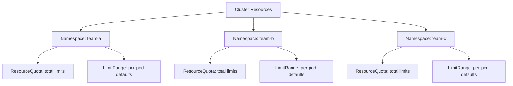
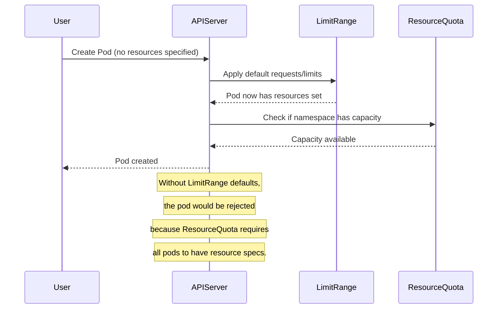

# How to Set Up Kubernetes Namespace Resource Quotas and LimitRanges

Author: [nawazdhandala](https://www.github.com/nawazdhandala)

Tags: Kubernetes, Namespaces, Resource Quotas, LimitRanges, Multi-Tenancy

Description: Learn how to use resource quotas and limit ranges to manage resource allocation across Kubernetes namespaces.

---

In a shared Kubernetes cluster, one team can accidentally consume all available resources and starve everyone else. Resource Quotas and LimitRanges solve this by putting caps on what each namespace can use. This post covers how to set up both, how they interact, and how to use them for multi-tenant clusters.

## The Resource Management Stack



- **ResourceQuota**: Limits the total amount of resources a namespace can consume.
- **LimitRange**: Sets default and maximum resource requests/limits for individual pods and containers.

## Setting Up Namespaces

```yaml
# namespaces.yaml
# Create separate namespaces for different teams.
apiVersion: v1
kind: Namespace
metadata:
  name: team-frontend
  labels:
    team: frontend
    environment: production
---
apiVersion: v1
kind: Namespace
metadata:
  name: team-backend
  labels:
    team: backend
    environment: production
```

## Resource Quotas

### Compute Resource Quotas

```yaml
# compute-quota.yaml
# Limit the total CPU and memory the frontend team can use.
apiVersion: v1
kind: ResourceQuota
metadata:
  name: compute-quota
  namespace: team-frontend
spec:
  hard:
    # Total CPU requests across all pods in this namespace
    requests.cpu: "4"
    # Total memory requests across all pods
    requests.memory: 8Gi
    # Total CPU limits across all pods
    limits.cpu: "8"
    # Total memory limits across all pods
    limits.memory: 16Gi
```

### Object Count Quotas

```yaml
# object-quota.yaml
# Limit the number of Kubernetes objects in the namespace.
apiVersion: v1
kind: ResourceQuota
metadata:
  name: object-quota
  namespace: team-frontend
spec:
  hard:
    # Maximum number of pods
    pods: "20"
    # Maximum number of services
    services: "10"
    # Maximum number of ConfigMaps
    configmaps: "20"
    # Maximum number of secrets
    secrets: "20"
    # Maximum number of PVCs
    persistentvolumeclaims: "5"
    # Maximum number of LoadBalancer services
    services.loadbalancers: "2"
    # Maximum number of NodePort services
    services.nodeports: "3"
```

### Storage Quotas

```yaml
# storage-quota.yaml
# Limit total storage and per-storage-class usage.
apiVersion: v1
kind: ResourceQuota
metadata:
  name: storage-quota
  namespace: team-frontend
spec:
  hard:
    # Total storage across all PVCs
    requests.storage: 100Gi
    # Total number of PVCs
    persistentvolumeclaims: "10"
    # Per-storage-class limits
    fast-ssd.storageclass.storage.k8s.io/requests.storage: 50Gi
    fast-ssd.storageclass.storage.k8s.io/persistentvolumeclaims: "5"
    standard.storageclass.storage.k8s.io/requests.storage: 50Gi
```

## LimitRanges

LimitRanges set defaults and constraints for individual containers and pods.

### Container-Level LimitRange

```yaml
# container-limits.yaml
# Set default resource requests and limits for containers.
# These apply when a pod does not specify its own values.
apiVersion: v1
kind: LimitRange
metadata:
  name: container-limits
  namespace: team-frontend
spec:
  limits:
    - type: Container
      # Default limits applied when none are specified
      default:
        cpu: 500m
        memory: 256Mi
      # Default requests applied when none are specified
      defaultRequest:
        cpu: 100m
        memory: 128Mi
      # Maximum allowed values
      max:
        cpu: "2"
        memory: 2Gi
      # Minimum allowed values
      min:
        cpu: 50m
        memory: 64Mi
      # Maximum ratio of limit to request
      # A ratio of 4 means limits can be at most 4x the requests
      maxLimitRequestRatio:
        cpu: "4"
        memory: "4"
```

### Pod-Level LimitRange

```yaml
# pod-limits.yaml
# Set maximum total resources for a single pod.
apiVersion: v1
kind: LimitRange
metadata:
  name: pod-limits
  namespace: team-frontend
spec:
  limits:
    - type: Pod
      # A single pod cannot use more than these totals
      max:
        cpu: "4"
        memory: 4Gi
```

### PVC Size LimitRange

```yaml
# pvc-limits.yaml
# Control the size of PersistentVolumeClaims.
apiVersion: v1
kind: LimitRange
metadata:
  name: pvc-limits
  namespace: team-frontend
spec:
  limits:
    - type: PersistentVolumeClaim
      min:
        storage: 1Gi
      max:
        storage: 50Gi
```

## How Quotas and LimitRanges Work Together



When a ResourceQuota is active, every pod must specify resource requests and limits. LimitRanges provide defaults so pods without explicit resources are not rejected.

## Multi-Tenant Configuration Example

Here is a complete namespace setup for a team:

```yaml
# team-backend-resources.yaml
# Complete resource management for the backend team namespace.
apiVersion: v1
kind: Namespace
metadata:
  name: team-backend
  labels:
    team: backend
---
# Total namespace budget
apiVersion: v1
kind: ResourceQuota
metadata:
  name: compute-quota
  namespace: team-backend
spec:
  hard:
    requests.cpu: "8"
    requests.memory: 16Gi
    limits.cpu: "16"
    limits.memory: 32Gi
    pods: "30"
    services: "15"
    configmaps: "30"
    secrets: "30"
    persistentvolumeclaims: "10"
    requests.storage: 200Gi
---
# Per-container defaults and limits
apiVersion: v1
kind: LimitRange
metadata:
  name: container-limits
  namespace: team-backend
spec:
  limits:
    - type: Container
      default:
        cpu: 250m
        memory: 256Mi
      defaultRequest:
        cpu: 100m
        memory: 128Mi
      max:
        cpu: "4"
        memory: 4Gi
      min:
        cpu: 50m
        memory: 64Mi
    - type: PersistentVolumeClaim
      min:
        storage: 1Gi
      max:
        storage: 50Gi
```

## Checking Quota Usage

```bash
# View current quota usage for a namespace
kubectl describe resourcequota compute-quota -n team-backend

# Output example:
# Name:            compute-quota
# Namespace:       team-backend
# Resource         Used    Hard
# --------         ----    ----
# limits.cpu       2       16
# limits.memory    4Gi     32Gi
# pods             5       30
# requests.cpu     1       8
# requests.memory  2Gi     16Gi

# View LimitRange settings
kubectl describe limitrange container-limits -n team-backend

# List all quotas across all namespaces
kubectl get resourcequota --all-namespaces
```

## Scoped Quotas

You can apply quotas only to pods with specific priority classes or quality-of-service classes.

```yaml
# scoped-quota.yaml
# Apply this quota only to BestEffort pods (pods without
# resource requests or limits).
apiVersion: v1
kind: ResourceQuota
metadata:
  name: besteffort-quota
  namespace: team-backend
spec:
  hard:
    pods: "5"
  # Only count pods with BestEffort QoS class
  scopeSelector:
    matchExpressions:
      - scopeName: PriorityClass
        operator: In
        values:
          - low-priority
```

## Best Practices

1. Always pair ResourceQuotas with LimitRanges so pods without explicit resources get defaults.
2. Start with generous quotas and tighten them based on actual usage data.
3. Use object count quotas to prevent namespace sprawl (too many ConfigMaps, Secrets, etc.).
4. Set `maxLimitRequestRatio` to prevent overcommitment where limits are much higher than requests.
5. Monitor quota usage regularly and alert when usage approaches the limit.
6. Use separate namespaces for different environments (dev, staging, production) with different quotas.

## Monitoring Resource Usage with OneUptime

Resource quotas prevent overconsumption, but you need visibility into trends. [OneUptime](https://oneuptime.com) tracks resource utilization across your namespaces, alerting you when teams approach their quota limits or when resource patterns suggest you need to adjust allocations. With OneUptime's dashboards, you can see exactly how resources are distributed across your cluster and make informed decisions about capacity planning.
