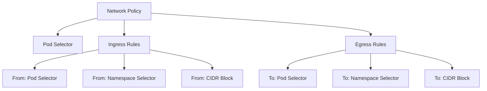
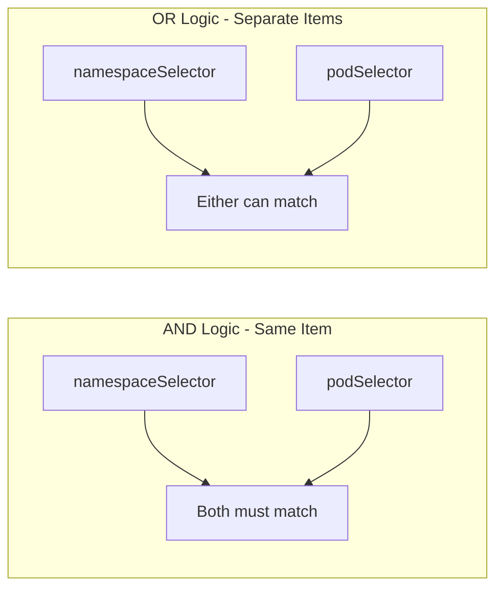

# How to Write Kubernetes Network Policies from Scratch

Author: [nawazdhandala](https://www.github.com/nawazdhandala)

Tags: Kubernetes, Network Policies, Security, Networking, Calico

Description: Step-by-step guide to writing Kubernetes Network Policies including ingress/egress rules, namespace selectors, and CIDR blocks.

---

## Why Network Policies Matter

By default, every pod in a Kubernetes cluster can communicate with every other pod. This is convenient for development but dangerous in production. Network Policies let you define firewall-like rules that control which pods can talk to each other.

Think of Network Policies as security groups for your pods. Without them, a compromised pod can reach every service in your cluster.

## How Network Policies Work

Network Policies are namespace-scoped resources that use label selectors to target pods and define allowed traffic.



## Prerequisites

You need a CNI plugin that supports Network Policies. Not all CNI plugins do. Calico, Cilium, and Weave support them. Flannel alone does not.

Check if your cluster supports Network Policies:

```bash
# Check which CNI plugin is installed
kubectl get pods -n kube-system | grep -E "calico|cilium|weave"

# If using Calico, verify it is running
kubectl get pods -n calico-system
```

## Your First Network Policy

Let us start with a simple policy that allows traffic to a web server only from pods with a specific label.

```yaml
# web-allow-frontend.yaml
# This policy allows ingress traffic to pods labeled app=web
# only from pods labeled role=frontend
apiVersion: networking.k8s.io/v1
kind: NetworkPolicy
metadata:
  name: web-allow-frontend
  namespace: default
spec:
  # Target pods with label app=web
  podSelector:
    matchLabels:
      app: web
  policyTypes:
    - Ingress
  ingress:
    - from:
        # Only allow traffic from pods labeled role=frontend
        - podSelector:
            matchLabels:
              role: frontend
      ports:
        # Only allow traffic on port 80
        - protocol: TCP
          port: 80
```

Apply it:

```bash
# Apply the network policy
kubectl apply -f web-allow-frontend.yaml

# Verify the policy was created
kubectl get networkpolicy web-allow-frontend
```

## Understanding Ingress Rules

Ingress rules control incoming traffic to the selected pods. Each rule specifies sources and ports.

```yaml
# multi-source-ingress.yaml
# Allow traffic from multiple sources to the API pods
apiVersion: networking.k8s.io/v1
kind: NetworkPolicy
metadata:
  name: api-ingress
  namespace: default
spec:
  podSelector:
    matchLabels:
      app: api
  policyTypes:
    - Ingress
  ingress:
    # Rule 1: Allow from frontend pods on port 8080
    - from:
        - podSelector:
            matchLabels:
              role: frontend
      ports:
        - protocol: TCP
          port: 8080
    # Rule 2: Allow from monitoring pods on port 9090
    - from:
        - podSelector:
            matchLabels:
              role: monitoring
      ports:
        - protocol: TCP
          port: 9090
```

## Understanding Egress Rules

Egress rules control outgoing traffic from the selected pods.

```yaml
# db-egress.yaml
# Allow the database pod to only reach specific destinations
apiVersion: networking.k8s.io/v1
kind: NetworkPolicy
metadata:
  name: db-egress
  namespace: default
spec:
  podSelector:
    matchLabels:
      app: database
  policyTypes:
    - Egress
  egress:
    # Allow DNS resolution (required for most pods)
    - to: []
      ports:
        - protocol: UDP
          port: 53
        - protocol: TCP
          port: 53
    # Allow outbound to backup service
    - to:
        - podSelector:
            matchLabels:
              app: backup
      ports:
        - protocol: TCP
          port: 5432
```

## Using Namespace Selectors

You can restrict traffic across namespaces using namespace selectors.

```yaml
# cross-namespace-policy.yaml
# Allow traffic from the monitoring namespace to app pods
apiVersion: networking.k8s.io/v1
kind: NetworkPolicy
metadata:
  name: allow-monitoring
  namespace: production
spec:
  podSelector:
    matchLabels:
      app: web
  policyTypes:
    - Ingress
  ingress:
    - from:
        # Allow from any pod in the monitoring namespace
        - namespaceSelector:
            matchLabels:
              name: monitoring
      ports:
        - protocol: TCP
          port: 9090
```

Remember to label your namespaces:

```bash
# Label the monitoring namespace so selectors can match it
kubectl label namespace monitoring name=monitoring
```

## Using CIDR Blocks

CIDR blocks let you allow or deny traffic to specific IP ranges. This is useful for external services.

```yaml
# allow-external-api.yaml
# Allow pods to reach an external API at a specific IP range
apiVersion: networking.k8s.io/v1
kind: NetworkPolicy
metadata:
  name: allow-external-api
  namespace: default
spec:
  podSelector:
    matchLabels:
      app: worker
  policyTypes:
    - Egress
  egress:
    # Allow DNS
    - to: []
      ports:
        - protocol: UDP
          port: 53
    # Allow traffic to external API IP range
    - to:
        - ipBlock:
            cidr: 203.0.113.0/24
            # Exclude a specific IP within the range
            except:
              - 203.0.113.50/32
      ports:
        - protocol: TCP
          port: 443
```

## Combining Selectors

You can combine pod selectors and namespace selectors in a single rule. The behavior changes depending on whether they are in the same list item or separate items.



```yaml
# combined-selectors.yaml
# AND logic: both selectors must match
apiVersion: networking.k8s.io/v1
kind: NetworkPolicy
metadata:
  name: and-logic-example
  namespace: default
spec:
  podSelector:
    matchLabels:
      app: api
  policyTypes:
    - Ingress
  ingress:
    - from:
        # AND: pod must be in monitoring namespace AND have role=prometheus
        - namespaceSelector:
            matchLabels:
              name: monitoring
          podSelector:
            matchLabels:
              role: prometheus
```

## Testing Your Policies

Always test network policies after applying them:

```bash
# Deploy a test pod to verify connectivity
kubectl run test-pod --image=busybox --restart=Never -- sleep 3600

# Test connectivity from the test pod to a target service
kubectl exec test-pod -- wget -qO- --timeout=2 http://web-service.default.svc:80

# Clean up
kubectl delete pod test-pod
```

## Common Mistakes

1. Forgetting to allow DNS egress - pods cannot resolve service names without it.
2. Using the wrong policy type - if you specify only Ingress, egress is unrestricted.
3. Not labeling namespaces - namespace selectors only work with labels.
4. Assuming Flannel supports policies - it does not without Calico alongside it.

## Monitoring Network Policy Enforcement

After deploying network policies, you need visibility into whether they are working as expected. OneUptime (https://oneuptime.com) provides monitoring and alerting for your Kubernetes infrastructure, helping you detect connectivity issues caused by misconfigured network policies before they affect your users.
