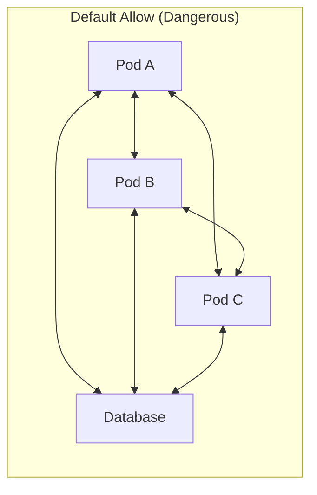
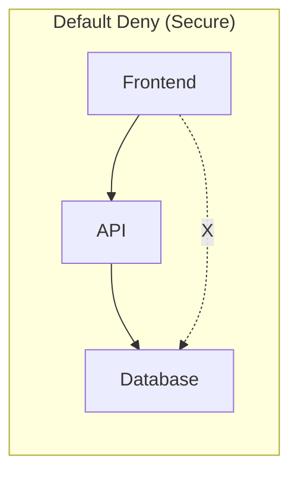
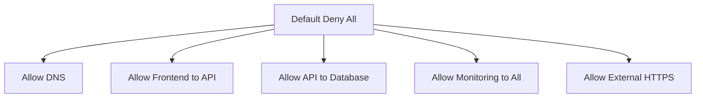

# How to Implement Default Deny Network Policies in Kubernetes

Author: [nawazdhandala](https://www.github.com/nawazdhandala)

Tags: Kubernetes, Network Policies, Security, Zero Trust, Networking

Description: Learn how to implement default deny network policies in Kubernetes to create a zero-trust network model for your cluster.

---

## The Problem with Default Allow

Kubernetes clusters are default-allow by nature. Every pod can reach every other pod across all namespaces. This means a single compromised pod can freely communicate with your database, secrets store, or any other service in the cluster.

A zero-trust network model flips this: deny everything by default, then explicitly allow only what is needed.





## Deny All Ingress Traffic

The simplest default deny policy blocks all incoming traffic to pods in a namespace.

```yaml
# deny-all-ingress.yaml
# Block all incoming traffic to every pod in this namespace
apiVersion: networking.k8s.io/v1
kind: NetworkPolicy
metadata:
  name: deny-all-ingress
  namespace: production
spec:
  # Empty selector matches ALL pods in the namespace
  podSelector: {}
  policyTypes:
    - Ingress
  # No ingress rules means no traffic is allowed in
```

Apply it:

```bash
# Apply default deny ingress to the production namespace
kubectl apply -f deny-all-ingress.yaml

# Verify no pods can receive traffic
kubectl get networkpolicy -n production
```

## Deny All Egress Traffic

Blocking all outgoing traffic prevents pods from making external calls, including DNS.

```yaml
# deny-all-egress.yaml
# Block all outgoing traffic from every pod in this namespace
apiVersion: networking.k8s.io/v1
kind: NetworkPolicy
metadata:
  name: deny-all-egress
  namespace: production
spec:
  # Empty selector matches ALL pods
  podSelector: {}
  policyTypes:
    - Egress
  # No egress rules means no outbound traffic is allowed
```

## Deny All Ingress and Egress

For maximum lockdown, deny both directions at once.

```yaml
# deny-all-traffic.yaml
# Block all traffic in both directions for every pod
apiVersion: networking.k8s.io/v1
kind: NetworkPolicy
metadata:
  name: deny-all-traffic
  namespace: production
spec:
  podSelector: {}
  policyTypes:
    - Ingress
    - Egress
  # No rules at all - everything is blocked
```

## Allow DNS After Default Deny

Once you deny all egress, pods cannot resolve DNS names. You must explicitly allow DNS.

```yaml
# allow-dns.yaml
# Allow all pods to perform DNS lookups
apiVersion: networking.k8s.io/v1
kind: NetworkPolicy
metadata:
  name: allow-dns
  namespace: production
spec:
  podSelector: {}
  policyTypes:
    - Egress
  egress:
    # Allow DNS queries to kube-dns / CoreDNS
    - to:
        - namespaceSelector: {}
      ports:
        - protocol: UDP
          port: 53
        - protocol: TCP
          port: 53
```

## Building Allow Rules on Top of Deny

After establishing default deny, add targeted allow rules for each service.



Here is a complete example for a three-tier application:

```yaml
# allow-frontend-to-api.yaml
# Allow the frontend pods to reach the API on port 8080
apiVersion: networking.k8s.io/v1
kind: NetworkPolicy
metadata:
  name: allow-frontend-to-api
  namespace: production
spec:
  podSelector:
    matchLabels:
      app: api
  policyTypes:
    - Ingress
  ingress:
    - from:
        - podSelector:
            matchLabels:
              app: frontend
      ports:
        - protocol: TCP
          port: 8080
---
# allow-api-to-database.yaml
# Allow the API pods to reach the database on port 5432
apiVersion: networking.k8s.io/v1
kind: NetworkPolicy
metadata:
  name: allow-api-to-database
  namespace: production
spec:
  podSelector:
    matchLabels:
      app: database
  policyTypes:
    - Ingress
  ingress:
    - from:
        - podSelector:
            matchLabels:
              app: api
      ports:
        - protocol: TCP
          port: 5432
---
# allow-api-egress-to-db.yaml
# Allow API pods to send traffic to the database
apiVersion: networking.k8s.io/v1
kind: NetworkPolicy
metadata:
  name: allow-api-egress-to-db
  namespace: production
spec:
  podSelector:
    matchLabels:
      app: api
  policyTypes:
    - Egress
  egress:
    - to:
        - podSelector:
            matchLabels:
              app: database
      ports:
        - protocol: TCP
          port: 5432
```

## Allowing Ingress Controller Traffic

Default deny will also block your ingress controller. You need to allow traffic from the ingress namespace.

```yaml
# allow-ingress-controller.yaml
# Allow traffic from the ingress controller namespace
apiVersion: networking.k8s.io/v1
kind: NetworkPolicy
metadata:
  name: allow-ingress-controller
  namespace: production
spec:
  podSelector:
    matchLabels:
      app: frontend
  policyTypes:
    - Ingress
  ingress:
    - from:
        # Allow from the ingress-nginx namespace
        - namespaceSelector:
            matchLabels:
              kubernetes.io/metadata.name: ingress-nginx
      ports:
        - protocol: TCP
          port: 80
        - protocol: TCP
          port: 443
```

## Namespace-Level Automation with Kustomize

Apply default deny to every namespace automatically using Kustomize:

```yaml
# kustomization.yaml
# Apply default deny policies to all target namespaces
apiVersion: kustomize.config.k8s.io/v1beta1
kind: Kustomization
resources:
  - deny-all-traffic.yaml
  - allow-dns.yaml
  - allow-ingress-controller.yaml
```

## Testing Default Deny

Always verify your policies work:

```bash
# Create a test namespace with default deny
kubectl create namespace test-deny
kubectl apply -f deny-all-traffic.yaml -n test-deny
kubectl apply -f allow-dns.yaml -n test-deny

# Deploy two test pods
kubectl run sender --image=busybox -n test-deny -- sleep 3600
kubectl run receiver --image=nginx -n test-deny

# Wait for pods to be ready
kubectl wait --for=condition=ready pod/sender -n test-deny --timeout=60s
kubectl wait --for=condition=ready pod/receiver -n test-deny --timeout=60s

# Get the receiver pod IP
RECEIVER_IP=$(kubectl get pod receiver -n test-deny -o jsonpath='{.status.podIP}')

# Test connectivity - this should fail (timeout)
kubectl exec sender -n test-deny -- wget -qO- --timeout=3 http://$RECEIVER_IP:80

# Clean up
kubectl delete namespace test-deny
```

## Audit Your Policies

List all network policies across all namespaces to audit your cluster:

```bash
# List all network policies in all namespaces
kubectl get networkpolicy --all-namespaces

# Describe a specific policy to see the rules
kubectl describe networkpolicy deny-all-traffic -n production

# Check which pods are selected by a policy
kubectl get pods -n production -l app=api
```

## Common Pitfalls

1. Forgetting to allow DNS egress after a default deny. Pods will fail to resolve service names and appear to have network issues.
2. Not allowing traffic from the ingress controller namespace. Your external traffic will be blocked.
3. Applying egress deny without allowing the Kubernetes API server. Some workloads need to talk to the API server.
4. Not testing policies in a staging environment first. A misconfigured policy can take down your entire application.

## Monitoring After Default Deny

After implementing default deny policies, monitoring becomes critical. You need to know immediately if a legitimate connection is being blocked. OneUptime (https://oneuptime.com) can monitor your Kubernetes services and alert you when connectivity between services degrades, helping you quickly identify whether a network policy is too restrictive or if there is a genuine issue.
