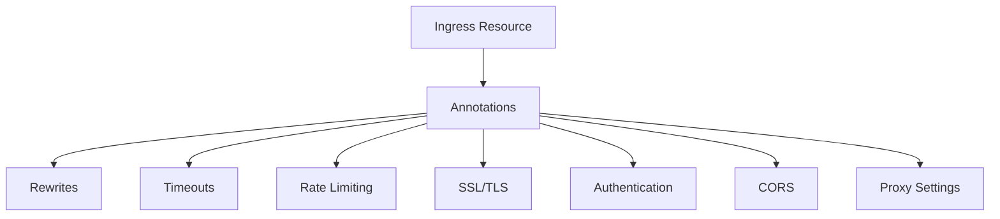
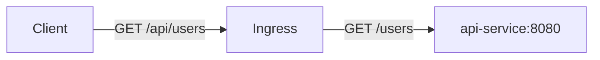

# Essential Nginx Ingress Controller Annotations for Kubernetes

Author: [nawazdhandala](https://www.github.com/nawazdhandala)

Tags: Kubernetes, Nginx, Ingress, Annotations, Configuration

Description: A practical reference guide to the most useful Nginx Ingress Controller annotations for rate limiting, rewrites, SSL, and more.

---

## Why Annotations Matter

The Kubernetes Ingress spec is intentionally minimal. It covers basic host and path routing, but real-world deployments need rate limiting, rewrites, timeouts, authentication, and more. Nginx Ingress Controller uses annotations to expose these features.

Annotations are key-value pairs on Ingress resources that configure Nginx behavior.



## SSL and TLS Annotations

### Force HTTPS Redirect

Redirect all HTTP traffic to HTTPS:

```yaml
# https-redirect.yaml
# Force all traffic to use HTTPS
apiVersion: networking.k8s.io/v1
kind: Ingress
metadata:
  name: secure-app
  annotations:
    # Redirect HTTP to HTTPS with a 308 permanent redirect
    nginx.ingress.kubernetes.io/ssl-redirect: "true"
    # Use 308 instead of 301 to preserve the request method
    nginx.ingress.kubernetes.io/force-ssl-redirect: "true"
spec:
  ingressClassName: nginx
  tls:
    - hosts:
        - app.example.com
      secretName: app-tls
  rules:
    - host: app.example.com
      http:
        paths:
          - path: /
            pathType: Prefix
            backend:
              service:
                name: app-service
                port:
                  number: 80
```

### HSTS (HTTP Strict Transport Security)

```yaml
# hsts.yaml
# Enable HSTS to tell browsers to always use HTTPS
apiVersion: networking.k8s.io/v1
kind: Ingress
metadata:
  name: hsts-app
  annotations:
    # Enable HSTS with a 1-year max age
    nginx.ingress.kubernetes.io/hsts: "true"
    nginx.ingress.kubernetes.io/hsts-max-age: "31536000"
    # Include subdomains in HSTS
    nginx.ingress.kubernetes.io/hsts-include-subdomains: "true"
    # Allow preloading in browser HSTS lists
    nginx.ingress.kubernetes.io/hsts-preload: "true"
spec:
  ingressClassName: nginx
  tls:
    - hosts:
        - app.example.com
      secretName: app-tls
  rules:
    - host: app.example.com
      http:
        paths:
          - path: /
            pathType: Prefix
            backend:
              service:
                name: app-service
                port:
                  number: 80
```

## URL Rewrite Annotations

### Rewrite Target

Strip or modify the URL path before forwarding to the backend:

```yaml
# rewrite.yaml
# Strip /api prefix before forwarding to the backend
# Request: /api/users -> Backend receives: /users
apiVersion: networking.k8s.io/v1
kind: Ingress
metadata:
  name: api-rewrite
  annotations:
    # Capture everything after the path prefix
    nginx.ingress.kubernetes.io/rewrite-target: /$2
    # Use regex in the path
    nginx.ingress.kubernetes.io/use-regex: "true"
spec:
  ingressClassName: nginx
  rules:
    - host: app.example.com
      http:
        paths:
          # Match /api/ followed by anything, capture the rest
          - path: /api(/|$)(.*)
            pathType: ImplementationSpecific
            backend:
              service:
                name: api-service
                port:
                  number: 8080
```



### App Root Redirect

Redirect the root path to a specific location:

```yaml
# app-root.yaml
# Redirect / to /dashboard
apiVersion: networking.k8s.io/v1
kind: Ingress
metadata:
  name: app-root
  annotations:
    # Redirect / to /dashboard
    nginx.ingress.kubernetes.io/app-root: /dashboard
spec:
  ingressClassName: nginx
  rules:
    - host: app.example.com
      http:
        paths:
          - path: /
            pathType: Prefix
            backend:
              service:
                name: app-service
                port:
                  number: 80
```

## Rate Limiting Annotations

Protect your services from excessive traffic:

```yaml
# rate-limit.yaml
# Apply rate limiting to an API endpoint
apiVersion: networking.k8s.io/v1
kind: Ingress
metadata:
  name: rate-limited-api
  annotations:
    # Limit to 10 requests per second per IP
    nginx.ingress.kubernetes.io/limit-rps: "10"
    # Allow burst of up to 20 requests
    nginx.ingress.kubernetes.io/limit-burst-multiplier: "2"
    # Limit concurrent connections per IP
    nginx.ingress.kubernetes.io/limit-connections: "5"
    # Return 429 (Too Many Requests) when limit is exceeded
    nginx.ingress.kubernetes.io/limit-rate-after: "0"
spec:
  ingressClassName: nginx
  rules:
    - host: api.example.com
      http:
        paths:
          - path: /
            pathType: Prefix
            backend:
              service:
                name: api-service
                port:
                  number: 8080
```

## Timeout and Proxy Annotations

### Backend Timeouts

Configure how long Nginx waits for backend responses:

```yaml
# timeouts.yaml
# Configure timeouts for a slow backend
apiVersion: networking.k8s.io/v1
kind: Ingress
metadata:
  name: slow-backend
  annotations:
    # Timeout for establishing connection to backend (seconds)
    nginx.ingress.kubernetes.io/proxy-connect-timeout: "10"
    # Timeout for reading response from backend (seconds)
    nginx.ingress.kubernetes.io/proxy-read-timeout: "300"
    # Timeout for sending request to backend (seconds)
    nginx.ingress.kubernetes.io/proxy-send-timeout: "300"
    # Maximum body size for uploads (default is 1m)
    nginx.ingress.kubernetes.io/proxy-body-size: "50m"
spec:
  ingressClassName: nginx
  rules:
    - host: upload.example.com
      http:
        paths:
          - path: /
            pathType: Prefix
            backend:
              service:
                name: upload-service
                port:
                  number: 8080
```

### WebSocket Support

Enable WebSocket connections:

```yaml
# websocket.yaml
# Enable WebSocket support with appropriate timeouts
apiVersion: networking.k8s.io/v1
kind: Ingress
metadata:
  name: websocket-app
  annotations:
    # Enable WebSocket proxying
    nginx.ingress.kubernetes.io/proxy-read-timeout: "3600"
    nginx.ingress.kubernetes.io/proxy-send-timeout: "3600"
    # Required for WebSocket upgrade
    nginx.ingress.kubernetes.io/upstream-hash-by: "$remote_addr"
spec:
  ingressClassName: nginx
  rules:
    - host: ws.example.com
      http:
        paths:
          - path: /
            pathType: Prefix
            backend:
              service:
                name: websocket-service
                port:
                  number: 8080
```

## CORS Annotations

Enable Cross-Origin Resource Sharing:

```yaml
# cors.yaml
# Enable CORS for an API
apiVersion: networking.k8s.io/v1
kind: Ingress
metadata:
  name: cors-api
  annotations:
    # Enable CORS
    nginx.ingress.kubernetes.io/enable-cors: "true"
    # Allowed origins (comma-separated)
    nginx.ingress.kubernetes.io/cors-allow-origin: "https://app.example.com, https://admin.example.com"
    # Allowed HTTP methods
    nginx.ingress.kubernetes.io/cors-allow-methods: "GET, POST, PUT, DELETE, OPTIONS"
    # Allowed headers
    nginx.ingress.kubernetes.io/cors-allow-headers: "Authorization, Content-Type, X-Request-ID"
    # Allow credentials (cookies, auth headers)
    nginx.ingress.kubernetes.io/cors-allow-credentials: "true"
    # Cache preflight response for 1 hour
    nginx.ingress.kubernetes.io/cors-max-age: "3600"
spec:
  ingressClassName: nginx
  rules:
    - host: api.example.com
      http:
        paths:
          - path: /
            pathType: Prefix
            backend:
              service:
                name: api-service
                port:
                  number: 8080
```

## Authentication Annotations

### Basic Authentication

```yaml
# basic-auth.yaml
# Protect an endpoint with basic authentication
apiVersion: networking.k8s.io/v1
kind: Ingress
metadata:
  name: protected-app
  annotations:
    # Enable basic authentication
    nginx.ingress.kubernetes.io/auth-type: basic
    # Secret containing htpasswd credentials
    nginx.ingress.kubernetes.io/auth-secret: basic-auth-secret
    # Realm shown in the browser prompt
    nginx.ingress.kubernetes.io/auth-realm: "Authentication Required"
spec:
  ingressClassName: nginx
  rules:
    - host: admin.example.com
      http:
        paths:
          - path: /
            pathType: Prefix
            backend:
              service:
                name: admin-service
                port:
                  number: 80
```

Create the auth secret:

```bash
# Generate htpasswd file
htpasswd -c auth admin

# Create Kubernetes secret from the htpasswd file
kubectl create secret generic basic-auth-secret --from-file=auth
```

## Custom Headers

Add custom response headers:

```yaml
# custom-headers.yaml
# Add security headers to all responses
apiVersion: networking.k8s.io/v1
kind: Ingress
metadata:
  name: secure-headers
  annotations:
    # Add custom response headers via a ConfigMap
    nginx.ingress.kubernetes.io/configuration-snippet: |
      add_header X-Frame-Options "SAMEORIGIN" always;
      add_header X-Content-Type-Options "nosniff" always;
      add_header X-XSS-Protection "1; mode=block" always;
      add_header Referrer-Policy "strict-origin-when-cross-origin" always;
spec:
  ingressClassName: nginx
  rules:
    - host: app.example.com
      http:
        paths:
          - path: /
            pathType: Prefix
            backend:
              service:
                name: app-service
                port:
                  number: 80
```

## Debugging Annotations

Verify your annotations are applied correctly:

```bash
# Check the generated Nginx configuration
kubectl exec -n ingress-nginx deploy/ingress-nginx-controller -- cat /etc/nginx/nginx.conf | grep -A 20 "app.example.com"

# Check Ingress events for errors
kubectl describe ingress secure-app

# View Nginx Ingress Controller logs
kubectl logs -n ingress-nginx deploy/ingress-nginx-controller --tail=50
```

## Monitoring Ingress Health

Nginx Ingress Controller annotations give you fine-grained control, but misconfigurations can cause outages. OneUptime (https://oneuptime.com) can monitor your Ingress endpoints, track response times, and alert you when rate limits, timeouts, or SSL configurations cause issues for your users.
