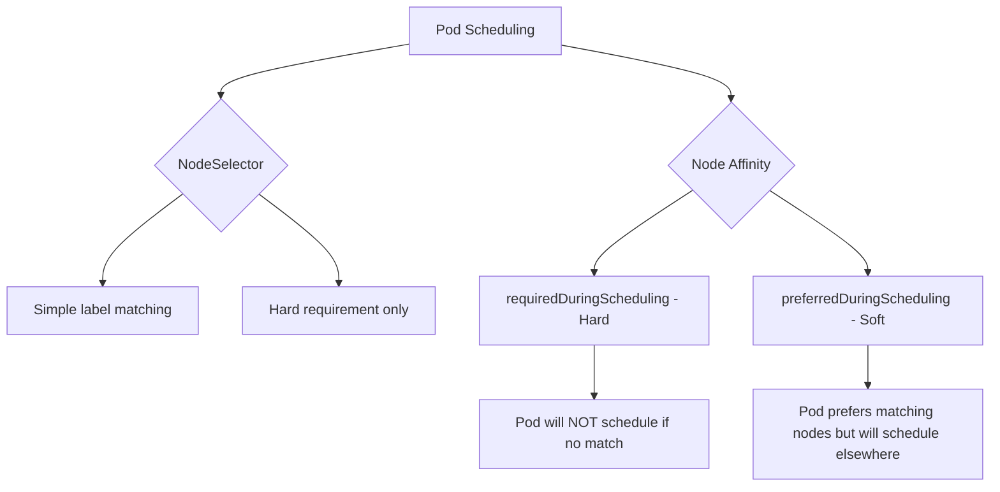
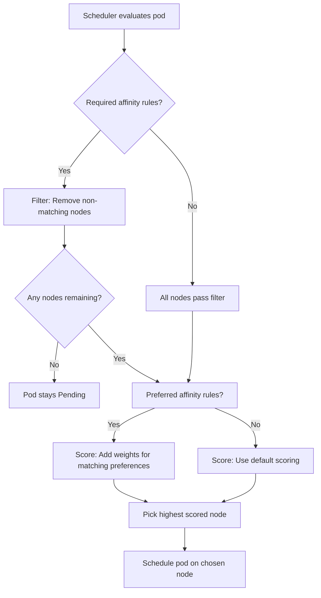

# How to Use Kubernetes Node Affinity and Anti-Affinity Rules

Author: [nawazdhandala](https://www.github.com/nawazdhandala)

Tags: Kubernetes, Scheduling, Node Affinity, Anti-Affinity, Placement

Description: Learn how to use node affinity and anti-affinity rules to control pod placement across specific nodes in your Kubernetes cluster.

---

By default, the Kubernetes scheduler places pods on any node with sufficient resources. But sometimes you need more control. You might want GPU workloads on GPU nodes, latency-sensitive services in a specific availability zone, or development pods away from production nodes. Node affinity and anti-affinity rules give you this control. This post covers how to use them effectively.

## Node Affinity vs NodeSelector

NodeSelector is the simplest way to constrain pods to specific nodes, but node affinity is more expressive. Node affinity supports soft preferences, multiple conditions, and operators beyond equality.



## Step 1: Label Your Nodes

Before using node affinity, label your nodes to create the selection criteria.

```bash
# Label nodes by their purpose
kubectl label nodes worker-1 workload-type=general
kubectl label nodes worker-2 workload-type=general
kubectl label nodes worker-3 workload-type=gpu
kubectl label nodes worker-4 workload-type=gpu

# Label nodes by availability zone
kubectl label nodes worker-1 topology.kubernetes.io/zone=us-east-1a
kubectl label nodes worker-2 topology.kubernetes.io/zone=us-east-1b
kubectl label nodes worker-3 topology.kubernetes.io/zone=us-east-1a
kubectl label nodes worker-4 topology.kubernetes.io/zone=us-east-1c

# Label nodes by disk type
kubectl label nodes worker-1 disk-type=ssd
kubectl label nodes worker-2 disk-type=hdd
kubectl label nodes worker-3 disk-type=ssd
kubectl label nodes worker-4 disk-type=ssd

# Verify labels
kubectl get nodes --show-labels
```

## Step 2: Required Node Affinity (Hard Constraint)

Use `requiredDuringSchedulingIgnoredDuringExecution` when a pod absolutely must run on a matching node.

```yaml
# required-affinity.yaml
# Pod that MUST be scheduled on a GPU node
apiVersion: v1
kind: Pod
metadata:
  name: ml-training
spec:
  affinity:
    nodeAffinity:
      requiredDuringSchedulingIgnoredDuringExecution:
        nodeSelectorTerms:
          # This term requires the node to have a GPU workload label
          - matchExpressions:
              - key: workload-type
                operator: In
                values:
                  - gpu
              # AND the node must have an SSD disk
              - key: disk-type
                operator: In
                values:
                  - ssd
  containers:
    - name: training
      image: your-registry/ml-training:latest
      resources:
        requests:
          cpu: "4000m"
          memory: "16Gi"
```

The pod above will only schedule on nodes that have both `workload-type=gpu` AND `disk-type=ssd`. If no matching node exists, the pod stays Pending.

## Step 3: Preferred Node Affinity (Soft Constraint)

Use `preferredDuringSchedulingIgnoredDuringExecution` when you want the scheduler to prefer certain nodes but still allow scheduling elsewhere.

```yaml
# preferred-affinity.yaml
# Pod that prefers SSD nodes but will run on HDD nodes if needed
apiVersion: apps/v1
kind: Deployment
metadata:
  name: cache-service
spec:
  replicas: 3
  selector:
    matchLabels:
      app: cache-service
  template:
    metadata:
      labels:
        app: cache-service
    spec:
      affinity:
        nodeAffinity:
          preferredDuringSchedulingIgnoredDuringExecution:
            # Strong preference for SSD nodes (weight 80 out of 100)
            - weight: 80
              preference:
                matchExpressions:
                  - key: disk-type
                    operator: In
                    values:
                      - ssd
            # Mild preference for us-east-1a zone (weight 20 out of 100)
            - weight: 20
              preference:
                matchExpressions:
                  - key: topology.kubernetes.io/zone
                    operator: In
                    values:
                      - us-east-1a
      containers:
        - name: cache
          image: redis:7
          resources:
            requests:
              cpu: "500m"
              memory: "1Gi"
```

The scheduler scores each node by summing the weights of matching preferences and places the pod on the highest-scoring node.

## Scheduling Decision Flow



## Step 4: Using Operators

Node affinity supports several operators beyond simple equality:

```yaml
# operators-example.yaml
# Demonstrating different operator types in node affinity
apiVersion: v1
kind: Pod
metadata:
  name: operator-demo
spec:
  affinity:
    nodeAffinity:
      requiredDuringSchedulingIgnoredDuringExecution:
        nodeSelectorTerms:
          - matchExpressions:
              # In - value must be one of the listed values
              - key: workload-type
                operator: In
                values:
                  - general
                  - gpu
              # NotIn - value must NOT be one of the listed values
              - key: environment
                operator: NotIn
                values:
                  - production
              # Exists - label key must exist (any value)
              - key: disk-type
                operator: Exists
              # Gt - value must be greater than (numeric comparison)
              - key: cpu-cores
                operator: Gt
                values:
                  - "4"
  containers:
    - name: app
      image: nginx:1.27
```

Available operators: `In`, `NotIn`, `Exists`, `DoesNotExist`, `Gt`, `Lt`.

## Step 5: Combining Required and Preferred

You can use both hard and soft constraints together.

```yaml
# combined-affinity.yaml
# Pod with both required and preferred node affinity
apiVersion: apps/v1
kind: Deployment
metadata:
  name: api-service
spec:
  replicas: 4
  selector:
    matchLabels:
      app: api-service
  template:
    metadata:
      labels:
        app: api-service
    spec:
      affinity:
        nodeAffinity:
          # MUST be a general-purpose node (hard requirement)
          requiredDuringSchedulingIgnoredDuringExecution:
            nodeSelectorTerms:
              - matchExpressions:
                  - key: workload-type
                    operator: In
                    values:
                      - general
          # PREFER SSD disk and zone a (soft preference)
          preferredDuringSchedulingIgnoredDuringExecution:
            - weight: 60
              preference:
                matchExpressions:
                  - key: disk-type
                    operator: In
                    values:
                      - ssd
            - weight: 40
              preference:
                matchExpressions:
                  - key: topology.kubernetes.io/zone
                    operator: In
                    values:
                      - us-east-1a
      containers:
        - name: api
          image: your-registry/api:latest
          resources:
            requests:
              cpu: "250m"
              memory: "512Mi"
```

## Step 6: Node Anti-Affinity

To prevent pods from scheduling on certain nodes, use the `NotIn` or `DoesNotExist` operators.

```yaml
# anti-affinity.yaml
# Pod that must NOT run on GPU nodes or maintenance nodes
apiVersion: v1
kind: Pod
metadata:
  name: lightweight-worker
spec:
  affinity:
    nodeAffinity:
      requiredDuringSchedulingIgnoredDuringExecution:
        nodeSelectorTerms:
          - matchExpressions:
              # Must NOT be a GPU node
              - key: workload-type
                operator: NotIn
                values:
                  - gpu
              # Must NOT have a maintenance label
              - key: maintenance
                operator: DoesNotExist
  containers:
    - name: worker
      image: your-registry/worker:latest
      resources:
        requests:
          cpu: "100m"
          memory: "128Mi"
```

## Debugging Node Affinity

```bash
# Check why a pod is not being scheduled
kubectl describe pod ml-training | grep -A 10 Events

# See which nodes match a specific label
kubectl get nodes -l workload-type=gpu

# Check a pod's affinity rules
kubectl get pod ml-training -o jsonpath='{.spec.affinity}' | jq .

# See scheduler events
kubectl get events --field-selector reason=FailedScheduling
```

## Summary

Node affinity gives you fine-grained control over which nodes your pods land on. Use hard constraints when placement is critical, soft preferences when you want to optimize without risking pending pods, and combine them for nuanced scheduling policies.

To monitor pod placement, track scheduling failures, and ensure your affinity rules are working as expected, use [OneUptime](https://oneuptime.com). OneUptime provides Kubernetes monitoring, alerting, and dashboards that show you exactly where your pods are running and alert you when scheduling problems occur.
