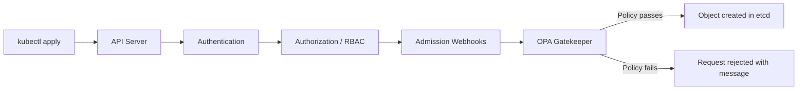
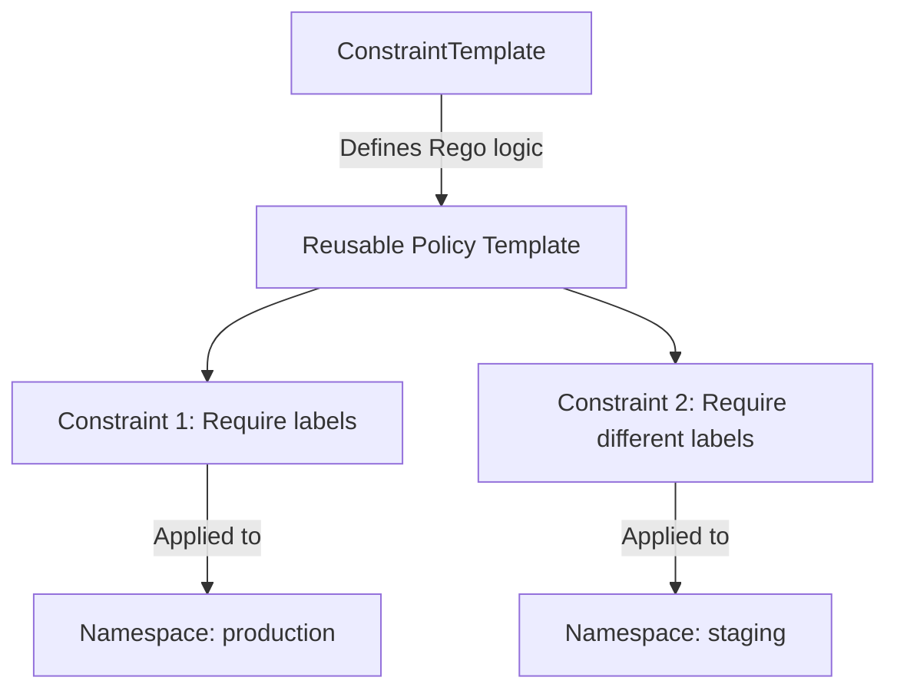

# How to Use OPA Gatekeeper for Kubernetes Policy Enforcement

Author: [nawazdhandala](https://www.github.com/nawazdhandala)

Tags: Kubernetes, OPA, Gatekeeper, Policy, Security

Description: Learn how to use OPA Gatekeeper to enforce custom policies in Kubernetes for security, compliance, and operational best practices.

---

Pod Security Standards cover basic container security, but organizations need to enforce many other policies: requiring labels, blocking latest tags, mandating resource limits, restricting registries, and more. OPA Gatekeeper is a Kubernetes admission controller that lets you define and enforce custom policies using the Rego policy language.

## What Is OPA Gatekeeper?

OPA (Open Policy Agent) is a general-purpose policy engine. Gatekeeper is its Kubernetes-native integration. It intercepts API requests through a validating admission webhook, evaluates them against your policies, and rejects requests that violate them.



## Installing Gatekeeper

```bash
# Install Gatekeeper using the official Helm chart
helm repo add gatekeeper https://open-policy-agent.github.io/gatekeeper/charts
helm repo update

helm install gatekeeper gatekeeper/gatekeeper \
  --namespace gatekeeper-system \
  --create-namespace \
  --set replicas=3 \
  --set audit.replicas=1

# Verify the installation
kubectl get pods -n gatekeeper-system
kubectl get crd | grep gatekeeper
```

## Constraint Templates and Constraints

Gatekeeper uses two resources to define policies:

- **ConstraintTemplate** - Defines the policy logic using Rego.
- **Constraint** - Applies the template with specific parameters.



## Policy: Require Labels

This policy ensures all deployments have specific labels.

```yaml
# template-require-labels.yaml
# This ConstraintTemplate checks that resources have required labels.
apiVersion: templates.gatekeeper.sh/v1
kind: ConstraintTemplate
metadata:
  name: k8srequiredlabels
spec:
  crd:
    spec:
      names:
        kind: K8sRequiredLabels
      validation:
        openAPIV3Schema:
          type: object
          properties:
            labels:
              type: array
              items:
                type: string
              description: "List of required label keys"
  targets:
    - target: admission.k8s.gatekeeper.sh
      rego: |
        package k8srequiredlabels

        # Check each required label
        violation[{"msg": msg}] {
          # Get the list of required labels from parameters
          required := input.parameters.labels[_]
          # Check if the label exists on the resource
          not input.review.object.metadata.labels[required]
          # Build a descriptive error message
          msg := sprintf("Resource '%v' is missing required label: '%v'", [
            input.review.object.metadata.name,
            required
          ])
        }
```

```yaml
# constraint-require-labels.yaml
# Apply the template: require "app" and "team" labels on Deployments.
apiVersion: constraints.gatekeeper.sh/v1beta1
kind: K8sRequiredLabels
metadata:
  name: require-app-team-labels
spec:
  # enforcement action: deny, dryrun, or warn
  enforcementAction: deny
  match:
    kinds:
      - apiGroups: ["apps"]
        kinds: ["Deployment"]
    namespaces:
      - production
      - staging
  parameters:
    labels:
      - "app"
      - "team"
```

## Policy: Block Latest Tag

```yaml
# template-block-latest.yaml
# This template blocks container images using the "latest" tag or no tag.
apiVersion: templates.gatekeeper.sh/v1
kind: ConstraintTemplate
metadata:
  name: k8sblocklatesttag
spec:
  crd:
    spec:
      names:
        kind: K8sBlockLatestTag
  targets:
    - target: admission.k8s.gatekeeper.sh
      rego: |
        package k8sblocklatesttag

        violation[{"msg": msg}] {
          # Get each container in the pod spec
          container := input.review.object.spec.template.spec.containers[_]
          # Check if the image uses "latest" tag
          endswith(container.image, ":latest")
          msg := sprintf("Container '%v' uses the ':latest' tag. Use a specific version tag instead.", [
            container.name
          ])
        }

        violation[{"msg": msg}] {
          container := input.review.object.spec.template.spec.containers[_]
          # Check if the image has no tag at all (defaults to latest)
          not contains(container.image, ":")
          msg := sprintf("Container '%v' has no image tag. Specify a version tag.", [
            container.name
          ])
        }
---
apiVersion: constraints.gatekeeper.sh/v1beta1
kind: K8sBlockLatestTag
metadata:
  name: block-latest-tag
spec:
  enforcementAction: deny
  match:
    kinds:
      - apiGroups: ["apps"]
        kinds: ["Deployment", "StatefulSet", "DaemonSet"]
```

## Policy: Require Resource Limits

```yaml
# template-require-limits.yaml
# Ensure all containers define CPU and memory limits.
apiVersion: templates.gatekeeper.sh/v1
kind: ConstraintTemplate
metadata:
  name: k8srequireresourcelimits
spec:
  crd:
    spec:
      names:
        kind: K8sRequireResourceLimits
  targets:
    - target: admission.k8s.gatekeeper.sh
      rego: |
        package k8srequireresourcelimits

        violation[{"msg": msg}] {
          container := input.review.object.spec.template.spec.containers[_]
          # Check if CPU limit is missing
          not container.resources.limits.cpu
          msg := sprintf("Container '%v' must define a CPU limit.", [container.name])
        }

        violation[{"msg": msg}] {
          container := input.review.object.spec.template.spec.containers[_]
          # Check if memory limit is missing
          not container.resources.limits.memory
          msg := sprintf("Container '%v' must define a memory limit.", [container.name])
        }
---
apiVersion: constraints.gatekeeper.sh/v1beta1
kind: K8sRequireResourceLimits
metadata:
  name: require-resource-limits
spec:
  enforcementAction: deny
  match:
    kinds:
      - apiGroups: ["apps"]
        kinds: ["Deployment", "StatefulSet"]
    namespaces:
      - production
```

## Policy: Restrict Image Registries

```yaml
# template-allowed-registries.yaml
# Only allow images from approved container registries.
apiVersion: templates.gatekeeper.sh/v1
kind: ConstraintTemplate
metadata:
  name: k8sallowedregistries
spec:
  crd:
    spec:
      names:
        kind: K8sAllowedRegistries
      validation:
        openAPIV3Schema:
          type: object
          properties:
            registries:
              type: array
              items:
                type: string
  targets:
    - target: admission.k8s.gatekeeper.sh
      rego: |
        package k8sallowedregistries

        violation[{"msg": msg}] {
          container := input.review.object.spec.template.spec.containers[_]
          # Check if the image starts with any allowed registry
          not registry_allowed(container.image)
          msg := sprintf("Container '%v' uses image '%v' from a disallowed registry. Allowed registries: %v", [
            container.name,
            container.image,
            input.parameters.registries
          ])
        }

        # Helper: check if image starts with any allowed registry prefix
        registry_allowed(image) {
          allowed := input.parameters.registries[_]
          startswith(image, allowed)
        }
---
apiVersion: constraints.gatekeeper.sh/v1beta1
kind: K8sAllowedRegistries
metadata:
  name: allowed-registries
spec:
  enforcementAction: deny
  match:
    kinds:
      - apiGroups: ["apps"]
        kinds: ["Deployment", "StatefulSet", "DaemonSet"]
  parameters:
    registries:
      - "123456789.dkr.ecr.us-east-1.amazonaws.com/"
      - "gcr.io/my-project/"
      - "ghcr.io/my-org/"
```

## Dry Run Mode

Test policies before enforcing them by using `dryrun` enforcement.

```yaml
# constraint-dryrun.yaml
# This constraint logs violations without blocking requests.
apiVersion: constraints.gatekeeper.sh/v1beta1
kind: K8sRequiredLabels
metadata:
  name: require-labels-dryrun
spec:
  # dryrun logs violations without rejecting requests
  enforcementAction: dryrun
  match:
    kinds:
      - apiGroups: ["apps"]
        kinds: ["Deployment"]
  parameters:
    labels:
      - "cost-center"
```

```bash
# Check audit results to see which resources would be rejected
kubectl get k8srequiredlabels require-labels-dryrun -o yaml

# View constraint violations
kubectl describe k8srequiredlabels require-labels-dryrun
```

## Monitoring Gatekeeper

```bash
# Check Gatekeeper health
kubectl get pods -n gatekeeper-system

# View all constraint templates
kubectl get constrainttemplates

# View all active constraints
kubectl get constraints

# Check audit violations across all constraints
kubectl get constraints -o json | \
  jq '.items[] | {name: .metadata.name, violations: .status.totalViolations}'
```

## Monitoring Policies with OneUptime

Policy enforcement is critical for maintaining security and compliance in production clusters. [OneUptime](https://oneuptime.com) helps you monitor Gatekeeper's health, track policy violation trends over time, and alert your team when new violations are detected during audits. Integrate Gatekeeper metrics with OneUptime dashboards to visualize which policies are most frequently violated and which teams need guidance on compliance.
