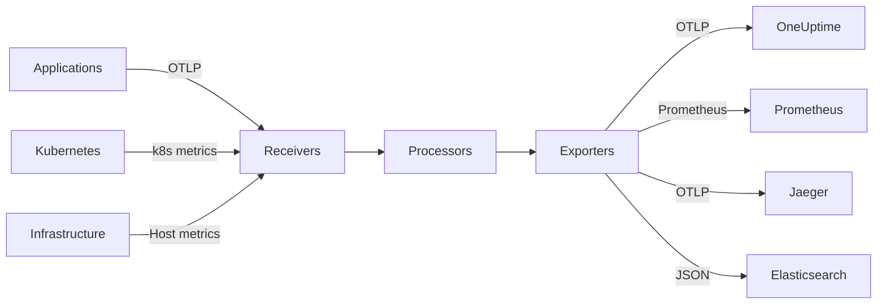
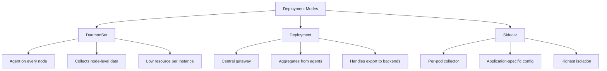

# How to Deploy the OpenTelemetry Collector on Kubernetes

Author: [nawazdhandala](https://www.github.com/nawazdhandala)

Tags: Kubernetes, OpenTelemetry, Collector, Observability, Telemetry

Description: Learn how to deploy and configure the OpenTelemetry Collector on Kubernetes for collecting metrics, traces, and logs.

---

The OpenTelemetry Collector is a vendor-neutral agent that receives, processes, and exports telemetry data. It acts as a central pipeline for metrics, traces, and logs in your Kubernetes cluster. This guide shows you how to deploy and configure it for production use.

## Architecture Overview

The Collector has three main components: receivers, processors, and exporters. Data flows through a pipeline from receivers to processors to exporters.



## Deployment Modes

The Collector can be deployed in different modes depending on your needs.



The recommended pattern is a two-tier setup: DaemonSet agents on each node forwarding to a central Deployment gateway.

## Step 1: Install the OpenTelemetry Operator

The OpenTelemetry Operator manages Collector instances using Custom Resources.

```bash
# Install cert-manager (required by the operator)
kubectl apply -f https://github.com/cert-manager/cert-manager/releases/download/v1.14.4/cert-manager.yaml

# Wait for cert-manager to be ready
kubectl wait --for=condition=Available deployment/cert-manager -n cert-manager --timeout=300s
kubectl wait --for=condition=Available deployment/cert-manager-webhook -n cert-manager --timeout=300s

# Install the OpenTelemetry Operator
kubectl apply -f https://github.com/open-telemetry/opentelemetry-operator/releases/latest/download/opentelemetry-operator.yaml

# Wait for the operator to be ready
kubectl wait --for=condition=Available deployment/opentelemetry-operator-controller-manager \
  -n opentelemetry-operator-system --timeout=300s
```

## Step 2: Deploy the Collector as a DaemonSet (Agent)

The agent runs on every node and collects telemetry from local pods.

```yaml
# otel-agent.yaml - DaemonSet collector agent
apiVersion: opentelemetry.io/v1beta1
kind: OpenTelemetryCollector
metadata:
  name: otel-agent
  namespace: observability
spec:
  # DaemonSet mode runs one collector pod per node
  mode: daemonset
  # Resource limits for each agent pod
  resources:
    requests:
      cpu: 100m
      memory: 256Mi
    limits:
      cpu: 500m
      memory: 512Mi
  config:
    # Receivers define how data gets into the collector
    receivers:
      # Accept OTLP data over gRPC and HTTP
      otlp:
        protocols:
          grpc:
            # Listen on all interfaces, port 4317
            endpoint: 0.0.0.0:4317
          http:
            # Listen on all interfaces, port 4318
            endpoint: 0.0.0.0:4318

      # Collect Kubernetes node and pod metrics
      kubeletstats:
        collection_interval: 30s
        auth_type: serviceAccount
        endpoint: "https://${env:K8S_NODE_NAME}:10250"
        insecure_skip_verify: true
        metric_groups:
          - node
          - pod
          - container

      # Collect host-level metrics from the node
      hostmetrics:
        collection_interval: 30s
        scrapers:
          cpu: {}
          memory: {}
          disk: {}
          filesystem: {}
          network: {}
          load: {}

    # Processors transform and enrich telemetry data
    processors:
      # Add batching to reduce export overhead
      batch:
        # Send a batch every 5 seconds
        send_batch_size: 8192
        timeout: 5s

      # Add memory limiting to prevent OOM
      memory_limiter:
        # Check memory usage every second
        check_interval: 1s
        # Hard limit at 400Mi (80% of 512Mi limit)
        limit_mib: 400
        # Start dropping data at 350Mi
        spike_limit_mib: 100

      # Add Kubernetes metadata to telemetry
      k8sattributes:
        auth_type: serviceAccount
        passthrough: false
        extract:
          metadata:
            - k8s.pod.name
            - k8s.pod.uid
            - k8s.namespace.name
            - k8s.node.name
            - k8s.deployment.name
          labels:
            - tag_name: app
              key: app
              from: pod

      # Add resource detection attributes
      resourcedetection:
        detectors: [env, system, k8snode]
        timeout: 5s

    # Exporters send data to backends
    exporters:
      # Forward to the central gateway collector
      otlp:
        endpoint: otel-gateway-collector.observability.svc.cluster.local:4317
        tls:
          insecure: true

      # Log telemetry data for debugging (remove in production)
      debug:
        verbosity: basic

    # Pipelines connect receivers, processors, and exporters
    service:
      pipelines:
        # Traces pipeline
        traces:
          receivers: [otlp]
          processors: [memory_limiter, k8sattributes, batch]
          exporters: [otlp]
        # Metrics pipeline
        metrics:
          receivers: [otlp, kubeletstats, hostmetrics]
          processors: [memory_limiter, k8sattributes, resourcedetection, batch]
          exporters: [otlp]
        # Logs pipeline
        logs:
          receivers: [otlp]
          processors: [memory_limiter, k8sattributes, batch]
          exporters: [otlp]
```

## Step 3: Deploy the Collector as a Deployment (Gateway)

The gateway aggregates data from all agents and exports to your backends.

```yaml
# otel-gateway.yaml - Central gateway collector
apiVersion: opentelemetry.io/v1beta1
kind: OpenTelemetryCollector
metadata:
  name: otel-gateway
  namespace: observability
spec:
  # Deployment mode runs a scalable set of collector pods
  mode: deployment
  replicas: 2
  resources:
    requests:
      cpu: 500m
      memory: 1Gi
    limits:
      cpu: 1000m
      memory: 2Gi
  config:
    receivers:
      # Receive data from the DaemonSet agents
      otlp:
        protocols:
          grpc:
            endpoint: 0.0.0.0:4317
          http:
            endpoint: 0.0.0.0:4318

    processors:
      batch:
        send_batch_size: 8192
        timeout: 10s

      memory_limiter:
        check_interval: 1s
        limit_mib: 1500
        spike_limit_mib: 300

      # Filter out noisy or unwanted telemetry
      filter:
        error_mode: ignore
        traces:
          span:
            # Drop health check spans to reduce noise
            - 'attributes["http.route"] == "/healthz"'
            - 'attributes["http.route"] == "/readyz"'

    exporters:
      # Export to OneUptime
      otlp/oneuptime:
        endpoint: "https://otlp.oneuptime.com"
        headers:
          x-oneuptime-token: "${env:ONEUPTIME_TOKEN}"

      # Export metrics to Prometheus
      prometheus:
        endpoint: 0.0.0.0:8889
        resource_to_telemetry_conversion:
          enabled: true

    service:
      pipelines:
        traces:
          receivers: [otlp]
          processors: [memory_limiter, filter, batch]
          exporters: [otlp/oneuptime]
        metrics:
          receivers: [otlp]
          processors: [memory_limiter, batch]
          exporters: [otlp/oneuptime, prometheus]
        logs:
          receivers: [otlp]
          processors: [memory_limiter, batch]
          exporters: [otlp/oneuptime]
```

## Step 4: Configure Your Applications

Point your applications to send telemetry to the local agent.

```yaml
# app-deployment.yaml - Application configured to send telemetry
apiVersion: apps/v1
kind: Deployment
metadata:
  name: my-app
  namespace: production
spec:
  replicas: 3
  selector:
    matchLabels:
      app: my-app
  template:
    metadata:
      labels:
        app: my-app
    spec:
      containers:
      - name: my-app
        image: my-app:latest
        env:
        # Point the OTLP exporter to the local agent DaemonSet
        # Using the node IP ensures traffic stays local
        - name: OTEL_EXPORTER_OTLP_ENDPOINT
          value: "http://otel-agent-collector.observability.svc.cluster.local:4317"
        # Set the service name for traces and metrics
        - name: OTEL_SERVICE_NAME
          value: "my-app"
        # Set the resource attributes
        - name: OTEL_RESOURCE_ATTRIBUTES
          value: "deployment.environment=production,service.version=1.2.3"
```

## Step 5: Apply RBAC for Kubernetes Metadata

The collector needs permissions to read Kubernetes metadata.

```yaml
# rbac.yaml - RBAC for the OpenTelemetry Collector
apiVersion: v1
kind: ServiceAccount
metadata:
  name: otel-collector
  namespace: observability
---
apiVersion: rbac.authorization.k8s.io/v1
kind: ClusterRole
metadata:
  name: otel-collector
rules:
# Read pods and namespaces for k8sattributes processor
- apiGroups: [""]
  resources: ["pods", "namespaces", "nodes"]
  verbs: ["get", "list", "watch"]
# Read replica sets for deployment name resolution
- apiGroups: ["apps"]
  resources: ["replicasets"]
  verbs: ["get", "list", "watch"]
# Read node stats for kubeletstats receiver
- apiGroups: [""]
  resources: ["nodes/stats"]
  verbs: ["get"]
---
apiVersion: rbac.authorization.k8s.io/v1
kind: ClusterRoleBinding
metadata:
  name: otel-collector
subjects:
- kind: ServiceAccount
  name: otel-collector
  namespace: observability
roleRef:
  kind: ClusterRole
  name: otel-collector
  apiGroup: rbac.authorization.k8s.io
```

## Verification

```bash
# Check that collector pods are running
kubectl get pods -n observability

# Check collector logs for errors
kubectl logs -n observability -l app.kubernetes.io/name=otel-agent-collector --tail=50

# Check the collector internal metrics
kubectl port-forward -n observability svc/otel-gateway-collector 8888:8888
# Visit http://localhost:8888/metrics

# Verify data is flowing through the pipeline
kubectl logs -n observability -l app.kubernetes.io/name=otel-gateway-collector | grep "TracesExported\|MetricsExported\|LogsExported"
```

## Conclusion

The OpenTelemetry Collector provides a powerful, vendor-neutral telemetry pipeline for Kubernetes. Using a two-tier architecture with DaemonSet agents and a Deployment gateway gives you the best balance of performance and flexibility. Configure receivers for your data sources, add processors for enrichment and filtering, and set up exporters for your observability backends.

For a complete observability platform that natively supports OpenTelemetry, check out [OneUptime](https://oneuptime.com). OneUptime accepts OTLP data directly and provides unified monitoring, tracing, logging, and incident management in one platform.
