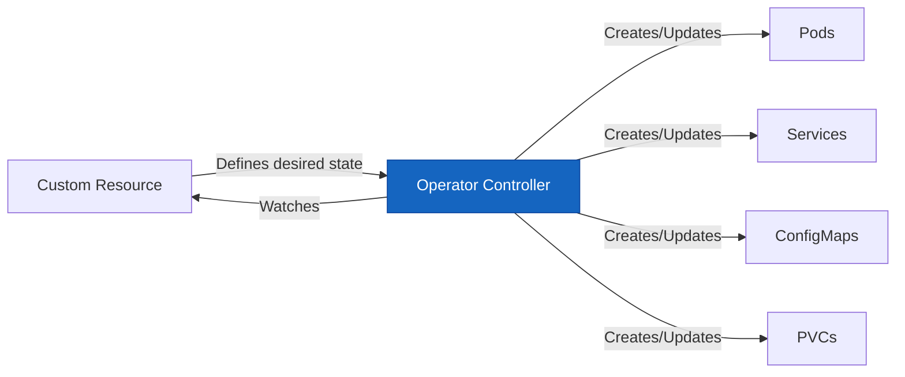
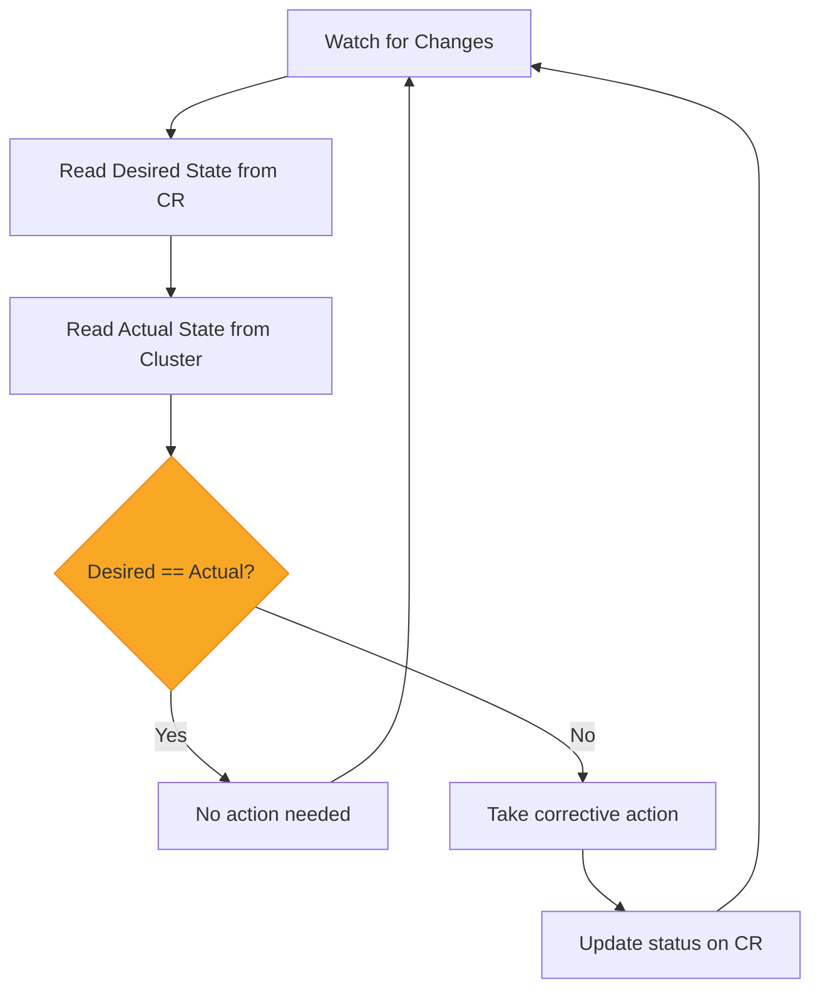
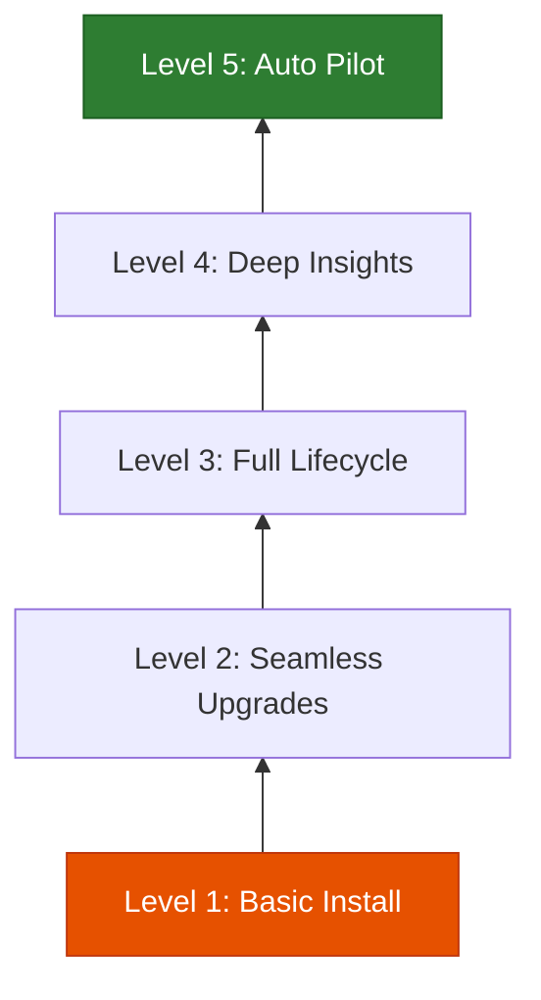

# Understanding the Kubernetes Operator Pattern

Author: [nawazdhandala](https://www.github.com/nawazdhandala)

Tags: Kubernetes, Operators, Custom Controllers, CRD, Automation

Description: A deep dive into the Kubernetes Operator pattern for automating complex application lifecycle management.

---

Kubernetes excels at managing stateless workloads. But stateful and complex applications - databases, message queues, monitoring systems - need human operators who understand their operational requirements. The Operator pattern encodes that operational knowledge into software, automating tasks that would otherwise require manual intervention.

## What is an Operator?

An Operator is a Kubernetes controller that watches custom resources and takes actions to reconcile the actual state of the system with the desired state. It extends Kubernetes to manage application-specific concerns like backups, upgrades, scaling, and failure recovery.



## The Reconciliation Loop

The heart of every operator is the reconciliation loop. It continuously compares the desired state (defined in a custom resource) with the actual state (what exists in the cluster) and takes corrective action.



## Custom Resource Definitions

Before building an operator, you define a Custom Resource Definition (CRD) that describes your application's desired state.

```yaml
# crd.yaml
# Defines a new "Database" resource type in Kubernetes
apiVersion: apiextensions.k8s.io/v1
kind: CustomResourceDefinition
metadata:
  name: databases.app.example.com
spec:
  group: app.example.com
  versions:
    - name: v1
      served: true
      storage: true
      schema:
        openAPIV3Schema:
          type: object
          properties:
            spec:
              type: object
              required:
                - engine
                - version
                - replicas
              properties:
                engine:
                  type: string
                  enum: ["postgres", "mysql"]
                version:
                  type: string
                replicas:
                  type: integer
                  minimum: 1
                  maximum: 5
                storage:
                  type: string
                  default: "10Gi"
                backup:
                  type: object
                  properties:
                    enabled:
                      type: boolean
                      default: true
                    schedule:
                      type: string
                      default: "0 2 * * *"
            status:
              type: object
              properties:
                phase:
                  type: string
                readyReplicas:
                  type: integer
                lastBackup:
                  type: string
      # Display extra columns in kubectl get output
      additionalPrinterColumns:
        - name: Engine
          type: string
          jsonPath: .spec.engine
        - name: Version
          type: string
          jsonPath: .spec.version
        - name: Replicas
          type: integer
          jsonPath: .spec.replicas
        - name: Phase
          type: string
          jsonPath: .status.phase
  scope: Namespaced
  names:
    plural: databases
    singular: database
    kind: Database
    shortNames:
      - db
```

### Creating a Database Instance

```yaml
# my-database.yaml
# A user creates this to declare they want a PostgreSQL database
apiVersion: app.example.com/v1
kind: Database
metadata:
  name: orders-db
  namespace: production
spec:
  engine: postgres
  version: "16"
  replicas: 3
  storage: "50Gi"
  backup:
    enabled: true
    schedule: "0 */6 * * *"
```

## Building the Operator Controller

Here is a Python-based operator using the `kopf` framework:

```python
import kopf
import kubernetes
from kubernetes import client, config

# Load in-cluster config when running inside Kubernetes
# Falls back to local kubeconfig for development
try:
    config.load_incluster_config()
except config.ConfigException:
    config.load_kube_config()

# Kubernetes API clients
apps_v1 = client.AppsV1Api()
core_v1 = client.CoreV1Api()


@kopf.on.create("app.example.com", "v1", "databases")
def on_create(spec, name, namespace, **kwargs):
    """
    Called when a new Database custom resource is created.
    Creates the underlying StatefulSet, Service, and ConfigMap.
    """
    engine = spec["engine"]
    version = spec["version"]
    replicas = spec["replicas"]
    storage = spec.get("storage", "10Gi")

    # Choose the correct container image based on the engine
    image = f"{engine}:{version}"

    # Create a ConfigMap with database configuration
    configmap = core_v1.create_namespaced_config_map(
        namespace=namespace,
        body=client.V1ConfigMap(
            metadata=client.V1ObjectMeta(
                name=f"{name}-config",
                # Set owner reference so the ConfigMap is garbage collected
                # when the Database CR is deleted
                owner_references=[_make_owner_ref(name, namespace)]
            ),
            data=_generate_config(engine)
        )
    )

    # Create a headless Service for stable DNS names
    service = core_v1.create_namespaced_service(
        namespace=namespace,
        body=client.V1Service(
            metadata=client.V1ObjectMeta(
                name=name,
                owner_references=[_make_owner_ref(name, namespace)]
            ),
            spec=client.V1ServiceSpec(
                cluster_ip="None",
                selector={"app": name},
                ports=[client.V1ServicePort(port=5432)]
            )
        )
    )

    # Create the StatefulSet for the database pods
    statefulset = apps_v1.create_namespaced_stateful_set(
        namespace=namespace,
        body=_build_statefulset(name, image, replicas, storage, namespace)
    )

    return {"phase": "Creating", "readyReplicas": 0}


@kopf.on.update("app.example.com", "v1", "databases")
def on_update(spec, name, namespace, old, new, **kwargs):
    """
    Called when a Database CR is updated.
    Handles scaling and version upgrades.
    """
    old_spec = old.get("spec", {})
    new_spec = new.get("spec", {})

    # Handle replica count changes
    if old_spec.get("replicas") != new_spec.get("replicas"):
        apps_v1.patch_namespaced_stateful_set(
            name=name,
            namespace=namespace,
            body={"spec": {"replicas": new_spec["replicas"]}}
        )
        return {"phase": "Scaling"}

    # Handle version upgrade
    if old_spec.get("version") != new_spec.get("version"):
        new_image = f"{new_spec['engine']}:{new_spec['version']}"
        apps_v1.patch_namespaced_stateful_set(
            name=name,
            namespace=namespace,
            body={
                "spec": {
                    "template": {
                        "spec": {
                            "containers": [{"name": "db", "image": new_image}]
                        }
                    }
                }
            }
        )
        return {"phase": "Upgrading"}


@kopf.on.delete("app.example.com", "v1", "databases")
def on_delete(name, namespace, **kwargs):
    """
    Called when a Database CR is deleted.
    Kubernetes garbage collection handles cleanup via owner references.
    """
    print(f"Database {name} in {namespace} is being deleted")
    # Owner references ensure child resources are automatically cleaned up


def _make_owner_ref(name, namespace):
    """Create an owner reference for garbage collection."""
    # Look up the CR to get its UID
    custom_api = client.CustomObjectsApi()
    cr = custom_api.get_namespaced_custom_object(
        "app.example.com", "v1", namespace, "databases", name
    )
    return client.V1OwnerReference(
        api_version="app.example.com/v1",
        kind="Database",
        name=name,
        uid=cr["metadata"]["uid"],
        controller=True,
        block_owner_deletion=True
    )


def _generate_config(engine):
    """Generate database-specific configuration."""
    if engine == "postgres":
        return {
            "postgresql.conf": "max_connections = 200\nshared_buffers = 256MB"
        }
    return {}


def _build_statefulset(name, image, replicas, storage, namespace):
    """Build a StatefulSet spec for the database."""
    return client.V1StatefulSet(
        metadata=client.V1ObjectMeta(
            name=name,
            owner_references=[_make_owner_ref(name, namespace)]
        ),
        spec=client.V1StatefulSetSpec(
            service_name=name,
            replicas=replicas,
            selector=client.V1LabelSelector(
                match_labels={"app": name}
            ),
            template=client.V1PodTemplateSpec(
                metadata=client.V1ObjectMeta(labels={"app": name}),
                spec=client.V1PodSpec(
                    containers=[
                        client.V1Container(
                            name="db",
                            image=image,
                            ports=[client.V1ContainerPort(container_port=5432)]
                        )
                    ]
                )
            ),
            volume_claim_templates=[
                client.V1PersistentVolumeClaim(
                    metadata=client.V1ObjectMeta(name="data"),
                    spec=client.V1PersistentVolumeClaimSpec(
                        access_modes=["ReadWriteOnce"],
                        resources=client.V1ResourceRequirements(
                            requests={"storage": storage}
                        )
                    )
                )
            ]
        )
    )
```

## Operator Maturity Model

Operators are classified by capability level:



| Level | Capability | Examples |
|-------|-----------|----------|
| 1 | Basic Install | Automated provisioning |
| 2 | Seamless Upgrades | Version upgrades, patch management |
| 3 | Full Lifecycle | Backup, restore, failure recovery |
| 4 | Deep Insights | Metrics, alerts, log analysis |
| 5 | Auto Pilot | Auto-scaling, auto-tuning, anomaly detection |

## Best Practices

- **Idempotent reconciliation** - running the reconcile loop twice should produce the same result
- **Owner references** - set them so child resources are garbage collected automatically
- **Status subresource** - report operator state back to users via the status field
- **Finalizers** - use them when you need custom cleanup logic before deletion
- **Rate limiting** - avoid overwhelming the API server with too many reconciliation calls

OneUptime helps you monitor your Kubernetes operators and the applications they manage. Track reconciliation loop latency, error rates, and custom resource status changes. Set alerts when operators fail to reconcile or when managed applications enter unhealthy states. Visit [https://oneuptime.com](https://oneuptime.com) to monitor your operator-managed infrastructure.
