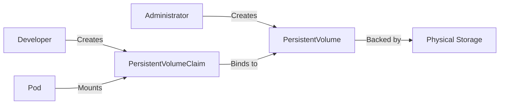
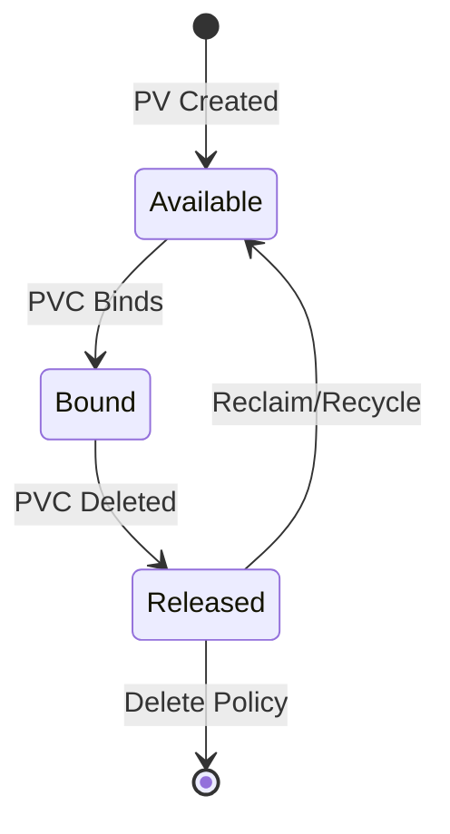

# Understanding Kubernetes Persistent Volumes and Persistent Volume Claims

Author: [nawazdhandala](https://www.github.com/nawazdhandala)

Tags: Kubernetes, Storage, Persistent Volumes, PVC, StatefulSet

Description: A comprehensive guide to Kubernetes persistent storage including PV, PVC, StorageClasses, and how to provision storage for stateful workloads.

---

Containers are ephemeral by default. When a pod restarts, any data written to its local filesystem is lost. For stateful workloads like databases, message queues, and file stores, you need persistent storage that survives pod restarts and rescheduling. Kubernetes solves this with Persistent Volumes (PV) and Persistent Volume Claims (PVC).

## How Kubernetes Storage Works

Kubernetes decouples storage provisioning from consumption. Cluster administrators create storage resources (PVs), and developers request storage (PVCs) without needing to know the underlying infrastructure.



## Persistent Volume Basics

A PersistentVolume (PV) is a cluster-level resource that represents a piece of storage. It can be backed by cloud disks, NFS shares, local storage, or any CSI-compatible driver.

```yaml
# pv-definition.yaml
# This PV provisions 10Gi of storage using a local NFS share.
# Access mode is ReadWriteOnce, meaning a single node can mount it read-write.
apiVersion: v1
kind: PersistentVolume
metadata:
  name: nfs-pv-01
  labels:
    type: nfs
    environment: production
spec:
  capacity:
    storage: 10Gi
  # ReadWriteOnce: single node read-write
  # ReadOnlyMany: many nodes read-only
  # ReadWriteMany: many nodes read-write
  accessModes:
    - ReadWriteOnce
  # Retain means the PV is not deleted when the PVC is removed
  persistentVolumeReclaimPolicy: Retain
  nfs:
    server: 192.168.1.100
    path: /exports/data
```

## Access Modes Explained

Access modes define how a volume can be mounted by nodes in the cluster.

| Mode | Short | Description |
|------|-------|-------------|
| ReadWriteOnce | RWO | Single node can mount read-write |
| ReadOnlyMany | ROX | Multiple nodes can mount read-only |
| ReadWriteMany | RWX | Multiple nodes can mount read-write |
| ReadWriteOncePod | RWOP | Single pod can mount read-write |

Not all storage backends support all access modes. Cloud block storage (EBS, Persistent Disk) typically supports only RWO. NFS and CephFS support RWX.

## Persistent Volume Claims

A PersistentVolumeClaim (PVC) is a request for storage by a user. Kubernetes finds a matching PV and binds the two together.

```yaml
# pvc-definition.yaml
# This PVC requests 5Gi of storage with ReadWriteOnce access.
# Kubernetes will find a PV that satisfies these requirements and bind them.
apiVersion: v1
kind: PersistentVolumeClaim
metadata:
  name: app-data-claim
  namespace: production
spec:
  accessModes:
    - ReadWriteOnce
  resources:
    requests:
      # Request 5Gi - Kubernetes will find a PV >= 5Gi
      storage: 5Gi
  # Optional: select PVs by label
  selector:
    matchLabels:
      type: nfs
      environment: production
```

## The PV-PVC Binding Lifecycle



The lifecycle has four phases:

1. **Available** - The PV is created and waiting for a claim.
2. **Bound** - A PVC has been matched and bound to the PV.
3. **Released** - The PVC has been deleted, but the PV has not been reclaimed yet.
4. **Failed** - The PV could not be reclaimed automatically.

## Reclaim Policies

When a PVC is deleted, the reclaim policy determines what happens to the PV.

- **Retain** - The PV and its data are kept. An administrator must manually clean up.
- **Delete** - The PV and its backing storage are deleted automatically.
- **Recycle** - (Deprecated) The volume is scrubbed and made available again.

## Using PVCs in Pods

Once a PVC is bound, you mount it in a pod spec.

```yaml
# pod-with-pvc.yaml
# This pod mounts the PVC at /app/data inside the container.
apiVersion: v1
kind: Pod
metadata:
  name: app-server
  namespace: production
spec:
  containers:
    - name: app
      image: myapp:1.4.0
      # Mount the volume at /app/data
      volumeMounts:
        - mountPath: /app/data
          name: data-volume
          # Optional: mount as read-only
          # readOnly: true
  volumes:
    - name: data-volume
      persistentVolumeClaim:
        # Reference the PVC by name
        claimName: app-data-claim
```

## StatefulSets and VolumeClaimTemplates

StatefulSets are the standard way to run stateful workloads. They use `volumeClaimTemplates` to automatically create a PVC for each replica.

```yaml
# statefulset-with-pvc.yaml
# Each replica gets its own PVC named data-<pod-name>.
apiVersion: apps/v1
kind: StatefulSet
metadata:
  name: postgres
  namespace: production
spec:
  serviceName: postgres
  replicas: 3
  selector:
    matchLabels:
      app: postgres
  template:
    metadata:
      labels:
        app: postgres
    spec:
      containers:
        - name: postgres
          image: postgres:16
          ports:
            - containerPort: 5432
          volumeMounts:
            - name: data
              mountPath: /var/lib/postgresql/data
  # Each pod gets its own PVC automatically
  volumeClaimTemplates:
    - metadata:
        name: data
      spec:
        accessModes:
          - ReadWriteOnce
        storageClassName: fast-ssd
        resources:
          requests:
            storage: 50Gi
```

This creates three PVCs: `data-postgres-0`, `data-postgres-1`, and `data-postgres-2`. Each PVC is bound to its own PV.

## Expanding Persistent Volumes

You can expand a PVC by editing its storage request, provided the StorageClass allows expansion.

```yaml
# storage-class-expandable.yaml
# allowVolumeExpansion must be true for resize to work.
apiVersion: storage.k8s.io/v1
kind: StorageClass
metadata:
  name: expandable-ssd
provisioner: ebs.csi.aws.com
allowVolumeExpansion: true
parameters:
  type: gp3
```

To resize, patch the PVC:

```bash
# Resize the PVC from 50Gi to 100Gi
# The underlying volume will be expanded automatically
kubectl patch pvc data-postgres-0 -n production \
  -p '{"spec":{"resources":{"requests":{"storage":"100Gi"}}}}'

# Check the resize status
kubectl get pvc data-postgres-0 -n production -o yaml | grep -A 5 conditions
```

## Debugging PVC Issues

Common problems and their solutions:

```bash
# Check PVC status - should show "Bound"
kubectl get pvc -n production

# Describe PVC to see events and binding details
kubectl describe pvc app-data-claim -n production

# Check available PVs and their status
kubectl get pv

# Check if any PVs match the PVC requirements
kubectl get pv -o custom-columns=\
NAME:.metadata.name,\
CAPACITY:.spec.capacity.storage,\
ACCESS:.spec.accessModes,\
STATUS:.status.phase,\
CLAIM:.spec.claimRef.name
```

A PVC stuck in `Pending` usually means no PV matches its requirements. Check:

- Storage size: the PV must have capacity >= the PVC request.
- Access modes: the PV must support the requested access mode.
- StorageClass: if specified, it must match.
- Node affinity: for local volumes, the PV must be on a schedulable node.

## Monitoring Storage with OneUptime

Persistent storage is critical for stateful workloads. Running out of disk space or experiencing slow I/O can bring down databases and queues. [OneUptime](https://oneuptime.com) lets you monitor your Kubernetes storage metrics, set up alerts for disk usage thresholds, and track PVC binding failures so you can respond before your applications are affected.
