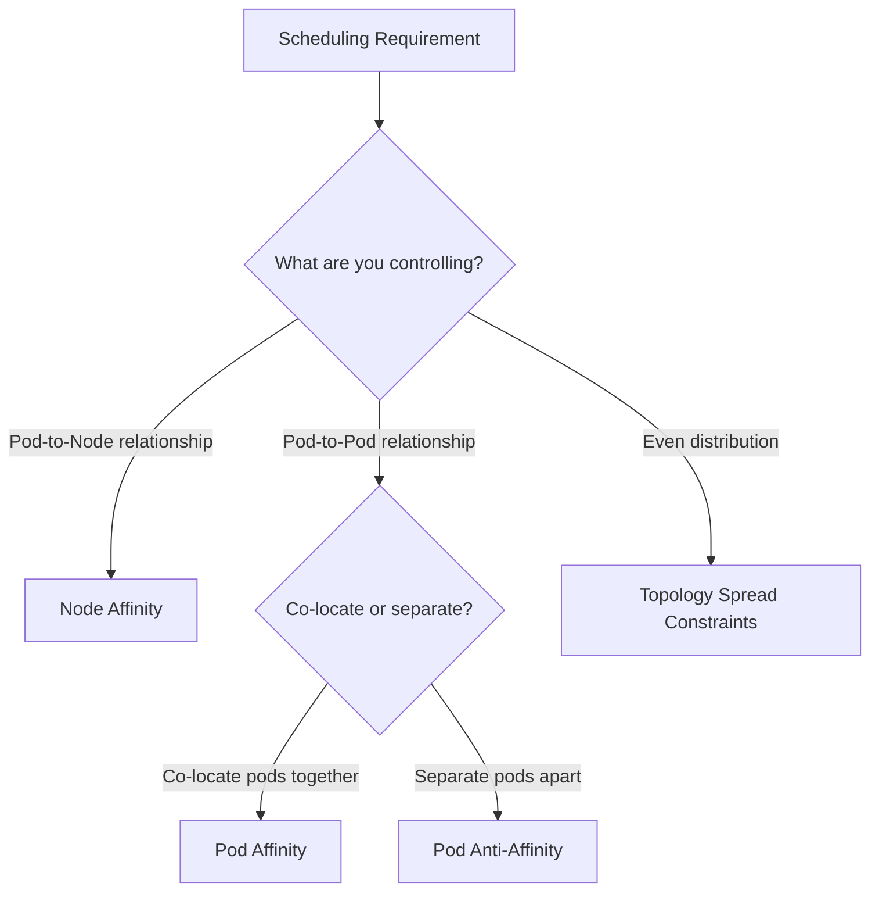
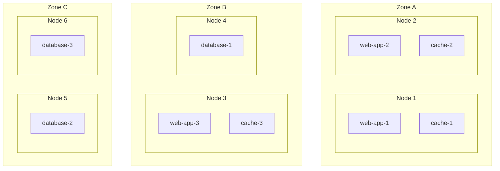
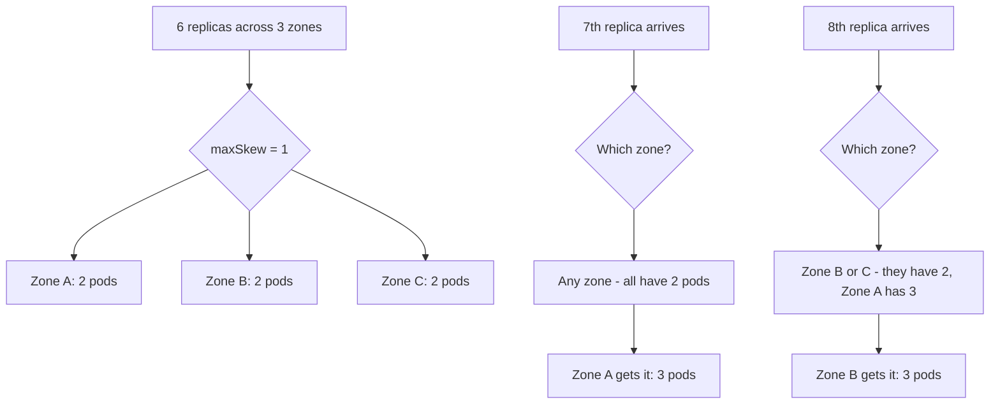

# How to Use Kubernetes Pod Affinity and Topology Spread Constraints

Author: [nawazdhandala](https://www.github.com/nawazdhandala)

Tags: Kubernetes, Scheduling, Pod Affinity, Topology, High Availability

Description: Learn how to use pod affinity, anti-affinity, and topology spread constraints to distribute workloads for high availability.

---

Node affinity controls which nodes a pod can run on. Pod affinity and anti-affinity control which pods should (or should not) be co-located on the same node or topology domain. Topology spread constraints take it further by ensuring even distribution across failure domains. Together, these features let you build highly available and performant deployments. This post covers all three.

## When to Use Each Feature



## Step 1: Pod Affinity - Co-locate Related Pods

Pod affinity attracts pods to nodes where specific other pods are already running. This is useful when pods communicate frequently and benefit from low-latency networking.

```yaml
# pod-affinity.yaml
# Cache pod that should run on the same node as the web app for low latency
apiVersion: apps/v1
kind: Deployment
metadata:
  name: local-cache
spec:
  replicas: 3
  selector:
    matchLabels:
      app: local-cache
  template:
    metadata:
      labels:
        app: local-cache
    spec:
      affinity:
        podAffinity:
          # MUST be co-located with a web-app pod on the same node
          requiredDuringSchedulingIgnoredDuringExecution:
            - labelSelector:
                matchExpressions:
                  - key: app
                    operator: In
                    values:
                      - web-app
              topologyKey: kubernetes.io/hostname  # Same node
      containers:
        - name: cache
          image: redis:7
          resources:
            requests:
              cpu: "200m"
              memory: "512Mi"
```

The `topologyKey` determines the scope of co-location:
- `kubernetes.io/hostname` - Same node
- `topology.kubernetes.io/zone` - Same availability zone
- `topology.kubernetes.io/region` - Same region

## Step 2: Pod Anti-Affinity - Separate Pods Apart

Pod anti-affinity repels pods from nodes where specific other pods are running. This is essential for high availability - you do not want all replicas of a service on the same node.

```yaml
# pod-anti-affinity.yaml
# Database replicas that must NOT run on the same node
apiVersion: apps/v1
kind: Deployment
metadata:
  name: database
spec:
  replicas: 3
  selector:
    matchLabels:
      app: database
  template:
    metadata:
      labels:
        app: database
    spec:
      affinity:
        podAntiAffinity:
          # Hard rule: no two database pods on the same node
          requiredDuringSchedulingIgnoredDuringExecution:
            - labelSelector:
                matchExpressions:
                  - key: app
                    operator: In
                    values:
                      - database
              topologyKey: kubernetes.io/hostname
          # Soft rule: prefer different availability zones
          preferredDuringSchedulingIgnoredDuringExecution:
            - weight: 100
              podAffinityTerm:
                labelSelector:
                  matchExpressions:
                    - key: app
                      operator: In
                      values:
                        - database
                topologyKey: topology.kubernetes.io/zone
      containers:
        - name: db
          image: postgres:16
          resources:
            requests:
              cpu: "1000m"
              memory: "2Gi"
```

## Pod Placement Visualization



In this layout:
- Cache pods are co-located with web-app pods (pod affinity)
- Database pods are spread across different nodes and zones (pod anti-affinity)

## Step 3: Topology Spread Constraints

Topology spread constraints provide more precise control over pod distribution than anti-affinity. They ensure pods are evenly spread across topology domains.

```yaml
# topology-spread.yaml
# Web app evenly distributed across availability zones
apiVersion: apps/v1
kind: Deployment
metadata:
  name: web-app
spec:
  replicas: 6
  selector:
    matchLabels:
      app: web-app
  template:
    metadata:
      labels:
        app: web-app
    spec:
      topologySpreadConstraints:
        # Spread evenly across zones with max 1 pod difference
        - maxSkew: 1
          topologyKey: topology.kubernetes.io/zone
          whenUnsatisfiable: DoNotSchedule  # Hard constraint
          labelSelector:
            matchLabels:
              app: web-app
        # Also spread across nodes within each zone
        - maxSkew: 1
          topologyKey: kubernetes.io/hostname
          whenUnsatisfiable: ScheduleAnyway  # Soft constraint
          labelSelector:
            matchLabels:
              app: web-app
      containers:
        - name: web
          image: nginx:1.27
          resources:
            requests:
              cpu: "200m"
              memory: "256Mi"
```

Key parameters:
- `maxSkew` - Maximum difference in pod count between any two topology domains
- `topologyKey` - The node label that defines topology domains
- `whenUnsatisfiable` - `DoNotSchedule` (hard) or `ScheduleAnyway` (soft)

## How maxSkew Works



With `maxSkew: 1`, the difference between the most-loaded and least-loaded zone cannot exceed 1.

## Step 4: Combining All Three Features

Here is a production-ready deployment that uses pod affinity, anti-affinity, and topology spread together.

```yaml
# production-deployment.yaml
# Production API with comprehensive scheduling rules
apiVersion: apps/v1
kind: Deployment
metadata:
  name: api-production
spec:
  replicas: 6
  selector:
    matchLabels:
      app: api-production
  template:
    metadata:
      labels:
        app: api-production
        tier: backend
    spec:
      # Topology spread for even zone distribution
      topologySpreadConstraints:
        - maxSkew: 1
          topologyKey: topology.kubernetes.io/zone
          whenUnsatisfiable: DoNotSchedule
          labelSelector:
            matchLabels:
              app: api-production
      affinity:
        # Prefer to run near cache pods for performance
        podAffinity:
          preferredDuringSchedulingIgnoredDuringExecution:
            - weight: 50
              podAffinityTerm:
                labelSelector:
                  matchExpressions:
                    - key: app
                      operator: In
                      values:
                        - redis-cache
                topologyKey: topology.kubernetes.io/zone
        # Must not co-locate with other api-production pods on same node
        podAntiAffinity:
          requiredDuringSchedulingIgnoredDuringExecution:
            - labelSelector:
                matchExpressions:
                  - key: app
                    operator: In
                    values:
                      - api-production
              topologyKey: kubernetes.io/hostname
      containers:
        - name: api
          image: your-registry/api:latest
          resources:
            requests:
              cpu: "500m"
              memory: "512Mi"
```

## Step 5: Namespace-Scoped Matching

You can match pods across namespaces using the `namespaces` and `namespaceSelector` fields.

```yaml
# cross-namespace.yaml
# Pod that avoids nodes running logging pods from the monitoring namespace
apiVersion: v1
kind: Pod
metadata:
  name: latency-sensitive-app
  namespace: production
spec:
  affinity:
    podAntiAffinity:
      preferredDuringSchedulingIgnoredDuringExecution:
        - weight: 80
          podAffinityTerm:
            labelSelector:
              matchExpressions:
                - key: app
                  operator: In
                  values:
                    - log-aggregator
            topologyKey: kubernetes.io/hostname
            namespaces:
              - monitoring  # Look for matching pods in the monitoring namespace
  containers:
    - name: app
      image: your-registry/latency-app:latest
      resources:
        requests:
          cpu: "500m"
          memory: "256Mi"
```

## Debugging Scheduling

```bash
# Check why pods are not being scheduled
kubectl describe pod <pod-name> | grep -A 20 Events

# See pod distribution across nodes
kubectl get pods -l app=web-app -o wide

# Check pod distribution across zones
kubectl get pods -l app=web-app -o jsonpath='{range .items[*]}{.metadata.name}{"\t"}{.spec.nodeName}{"\n"}{end}'

# View node labels to understand topology domains
kubectl get nodes -L topology.kubernetes.io/zone,kubernetes.io/hostname
```

## Summary

Pod affinity, anti-affinity, and topology spread constraints are the tools you need for high availability in Kubernetes. Use pod affinity to co-locate tightly coupled services, anti-affinity to prevent single points of failure, and topology spread to distribute evenly across failure domains.

To monitor your pod distribution, detect scheduling failures, and track the health of your highly available deployments, use [OneUptime](https://oneuptime.com). OneUptime provides Kubernetes observability, alerting, and status pages that help you verify your availability guarantees and respond quickly when things go wrong.
