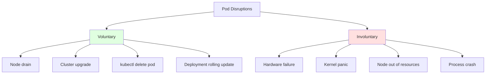
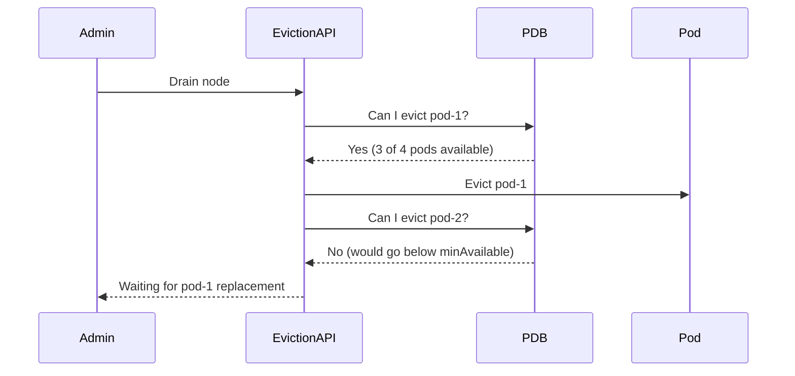
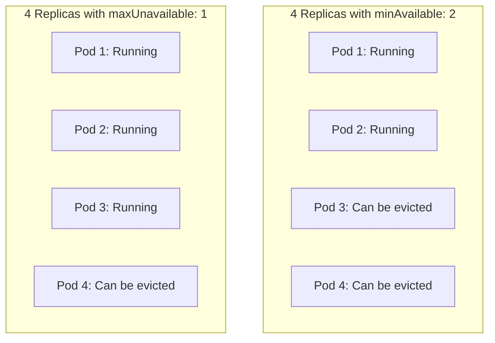
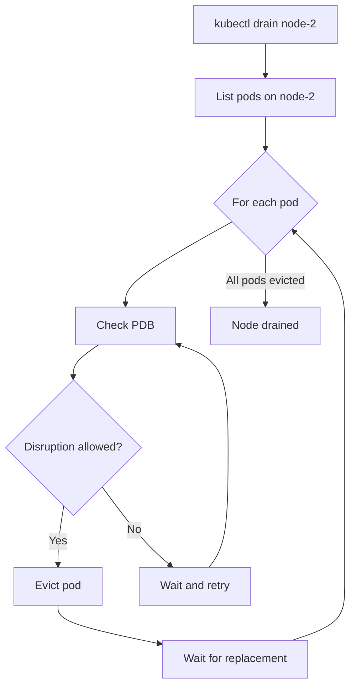

# How to Use Kubernetes Pod Disruption Budgets for Safe Maintenance

Author: [nawazdhandala](https://www.github.com/nawazdhandala)

Tags: Kubernetes, PDB, Disruption Budget, Maintenance, Availability

Description: Learn how to use Pod Disruption Budgets to ensure minimum availability during node maintenance and cluster upgrades.

---

When you drain a node for maintenance or upgrade your cluster, Kubernetes needs to evict pods. Without guardrails, it might evict too many pods at once and cause downtime. Pod Disruption Budgets (PDBs) tell Kubernetes how many pods of a given application must stay available during voluntary disruptions. This post explains how PDBs work and how to configure them for different scenarios.

## Voluntary vs Involuntary Disruptions

Not all disruptions are created equal. PDBs only protect against voluntary disruptions.



**Voluntary disruptions** are planned actions that Kubernetes can control:
- Draining a node for maintenance
- Cluster autoscaler removing a node
- Rolling updates

**Involuntary disruptions** happen unexpectedly and PDBs cannot prevent them:
- Hardware failure
- Node crashes
- Container OOM kills

## How PDBs Work

A PDB sets a constraint on how many pods can be disrupted at the same time. When an administrator drains a node, the eviction API checks PDBs before removing pods. If evicting a pod would violate a PDB, the eviction is blocked.



## Creating a PDB with minAvailable

`minAvailable` sets the minimum number of pods that must remain available during disruptions.

```yaml
# pdb-min-available.yaml
# Ensure at least 2 pods of the web-app are always available
# during voluntary disruptions like node drains.
apiVersion: policy/v1
kind: PodDisruptionBudget
metadata:
  name: web-app-pdb
spec:
  # At least 2 pods must remain running at all times
  minAvailable: 2
  selector:
    matchLabels:
      app: web-app
```

You can also use a percentage:

```yaml
# pdb-min-available-percent.yaml
# Ensure at least 50% of pods remain available.
# For 4 replicas, this means at least 2 pods.
apiVersion: policy/v1
kind: PodDisruptionBudget
metadata:
  name: web-app-pdb
spec:
  minAvailable: "50%"
  selector:
    matchLabels:
      app: web-app
```

## Creating a PDB with maxUnavailable

`maxUnavailable` sets the maximum number of pods that can be unavailable at the same time.

```yaml
# pdb-max-unavailable.yaml
# Allow at most 1 pod to be unavailable during disruptions.
# For 4 replicas, at least 3 must remain running.
apiVersion: policy/v1
kind: PodDisruptionBudget
metadata:
  name: api-server-pdb
spec:
  maxUnavailable: 1
  selector:
    matchLabels:
      app: api-server
```

## minAvailable vs maxUnavailable



The choice depends on your scaling behavior:

- **minAvailable** is best when you have a fixed minimum capacity requirement.
- **maxUnavailable** is better for large deployments where you want to control the disruption rate.

For a deployment with 100 replicas:
- `minAvailable: 90` and `maxUnavailable: 10` have the same effect.
- `maxUnavailable: 10` is clearer about your intent and works better when you scale the deployment up or down.

## PDB with a Deployment

Here is a complete example with a Deployment and its PDB:

```yaml
# deployment.yaml
# A web application with 4 replicas.
apiVersion: apps/v1
kind: Deployment
metadata:
  name: web-app
spec:
  replicas: 4
  selector:
    matchLabels:
      app: web-app
  template:
    metadata:
      labels:
        app: web-app
    spec:
      # Spread pods across nodes for better availability
      topologySpreadConstraints:
        - maxSkew: 1
          topologyKey: kubernetes.io/hostname
          whenUnsatisfiable: DoNotSchedule
          labelSelector:
            matchLabels:
              app: web-app
      containers:
        - name: web-app
          image: myregistry/web-app:latest
          ports:
            - containerPort: 8080
          readinessProbe:
            httpGet:
              path: /ready
              port: 8080
            periodSeconds: 5
---
# pdb.yaml
# Allow at most 1 pod to be unavailable at a time.
apiVersion: policy/v1
kind: PodDisruptionBudget
metadata:
  name: web-app-pdb
spec:
  maxUnavailable: 1
  selector:
    matchLabels:
      app: web-app
```

## PDB for StatefulSets

StatefulSets need careful PDB configuration because each pod may have unique data or responsibilities.

```yaml
# statefulset-pdb.yaml
# For a 3-replica database StatefulSet,
# ensure at least 2 replicas stay available.
# This maintains quorum for consensus-based systems.
apiVersion: policy/v1
kind: PodDisruptionBudget
metadata:
  name: etcd-pdb
spec:
  # Quorum for 3 nodes: at least 2 must be available
  minAvailable: 2
  selector:
    matchLabels:
      app: etcd
```

## Checking PDB Status

```bash
# List all PDBs in the current namespace
kubectl get pdb

# Check the details of a specific PDB
kubectl describe pdb web-app-pdb

# Output includes:
# - Allowed disruptions: how many pods can currently be evicted
# - Current healthy: how many pods are currently healthy
# - Desired healthy: the minimum healthy pods required
# - Expected pods: total pods matched by the selector
```

## What Happens During a Node Drain



If a PDB blocks eviction for too long, the drain command will hang. You can use `--timeout` to set a maximum wait time:

```bash
# Drain with a 5-minute timeout
kubectl drain node-2 --timeout=300s --ignore-daemonsets --delete-emptydir-data
```

## Common Pitfalls

### PDB Too Restrictive

```yaml
# BAD: For a 2-replica deployment, minAvailable: 2
# means no pods can ever be evicted voluntarily.
spec:
  minAvailable: 2
  # With only 2 replicas, this blocks all drains.
```

### No PDB at All

Without a PDB, a node drain can evict all pods of an application at once, causing total downtime.

### PDB Does Not Match Any Pods

If the selector does not match any pods, the PDB has no effect. Always verify:

```bash
# Check which pods the PDB selects
kubectl get pods -l app=web-app
```

## Best Practices

1. Always create a PDB for production workloads that need high availability.
2. Use `maxUnavailable: 1` as a safe default for most applications.
3. For quorum-based systems (etcd, ZooKeeper), set `minAvailable` to the quorum size.
4. Spread pods across nodes using `topologySpreadConstraints` so a single node drain affects fewer pods.
5. Make sure your PDB allows at least one disruption, or node drains will hang forever.
6. Pair PDBs with readiness probes so Kubernetes knows when a replacement pod is truly ready.

## Monitoring Disruptions with OneUptime

PDBs protect your availability during planned maintenance, but you still need visibility into what is happening. [OneUptime](https://oneuptime.com) monitors your application availability during node drains, cluster upgrades, and scaling events. When pod disruptions cause latency spikes or error rate increases, OneUptime alerts you immediately so you can pause the maintenance and investigate before users are impacted.
