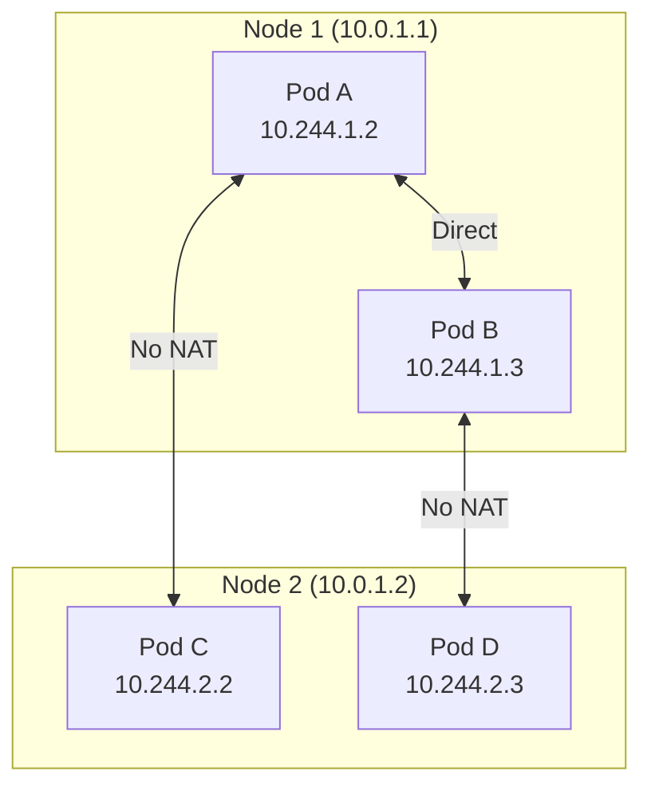
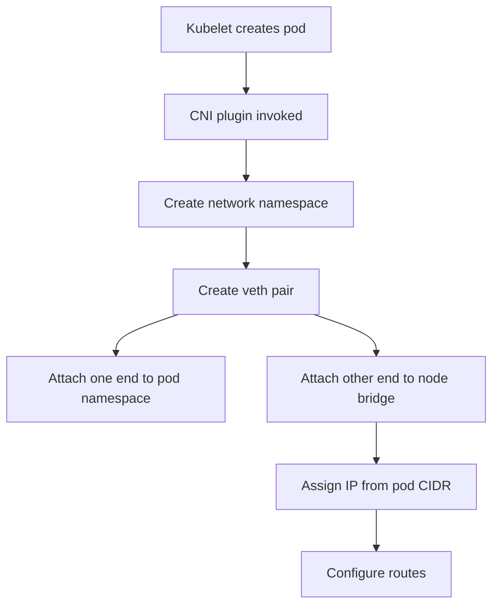
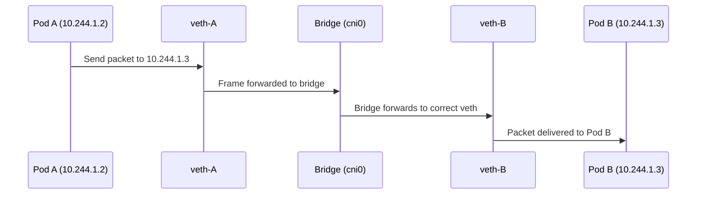
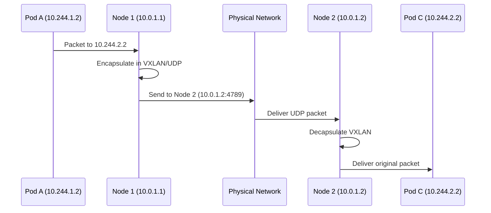
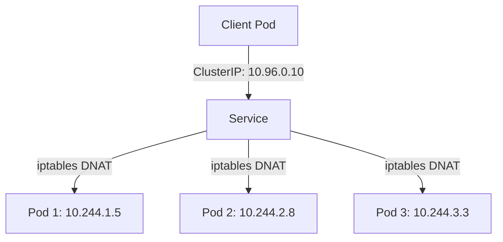

# Understanding the Kubernetes Pod Networking Model

Author: [nawazdhandala](https://www.github.com/nawazdhandala)

Tags: Kubernetes, Networking, Pods, Container Networking, CNI

Description: Deep dive into how Kubernetes pod networking works including IP-per-pod, veth pairs, bridges, and cross-node communication.

---

## The Fundamental Rule

Kubernetes networking follows three fundamental rules:

1. Every pod gets its own unique IP address.
2. Pods on the same node can communicate with each other directly.
3. Pods on different nodes can communicate without NAT.

These rules create a flat network where every pod can reach every other pod using its IP address, regardless of which node it runs on.



## IP-Per-Pod Model

Unlike Docker's default bridge networking where containers share the host's IP with port mapping, Kubernetes assigns a unique IP to each pod. All containers within a pod share this IP and communicate over localhost.

```yaml
# multi-container-pod.yaml
# Both containers share the same IP and network namespace
apiVersion: v1
kind: Pod
metadata:
  name: multi-container
spec:
  containers:
    # Main application container
    - name: app
      image: nginx:1.25
      ports:
        - containerPort: 80
    # Sidecar container - shares the same IP as app
    - name: sidecar
      image: busybox
      command: ["sh", "-c", "while true; do wget -qO- localhost:80; sleep 5; done"]
```

You can verify that containers share the same IP:

```bash
# Check the pod IP
kubectl get pod multi-container -o wide

# Verify from inside each container
kubectl exec multi-container -c app -- hostname -i
kubectl exec multi-container -c sidecar -- hostname -i
# Both commands return the same IP
```

## How Pod Networking Works on a Single Node

When a pod is created, the following happens at the network level:



### Network Namespaces

Each pod gets its own Linux network namespace. This isolates its network stack - interfaces, routes, and iptables rules - from other pods and the host.

```bash
# List network namespaces on a node (requires root)
sudo ip netns list

# Inspect a pod's network namespace
# First, find the pod's container ID
CONTAINER_ID=$(sudo crictl ps --name app -q)

# Get the network namespace path
sudo crictl inspect $CONTAINER_ID | grep -i netns
```

### Virtual Ethernet Pairs (veth)

A veth pair is like a virtual network cable. One end sits inside the pod's network namespace, and the other end connects to a bridge on the host.

```bash
# Inside the pod, you see eth0
kubectl exec multi-container -c app -- ip addr show eth0
# Output: eth0@if7: <BROADCAST,MULTICAST,UP> ... inet 10.244.1.2/24

# On the host, you see the other end of the veth pair
ip link show | grep veth
# Output: vethXXXXXX@if2: <BROADCAST,MULTICAST,UP>
```

### Linux Bridge

The node has a bridge (typically called cbr0 or cni0) that connects all veth pairs. This bridge acts like a virtual switch, allowing pods on the same node to communicate.

```bash
# View the bridge on the node
brctl show
# Output:
# bridge name    bridge id          STP enabled    interfaces
# cni0           8000.1234567890ab  no             veth1234
#                                                   veth5678

# View bridge IP - this is the gateway for pods
ip addr show cni0
# Output: inet 10.244.1.1/24
```

## Same-Node Pod Communication

When Pod A sends a packet to Pod B on the same node:



The packet never leaves the node. The bridge handles the forwarding based on MAC address learning, just like a physical switch.

## Cross-Node Pod Communication

When pods are on different nodes, the packet must traverse the physical network. How this happens depends on your CNI plugin.

### Overlay Networks (VXLAN)

Flannel and Weave use VXLAN to encapsulate pod-to-pod traffic inside UDP packets that can traverse the underlying network.



### Direct Routing (BGP)

Calico can use BGP to advertise pod CIDR routes to other nodes, avoiding encapsulation entirely.

```bash
# Check BGP peers on a Calico node
sudo calicoctl node status
# Output:
# IPv4 BGP status
# +--------------+-------------------+-------+
# | PEER ADDRESS | PEER TYPE         | STATE |
# +--------------+-------------------+-------+
# | 10.0.1.2     | node-to-node mesh | up    |
# | 10.0.1.3     | node-to-node mesh | up    |
# +--------------+-------------------+-------+

# View routes on the node
ip route | grep bird
# 10.244.2.0/24 via 10.0.1.2 dev eth0 proto bird
# 10.244.3.0/24 via 10.0.1.3 dev eth0 proto bird
```

## Pod CIDR Allocation

Each node gets a slice of the cluster's pod CIDR range. The cluster CIDR (e.g., 10.244.0.0/16) is split into per-node CIDRs (e.g., 10.244.1.0/24 for Node 1).

```bash
# Check the cluster CIDR
kubectl cluster-info dump | grep -m 1 cluster-cidr
# --cluster-cidr=10.244.0.0/16

# Check per-node pod CIDR allocation
kubectl get nodes -o jsonpath='{range .items[*]}{.metadata.name}: {.spec.podCIDR}{"\n"}{end}'
# node-1: 10.244.1.0/24
# node-2: 10.244.2.0/24
# node-3: 10.244.3.0/24
```

## Service Networking

Kubernetes Services provide stable virtual IPs (ClusterIPs) that load-balance traffic to pod endpoints. These are implemented using iptables or IPVS rules on each node.

```bash
# Check iptables rules for a service
sudo iptables -t nat -L KUBE-SERVICES | head -20

# If using IPVS, check virtual servers
sudo ipvsadm -Ln
```



## Troubleshooting Pod Networking

When things go wrong, these commands help diagnose issues:

```bash
# Check pod IP and status
kubectl get pod -o wide

# Test DNS resolution inside a pod
kubectl exec test-pod -- nslookup kubernetes.default.svc.cluster.local

# Test connectivity between pods
kubectl exec pod-a -- ping -c 3 10.244.2.5

# Check routes inside a pod
kubectl exec test-pod -- ip route

# Check ARP table on the node
arp -a

# Verify CNI plugin is configured
ls /etc/cni/net.d/
cat /etc/cni/net.d/10-calico.conflist
```

## Monitoring Pod Network Health

Understanding pod networking is critical, but you also need to monitor it continuously. OneUptime (https://oneuptime.com) provides infrastructure monitoring for Kubernetes clusters, letting you track network latency between pods, detect DNS resolution failures, and alert on connectivity issues before they impact your users.
