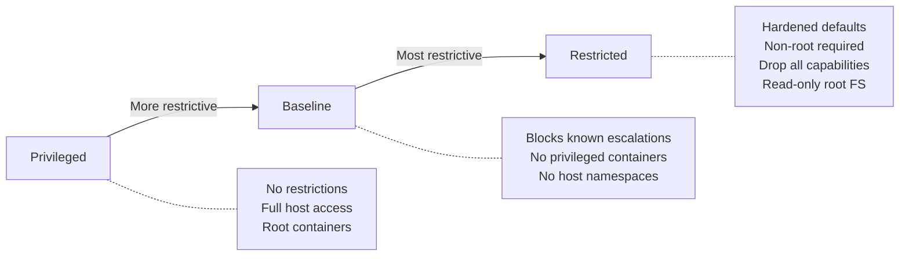
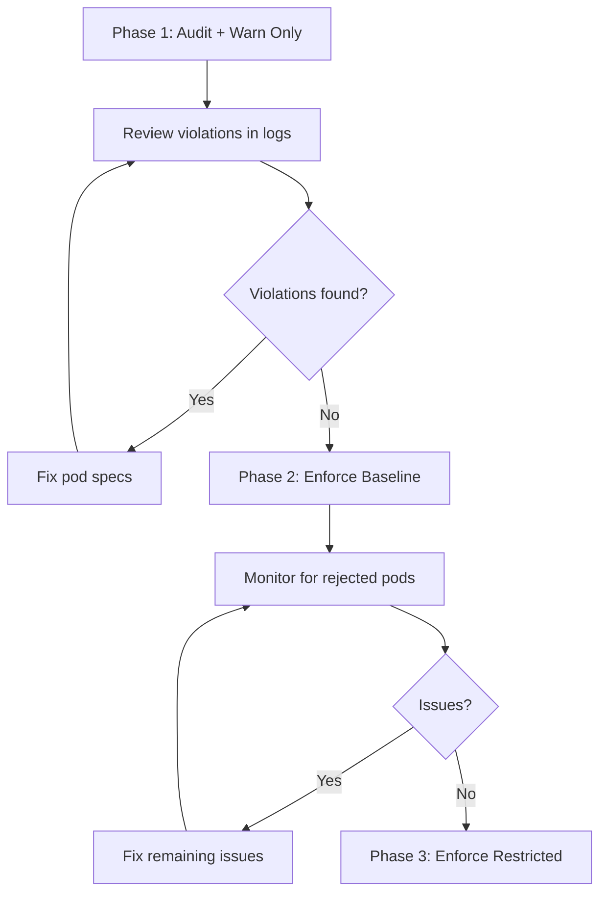

# How to Enforce Kubernetes Pod Security Standards

Author: [nawazdhandala](https://www.github.com/nawazdhandala)

Tags: Kubernetes, Pod Security, Security, Admission Control, Standards

Description: Learn how to enforce Pod Security Standards in Kubernetes using the built-in Pod Security Admission controller with enforce, audit, and warn modes.

---

Running containers as root, mounting the host filesystem, or using privileged mode can give attackers full control of your nodes. Kubernetes Pod Security Standards (PSS) define three security profiles that restrict what pods can do. The Pod Security Admission (PSA) controller enforces these profiles at the namespace level without any third-party tools.

## Pod Security Standards Overview

Kubernetes defines three security profiles, each progressively more restrictive.



| Profile | Use Case | Key Restrictions |
|---------|----------|-----------------|
| Privileged | System-level workloads (CNI, CSI drivers) | None |
| Baseline | General workloads | No privileged, no hostNetwork, no hostPID |
| Restricted | Security-sensitive workloads | Non-root, drop ALL capabilities, no privilege escalation |

## Pod Security Admission Modes

PSA can operate in three modes per namespace. You can combine them.

| Mode | Behavior |
|------|----------|
| enforce | Rejects pods that violate the policy |
| audit | Allows violating pods but records violations in audit logs |
| warn | Allows violating pods but shows warnings to the user |

## Labeling Namespaces

Enable PSA by adding labels to namespaces. No additional installation is needed.

```yaml
# namespace-restricted.yaml
# This namespace enforces the "restricted" profile.
# Pods that violate the restricted profile will be rejected.
apiVersion: v1
kind: Namespace
metadata:
  name: production
  labels:
    # Enforce restricted profile - reject violating pods
    pod-security.kubernetes.io/enforce: restricted
    pod-security.kubernetes.io/enforce-version: latest
    # Audit restricted profile - log violations
    pod-security.kubernetes.io/audit: restricted
    pod-security.kubernetes.io/audit-version: latest
    # Warn restricted profile - show warnings to users
    pod-security.kubernetes.io/warn: restricted
    pod-security.kubernetes.io/warn-version: latest
```

```bash
# Apply PSA labels to an existing namespace
kubectl label namespace production \
  pod-security.kubernetes.io/enforce=restricted \
  pod-security.kubernetes.io/enforce-version=latest \
  pod-security.kubernetes.io/audit=restricted \
  pod-security.kubernetes.io/warn=restricted
```

## Gradual Rollout Strategy

When adopting PSS, use a phased approach to avoid breaking existing workloads.



### Phase 1: Audit and Warn

```yaml
# namespace-phase1.yaml
# Start with audit and warn only - no pods are rejected.
apiVersion: v1
kind: Namespace
metadata:
  name: staging
  labels:
    # Do not enforce yet
    pod-security.kubernetes.io/enforce: privileged
    # Audit against restricted to see what would fail
    pod-security.kubernetes.io/audit: restricted
    pod-security.kubernetes.io/audit-version: latest
    # Warn developers about violations
    pod-security.kubernetes.io/warn: restricted
    pod-security.kubernetes.io/warn-version: latest
```

### Phase 2: Enforce Baseline

```yaml
# namespace-phase2.yaml
# Enforce baseline while auditing restricted.
apiVersion: v1
kind: Namespace
metadata:
  name: staging
  labels:
    pod-security.kubernetes.io/enforce: baseline
    pod-security.kubernetes.io/enforce-version: latest
    pod-security.kubernetes.io/audit: restricted
    pod-security.kubernetes.io/audit-version: latest
    pod-security.kubernetes.io/warn: restricted
    pod-security.kubernetes.io/warn-version: latest
```

## Writing Compliant Pod Specs

### Baseline-Compliant Pod

```yaml
# pod-baseline.yaml
# This pod passes the baseline profile.
apiVersion: v1
kind: Pod
metadata:
  name: app-baseline
  namespace: staging
spec:
  containers:
    - name: app
      image: myapp:2.0.0
      ports:
        - containerPort: 8080
      # No privileged mode
      # No hostNetwork
      # No hostPID
      securityContext:
        # Do not run as privileged
        privileged: false
        # Prevent privilege escalation
        allowPrivilegeEscalation: false
```

### Restricted-Compliant Pod

```yaml
# pod-restricted.yaml
# This pod passes the restricted profile.
# All fields required by the restricted policy are explicitly set.
apiVersion: v1
kind: Pod
metadata:
  name: app-restricted
  namespace: production
spec:
  # Run all containers as non-root
  securityContext:
    runAsNonRoot: true
    # Set a specific non-root UID
    runAsUser: 1000
    runAsGroup: 1000
    fsGroup: 1000
    # Use RuntimeDefault seccomp profile
    seccompProfile:
      type: RuntimeDefault
  containers:
    - name: app
      image: myapp:2.0.0
      ports:
        - containerPort: 8080
      securityContext:
        # Block privilege escalation
        allowPrivilegeEscalation: false
        # Run as non-root
        runAsNonRoot: true
        # Drop all Linux capabilities
        capabilities:
          drop:
            - ALL
        # Read-only root filesystem
        readOnlyRootFilesystem: true
      # Mount a writable volume for temp files
      volumeMounts:
        - name: tmp
          mountPath: /tmp
  volumes:
    - name: tmp
      emptyDir: {}
```

## Exemptions

Some workloads legitimately need elevated privileges (monitoring agents, CNI plugins). Configure exemptions in the PSA admission configuration.

```yaml
# psa-config.yaml
# This configures PSA exemptions at the cluster level.
# Applied via the API server --admission-control-config-file flag.
apiVersion: apiserver.config.k8s.io/v1
kind: AdmissionConfiguration
plugins:
  - name: PodSecurity
    configuration:
      apiVersion: pod-security.admission.config.k8s.io/v1
      kind: PodSecurityConfiguration
      defaults:
        enforce: restricted
        enforce-version: latest
        audit: restricted
        audit-version: latest
        warn: restricted
        warn-version: latest
      exemptions:
        # Exempt specific usernames
        usernames: []
        # Exempt specific runtime classes
        runtimeClasses: []
        # Exempt specific namespaces (system namespaces)
        namespaces:
          - kube-system
          - kube-node-lease
          - monitoring
```

## Common Violations and Fixes

| Violation | Fix |
|-----------|-----|
| Container must not run as root | Add `runAsNonRoot: true` and `runAsUser: 1000` |
| Privilege escalation must be disallowed | Add `allowPrivilegeEscalation: false` |
| Capabilities must be dropped | Add `capabilities: { drop: ["ALL"] }` |
| Seccomp profile must be set | Add `seccompProfile: { type: RuntimeDefault }` |
| Container must use read-only root FS | Add `readOnlyRootFilesystem: true` |

## Checking Compliance

```bash
# Dry-run a pod against the restricted profile
# This shows warnings without creating the pod
kubectl apply --dry-run=server -f pod.yaml -n production

# Check all pods in a namespace for violations
kubectl label namespace staging \
  pod-security.kubernetes.io/warn=restricted \
  --overwrite

# Then apply any deployment to see warnings
kubectl apply -f deployment.yaml -n staging
# Warning: would violate PodSecurity "restricted:latest"
```

## Monitoring Pod Security with OneUptime

Enforcing pod security standards is only useful if you know when violations occur. [OneUptime](https://oneuptime.com) monitors your Kubernetes audit logs for PSA violations, tracks policy enforcement across namespaces, and alerts your security team when pods are rejected or exemptions are used. This gives you continuous visibility into your cluster's security posture and helps you maintain compliance.
