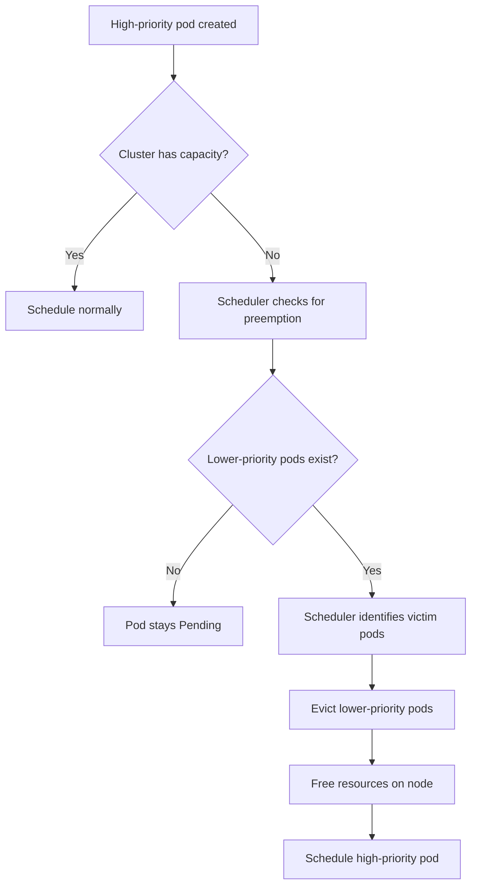
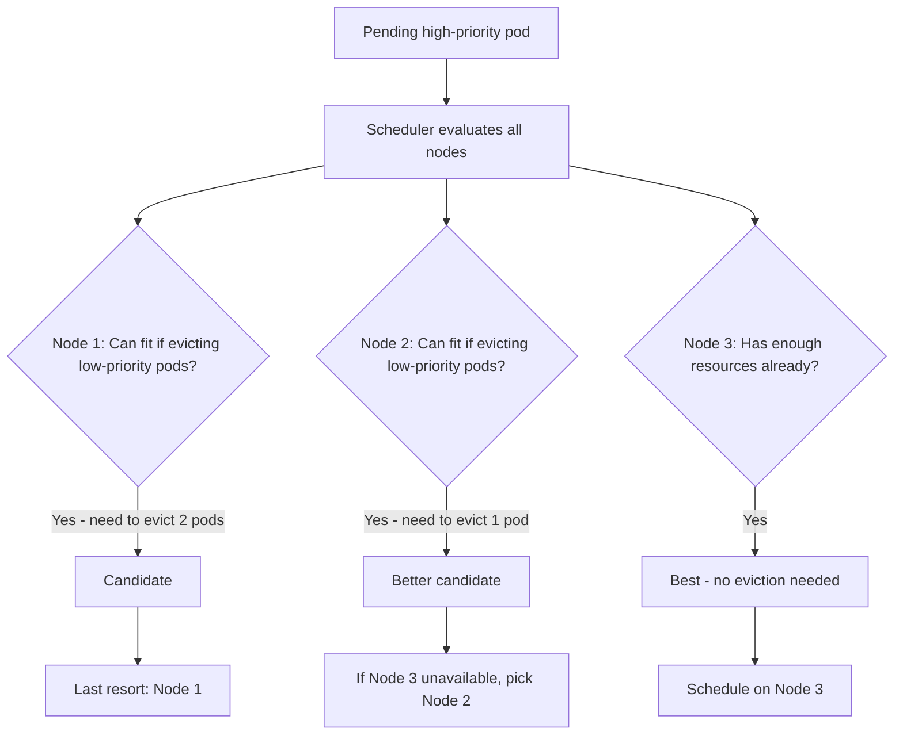

# How to Use Kubernetes Priority Classes and Pod Preemption

Author: [nawazdhandala](https://www.github.com/nawazdhandala)

Tags: Kubernetes, Priority, Preemption, Scheduling, Resource Management

Description: Learn how to use PriorityClasses and pod preemption to ensure critical workloads always have resources in Kubernetes.

---

When your Kubernetes cluster is at capacity, which pods get scheduled and which ones wait? By default, it is first-come, first-served. But in production, your payment processing service is more important than your log aggregator. Kubernetes PriorityClasses and pod preemption solve this by letting you assign priorities to pods so that critical workloads can evict lower-priority ones when resources are scarce. This post covers how to set it up.

## How Priority and Preemption Work



Priority is a numeric value. Higher numbers mean higher priority. When a high-priority pod cannot be scheduled, the scheduler looks for nodes where evicting lower-priority pods would free enough resources.

## Step 1: Create PriorityClasses

PriorityClasses are cluster-scoped resources. Create them in order from lowest to highest priority.

```yaml
# priority-classes.yaml
# Define priority levels for different workload tiers

# Lowest priority - batch jobs and background tasks
apiVersion: scheduling.k8s.io/v1
kind: PriorityClass
metadata:
  name: low-priority
value: 100
globalDefault: false
preemptionPolicy: Never  # These pods will NOT preempt others
description: "Low priority for batch jobs and background processing"
---
# Default priority for standard workloads
apiVersion: scheduling.k8s.io/v1
kind: PriorityClass
metadata:
  name: default-priority
value: 1000
globalDefault: true  # This is the default for pods without a priority class
preemptionPolicy: PreemptLowerPriority
description: "Default priority for standard application workloads"
---
# High priority for user-facing services
apiVersion: scheduling.k8s.io/v1
kind: PriorityClass
metadata:
  name: high-priority
value: 10000
globalDefault: false
preemptionPolicy: PreemptLowerPriority
description: "High priority for user-facing production services"
---
# Critical priority for essential infrastructure
apiVersion: scheduling.k8s.io/v1
kind: PriorityClass
metadata:
  name: critical
value: 100000
globalDefault: false
preemptionPolicy: PreemptLowerPriority
description: "Critical priority for essential infrastructure components"
```

```bash
# Apply all priority classes
kubectl apply -f priority-classes.yaml

# Verify they were created
kubectl get priorityclasses
```

## Step 2: Assign PriorityClasses to Pods

```yaml
# critical-deployment.yaml
# Payment service with critical priority - will preempt lower-priority pods
apiVersion: apps/v1
kind: Deployment
metadata:
  name: payment-service
spec:
  replicas: 3
  selector:
    matchLabels:
      app: payment-service
  template:
    metadata:
      labels:
        app: payment-service
    spec:
      priorityClassName: critical  # Assign the critical priority class
      containers:
        - name: payment
          image: your-registry/payment-service:latest
          ports:
            - containerPort: 8080
          resources:
            requests:
              cpu: "500m"
              memory: "512Mi"
            limits:
              cpu: "1000m"
              memory: "1Gi"
---
# Log aggregator with low priority - can be preempted by higher-priority pods
apiVersion: apps/v1
kind: Deployment
metadata:
  name: log-aggregator
spec:
  replicas: 5
  selector:
    matchLabels:
      app: log-aggregator
  template:
    metadata:
      labels:
        app: log-aggregator
    spec:
      priorityClassName: low-priority  # Low priority, can be evicted
      containers:
        - name: aggregator
          image: your-registry/log-aggregator:latest
          resources:
            requests:
              cpu: "200m"
              memory: "256Mi"
            limits:
              cpu: "500m"
              memory: "512Mi"
```

## Preemption Decision Flow



The scheduler minimizes the number of preempted pods and avoids preempting pods with PodDisruptionBudgets when possible.

## Step 3: Use PreemptionPolicy

The `preemptionPolicy` field controls whether pods of a given class can preempt others.

```yaml
# non-preempting-priority.yaml
# High priority class that does NOT preempt other pods
# Useful for important jobs that should get priority in the scheduling queue
# but should not evict running workloads
apiVersion: scheduling.k8s.io/v1
kind: PriorityClass
metadata:
  name: high-priority-non-preempting
value: 10000
globalDefault: false
preemptionPolicy: Never  # Will NOT evict lower-priority pods
description: "High priority but will not preempt running pods"
```

With `preemptionPolicy: Never`, the pod gets scheduling priority (it moves to the front of the queue) but will not cause evictions. It waits until resources become available naturally.

## Step 4: System-Level Priority Classes

Kubernetes includes built-in priority classes for system components.

```bash
# View all priority classes including system ones
kubectl get priorityclasses

# system-cluster-critical (2000000000) - for cluster-critical pods
# system-node-critical (2000001000) - for node-critical pods like kube-proxy
```

```yaml
# system-component.yaml
# Custom system component with system-level priority
apiVersion: apps/v1
kind: DaemonSet
metadata:
  name: network-monitor
  namespace: kube-system
spec:
  selector:
    matchLabels:
      app: network-monitor
  template:
    metadata:
      labels:
        app: network-monitor
    spec:
      # Use system-level priority for infrastructure components
      priorityClassName: system-cluster-critical
      tolerations:
        - operator: "Exists"  # Run on all nodes
      containers:
        - name: monitor
          image: your-registry/network-monitor:latest
          resources:
            requests:
              cpu: "50m"
              memory: "64Mi"
```

## Step 5: Protect Pods from Preemption with PDBs

PodDisruptionBudgets limit how many pods can be simultaneously disrupted, including during preemption.

```yaml
# pdb-protection.yaml
# PDB that protects the payment service during preemption events
apiVersion: policy/v1
kind: PodDisruptionBudget
metadata:
  name: payment-service-pdb
spec:
  minAvailable: 2  # Always keep at least 2 replicas running
  selector:
    matchLabels:
      app: payment-service
---
# PDB for the log aggregator allowing some disruption
apiVersion: policy/v1
kind: PodDisruptionBudget
metadata:
  name: log-aggregator-pdb
spec:
  maxUnavailable: 2  # Allow up to 2 pods to be disrupted at once
  selector:
    matchLabels:
      app: log-aggregator
```

## Step 6: Real-World Priority Strategy

Here is a recommended priority structure for a production cluster:

```yaml
# production-priorities.yaml
# Tier 1: Infrastructure (value 100000)
# Components: ingress controllers, DNS, service mesh, monitoring agents
# Preemption: PreemptLowerPriority
apiVersion: scheduling.k8s.io/v1
kind: PriorityClass
metadata:
  name: infrastructure
value: 100000
preemptionPolicy: PreemptLowerPriority
description: "Cluster infrastructure components"
---
# Tier 2: Revenue-critical services (value 50000)
# Components: payment processing, checkout, auth
# Preemption: PreemptLowerPriority
apiVersion: scheduling.k8s.io/v1
kind: PriorityClass
metadata:
  name: revenue-critical
value: 50000
preemptionPolicy: PreemptLowerPriority
description: "Revenue-critical production services"
---
# Tier 3: User-facing services (value 10000)
# Components: APIs, web frontends, search
# Preemption: PreemptLowerPriority
apiVersion: scheduling.k8s.io/v1
kind: PriorityClass
metadata:
  name: user-facing
value: 10000
preemptionPolicy: PreemptLowerPriority
description: "User-facing application services"
---
# Tier 4: Internal services (value 1000, globalDefault)
# Components: internal tools, admin dashboards
# Preemption: PreemptLowerPriority
apiVersion: scheduling.k8s.io/v1
kind: PriorityClass
metadata:
  name: internal
value: 1000
globalDefault: true
preemptionPolicy: PreemptLowerPriority
description: "Internal services and tools"
---
# Tier 5: Best-effort (value 100)
# Components: batch jobs, reports, dev workloads
# Preemption: Never
apiVersion: scheduling.k8s.io/v1
kind: PriorityClass
metadata:
  name: best-effort
value: 100
preemptionPolicy: Never
description: "Best-effort batch and development workloads"
```

## Debugging Priority and Preemption

```bash
# Check which priority class a pod is using
kubectl get pods -o custom-columns=NAME:.metadata.name,PRIORITY:.spec.priority,CLASS:.spec.priorityClassName

# Watch for preemption events
kubectl get events --field-selector reason=Preempted --watch

# Check if pods are pending due to priority issues
kubectl get pods --field-selector=status.phase=Pending -o wide

# View the scheduling queue order
kubectl describe pod <pending-pod> | grep -A 10 Events
```

## Summary

PriorityClasses and pod preemption ensure your most important workloads always have the resources they need, even when the cluster is under pressure. Define a clear priority hierarchy, protect critical services with PodDisruptionBudgets, and use non-preempting priorities for important-but-not-urgent workloads.

To monitor preemption events, track pod evictions, and get alerted when critical services are disrupted, use [OneUptime](https://oneuptime.com). OneUptime gives you visibility into your Kubernetes scheduling behavior, helping you verify that your priority strategy is working and that critical workloads are never starved of resources.
