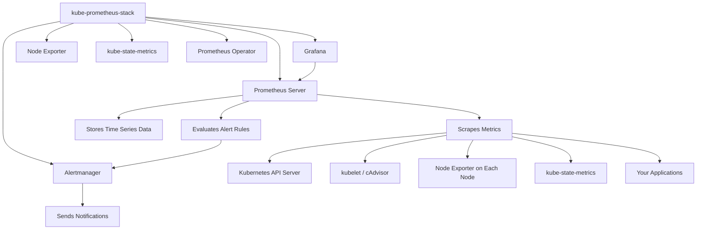
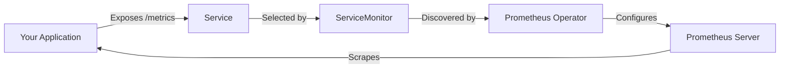

# How to Set Up Prometheus Monitoring for Kubernetes

Author: [nawazdhandala](https://www.github.com/nawazdhandala)

Tags: Kubernetes, Prometheus, Monitoring, Metrics, Observability

Description: Step-by-step guide to setting up Prometheus monitoring for Kubernetes using the kube-prometheus-stack Helm chart.

---

Prometheus is the standard for Kubernetes monitoring. It scrapes metrics from your cluster components, applications, and infrastructure, and stores them as time series data. This guide walks you through setting up a production-ready Prometheus monitoring stack on Kubernetes.

## Architecture Overview

The kube-prometheus-stack deploys a complete monitoring solution including Prometheus, Alertmanager, Grafana, and exporters for Kubernetes components.



## Prerequisites

```bash
# Make sure kubectl is configured and pointing to your cluster
kubectl cluster-info

# Install Helm 3 if not already installed
# macOS
brew install helm

# Verify Helm is installed
helm version
```

## Step 1: Install kube-prometheus-stack

```bash
# Add the Prometheus community Helm chart repository
helm repo add prometheus-community https://prometheus-community.github.io/helm-charts

# Update the repository index
helm repo update

# Create a namespace for monitoring
kubectl create namespace monitoring
```

Create a values file to customize the installation:

```yaml
# prometheus-values.yaml - Custom configuration for the stack
# Prometheus server configuration
prometheus:
  prometheusSpec:
    # How long to keep metrics data
    retention: 15d
    # Storage configuration - use persistent storage in production
    storageSpec:
      volumeClaimTemplate:
        spec:
          storageClassName: standard
          accessModes: ["ReadWriteOnce"]
          resources:
            requests:
              # Adjust based on your metrics volume
              storage: 50Gi
    # Resource limits for the Prometheus server
    resources:
      requests:
        cpu: 500m
        memory: 2Gi
      limits:
        cpu: 1000m
        memory: 4Gi
    # Scrape interval for all targets
    scrapeInterval: 30s
    # Evaluation interval for alerting rules
    evaluationInterval: 30s

# Alertmanager configuration
alertmanager:
  alertmanagerSpec:
    storage:
      volumeClaimTemplate:
        spec:
          storageClassName: standard
          accessModes: ["ReadWriteOnce"]
          resources:
            requests:
              storage: 10Gi

# Grafana configuration
grafana:
  # Admin password for Grafana
  adminPassword: "changeme-in-production"
  # Enable persistent storage for dashboards
  persistence:
    enabled: true
    size: 10Gi

# Node exporter runs on every node as a DaemonSet
nodeExporter:
  enabled: true

# kube-state-metrics provides Kubernetes object metrics
kubeStateMetrics:
  enabled: true
```

Install the stack:

```bash
# Install the kube-prometheus-stack with custom values
helm install prometheus prometheus-community/kube-prometheus-stack \
  --namespace monitoring \
  --values prometheus-values.yaml \
  --wait

# Verify all components are running
kubectl get pods -n monitoring
```

## Step 2: Access the UIs

```bash
# Port-forward Prometheus UI
kubectl port-forward -n monitoring svc/prometheus-kube-prometheus-prometheus 9090:9090

# Port-forward Grafana UI (default credentials: admin / changeme-in-production)
kubectl port-forward -n monitoring svc/prometheus-grafana 3000:80

# Port-forward Alertmanager UI
kubectl port-forward -n monitoring svc/prometheus-kube-prometheus-alertmanager 9093:9093
```

## Step 3: Monitor Your Applications

To scrape metrics from your own applications, create a ServiceMonitor resource.



```yaml
# service-monitor.yaml - Tell Prometheus to scrape your application
apiVersion: monitoring.coreos.com/v1
kind: ServiceMonitor
metadata:
  name: my-app-monitor
  namespace: monitoring
  labels:
    # This label must match the Prometheus serviceMonitorSelector
    release: prometheus
spec:
  # Select the service to monitor
  selector:
    matchLabels:
      app: my-app
  # Namespace where the target service lives
  namespaceSelector:
    matchNames:
    - your-namespace
  # Define the endpoint to scrape
  endpoints:
  - port: metrics           # Name of the service port
    path: /metrics          # Path where metrics are exposed
    interval: 15s           # How often to scrape
    scrapeTimeout: 10s      # Timeout for each scrape
```

Make sure your application service has the matching label:

```yaml
# service.yaml - Your application service
apiVersion: v1
kind: Service
metadata:
  name: my-app
  namespace: your-namespace
  labels:
    # This label is what the ServiceMonitor selector matches
    app: my-app
spec:
  ports:
  - name: http
    port: 8080
  - name: metrics
    port: 9090
  selector:
    app: my-app
```

## Step 4: Configure Alerting Rules

Create PrometheusRule resources to define alerting conditions.

```yaml
# alert-rules.yaml - Custom alerting rules
apiVersion: monitoring.coreos.com/v1
kind: PrometheusRule
metadata:
  name: kubernetes-alerts
  namespace: monitoring
  labels:
    release: prometheus
spec:
  groups:
  - name: kubernetes-pods
    rules:
    # Alert when a pod is in CrashLoopBackOff
    - alert: PodCrashLoopBackOff
      expr: |
        rate(kube_pod_container_status_restarts_total[15m]) * 60 * 5 > 0
      for: 5m
      labels:
        severity: critical
      annotations:
        summary: "Pod {{ $labels.namespace }}/{{ $labels.pod }} is crash looping"

    # Alert when a pod is not ready
    - alert: PodNotReady
      expr: |
        kube_pod_status_ready{condition="true"} == 0
      for: 10m
      labels:
        severity: warning
      annotations:
        summary: "Pod {{ $labels.namespace }}/{{ $labels.pod }} has been not ready for 10 minutes"

  - name: kubernetes-nodes
    rules:
    # Alert when a node is not ready
    - alert: NodeNotReady
      expr: |
        kube_node_status_condition{condition="Ready", status="true"} == 0
      for: 5m
      labels:
        severity: critical
      annotations:
        summary: "Node {{ $labels.node }} is not ready"

    # Alert when node disk is almost full
    - alert: NodeDiskPressure
      expr: |
        (node_filesystem_avail_bytes{mountpoint="/"} / node_filesystem_size_bytes{mountpoint="/"}) * 100 < 15
      for: 5m
      labels:
        severity: warning
      annotations:
        summary: "Node {{ $labels.instance }} disk usage is above 85%"
```

## Step 5: Configure Alertmanager Notifications

```yaml
# alertmanager-config.yaml - Route alerts to notification channels
apiVersion: monitoring.coreos.com/v1alpha1
kind: AlertmanagerConfig
metadata:
  name: notification-config
  namespace: monitoring
  labels:
    release: prometheus
spec:
  route:
    receiver: 'slack-notifications'
    groupBy: ['alertname', 'namespace']
    # Wait before sending the initial notification
    groupWait: 30s
    # Wait before sending updates for the same group
    groupInterval: 5m
    # Wait before resending a resolved notification
    repeatInterval: 4h
    routes:
    # Route critical alerts immediately
    - matchers:
      - name: severity
        value: critical
      receiver: 'slack-critical'
      repeatInterval: 1h
  receivers:
  - name: 'slack-notifications'
    slackConfigs:
    - apiURL:
        name: slack-webhook
        key: url
      channel: '#monitoring-alerts'
      title: '[{{ .Status | toUpper }}] {{ .CommonLabels.alertname }}'
      text: '{{ range .Alerts }}{{ .Annotations.summary }}{{ end }}'
  - name: 'slack-critical'
    slackConfigs:
    - apiURL:
        name: slack-webhook
        key: url
      channel: '#critical-alerts'
      title: 'CRITICAL: {{ .CommonLabels.alertname }}'
      text: '{{ range .Alerts }}{{ .Annotations.summary }}{{ end }}'
```

## Step 6: Essential PromQL Queries

```bash
# CPU usage per pod
rate(container_cpu_usage_seconds_total{container!=""}[5m])

# Memory usage per pod
container_memory_working_set_bytes{container!=""}

# Pod restart count
kube_pod_container_status_restarts_total

# Request rate for a service (requires application metrics)
rate(http_requests_total{service="my-app"}[5m])

# Error rate as a percentage
rate(http_requests_total{status=~"5.."}[5m])
/ rate(http_requests_total[5m]) * 100

# Node CPU utilization percentage
100 - (avg by(instance) (rate(node_cpu_seconds_total{mode="idle"}[5m])) * 100)
```

## Verification Checklist

```bash
# 1. Check all monitoring pods are running
kubectl get pods -n monitoring

# 2. Verify Prometheus targets are being scraped
# Open Prometheus UI and check Status > Targets
kubectl port-forward -n monitoring svc/prometheus-kube-prometheus-prometheus 9090:9090

# 3. Verify metrics are being collected
# Run a test query in Prometheus UI
# up{job="kubelet"}

# 4. Check Alertmanager is receiving alerts
kubectl port-forward -n monitoring svc/prometheus-kube-prometheus-alertmanager 9093:9093

# 5. Verify Grafana dashboards are loading
kubectl port-forward -n monitoring svc/prometheus-grafana 3000:80
```

## Conclusion

Setting up Prometheus monitoring for Kubernetes gives you deep visibility into your cluster health, application performance, and resource usage. The kube-prometheus-stack provides a production-ready setup with minimal configuration. Start with the default dashboards and alerting rules, then add custom ServiceMonitors and PrometheusRules for your applications.

For a managed monitoring solution that works alongside Prometheus and provides incident management, status pages, and on-call scheduling, check out [OneUptime](https://oneuptime.com). OneUptime integrates with Prometheus and provides a unified platform for monitoring, alerting, and incident response.
