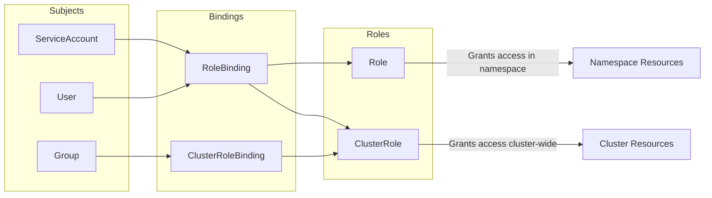

# How to Set Up Kubernetes RBAC with Roles and RoleBindings

Author: [nawazdhandala](https://www.github.com/nawazdhandala)

Tags: Kubernetes, RBAC, Security, Roles, Authorization

Description: Step-by-step guide to setting up Kubernetes RBAC including Roles, ClusterRoles, RoleBindings, and best practices for least privilege.

---

Role-Based Access Control (RBAC) is how you control who can do what in a Kubernetes cluster. Every API request is authorized through RBAC, and getting it wrong means either locking people out of what they need or giving them access to things they should not touch. This guide covers the core RBAC primitives and shows you how to build a least-privilege access model.

## RBAC Building Blocks

Kubernetes RBAC uses four resources to define access control.



| Resource | Scope | Purpose |
|----------|-------|---------|
| Role | Namespace | Defines permissions within a single namespace |
| ClusterRole | Cluster | Defines permissions across all namespaces or for cluster-scoped resources |
| RoleBinding | Namespace | Grants a Role or ClusterRole to subjects in a namespace |
| ClusterRoleBinding | Cluster | Grants a ClusterRole to subjects across the entire cluster |

## Creating a Role

A Role grants permissions on resources within a specific namespace.

```yaml
# role-developer.yaml
# This Role allows reading pods and logs, and managing deployments
# in the "staging" namespace only.
apiVersion: rbac.authorization.k8s.io/v1
kind: Role
metadata:
  name: developer
  namespace: staging
rules:
  # Allow reading pods and their logs
  - apiGroups: [""]
    resources: ["pods", "pods/log", "pods/status"]
    verbs: ["get", "list", "watch"]
  # Allow managing deployments
  - apiGroups: ["apps"]
    resources: ["deployments"]
    verbs: ["get", "list", "watch", "create", "update", "patch"]
  # Allow reading configmaps and secrets
  - apiGroups: [""]
    resources: ["configmaps"]
    verbs: ["get", "list", "watch"]
  # Allow reading services
  - apiGroups: [""]
    resources: ["services"]
    verbs: ["get", "list", "watch"]
```

## Creating a ClusterRole

A ClusterRole can be used across all namespaces or for cluster-scoped resources like nodes and namespaces.

```yaml
# clusterrole-readonly.yaml
# This ClusterRole grants read-only access to common resources
# across all namespaces when used with a ClusterRoleBinding.
apiVersion: rbac.authorization.k8s.io/v1
kind: ClusterRole
metadata:
  name: cluster-readonly
rules:
  # Read-only access to core resources
  - apiGroups: [""]
    resources:
      - pods
      - services
      - endpoints
      - configmaps
      - events
      - namespaces
      - nodes
    verbs: ["get", "list", "watch"]
  # Read-only access to apps resources
  - apiGroups: ["apps"]
    resources:
      - deployments
      - statefulsets
      - daemonsets
      - replicasets
    verbs: ["get", "list", "watch"]
  # Read-only access to networking resources
  - apiGroups: ["networking.k8s.io"]
    resources: ["ingresses", "networkpolicies"]
    verbs: ["get", "list", "watch"]
```

## Binding Roles to Users

A RoleBinding connects a Role to a subject (user, group, or service account).

```yaml
# rolebinding-developer.yaml
# This binds the "developer" Role to user "alice"
# in the "staging" namespace.
apiVersion: rbac.authorization.k8s.io/v1
kind: RoleBinding
metadata:
  name: developer-alice
  namespace: staging
subjects:
  # Bind to a specific user
  - kind: User
    name: alice
    apiGroup: rbac.authorization.k8s.io
roleRef:
  kind: Role
  name: developer
  apiGroup: rbac.authorization.k8s.io
```

```yaml
# clusterrolebinding-readonly.yaml
# This gives the "ops-team" group read-only access
# across the entire cluster.
apiVersion: rbac.authorization.k8s.io/v1
kind: ClusterRoleBinding
metadata:
  name: ops-team-readonly
subjects:
  # Bind to a group - all users in this group get access
  - kind: Group
    name: ops-team
    apiGroup: rbac.authorization.k8s.io
roleRef:
  kind: ClusterRole
  name: cluster-readonly
  apiGroup: rbac.authorization.k8s.io
```

## Common RBAC Patterns

### Namespace Admin

```yaml
# role-namespace-admin.yaml
# Full control within a namespace, but no cluster-level access.
apiVersion: rbac.authorization.k8s.io/v1
kind: RoleBinding
metadata:
  name: team-alpha-admin
  namespace: team-alpha
subjects:
  - kind: Group
    name: team-alpha-leads
    apiGroup: rbac.authorization.k8s.io
roleRef:
  # Use the built-in admin ClusterRole scoped to this namespace
  kind: ClusterRole
  name: admin
  apiGroup: rbac.authorization.k8s.io
```

### CI/CD Service Account

```yaml
# sa-cicd.yaml
# A service account for CI/CD with deploy-only permissions.
apiVersion: v1
kind: ServiceAccount
metadata:
  name: cicd-deployer
  namespace: production
---
apiVersion: rbac.authorization.k8s.io/v1
kind: Role
metadata:
  name: deployer
  namespace: production
rules:
  # Only allow updating deployments - no delete, no create
  - apiGroups: ["apps"]
    resources: ["deployments"]
    verbs: ["get", "list", "patch", "update"]
    # Optionally restrict to specific deployment names
    resourceNames: ["api-server", "web-frontend", "worker"]
  # Allow reading pods to check rollout status
  - apiGroups: [""]
    resources: ["pods"]
    verbs: ["get", "list", "watch"]
---
apiVersion: rbac.authorization.k8s.io/v1
kind: RoleBinding
metadata:
  name: cicd-deployer-binding
  namespace: production
subjects:
  - kind: ServiceAccount
    name: cicd-deployer
    namespace: production
roleRef:
  kind: Role
  name: deployer
  apiGroup: rbac.authorization.k8s.io
```

## Aggregated ClusterRoles

Kubernetes lets you build composite ClusterRoles using label-based aggregation.

```yaml
# aggregated-monitoring-role.yaml
# This ClusterRole automatically includes any ClusterRole
# with the label "rbac.example.com/aggregate-to-monitoring: true"
apiVersion: rbac.authorization.k8s.io/v1
kind: ClusterRole
metadata:
  name: monitoring
aggregationRule:
  clusterRoleSelectors:
    - matchLabels:
        rbac.example.com/aggregate-to-monitoring: "true"
rules: []  # Rules are auto-populated by aggregation
---
# This fragment gets aggregated into the monitoring ClusterRole
apiVersion: rbac.authorization.k8s.io/v1
kind: ClusterRole
metadata:
  name: monitoring-metrics
  labels:
    rbac.example.com/aggregate-to-monitoring: "true"
rules:
  - apiGroups: [""]
    resources: ["pods", "nodes"]
    verbs: ["get", "list", "watch"]
  - apiGroups: ["metrics.k8s.io"]
    resources: ["pods", "nodes"]
    verbs: ["get", "list"]
```

## Testing RBAC Permissions

```bash
# Check if a user can perform an action
kubectl auth can-i get pods --namespace staging --as alice

# Check if a service account can perform an action
kubectl auth can-i create deployments \
  --namespace production \
  --as system:serviceaccount:production:cicd-deployer

# List all permissions for a user
kubectl auth can-i --list --as alice --namespace staging

# Check who can perform a specific action (requires kubectl-who-can plugin)
# kubectl who-can delete pods --namespace production
```

## RBAC Best Practices

1. **Start with least privilege.** Give users only the permissions they need.
2. **Use Groups over Users.** Bind roles to groups managed by your identity provider.
3. **Prefer namespaced Roles.** Use ClusterRoles only when cross-namespace access is truly needed.
4. **Never use cluster-admin for applications.** Create specific roles for each workload.
5. **Audit regularly.** Review RoleBindings and ClusterRoleBindings periodically.
6. **Use resourceNames when possible.** Restrict access to specific resources by name.

```bash
# Audit: Find all ClusterRoleBindings using cluster-admin
kubectl get clusterrolebindings -o json | \
  jq -r '.items[] | select(.roleRef.name=="cluster-admin") | .metadata.name'

# Audit: List all RoleBindings in all namespaces
kubectl get rolebindings --all-namespaces -o wide
```

## Monitoring RBAC with OneUptime

Misconfigured RBAC can either break your workloads (too restrictive) or create security holes (too permissive). [OneUptime](https://oneuptime.com) helps you monitor RBAC-related errors in your Kubernetes audit logs. Set up alerts for unauthorized access attempts, track changes to RoleBindings, and get notified when new ClusterRoleBindings with elevated privileges are created. This gives your security team visibility into access patterns across your cluster.
