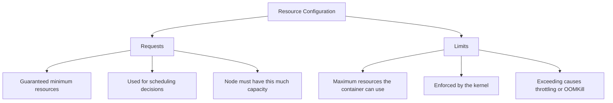
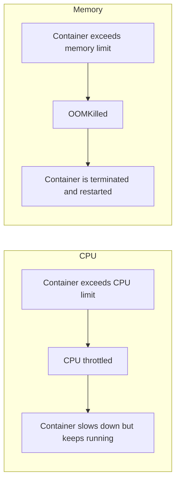
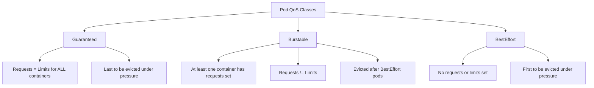
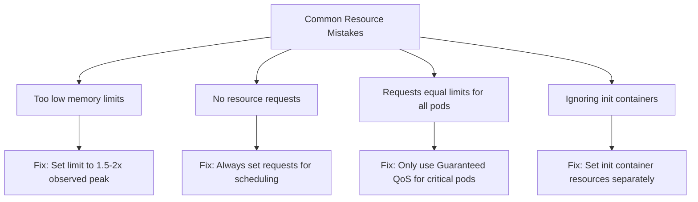

# How to Set Kubernetes Resource Requests and Limits Correctly

Author: [nawazdhandala](https://www.github.com/nawazdhandala)

Tags: Kubernetes, Resources, Requests, Limits, Best Practices

Description: Best practices for setting CPU and memory resource requests and limits in Kubernetes to avoid OOMKill and CPU throttling.

---

Getting resource requests and limits right is one of the most impactful things you can do for your Kubernetes cluster. Set them too low and your pods get OOMKilled or CPU throttled. Set them too high and you waste capacity and money. This post explains how CPU and memory resources work in Kubernetes and gives you practical strategies for setting them correctly.

## How Requests and Limits Work



- **Requests** - The amount of CPU/memory guaranteed to the container. The scheduler uses this to find a node with enough capacity.
- **Limits** - The maximum CPU/memory a container can use. The kernel enforces this.

## CPU vs Memory: Key Differences

CPU and memory behave very differently when limits are exceeded:



CPU is compressible - the kernel can throttle it without killing the process. Memory is incompressible - once a process allocates memory, the kernel cannot take it back without killing the process.

## Step 1: Understand CPU Units

```yaml
# cpu-examples.yaml
# CPU resource specifications in Kubernetes
apiVersion: v1
kind: Pod
metadata:
  name: cpu-demo
spec:
  containers:
    - name: app
      image: nginx:1.27
      resources:
        requests:
          # CPU is measured in millicores (m)
          # 1 CPU = 1000m = 1 vCPU/core
          cpu: "250m"     # 0.25 CPU cores
          # Equivalent notations:
          # cpu: "0.25"   # Same as 250m
          # cpu: "1"      # 1 full core = 1000m
          # cpu: "1500m"  # 1.5 cores
        limits:
          cpu: "500m"     # Container can burst up to 0.5 cores
```

## Step 2: Understand Memory Units

```yaml
# memory-examples.yaml
# Memory resource specifications in Kubernetes
apiVersion: v1
kind: Pod
metadata:
  name: memory-demo
spec:
  containers:
    - name: app
      image: nginx:1.27
      resources:
        requests:
          # Memory uses binary units (powers of 1024)
          memory: "256Mi"   # 256 mebibytes (268,435,456 bytes)
          # Other notations:
          # memory: "1Gi"   # 1 gibibyte = 1024 Mi
          # memory: "512M"  # 512 megabytes (powers of 1000, slightly less than 512Mi)
        limits:
          memory: "512Mi"   # Hard cap - container gets OOMKilled if it exceeds this
```

## Step 3: QoS Classes

Kubernetes assigns a Quality of Service class to each pod based on its resource configuration.



```yaml
# qos-guaranteed.yaml
# Guaranteed QoS - requests equal limits for both CPU and memory
apiVersion: v1
kind: Pod
metadata:
  name: guaranteed-pod
spec:
  containers:
    - name: app
      image: nginx:1.27
      resources:
        requests:
          cpu: "500m"
          memory: "256Mi"
        limits:
          cpu: "500m"       # Same as request
          memory: "256Mi"   # Same as request
---
# qos-burstable.yaml
# Burstable QoS - limits are higher than requests
apiVersion: v1
kind: Pod
metadata:
  name: burstable-pod
spec:
  containers:
    - name: app
      image: nginx:1.27
      resources:
        requests:
          cpu: "200m"
          memory: "128Mi"
        limits:
          cpu: "1000m"      # Can burst up to 1 CPU
          memory: "512Mi"   # Can burst up to 512Mi
```

## Step 4: Measure Actual Usage Before Setting Values

Never guess resource values. Measure first, then set.

```bash
# Check current resource usage of your pods
kubectl top pods -l app=web-app --containers

# Check resource usage over time using Prometheus queries
# Average CPU usage over the last 24 hours:
# rate(container_cpu_usage_seconds_total{container="web-app"}[24h])

# Peak memory usage over the last 7 days:
# max_over_time(container_memory_working_set_bytes{container="web-app"}[7d])

# Check current requests and limits
kubectl get pods -o custom-columns=\
NAME:.metadata.name,\
CPU_REQ:.spec.containers[0].resources.requests.cpu,\
CPU_LIM:.spec.containers[0].resources.limits.cpu,\
MEM_REQ:.spec.containers[0].resources.requests.memory,\
MEM_LIM:.spec.containers[0].resources.limits.memory
```

## Step 5: Setting Requests - The Right Way

```yaml
# well-configured-deployment.yaml
# Deployment with carefully chosen resource values
apiVersion: apps/v1
kind: Deployment
metadata:
  name: api-service
spec:
  replicas: 3
  selector:
    matchLabels:
      app: api-service
  template:
    metadata:
      labels:
        app: api-service
    spec:
      containers:
        - name: api
          image: your-registry/api:latest
          resources:
            requests:
              # Set CPU request to the P50 (median) usage
              # If your app typically uses 150m, set request to 200m
              cpu: "200m"
              # Set memory request to the P99 usage
              # Memory should be requested generously since OOMKill is disruptive
              memory: "384Mi"
            limits:
              # Set CPU limit to 2-5x the request for burst capacity
              # Or consider not setting CPU limits at all (see below)
              cpu: "1000m"
              # Set memory limit to 1.5-2x the request
              # This gives headroom for spikes without wasting too much
              memory: "512Mi"
```

## The CPU Limits Debate

There is an ongoing debate about whether to set CPU limits at all. Here are both sides:

```yaml
# option-1-with-limits.yaml
# WITH CPU limits - predictable but may cause throttling
apiVersion: v1
kind: Pod
metadata:
  name: with-cpu-limit
spec:
  containers:
    - name: app
      image: nginx:1.27
      resources:
        requests:
          cpu: "200m"
          memory: "256Mi"
        limits:
          cpu: "500m"       # CPU is throttled above this
          memory: "512Mi"
---
# option-2-no-cpu-limit.yaml
# WITHOUT CPU limits - can use idle CPU but less predictable
apiVersion: v1
kind: Pod
metadata:
  name: no-cpu-limit
spec:
  containers:
    - name: app
      image: nginx:1.27
      resources:
        requests:
          cpu: "200m"       # Guaranteed 200m
          memory: "256Mi"
        limits:
          # No CPU limit - container can use all available CPU on the node
          memory: "512Mi"   # Always set memory limits to prevent OOM
```

The recommendation: Always set memory limits. For CPU, use limits if you need predictable performance, skip them if you want maximum throughput and can tolerate noisy-neighbor effects.

## Step 6: LimitRange for Defaults

Use LimitRange to set default resource values for pods that do not specify them.

```yaml
# limit-range.yaml
# LimitRange sets default and maximum resource values per namespace
apiVersion: v1
kind: LimitRange
metadata:
  name: default-resources
  namespace: production
spec:
  limits:
    - type: Container
      # Default values applied when pod does not specify resources
      default:
        cpu: "500m"
        memory: "256Mi"
      # Default requests applied when pod does not specify requests
      defaultRequest:
        cpu: "100m"
        memory: "128Mi"
      # Maximum allowed values per container
      max:
        cpu: "4000m"
        memory: "8Gi"
      # Minimum allowed values per container
      min:
        cpu: "50m"
        memory: "32Mi"
```

## Step 7: ResourceQuota for Namespace Limits

ResourceQuota caps total resource consumption per namespace.

```yaml
# resource-quota.yaml
# ResourceQuota limits total resources used in a namespace
apiVersion: v1
kind: ResourceQuota
metadata:
  name: production-quota
  namespace: production
spec:
  hard:
    requests.cpu: "20"        # Total CPU requests across all pods
    requests.memory: "40Gi"   # Total memory requests across all pods
    limits.cpu: "40"          # Total CPU limits across all pods
    limits.memory: "80Gi"     # Total memory limits across all pods
    pods: "100"               # Maximum number of pods
```

```bash
# Check quota usage
kubectl describe resourcequota production-quota -n production
```

## Common Mistakes and Fixes



```yaml
# init-container-resources.yaml
# Do not forget to set resources for init containers too
apiVersion: v1
kind: Pod
metadata:
  name: app-with-init
spec:
  initContainers:
    - name: db-migration
      image: your-registry/migration:latest
      resources:
        requests:
          cpu: "500m"       # Migrations may need more CPU temporarily
          memory: "256Mi"
        limits:
          cpu: "1000m"
          memory: "512Mi"
  containers:
    - name: app
      image: your-registry/app:latest
      resources:
        requests:
          cpu: "200m"
          memory: "256Mi"
        limits:
          cpu: "500m"
          memory: "512Mi"
```

## Monitoring Resource Usage

```bash
# Check for OOMKilled pods
kubectl get pods --all-namespaces | grep OOMKilled

# Check for pods that were evicted
kubectl get events --field-selector reason=Evicted --all-namespaces

# Find pods with high CPU throttling (using Prometheus)
# rate(container_cpu_cfs_throttled_periods_total[5m]) / rate(container_cpu_cfs_periods_total[5m]) > 0.25

# Compare requests to actual usage
kubectl top pods --containers | sort -k3 -rn | head -20
```

## Summary

Setting resource requests and limits correctly is foundational to running a stable and cost-efficient Kubernetes cluster. Measure before you configure, use requests for scheduling guarantees, use memory limits always, and consider your QoS strategy for each workload tier.

To monitor resource utilization, detect OOMKills, track CPU throttling, and get alerted before resource issues cause outages, use [OneUptime](https://oneuptime.com). OneUptime provides comprehensive infrastructure monitoring that gives you visibility into every pod's resource consumption, helping you right-size your workloads and avoid costly over-provisioning.
