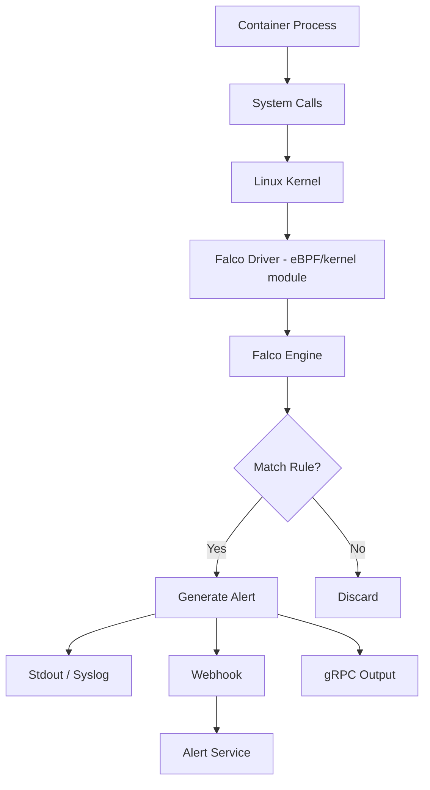
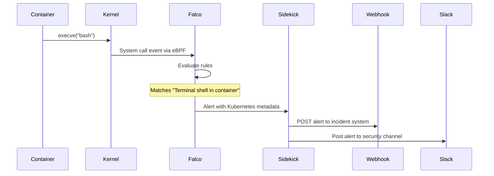
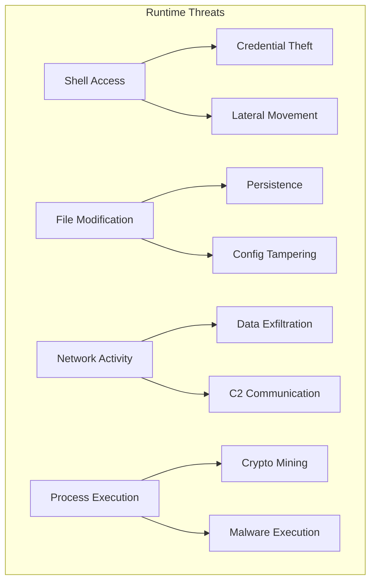

# How to Use Falco for Kubernetes Runtime Security

Author: [nawazdhandala](https://www.github.com/nawazdhandala)

Tags: Kubernetes, Falco, Runtime Security, Threat Detection, Security

Description: Learn how to deploy Falco for Kubernetes runtime security monitoring and threat detection with custom rules.

---

Static security scanning catches known vulnerabilities in container images. But what about runtime behavior? A container that spawns an unexpected shell, reads sensitive files, or opens a network connection to an external IP might be compromised. Falco monitors system calls in real time and alerts on suspicious activity.

This guide covers deploying Falco on Kubernetes, writing custom rules, and integrating alerts with your incident response pipeline.

## How Falco Works



## Installing Falco with Helm

```bash
# install-falco.sh
# Deploy Falco as a DaemonSet so it runs on every node

# Add the Falcosecurity Helm repository
helm repo add falcosecurity https://falcosecurity.github.io/charts
helm repo update

# Install Falco with the eBPF driver (no kernel module needed)
helm install falco falcosecurity/falco \
  --namespace falco \
  --create-namespace \
  --set driver.kind=ebpf \
  --set falcosidekick.enabled=true \
  --set falcosidekick.webui.enabled=true \
  --set collectors.kubernetes.enabled=true
```

## Falco DaemonSet Configuration

```yaml
# falco-values.yaml
# Helm values for production Falco deployment
driver:
  # Use eBPF probe instead of kernel module
  # eBPF is safer and works on more kernel versions
  kind: ebpf

# Enable Kubernetes metadata enrichment
collectors:
  kubernetes:
    enabled: true

# Resource limits for the Falco pods
resources:
  requests:
    cpu: 100m
    memory: 512Mi
  limits:
    cpu: 500m
    memory: 1Gi

# Falcosidekick forwards alerts to multiple destinations
falcosidekick:
  enabled: true
  config:
    webhook:
      # Send alerts to your incident management system
      address: "https://alerts.example.com/falco"
    slack:
      webhookurl: ""
      channel: "#security-alerts"
      minimumpriority: "warning"

# Tolerations to run on all nodes including control plane
tolerations:
  - effect: NoSchedule
    operator: Exists
```

## Default Detection Rules

Falco ships with rules that detect common threats. Here are some of the most important ones:

```yaml
# Key built-in rules that Falco evaluates:
#
# 1. Terminal shell in container
#    Detects: Interactive shell opened inside a running container
#    Why: Attackers use shells for lateral movement
#
# 2. Write below /etc
#    Detects: File writes to /etc inside a container
#    Why: Modifying config files indicates tampering
#
# 3. Read sensitive file
#    Detects: Reading /etc/shadow, /etc/passwd
#    Why: Credential harvesting attempt
#
# 4. Launch privileged container
#    Detects: Container running with --privileged flag
#    Why: Privileged containers can escape to the host
#
# 5. Contact Kubernetes API from container
#    Detects: Unexpected API server communication
#    Why: Token theft or service account abuse
```

## Writing Custom Rules

```yaml
# custom-rules.yaml
# Custom Falco rules for application-specific threat detection
customRules:
  custom-rules.yaml: |-
    # Detect cryptocurrency mining processes
    - rule: Detect Crypto Mining
      desc: Detects processes commonly associated with crypto mining
      condition: >
        spawned_process and
        container and
        (proc.name in (xmrig, minerd, cpuminer, cgminer, bfgminer) or
         proc.cmdline contains "stratum+tcp" or
         proc.cmdline contains "stratum+ssl")
      output: >
        Crypto mining process detected
        (user=%user.name command=%proc.cmdline
         container=%container.name
         pod=%k8s.pod.name
         namespace=%k8s.ns.name
         image=%container.image.repository)
      priority: CRITICAL
      tags: [crypto, mining, threat]

    # Detect reverse shell connections
    - rule: Reverse Shell Detected
      desc: Detects outbound connections from shell processes
      condition: >
        evt.type=connect and
        evt.dir=< and
        container and
        (proc.name in (bash, sh, zsh, dash) or
         proc.name in (nc, ncat, netcat))
      output: >
        Reverse shell connection detected
        (user=%user.name command=%proc.cmdline
         connection=%fd.name
         container=%container.name
         pod=%k8s.pod.name
         namespace=%k8s.ns.name)
      priority: CRITICAL
      tags: [network, shell, threat]

    # Detect unexpected outbound connections
    - rule: Unexpected Outbound Connection
      desc: Detects containers making connections to non-approved IPs
      condition: >
        evt.type=connect and
        evt.dir=< and
        container and
        fd.typechar=4 and
        not (fd.sip in (10.0.0.0/8, 172.16.0.0/12, 192.168.0.0/16))
      output: >
        Unexpected outbound connection to external IP
        (user=%user.name command=%proc.cmdline
         connection=%fd.name
         container=%container.name
         pod=%k8s.pod.name
         namespace=%k8s.ns.name)
      priority: WARNING
      tags: [network, exfiltration]

    # Detect modification of package managers
    - rule: Package Manager Execution
      desc: Detects package manager usage inside containers
      condition: >
        spawned_process and
        container and
        proc.name in (apt, apt-get, yum, dnf, apk, pip, npm)
      output: >
        Package manager executed in container
        (user=%user.name command=%proc.cmdline
         container=%container.name
         pod=%k8s.pod.name
         namespace=%k8s.ns.name)
      priority: WARNING
      tags: [software, supply-chain]
```

## Alert Flow



## Falco Alert Processor

```python
# falco_alert_processor.py
# Receives Falco alerts via webhook and processes them
# Groups alerts by severity and enriches with cluster context

from flask import Flask, request, jsonify
from datetime import datetime
import json

app = Flask(__name__)

# In-memory alert buffer for aggregation
alert_buffer = []


@app.route("/falco", methods=["POST"])
def receive_alert():
    """Receive a Falco alert from Falcosidekick."""
    alert = request.json

    # Extract key fields from the alert
    processed = {
        "timestamp": datetime.utcnow().isoformat(),
        "priority": alert.get("priority", "unknown"),
        "rule": alert.get("rule", "unknown"),
        "output": alert.get("output", ""),
        "source": alert.get("source", "syscall"),
        # Extract Kubernetes context from output fields
        "pod": alert.get("output_fields", {}).get("k8s.pod.name", "unknown"),
        "namespace": alert.get("output_fields", {}).get("k8s.ns.name", "unknown"),
        "container": alert.get("output_fields", {}).get("container.name", "unknown"),
        "image": alert.get("output_fields", {}).get("container.image.repository", "unknown"),
    }

    alert_buffer.append(processed)

    # Log critical alerts immediately
    if processed["priority"] in ("Critical", "Emergency"):
        print(
            f"CRITICAL ALERT: {processed['rule']} "
            f"in {processed['namespace']}/{processed['pod']}"
        )

    return jsonify({"status": "received"}), 200


@app.route("/alerts/summary", methods=["GET"])
def alert_summary():
    """Return a summary of recent alerts grouped by rule."""
    summary = {}
    for alert in alert_buffer[-1000:]:
        rule = alert["rule"]
        if rule not in summary:
            summary[rule] = {"count": 0, "priority": alert["priority"]}
        summary[rule]["count"] += 1

    return jsonify(summary), 200


if __name__ == "__main__":
    app.run(host="0.0.0.0", port=8080)
```

## Threat Detection Categories



## Tuning False Positives

Falco will generate noise. Some containers legitimately run shells for health checks, or connect to external APIs. Create exception rules to suppress known-good behavior.

```yaml
# exceptions.yaml
# Suppress known-good behavior to reduce alert noise
customRules:
  exceptions.yaml: |-
    # Allow health check scripts to run shells
    - rule: Terminal shell in container
      append: true
      condition: >
        and not (k8s.ns.name = "monitoring" and
                 container.image.repository = "registry.example.com/healthcheck")

    # Allow CI/CD runners to install packages
    - rule: Package Manager Execution
      append: true
      condition: >
        and not (k8s.ns.name = "ci-cd" and
                 container.image.repository contains "runner")
```

## Key Takeaways

- Deploy Falco as a DaemonSet on every node. Use the eBPF driver for compatibility across kernel versions.
- Start with the default rule set and tune out false positives over time. Do not disable rules just because they are noisy.
- Write custom rules for your application-specific threats, such as unexpected outbound connections or crypto mining.
- Use Falcosidekick to fan out alerts to multiple destinations including Slack, webhooks, and your incident system.
- Combine Falco with audit logging for defense in depth. Audit logs cover API-level activity while Falco covers host-level activity.

Runtime security is the last line of defense. Use [OneUptime](https://oneuptime.com) to receive Falco alerts, correlate them with your infrastructure monitoring, and trigger incident workflows when a genuine threat is detected in your Kubernetes cluster.
