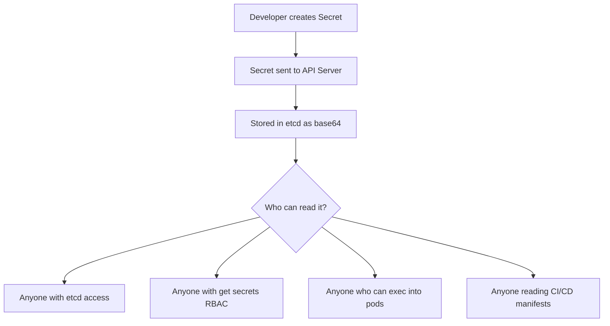
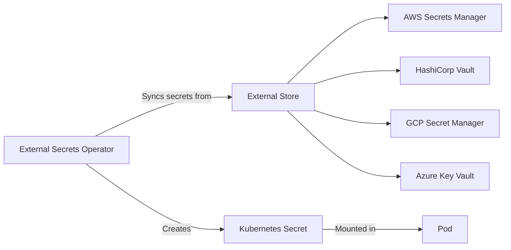

# How to Manage Secrets Securely in Kubernetes

Author: [nawazdhandala](https://www.github.com/nawazdhandala)

Tags: Kubernetes, Secrets, Security, Encryption, Best Practices

Description: Best practices for managing Kubernetes secrets including encryption at rest, external secret stores, and avoiding common mistakes.

---

Kubernetes Secrets store sensitive data like passwords, API keys, and TLS certificates. By default, Secrets are stored as base64-encoded text in etcd with no encryption. This means anyone with access to etcd or the Kubernetes API can read your secrets in plain text. This guide covers how to properly secure secrets in Kubernetes.

## The Problem with Default Secrets



Base64 is encoding, not encryption. Anyone can decode it:

```bash
# This is NOT secure - base64 is trivially reversible
echo "cGFzc3dvcmQxMjM=" | base64 --decode
# Output: password123
```

## Creating Kubernetes Secrets

### From Literal Values

```bash
# Create a secret from literal key-value pairs
# Kubernetes handles the base64 encoding internally
kubectl create secret generic db-credentials \
  --namespace production \
  --from-literal=username=dbadmin \
  --from-literal=password='s3cur3-p@ssw0rd'
```

### From a YAML Manifest

```yaml
# secret-manifest.yaml
# Values must be base64-encoded in the manifest.
apiVersion: v1
kind: Secret
metadata:
  name: db-credentials
  namespace: production
type: Opaque
data:
  # echo -n 'dbadmin' | base64
  username: ZGJhZG1pbg==
  # echo -n 's3cur3-p@ssw0rd' | base64
  password: czNjdXIzLXBAc3N3MHJk
```

### Using stringData (No Base64 Required)

```yaml
# secret-stringdata.yaml
# stringData accepts plain text and encodes it automatically.
# Easier to read, but do NOT commit this to version control.
apiVersion: v1
kind: Secret
metadata:
  name: api-keys
  namespace: production
type: Opaque
stringData:
  api-key: "ak_live_abc123def456"
  webhook-secret: "whsec_xyz789"
```

## Mounting Secrets in Pods

### As Environment Variables

```yaml
# pod-secret-env.yaml
# Mount individual secret keys as environment variables.
apiVersion: v1
kind: Pod
metadata:
  name: app-server
  namespace: production
spec:
  containers:
    - name: app
      image: myapp:3.0.0
      env:
        # Mount a specific key from the secret
        - name: DB_USERNAME
          valueFrom:
            secretKeyRef:
              name: db-credentials
              key: username
        - name: DB_PASSWORD
          valueFrom:
            secretKeyRef:
              name: db-credentials
              key: password
```

### As Volume Files

```yaml
# pod-secret-volume.yaml
# Mount the entire secret as files in a volume.
# Each key becomes a file, and the value becomes the file content.
apiVersion: v1
kind: Pod
metadata:
  name: app-server
  namespace: production
spec:
  containers:
    - name: app
      image: myapp:3.0.0
      volumeMounts:
        - name: secret-volume
          mountPath: /etc/secrets
          readOnly: true
  volumes:
    - name: secret-volume
      secret:
        secretName: db-credentials
        # Set file permissions (octal)
        defaultMode: 0400
```

Volume-mounted secrets are automatically updated when the secret changes (with a short delay). Environment variables are not updated until the pod restarts.

## Encryption at Rest

Enable encryption at rest to protect secrets stored in etcd.

```yaml
# encryption-config.yaml
# This configuration encrypts secrets using AES-CBC.
# Place this file on the control plane node and reference it
# in the API server's --encryption-provider-config flag.
apiVersion: apiserver.config.k8s.io/v1
kind: EncryptionConfiguration
resources:
  - resources:
      - secrets
    providers:
      # AES-CBC encryption with a 32-byte key
      - aescbc:
          keys:
            - name: key1
              # Generate with: head -c 32 /dev/urandom | base64
              secret: "dGhpcyBpcyBhIDMyIGJ5dGUga2V5IGZvciBhZXM="
      # Identity provider as fallback for reading old unencrypted secrets
      - identity: {}
```

```bash
# After enabling encryption, re-encrypt all existing secrets
# This reads each secret and writes it back, encrypting it
kubectl get secrets --all-namespaces -o json | \
  kubectl replace -f -

# Verify encryption is working
# Connect to etcd and read a secret - it should be encrypted
ETCDCTL_API=3 etcdctl get /registry/secrets/production/db-credentials | hexdump -C
```

## External Secret Management

For production environments, use an external secret store instead of native Kubernetes secrets.



### External Secrets Operator

```yaml
# secret-store.yaml
# This SecretStore connects to AWS Secrets Manager.
apiVersion: external-secrets.io/v1beta1
kind: SecretStore
metadata:
  name: aws-secrets
  namespace: production
spec:
  provider:
    aws:
      service: SecretsManager
      region: us-east-1
      auth:
        jwt:
          serviceAccountRef:
            name: external-secrets-sa
---
# external-secret.yaml
# This ExternalSecret syncs a secret from AWS Secrets Manager
# into a Kubernetes Secret. It refreshes every hour.
apiVersion: external-secrets.io/v1beta1
kind: ExternalSecret
metadata:
  name: db-credentials
  namespace: production
spec:
  # How often to sync from the external store
  refreshInterval: 1h
  secretStoreRef:
    name: aws-secrets
    kind: SecretStore
  target:
    # The Kubernetes Secret to create
    name: db-credentials
    creationPolicy: Owner
  data:
    # Map external secret keys to Kubernetes secret keys
    - secretKey: username
      remoteRef:
        key: production/database
        property: username
    - secretKey: password
      remoteRef:
        key: production/database
        property: password
```

## Sealed Secrets for GitOps

Sealed Secrets let you encrypt secrets so they can be safely stored in Git.

```bash
# Install kubeseal CLI
brew install kubeseal

# Encrypt a secret using the cluster's public key
# The encrypted secret can only be decrypted by the cluster
kubectl create secret generic db-credentials \
  --namespace production \
  --from-literal=password='s3cur3' \
  --dry-run=client -o yaml | \
  kubeseal --format yaml > sealed-secret.yaml

# The sealed secret can be committed to Git safely
cat sealed-secret.yaml
```

```yaml
# sealed-secret.yaml
# This can be safely stored in version control.
# Only the Sealed Secrets controller in the target cluster can decrypt it.
apiVersion: bitnami.com/v1alpha1
kind: SealedSecret
metadata:
  name: db-credentials
  namespace: production
spec:
  encryptedData:
    password: AgBghj82...encrypted...data==
```

## RBAC for Secrets

Restrict who can read secrets with tight RBAC rules.

```yaml
# role-no-secrets.yaml
# A developer role that explicitly excludes secrets access.
apiVersion: rbac.authorization.k8s.io/v1
kind: Role
metadata:
  name: developer-no-secrets
  namespace: production
rules:
  - apiGroups: [""]
    resources: ["pods", "services", "configmaps"]
    verbs: ["get", "list", "watch"]
  # Secrets are NOT listed here - developers cannot read them
  - apiGroups: ["apps"]
    resources: ["deployments"]
    verbs: ["get", "list", "watch", "update", "patch"]
```

## Common Mistakes to Avoid

1. **Committing secrets to Git.** Use Sealed Secrets or external secret managers.
2. **Using environment variables for secrets.** They can leak via process listings, crash dumps, and logs. Prefer volume mounts.
3. **Overly broad RBAC.** Do not give `get secrets` permission to all users.
4. **Not enabling encryption at rest.** Without it, secrets are stored in plain base64 in etcd.
5. **Hardcoding secrets in container images.** Never bake credentials into Docker images.
6. **Not rotating secrets.** Use external secret stores with automatic rotation.

## Monitoring Secrets with OneUptime

Secret mismanagement is a leading cause of security incidents. [OneUptime](https://oneuptime.com) helps you monitor access to Kubernetes secrets through audit log analysis. Track who is reading secrets, alert on unusual access patterns, and get notified when secrets are modified or deleted. Combined with your external secret store, OneUptime provides end-to-end visibility into your secret lifecycle.
