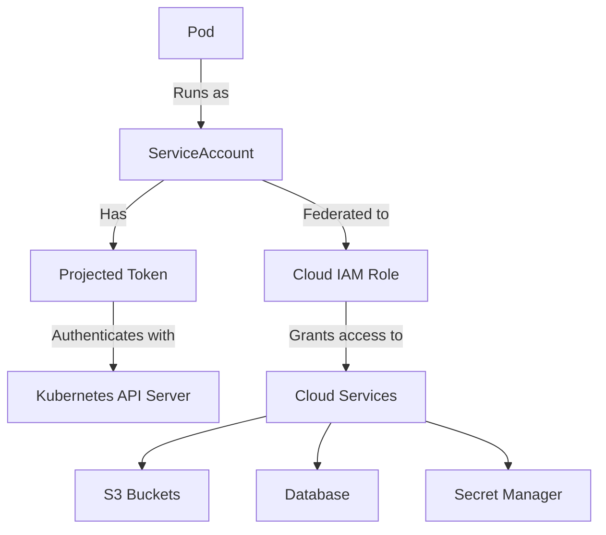
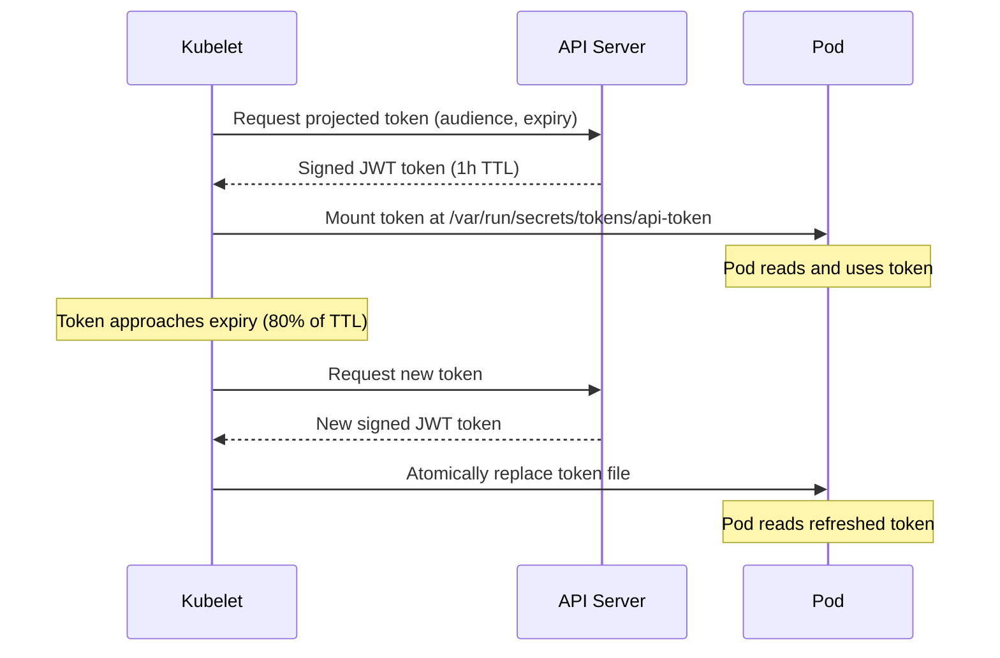

# How to Use Kubernetes Service Accounts and Workload Identity

Author: [nawazdhandala](https://www.github.com/nawazdhandala)

Tags: Kubernetes, Service Accounts, Workload Identity, Security, IAM

Description: Learn how to use Kubernetes service accounts for pod identity, token projection, and workload identity federation with cloud providers.

---

Every pod in Kubernetes runs with a service account. Service accounts provide an identity for processes running in pods, allowing them to authenticate with the Kubernetes API and, through workload identity federation, with external cloud services. Understanding service accounts is essential for securing your workloads and eliminating hard-coded credentials.

## What Is a Service Account?

A service account is a Kubernetes resource that provides an identity for pods. Unlike user accounts (which are for humans), service accounts are for machines and applications.



## Creating a Service Account

```yaml
# service-account.yaml
# A dedicated service account for a web application.
# Always create specific service accounts instead of using "default".
apiVersion: v1
kind: ServiceAccount
metadata:
  name: web-app
  namespace: production
  labels:
    app: web-app
    team: backend
  annotations:
    # Description for documentation
    description: "Service account for the web application pods"
```

```bash
# Create the service account
kubectl apply -f service-account.yaml

# List service accounts in a namespace
kubectl get serviceaccounts -n production

# View service account details
kubectl describe serviceaccount web-app -n production
```

## Using a Service Account in a Pod

Assign a service account to a pod in the pod spec.

```yaml
# pod-with-sa.yaml
# This pod runs with the "web-app" service account.
apiVersion: v1
kind: Pod
metadata:
  name: web-app-pod
  namespace: production
spec:
  # Assign the service account
  serviceAccountName: web-app
  # Disable auto-mounting the token if the pod does not need API access
  # automountServiceAccountToken: false
  containers:
    - name: web
      image: myapp:2.1.0
      ports:
        - containerPort: 8080
```

## Disabling Token Auto-Mounting

By default, Kubernetes mounts a service account token into every pod. If your pod does not need to talk to the Kubernetes API, disable this to reduce your attack surface.

```yaml
# sa-no-automount.yaml
# This service account disables automatic token mounting.
# Pods using this SA will not get a Kubernetes API token unless explicitly requested.
apiVersion: v1
kind: ServiceAccount
metadata:
  name: batch-worker
  namespace: production
automountServiceAccountToken: false
```

You can also disable it at the pod level:

```yaml
# pod-no-token.yaml
# Even if the SA allows auto-mount, the pod opts out.
apiVersion: v1
kind: Pod
metadata:
  name: batch-job
  namespace: production
spec:
  serviceAccountName: batch-worker
  automountServiceAccountToken: false
  containers:
    - name: worker
      image: batch-processor:1.0.0
```

## Projected Service Account Tokens

Kubernetes supports projected service account tokens that are time-limited, audience-bound, and automatically rotated. These are more secure than the legacy static tokens.

```yaml
# pod-projected-token.yaml
# This pod mounts a projected token with a 1-hour expiry
# and a specific audience for an external service.
apiVersion: v1
kind: Pod
metadata:
  name: api-client
  namespace: production
spec:
  serviceAccountName: web-app
  containers:
    - name: client
      image: api-client:1.0.0
      volumeMounts:
        - name: token
          mountPath: /var/run/secrets/tokens
          readOnly: true
  volumes:
    - name: token
      projected:
        sources:
          - serviceAccountToken:
              # Token audience - the intended recipient
              audience: "https://api.example.com"
              # Token expiry in seconds (1 hour)
              expirationSeconds: 3600
              # Path within the volume mount
              path: api-token
```

## Token Lifecycle



## Workload Identity on AWS (EKS)

AWS EKS uses IAM Roles for Service Accounts (IRSA) to let pods assume IAM roles without static credentials.

```yaml
# sa-aws-workload-identity.yaml
# This service account is annotated with an IAM role ARN.
# Pods using this SA can access AWS services with that role's permissions.
apiVersion: v1
kind: ServiceAccount
metadata:
  name: s3-reader
  namespace: production
  annotations:
    # The IAM role this service account maps to
    eks.amazonaws.com/role-arn: "arn:aws:iam::123456789012:role/s3-reader-role"
---
# deployment-with-irsa.yaml
apiVersion: apps/v1
kind: Deployment
metadata:
  name: data-processor
  namespace: production
spec:
  replicas: 2
  selector:
    matchLabels:
      app: data-processor
  template:
    metadata:
      labels:
        app: data-processor
    spec:
      # Use the annotated service account
      serviceAccountName: s3-reader
      containers:
        - name: processor
          image: data-processor:3.0.0
          # AWS SDK automatically picks up the projected OIDC token
          # No AWS_ACCESS_KEY_ID or AWS_SECRET_ACCESS_KEY needed
```

## Workload Identity on GCP (GKE)

GKE Workload Identity lets pods act as Google Cloud service accounts.

```yaml
# sa-gcp-workload-identity.yaml
# This Kubernetes SA is linked to a GCP service account.
apiVersion: v1
kind: ServiceAccount
metadata:
  name: gcs-writer
  namespace: production
  annotations:
    # The GCP service account to impersonate
    iam.gke.io/gcp-service-account: "gcs-writer@my-project.iam.gserviceaccount.com"
```

```bash
# Bind the Kubernetes SA to the GCP SA
# This creates an IAM policy binding that allows impersonation.
gcloud iam service-accounts add-iam-policy-binding \
  gcs-writer@my-project.iam.gserviceaccount.com \
  --role roles/iam.workloadIdentityUser \
  --member "serviceAccount:my-project.svc.id.goog[production/gcs-writer]"
```

## Workload Identity on Azure (AKS)

AKS uses Azure AD Workload Identity for pod-level authentication.

```yaml
# sa-azure-workload-identity.yaml
# This service account uses Azure AD workload identity.
apiVersion: v1
kind: ServiceAccount
metadata:
  name: blob-reader
  namespace: production
  annotations:
    azure.workload.identity/client-id: "00000000-0000-0000-0000-000000000000"
  labels:
    azure.workload.identity/use: "true"
```

## Security Best Practices

1. **Create dedicated service accounts for each workload.** Never share the default service account across applications.
2. **Disable auto-mounted tokens** for pods that do not call the Kubernetes API.
3. **Use projected tokens** with short expiry times and specific audiences.
4. **Use workload identity** instead of static cloud credentials in environment variables or secrets.
5. **Apply RBAC roles** scoped to the minimum permissions each service account needs.
6. **Audit service account usage** regularly to find overprivileged accounts.

```bash
# Find pods using the default service account
kubectl get pods --all-namespaces -o json | \
  jq -r '.items[] | select(.spec.serviceAccountName=="default" or .spec.serviceAccountName==null) | "\(.metadata.namespace)/\(.metadata.name)"'

# List all service accounts with their annotations
kubectl get serviceaccounts --all-namespaces -o json | \
  jq -r '.items[] | "\(.metadata.namespace)/\(.metadata.name) - \(.metadata.annotations // "none")"'
```

## Monitoring Service Accounts with OneUptime

Compromised service accounts are a common attack vector in Kubernetes. [OneUptime](https://oneuptime.com) helps you monitor Kubernetes audit logs for suspicious service account activity, such as unexpected API calls, privilege escalation attempts, or access from unusual source IPs. Set up alerts for authentication failures and track service account token usage across your cluster to detect anomalies early.
