# Comparing Kubernetes Service Meshes: Istio, Linkerd, and Consul Connect

Author: [nawazdhandala](https://www.github.com/nawazdhandala)

Tags: Service Mesh, Kubernetes, Istio, Linkerd, Consul

Description: A practical comparison of Kubernetes service meshes including Istio, Linkerd, and Consul Connect for different use cases.

---

A service mesh adds observability, security, and traffic management to service-to-service communication without changing application code. But which mesh should you choose? Istio is feature-rich. Linkerd is lightweight. Consul Connect integrates with HashiCorp's ecosystem. Each has trade-offs in complexity, resource usage, and capability.

This guide compares all three with concrete configuration examples so you can make an informed decision.

## Architecture Comparison


## Feature Comparison

| Feature | Istio | Linkerd | Consul Connect |
|---|---|---|---|
| Proxy | Envoy | linkerd2-proxy (Rust) | Envoy |
| mTLS | Yes, auto | Yes, auto | Yes, auto |
| Traffic splitting | Yes | Yes | Yes |
| Circuit breaking | Yes | No (uses retries) | Yes |
| Rate limiting | Yes (external) | No | Yes (via intentions) |
| Multi-cluster | Yes | Yes | Yes |
| Resource overhead | High (~50MB/sidecar) | Low (~10MB/sidecar) | Medium (~30MB/sidecar) |
| Complexity | High | Low | Medium |
| Protocol support | HTTP, gRPC, TCP | HTTP, gRPC, TCP | HTTP, gRPC, TCP |

## Installing Istio

```bash
# install-istio.sh
# Install Istio with the demo profile for evaluation

# Download Istio CLI
curl -L https://istio.io/downloadIstio | sh -
cd istio-*

# Install with the production profile
./bin/istioctl install --set profile=default -y

# Enable automatic sidecar injection in the default namespace
kubectl label namespace default istio-injection=enabled
```

## Istio Traffic Splitting

```yaml
# istio-virtual-service.yaml
# Split traffic between v1 and v2 of a service for canary deployment
apiVersion: networking.istio.io/v1beta1
kind: VirtualService
metadata:
  name: my-service
  namespace: default
spec:
  hosts:
    - my-service
  http:
    - route:
        # Send 90% to v1
        - destination:
            host: my-service
            subset: v1
          weight: 90
        # Send 10% to v2 (canary)
        - destination:
            host: my-service
            subset: v2
          weight: 10
---
# Define the subsets based on pod labels
apiVersion: networking.istio.io/v1beta1
kind: DestinationRule
metadata:
  name: my-service
  namespace: default
spec:
  host: my-service
  subsets:
    - name: v1
      labels:
        version: v1
    - name: v2
      labels:
        version: v2
```

## Istio Circuit Breaker

```yaml
# istio-circuit-breaker.yaml
# Configure circuit breaking to prevent cascading failures
apiVersion: networking.istio.io/v1beta1
kind: DestinationRule
metadata:
  name: my-service
  namespace: default
spec:
  host: my-service
  trafficPolicy:
    connectionPool:
      tcp:
        # Maximum number of TCP connections
        maxConnections: 100
      http:
        # Maximum pending HTTP requests
        h2UpgradePolicy: DEFAULT
        maxPendingRequests: 100
        # Maximum requests per connection
        maxRequestsPerConnection: 10
    outlierDetection:
      # Eject a host after 5 consecutive 5xx errors
      consecutive5xxErrors: 5
      # Check every 30 seconds
      interval: 30s
      # Keep ejected hosts out for 60 seconds
      baseEjectionTime: 60s
      # Allow up to 50% of hosts to be ejected
      maxEjectionPercent: 50
```

## Installing Linkerd

```bash
# install-linkerd.sh
# Install Linkerd with its minimal control plane

# Install the Linkerd CLI
curl -fsL https://run.linkerd.io/install | sh

# Validate the cluster is ready for Linkerd
linkerd check --pre

# Install the control plane
linkerd install --crds | kubectl apply -f -
linkerd install | kubectl apply -f -

# Verify the installation
linkerd check

# Inject sidecars into an existing deployment
kubectl get deployment my-app -o yaml \
  | linkerd inject - \
  | kubectl apply -f -
```

## Linkerd Traffic Splitting

```yaml
# linkerd-traffic-split.yaml
# Split traffic between two services using the SMI spec
apiVersion: split.smi-spec.io/v1alpha2
kind: TrafficSplit
metadata:
  name: my-service-split
  namespace: default
spec:
  # The root service that clients connect to
  service: my-service
  backends:
    # 90% to the stable version
    - service: my-service-v1
      weight: 900
    # 10% to the canary version
    - service: my-service-v2
      weight: 100
```

## Linkerd Service Profiles

```yaml
# linkerd-service-profile.yaml
# Define per-route metrics and retry policies
apiVersion: linkerd.io/v1alpha2
kind: ServiceProfile
metadata:
  name: my-service.default.svc.cluster.local
  namespace: default
spec:
  routes:
    # Track GET /api/users as a named route
    - name: GET /api/users
      condition:
        method: GET
        pathRegex: /api/users
      # Retry on 5xx responses
      isRetryable: true
    # Track POST /api/orders with a longer timeout
    - name: POST /api/orders
      condition:
        method: POST
        pathRegex: /api/orders
      timeout: 10s
```

## Installing Consul Connect

```bash
# install-consul.sh
# Install Consul on Kubernetes using the official Helm chart

helm repo add hashicorp https://helm.releases.hashicorp.com
helm repo update

# Install Consul with Connect (service mesh) enabled
helm install consul hashicorp/consul \
  --namespace consul \
  --create-namespace \
  --set global.name=consul \
  --set connectInject.enabled=true \
  --set connectInject.default=false \
  --set controller.enabled=true \
  --set global.tls.enabled=true
```

## Consul Connect Intentions

```yaml
# consul-intentions.yaml
# Define service-to-service authorization rules
apiVersion: consul.hashicorp.com/v1alpha1
kind: ServiceIntentions
metadata:
  name: my-service
  namespace: default
spec:
  destination:
    name: my-service
  sources:
    # Allow traffic from the frontend service
    - name: frontend
      action: allow
    # Allow traffic from the API gateway
    - name: api-gateway
      action: allow
    # Deny all other traffic by default
    - name: "*"
      action: deny
```

## Resource Usage Comparison


## Decision Flow

```mermaid
graph TD
    A{Primary Need?} --> B[Maximum Features]
    A --> C[Minimum Overhead]
    A --> D[HashiCorp Ecosystem]
    B --> E[Choose Istio]
    C --> F[Choose Linkerd]
    D --> G[Choose Consul Connect]
    E --> H{Need Multi-Cloud?}
    H -->|Yes| I[Istio with multi-cluster]
    H -->|No| J[Istio single cluster]
    F --> K{Need Advanced Traffic Mgmt?}
    K -->|Yes| L[Consider Istio instead]
    K -->|No| M[Linkerd is sufficient]
```



## Observability Comparison

All three meshes provide golden signal metrics out of the box:

```bash
# Check latency percentiles with Linkerd
linkerd stat deploy/my-service

# Query Istio metrics via Prometheus
# istio_request_duration_milliseconds_bucket{destination_service="my-service"}

# Consul Connect exports metrics through Envoy
# envoy_http_downstream_rq_time_bucket{consul_service="my-service"}
```

## When to Use Each

**Choose Istio when:**
- You need advanced traffic management like fault injection, mirroring, or header-based routing.
- Your organization has the engineering capacity to manage its complexity.
- You operate multi-cluster or multi-cloud environments.

**Choose Linkerd when:**
- You want mTLS and observability with minimal resource overhead.
- Your team is small and values simplicity.
- You run latency-sensitive workloads where proxy overhead matters.

**Choose Consul Connect when:**
- You already use Consul for service discovery or Vault for secrets.
- You need to mesh services across Kubernetes and non-Kubernetes environments.
- You want intention-based authorization integrated with the HashiCorp stack.

## Key Takeaways

- All three meshes provide mTLS, traffic splitting, and observability. The differences are in resource usage, complexity, and ecosystem integration.
- Linkerd has the lowest resource overhead and the simplest operational model.
- Istio has the richest feature set but requires the most operational investment.
- Consul Connect is the best choice if you are already in the HashiCorp ecosystem.
- Start with the simplest mesh that meets your requirements and migrate to a more complex one only when needed.

Whichever service mesh you choose, you need visibility into its health and the traffic flowing through it. Use [OneUptime](https://oneuptime.com) to monitor your mesh control plane, track service-to-service latency, and get alerted when mTLS certificates are about to expire or when error rates spike between services.
