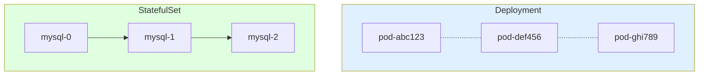
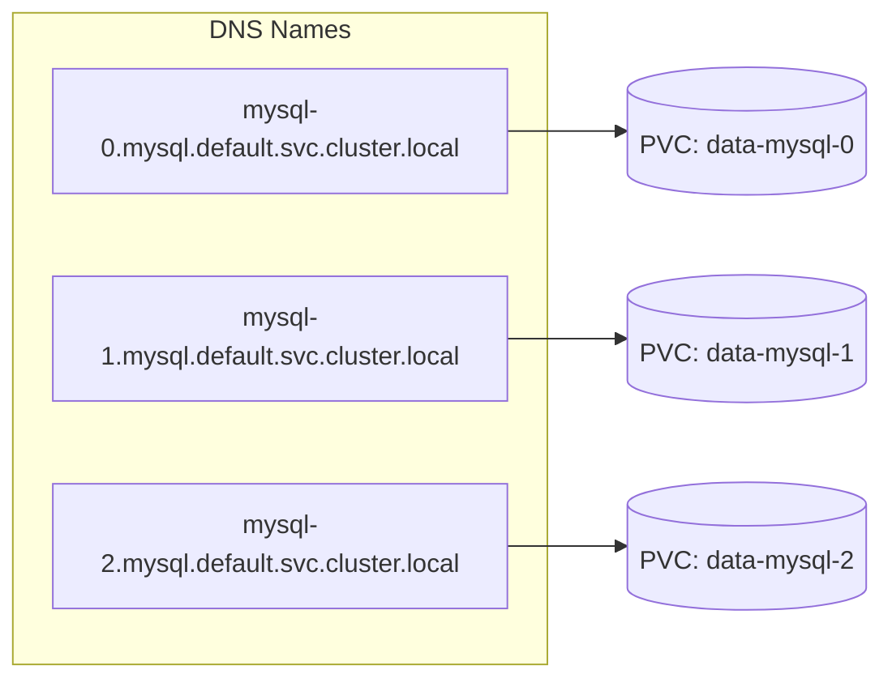
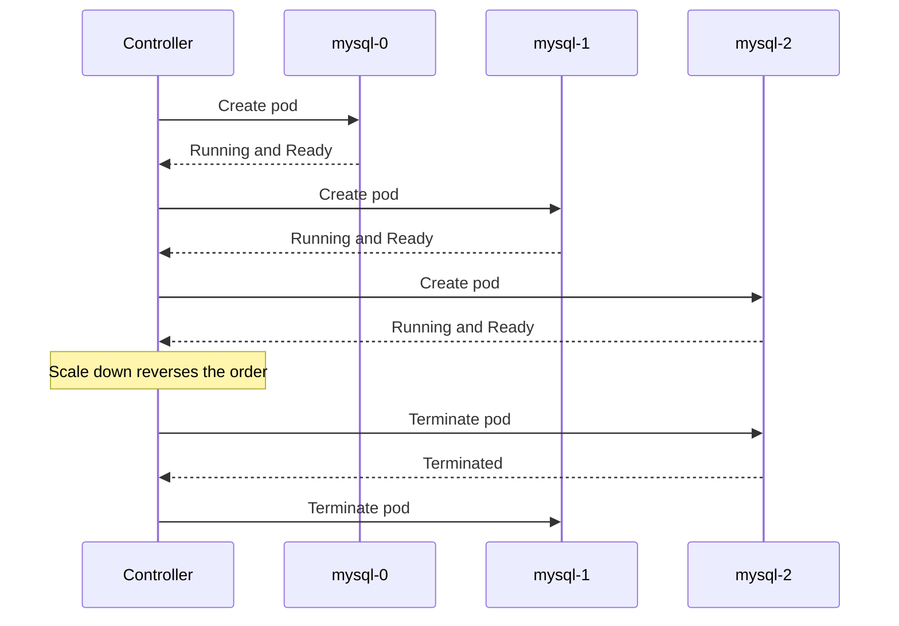
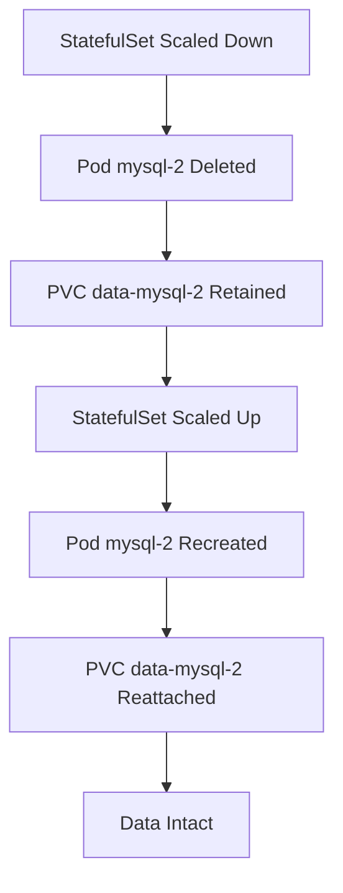

# Understanding Kubernetes StatefulSets for Stateful Applications

Author: [nawazdhandala](https://www.github.com/nawazdhandala)

Tags: Kubernetes, StatefulSets, Stateful, Databases, Workloads

Description: A comprehensive guide to Kubernetes StatefulSets including ordered deployment, stable network identities, and persistent storage.

---

Deployments work well for stateless applications, but databases, message queues, and distributed systems need stable identities and persistent storage. StatefulSets provide these guarantees. This guide covers how StatefulSets work, when to use them, and how to configure them correctly.

## StatefulSets vs Deployments

The key difference is identity. Deployments treat pods as interchangeable. StatefulSets give each pod a stable, unique identity that persists across restarts and rescheduling.



StatefulSets guarantee:

- **Stable network identity**: Each pod gets a predictable hostname like `mysql-0`, `mysql-1`.
- **Ordered deployment and scaling**: Pods are created in order (0, 1, 2) and terminated in reverse.
- **Persistent storage**: Each pod gets its own PersistentVolumeClaim that survives pod restarts.

## Creating a Headless Service

StatefulSets require a headless Service (with `clusterIP: None`) to control the network domain for pod DNS entries.

```yaml
# headless-service.yaml
# A headless service that gives each StatefulSet pod
# a unique DNS name: <pod-name>.<service-name>.<namespace>.svc.cluster.local
apiVersion: v1
kind: Service
metadata:
  name: mysql
  labels:
    app: mysql
spec:
  ports:
    - port: 3306
      name: mysql
  # Headless service - no cluster IP assigned
  clusterIP: None
  selector:
    app: mysql
```

## Basic StatefulSet Configuration

Here is a StatefulSet for a MySQL cluster with persistent storage:

```yaml
# statefulset.yaml
# StatefulSet that runs 3 MySQL replicas with stable
# identities and dedicated persistent volumes.
apiVersion: apps/v1
kind: StatefulSet
metadata:
  name: mysql
spec:
  # Must match the headless service name
  serviceName: "mysql"
  replicas: 3
  selector:
    matchLabels:
      app: mysql
  template:
    metadata:
      labels:
        app: mysql
    spec:
      containers:
        - name: mysql
          image: mysql:8.0
          ports:
            - containerPort: 3306
              name: mysql
          env:
            - name: MYSQL_ROOT_PASSWORD
              valueFrom:
                secretKeyRef:
                  name: mysql-secret
                  key: root-password
          # Mount the persistent volume at the data directory
          volumeMounts:
            - name: data
              mountPath: /var/lib/mysql
  # Each pod gets its own PVC from this template
  volumeClaimTemplates:
    - metadata:
        name: data
      spec:
        accessModes: ["ReadWriteOnce"]
        storageClassName: "standard"
        resources:
          requests:
            storage: 10Gi
```

## Pod DNS and Network Identity

Each pod in a StatefulSet gets a DNS name following this pattern:

```
<pod-name>.<service-name>.<namespace>.svc.cluster.local
```



Your application can connect to a specific replica using its DNS name. This is critical for leader election, replication, and clustering.

```python
# connect_to_primary.py
# Connect to the primary MySQL instance using its stable DNS name.
import mysql.connector

# The primary is always mysql-0
connection = mysql.connector.connect(
    host="mysql-0.mysql.default.svc.cluster.local",
    port=3306,
    user="root",
    password="secret",
    database="myapp"
)

# Use the connection
cursor = connection.cursor()
cursor.execute("SELECT 1")
print(cursor.fetchone())
connection.close()
```

## Ordered Pod Management

By default, StatefulSets create pods sequentially and wait for each pod to be Running and Ready before starting the next one.



You can relax ordering with the `podManagementPolicy` field:

```yaml
# parallel-management.yaml
# Use Parallel pod management when ordering does not matter,
# for example when all replicas are peers.
spec:
  podManagementPolicy: Parallel
```

## Update Strategies

StatefulSets support two update strategies:

### RollingUpdate (Default)

Pods are updated in reverse ordinal order (highest to lowest), one at a time.

```yaml
# rolling-update.yaml
# Update pods one at a time, starting from the highest ordinal.
spec:
  updateStrategy:
    type: RollingUpdate
    rollingUpdate:
      # Only update pods with ordinal >= 2
      # Useful for canary testing on the last replica
      partition: 2
```

### OnDelete

Pods are only updated when you manually delete them. This gives you full control over the update sequence.

```yaml
# on-delete.yaml
# Pods are updated only when manually deleted.
spec:
  updateStrategy:
    type: OnDelete
```

## Persistent Volume Lifecycle

When a StatefulSet pod is deleted or the StatefulSet is scaled down, the associated PersistentVolumeClaims are **not** deleted. This means your data survives scaling events.



To clean up PVCs when scaling down, use the `persistentVolumeClaimRetentionPolicy` field (Kubernetes 1.27+):

```yaml
# pvc-retention.yaml
# Automatically delete PVCs when pods are scaled down
# but retain them when the StatefulSet is deleted.
spec:
  persistentVolumeClaimRetentionPolicy:
    whenScaled: Delete
    whenDeleted: Retain
```

## Health Checks for StatefulSets

Health checks are especially important for stateful workloads. A database that has started its process but has not finished recovery should not receive traffic.

```yaml
# statefulset-probes.yaml
# Readiness and liveness probes for a MySQL StatefulSet.
spec:
  template:
    spec:
      containers:
        - name: mysql
          image: mysql:8.0
          # Readiness: is the database accepting connections?
          readinessProbe:
            exec:
              command:
                - mysqladmin
                - ping
                - -h
                - localhost
            initialDelaySeconds: 30
            periodSeconds: 10
          # Liveness: is the process still alive?
          livenessProbe:
            exec:
              command:
                - mysqladmin
                - ping
                - -h
                - localhost
            initialDelaySeconds: 60
            periodSeconds: 15
            failureThreshold: 5
```

## When to Use StatefulSets

Use StatefulSets when your workload needs:

1. Stable, unique network identifiers (database clusters, ZooKeeper, etcd).
2. Stable, persistent storage (databases, message queues).
3. Ordered, graceful deployment and scaling (primary-replica setups).
4. Ordered, automated rolling updates.

For everything else, prefer Deployments.

## Monitoring Stateful Workloads with OneUptime

Stateful applications are harder to monitor because each replica can have different health. [OneUptime](https://oneuptime.com) helps you monitor individual database replicas, track replication lag, and get alerted when a StatefulSet pod fails to become ready. With OneUptime's dashboards and alerting, you can catch issues with persistent volumes, slow recovery times, and unhealthy replicas before they cause data loss.
