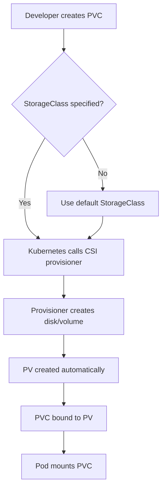
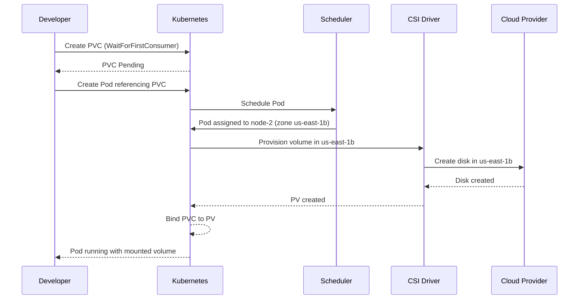

# How to Use Kubernetes StorageClass for Dynamic Volume Provisioning

Author: [nawazdhandala](https://www.github.com/nawazdhandala)

Tags: Kubernetes, StorageClass, Dynamic Provisioning, Storage, CSI

Description: Learn how to use StorageClass for dynamic volume provisioning in Kubernetes with different CSI drivers and reclaim policies.

---

Manually creating Persistent Volumes for every workload does not scale. Kubernetes StorageClass enables dynamic provisioning, where PVs are created automatically when a PVC is submitted. This eliminates the need for administrators to pre-provision storage and lets developers self-serve.

## What Is a StorageClass?

A StorageClass defines a "class" of storage. It specifies which provisioner to use, what parameters to pass, and what reclaim policy to apply. When a PVC references a StorageClass, Kubernetes calls the provisioner to create the backing volume on demand.



## Creating a StorageClass

Here is a StorageClass for AWS EBS using the CSI driver:

```yaml
# storageclass-aws-gp3.yaml
# This StorageClass provisions gp3 EBS volumes in AWS.
# gp3 provides a baseline of 3000 IOPS and 125 MiB/s throughput.
apiVersion: storage.k8s.io/v1
kind: StorageClass
metadata:
  name: gp3-ssd
  annotations:
    # Set as the default StorageClass for the cluster
    storageclass.kubernetes.io/is-default-class: "true"
# The CSI driver responsible for provisioning
provisioner: ebs.csi.aws.com
# Delete the EBS volume when the PVC is deleted
reclaimPolicy: Delete
# Allow resizing volumes after creation
allowVolumeExpansion: true
# WaitForFirstConsumer delays provisioning until a pod is scheduled
volumeBindingMode: WaitForFirstConsumer
parameters:
  # EBS volume type
  type: gp3
  # Encrypt volumes at rest using the default KMS key
  encrypted: "true"
```

## StorageClass for GCP

```yaml
# storageclass-gcp-pd.yaml
# This StorageClass provisions SSD persistent disks in GCP.
apiVersion: storage.k8s.io/v1
kind: StorageClass
metadata:
  name: ssd-persistent
provisioner: pd.csi.storage.gke.io
reclaimPolicy: Delete
allowVolumeExpansion: true
volumeBindingMode: WaitForFirstConsumer
parameters:
  # pd-ssd for SSD, pd-standard for HDD
  type: pd-ssd
  # Replicate across zones for high availability
  replication-type: regional-pd
```

## StorageClass for Local NFS

```yaml
# storageclass-nfs.yaml
# This StorageClass provisions NFS volumes using an NFS CSI driver.
apiVersion: storage.k8s.io/v1
kind: StorageClass
metadata:
  name: nfs-share
provisioner: nfs.csi.k8s.io
reclaimPolicy: Retain
allowVolumeExpansion: false
parameters:
  # NFS server address
  server: nfs-server.internal
  # Base path on the NFS server
  share: /exports/kubernetes
```

## Volume Binding Modes

The `volumeBindingMode` controls when volume binding and provisioning occurs.

| Mode | Behavior |
|------|----------|
| Immediate | Volume is provisioned as soon as the PVC is created |
| WaitForFirstConsumer | Volume provisioning is delayed until a pod using the PVC is scheduled |

`WaitForFirstConsumer` is almost always the right choice. It ensures the volume is created in the same availability zone as the pod, avoiding cross-zone mounting failures.



## Setting a Default StorageClass

Mark a StorageClass as default so PVCs without a `storageClassName` use it automatically.

```bash
# Set gp3-ssd as the default StorageClass
kubectl annotate storageclass gp3-ssd \
  storageclass.kubernetes.io/is-default-class=true

# Remove default from the old StorageClass
kubectl annotate storageclass old-default \
  storageclass.kubernetes.io/is-default-class=false --overwrite

# Verify only one default exists
kubectl get storageclass
```

Only one StorageClass should be marked as default. If multiple are marked default, PVCs without an explicit class will fail.

## Using StorageClass in PVCs

Reference the StorageClass by name in your PVC:

```yaml
# pvc-with-storageclass.yaml
# This PVC requests 20Gi of gp3-ssd storage.
# The CSI driver will dynamically provision an EBS gp3 volume.
apiVersion: v1
kind: PersistentVolumeClaim
metadata:
  name: app-database
  namespace: production
spec:
  # Reference the StorageClass by name
  storageClassName: gp3-ssd
  accessModes:
    - ReadWriteOnce
  resources:
    requests:
      storage: 20Gi
```

To explicitly opt out of dynamic provisioning, set `storageClassName` to an empty string:

```yaml
# pvc-static-only.yaml
# Setting storageClassName to "" disables dynamic provisioning.
# This PVC will only bind to a manually created PV.
apiVersion: v1
kind: PersistentVolumeClaim
metadata:
  name: legacy-data
spec:
  storageClassName: ""
  accessModes:
    - ReadWriteOnce
  resources:
    requests:
      storage: 10Gi
```

## Multiple StorageClasses for Different Tiers

A common pattern is to define multiple StorageClasses for different performance tiers.

```yaml
# storageclass-standard.yaml
# Standard HDD tier for non-critical workloads
apiVersion: storage.k8s.io/v1
kind: StorageClass
metadata:
  name: standard-hdd
provisioner: ebs.csi.aws.com
reclaimPolicy: Delete
allowVolumeExpansion: true
volumeBindingMode: WaitForFirstConsumer
parameters:
  type: st1
---
# storageclass-performance.yaml
# High-performance tier for databases
apiVersion: storage.k8s.io/v1
kind: StorageClass
metadata:
  name: high-iops
provisioner: ebs.csi.aws.com
reclaimPolicy: Retain
allowVolumeExpansion: true
volumeBindingMode: WaitForFirstConsumer
parameters:
  type: io2
  iopsPerGB: "50"
```

## Reclaim Policy Deep Dive

The reclaim policy on a StorageClass determines what happens to the dynamically provisioned PV when its PVC is deleted.

- **Delete** - The PV and backing storage are deleted. Use for ephemeral or reproducible data.
- **Retain** - The PV is kept and must be manually cleaned up. Use for production databases.

You can change the reclaim policy of an existing PV:

```bash
# Change a PV's reclaim policy from Delete to Retain
# This protects the volume from accidental deletion
kubectl patch pv pvc-abc123 \
  -p '{"spec":{"persistentVolumeReclaimPolicy":"Retain"}}'
```

## Debugging Dynamic Provisioning

```bash
# List all StorageClasses
kubectl get storageclass

# Check if the CSI driver pods are running
kubectl get pods -n kube-system | grep csi

# Check PVC events for provisioning errors
kubectl describe pvc app-database -n production

# Check CSI driver logs for errors
kubectl logs -n kube-system -l app=ebs-csi-controller -c csi-provisioner
```

Common issues:

- **PVC stuck in Pending** - The CSI driver may not be installed, or IAM permissions may be missing.
- **Volume created in wrong zone** - Use `WaitForFirstConsumer` binding mode.
- **Quota exceeded** - Check cloud provider disk quotas.

## Monitoring Dynamic Provisioning with OneUptime

Dynamic provisioning failures can silently block deployments. Pods wait indefinitely for storage that never gets created. [OneUptime](https://oneuptime.com) monitors your Kubernetes cluster and alerts you when PVCs are stuck in Pending state, CSI driver pods are unhealthy, or provisioning errors appear in cluster events. Set up dashboards to track storage consumption across all your StorageClasses.
