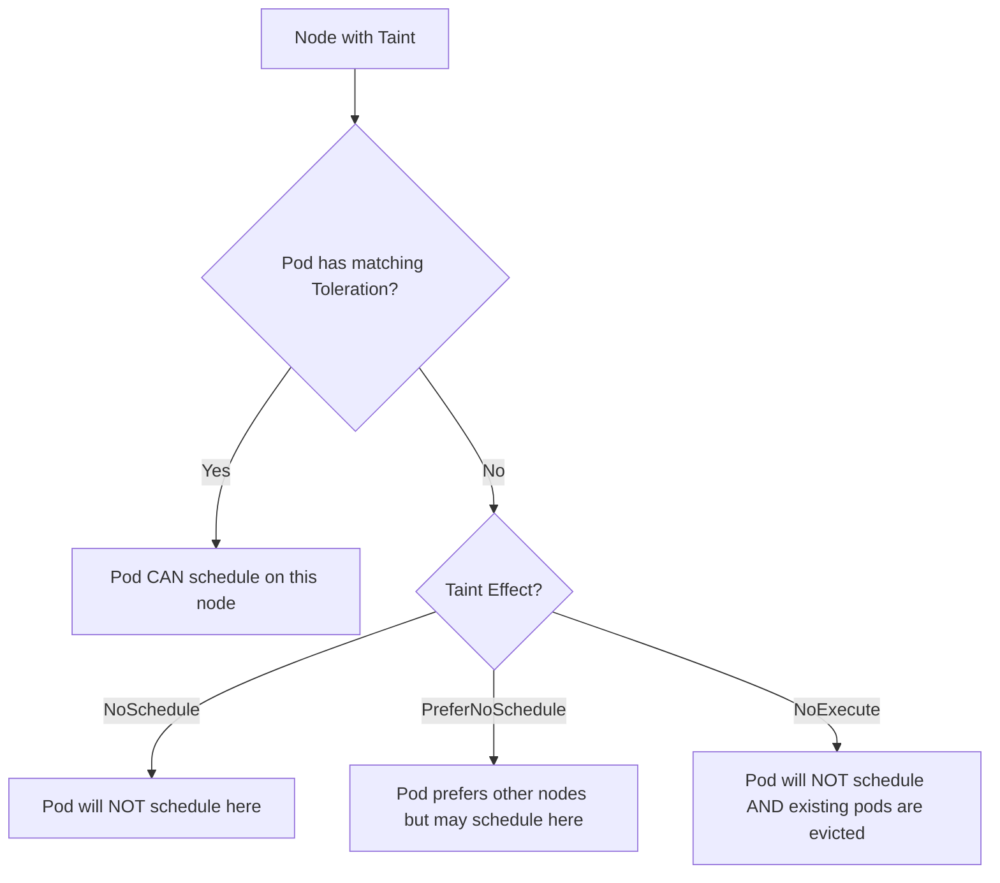
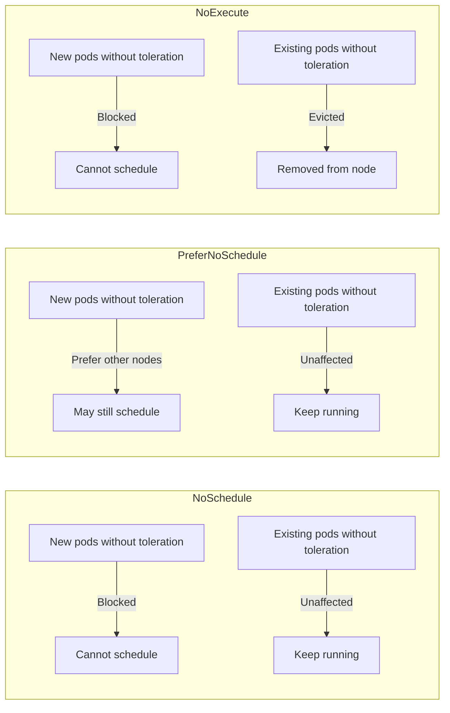

# How to Use Kubernetes Taints and Tolerations for Workload Isolation

Author: [nawazdhandala](https://www.github.com/nawazdhandala)

Tags: Kubernetes, Taints, Tolerations, Scheduling, Isolation

Description: Learn how to use taints and tolerations to isolate workloads, dedicate nodes, and control pod scheduling in Kubernetes.

---

Taints and tolerations work like an inverse of node affinity. While node affinity attracts pods to specific nodes, taints repel pods from nodes. A taint on a node prevents pods from scheduling there unless the pod has a matching toleration. This mechanism is powerful for dedicating nodes to specific workloads, isolating noisy neighbors, and handling node conditions. This post shows you how to use them.

## How Taints and Tolerations Work



A taint has three parts:
- **Key** - A label key (e.g., `dedicated`)
- **Value** - A label value (e.g., `gpu`)
- **Effect** - What happens to non-tolerating pods (`NoSchedule`, `PreferNoSchedule`, `NoExecute`)

## Step 1: Apply Taints to Nodes

```bash
# Taint a node so only GPU workloads can schedule on it
kubectl taint nodes gpu-node-1 dedicated=gpu:NoSchedule
kubectl taint nodes gpu-node-2 dedicated=gpu:NoSchedule

# Taint nodes for a specific team
kubectl taint nodes team-a-node-1 team=data-science:NoSchedule
kubectl taint nodes team-a-node-2 team=data-science:NoSchedule

# Soft taint - pods prefer other nodes but CAN schedule here if needed
kubectl taint nodes expensive-node-1 cost=high:PreferNoSchedule

# Taint for maintenance - also evicts already running pods
kubectl taint nodes worker-3 maintenance=true:NoExecute

# Verify taints on a node
kubectl describe node gpu-node-1 | grep -A 5 Taints

# Remove a taint (add a minus at the end)
kubectl taint nodes worker-3 maintenance=true:NoExecute-
```

## Step 2: Add Tolerations to Pods

For a pod to schedule on a tainted node, it must have a matching toleration.

```yaml
# gpu-pod.yaml
# Pod that tolerates the GPU node taint and can schedule there
apiVersion: v1
kind: Pod
metadata:
  name: ml-training-job
spec:
  tolerations:
    # Tolerate the GPU node taint
    - key: "dedicated"
      operator: "Equal"
      value: "gpu"
      effect: "NoSchedule"
  # Also use node affinity to prefer GPU nodes
  affinity:
    nodeAffinity:
      requiredDuringSchedulingIgnoredDuringExecution:
        nodeSelectorTerms:
          - matchExpressions:
              - key: workload-type
                operator: In
                values:
                  - gpu
  containers:
    - name: training
      image: your-registry/ml-training:latest
      resources:
        requests:
          cpu: "4000m"
          memory: "16Gi"
          nvidia.com/gpu: "1"  # Request one GPU
```

Important: A toleration allows a pod to schedule on a tainted node, but it does not force it there. You typically combine tolerations with node affinity to ensure the pod goes to the right node.

## Taint Effects Compared



## Step 3: Toleration Operators

There are two operators: `Equal` and `Exists`.

```yaml
# toleration-operators.yaml
# Demonstrating different toleration operators
apiVersion: v1
kind: Pod
metadata:
  name: toleration-demo
spec:
  tolerations:
    # Equal operator - matches exact key, value, and effect
    - key: "dedicated"
      operator: "Equal"
      value: "gpu"
      effect: "NoSchedule"

    # Exists operator - matches any taint with this key (any value)
    - key: "team"
      operator: "Exists"
      effect: "NoSchedule"

    # Exists with no key - tolerates ALL taints (use with caution)
    # This is how DaemonSets often work
    # - operator: "Exists"

    # Tolerate NoExecute with a time limit
    # Pod will stay for 300 seconds after the taint is applied, then evicted
    - key: "node.kubernetes.io/not-ready"
      operator: "Exists"
      effect: "NoExecute"
      tolerationSeconds: 300
  containers:
    - name: app
      image: nginx:1.27
```

## Step 4: Dedicate Nodes to a Team

A common pattern is dedicating a pool of nodes to a specific team.

```bash
# Label and taint nodes for the data team
kubectl label nodes data-node-1 data-node-2 team=data
kubectl taint nodes data-node-1 data-node-2 team=data:NoSchedule
```

```yaml
# data-team-deployment.yaml
# Deployment that runs exclusively on data team nodes
apiVersion: apps/v1
kind: Deployment
metadata:
  name: data-pipeline
  namespace: data-team
spec:
  replicas: 3
  selector:
    matchLabels:
      app: data-pipeline
  template:
    metadata:
      labels:
        app: data-pipeline
    spec:
      # Tolerate the team taint
      tolerations:
        - key: "team"
          operator: "Equal"
          value: "data"
          effect: "NoSchedule"
      # Force scheduling on data team nodes
      nodeSelector:
        team: data
      containers:
        - name: pipeline
          image: your-registry/data-pipeline:latest
          resources:
            requests:
              cpu: "2000m"
              memory: "4Gi"
```

## Step 5: Handle Node Conditions

Kubernetes automatically taints nodes with certain conditions. Understanding these helps you control pod behavior during node issues.

```yaml
# node-condition-tolerations.yaml
# Pod with tolerations for common node conditions
apiVersion: apps/v1
kind: Deployment
metadata:
  name: resilient-app
spec:
  replicas: 3
  selector:
    matchLabels:
      app: resilient-app
  template:
    metadata:
      labels:
        app: resilient-app
    spec:
      tolerations:
        # Tolerate node being unreachable for 60 seconds before eviction
        - key: "node.kubernetes.io/unreachable"
          operator: "Exists"
          effect: "NoExecute"
          tolerationSeconds: 60
        # Tolerate node not-ready for 60 seconds before eviction
        - key: "node.kubernetes.io/not-ready"
          operator: "Exists"
          effect: "NoExecute"
          tolerationSeconds: 60
        # Tolerate memory pressure on node (pod will not be evicted)
        - key: "node.kubernetes.io/memory-pressure"
          operator: "Exists"
          effect: "NoSchedule"
        # Tolerate disk pressure on node
        - key: "node.kubernetes.io/disk-pressure"
          operator: "Exists"
          effect: "NoSchedule"
      containers:
        - name: app
          image: your-registry/app:latest
          resources:
            requests:
              cpu: "200m"
              memory: "256Mi"
```

## Step 6: DaemonSet Tolerations

DaemonSets often need to run on every node, including tainted ones. Add broad tolerations.

```yaml
# daemonset-logging.yaml
# Logging agent DaemonSet that runs on ALL nodes including tainted ones
apiVersion: apps/v1
kind: DaemonSet
metadata:
  name: log-collector
  namespace: monitoring
spec:
  selector:
    matchLabels:
      app: log-collector
  template:
    metadata:
      labels:
        app: log-collector
    spec:
      tolerations:
        # Tolerate all taints so this runs on every node
        - operator: "Exists"
      containers:
        - name: collector
          image: fluent/fluent-bit:latest
          resources:
            requests:
              cpu: "50m"
              memory: "64Mi"
            limits:
              cpu: "200m"
              memory: "256Mi"
          volumeMounts:
            - name: varlog
              mountPath: /var/log
              readOnly: true
      volumes:
        - name: varlog
          hostPath:
            path: /var/log
```

## Debugging Taints and Tolerations

```bash
# List all taints on all nodes
kubectl get nodes -o custom-columns=NAME:.metadata.name,TAINTS:.spec.taints

# Check a specific node's taints
kubectl describe node gpu-node-1 | grep -A 10 Taints

# Check a pod's tolerations
kubectl get pod ml-training-job -o jsonpath='{.spec.tolerations}' | jq .

# Find pods that were evicted due to taints
kubectl get events --field-selector reason=TaintManagerEviction

# Check pending pods and their scheduling failures
kubectl get pods --field-selector=status.phase=Pending
kubectl describe pod <pending-pod> | grep -A 5 Events
```

## Summary

Taints and tolerations give you a powerful mechanism for workload isolation in Kubernetes. Use them to dedicate nodes to specific teams, isolate GPU or high-memory workloads, handle maintenance gracefully, and control pod behavior during node failures. Combined with node affinity, they form a complete node-level scheduling strategy.

To monitor your node health, track taint changes, and get alerted when pods are unexpectedly evicted, try [OneUptime](https://oneuptime.com). OneUptime provides infrastructure monitoring and incident management that helps you keep your Kubernetes clusters healthy and your workloads properly isolated.
