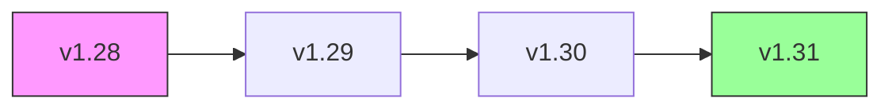
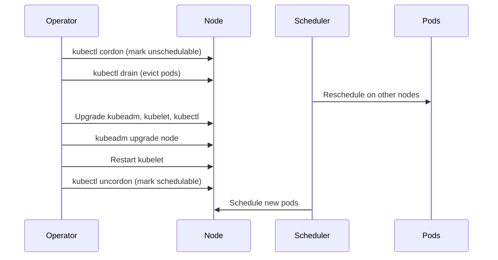

# How to Safely Upgrade Kubernetes Clusters

Author: [nawazdhandala](https://www.github.com/nawazdhandala)

Tags: Kubernetes, Upgrade, Cluster Management, Best Practices, Operations

Description: A practical guide to safely upgrading Kubernetes clusters including pre-upgrade checks, rolling upgrades, and rollback plans.

---

Kubernetes releases a new minor version roughly every four months. Each version drops support for deprecated APIs, changes default behaviors, and introduces new features. Skipping upgrades leads to painful multi-version jumps. Rushing upgrades leads to outages. The safe path is a methodical, tested, one-version-at-a-time upgrade.

This guide covers the full upgrade lifecycle from planning through validation.

## Upgrade Path



Kubernetes only supports upgrading one minor version at a time. Jumping from v1.28 to v1.31 directly is not supported. Plan each hop as a separate upgrade cycle.

## Pre-Upgrade Checklist

```bash
# pre-upgrade-checks.sh
# Run these checks before starting any upgrade

# 1. Check current cluster version
echo "=== Current Version ==="
kubectl version --short

# 2. Verify all nodes are Ready
echo "=== Node Status ==="
kubectl get nodes -o wide

# 3. Check for deprecated API usage in the target version
# Install pluto (https://github.com/FairwindsOps/pluto)
echo "=== Deprecated APIs ==="
pluto detect-all-in-cluster --target-versions k8s=v1.30

# 4. Check for PodDisruptionBudgets that might block draining
echo "=== PodDisruptionBudgets ==="
kubectl get pdb --all-namespaces

# 5. Verify etcd health
echo "=== etcd Health ==="
ETCDCTL_API=3 etcdctl endpoint health \
  --endpoints=https://127.0.0.1:2379 \
  --cacert=/etc/kubernetes/pki/etcd/ca.crt \
  --cert=/etc/kubernetes/pki/etcd/server.crt \
  --key=/etc/kubernetes/pki/etcd/server.key

# 6. Take an etcd backup before anything else
echo "=== Taking etcd Backup ==="
ETCDCTL_API=3 etcdctl snapshot save /tmp/pre-upgrade-backup.db \
  --endpoints=https://127.0.0.1:2379 \
  --cacert=/etc/kubernetes/pki/etcd/ca.crt \
  --cert=/etc/kubernetes/pki/etcd/server.crt \
  --key=/etc/kubernetes/pki/etcd/server.key
```

## Deprecated API Detection Script

```python
# check_deprecated_apis.py
# Scans all resources in the cluster for deprecated API versions
# Reports which resources need migration before upgrading

import subprocess
import json
import sys

# APIs deprecated in Kubernetes v1.30
# Maps old API group/version to the replacement
DEPRECATED_APIS = {
    "flowcontrol.apiserver.k8s.io/v1beta3": "flowcontrol.apiserver.k8s.io/v1",
    "autoscaling/v2beta2": "autoscaling/v2",
    "batch/v1beta1": "batch/v1",
}


def get_api_resources():
    """Fetch all API resources available in the cluster."""
    result = subprocess.run(
        ["kubectl", "api-resources", "-o", "wide", "--no-headers"],
        capture_output=True,
        text=True,
    )
    return result.stdout.strip().split("\n")


def check_for_deprecated_usage():
    """Scan for resources using deprecated API versions."""
    issues = []

    for api_version, replacement in DEPRECATED_APIS.items():
        # Try to list resources using the deprecated API version
        result = subprocess.run(
            [
                "kubectl",
                "get",
                "--raw",
                f"/apis/{api_version}",
            ],
            capture_output=True,
            text=True,
        )

        if result.returncode == 0:
            data = json.loads(result.stdout)
            resources = data.get("resources", [])
            for resource in resources:
                name = resource.get("name", "")
                # Skip sub-resources like status
                if "/" in name:
                    continue
                issues.append(
                    {
                        "api_version": api_version,
                        "resource": name,
                        "replacement": replacement,
                    }
                )

    return issues


def main():
    issues = check_for_deprecated_usage()

    if not issues:
        print("No deprecated API usage detected. Safe to upgrade.")
        sys.exit(0)

    print("Deprecated API usage found:")
    for issue in issues:
        print(
            f"  - {issue['resource']} using {issue['api_version']} "
            f"-> migrate to {issue['replacement']}"
        )
    sys.exit(1)


if __name__ == "__main__":
    main()
```

## Upgrading Control Plane Nodes (kubeadm)

```bash
# upgrade-control-plane.sh
# Upgrade the first control plane node

# Step 1: Update the kubeadm package
sudo apt-get update
sudo apt-get install -y kubeadm=1.30.0-00

# Step 2: Verify the upgrade plan
sudo kubeadm upgrade plan

# Step 3: Apply the upgrade to the first control plane node
sudo kubeadm upgrade apply v1.30.0

# Step 4: Upgrade kubelet and kubectl
sudo apt-get install -y kubelet=1.30.0-00 kubectl=1.30.0-00

# Step 5: Restart kubelet
sudo systemctl daemon-reload
sudo systemctl restart kubelet

# Step 6: Verify the node version
kubectl get nodes
```

## Upgrading Worker Nodes



```bash
# upgrade-worker.sh
# Upgrade a single worker node with graceful pod migration
# Usage: ./upgrade-worker.sh <node-name>

NODE_NAME=$1

if [ -z "$NODE_NAME" ]; then
  echo "Usage: ./upgrade-worker.sh <node-name>"
  exit 1
fi

echo "=== Cordoning ${NODE_NAME} ==="
# Prevent new pods from being scheduled on this node
kubectl cordon "${NODE_NAME}"

echo "=== Draining ${NODE_NAME} ==="
# Evict all pods, respecting PodDisruptionBudgets
# Timeout after 5 minutes per pod
kubectl drain "${NODE_NAME}" \
  --ignore-daemonsets \
  --delete-emptydir-data \
  --timeout=300s

echo "=== Upgrading packages on ${NODE_NAME} ==="
# SSH to the node and upgrade packages
ssh "${NODE_NAME}" << 'EOF'
  sudo apt-get update
  sudo apt-get install -y kubeadm=1.30.0-00
  sudo kubeadm upgrade node
  sudo apt-get install -y kubelet=1.30.0-00
  sudo systemctl daemon-reload
  sudo systemctl restart kubelet
EOF

echo "=== Uncordoning ${NODE_NAME} ==="
# Allow pods to be scheduled on this node again
kubectl uncordon "${NODE_NAME}"

echo "=== Verifying ${NODE_NAME} ==="
kubectl get node "${NODE_NAME}"
```

## Post-Upgrade Validation

```bash
# post-upgrade-checks.sh
# Validate the cluster after upgrading all nodes

# 1. All nodes should show the new version and Ready status
echo "=== Node Versions ==="
kubectl get nodes -o wide

# 2. All system pods should be running
echo "=== System Pods ==="
kubectl get pods -n kube-system

# 3. CoreDNS should be resolving
echo "=== DNS Test ==="
kubectl run dns-test --image=busybox --rm -it --restart=Never -- \
  nslookup kubernetes.default.svc.cluster.local

# 4. Run a smoke test deployment
echo "=== Smoke Test ==="
kubectl create deployment smoke-test --image=nginx --replicas=3
kubectl wait --for=condition=available deployment/smoke-test --timeout=60s
kubectl delete deployment smoke-test

# 5. Verify no pods are in CrashLoopBackOff
echo "=== Unhealthy Pods ==="
kubectl get pods --all-namespaces --field-selector=status.phase!=Running,status.phase!=Succeeded
```

## Upgrade Timeline

```mermaid
gantt
    title Kubernetes Upgrade Timeline
    dateFormat  HH:mm
    section Preparation
    Pre-upgrade checks     :a1, 00:00, 30min
    etcd backup            :a2, after a1, 15min
    section Control Plane
    Upgrade CP node 1      :b1, after a2, 20min
    Upgrade CP node 2      :b2, after b1, 20min
    Upgrade CP node 3      :b3, after b2, 20min
    section Workers
    Upgrade worker 1       :c1, after b3, 15min
    Upgrade worker 2       :c2, after c1, 15min
    Upgrade worker 3       :c3, after c2, 15min
    section Validation
    Post-upgrade checks    :d1, after c3, 20min
```



## Rollback Plan

If the upgrade fails on a control plane node, restore from the etcd backup taken before the upgrade. If it fails on a worker node, the node can be rebuilt and rejoined to the cluster.

Key rollback steps:

1. Restore the etcd snapshot to revert cluster state.
2. Downgrade kubeadm, kubelet, and kubectl to the previous version.
3. Run `kubeadm upgrade apply` with the previous version.
4. Verify all nodes rejoin the cluster successfully.

Never skip the etcd backup. It is your only reliable rollback mechanism for control plane failures.

## Key Takeaways

- Upgrade one minor version at a time. Multi-version jumps are unsupported and risky.
- Scan for deprecated APIs before upgrading. A removed API will break workloads immediately.
- Always take an etcd backup before touching the control plane.
- Drain worker nodes one at a time. Ensure pods reschedule successfully before moving to the next node.
- Run post-upgrade validation including DNS tests, deployment smoke tests, and system pod checks.

Cluster upgrades are the highest-risk operational task in Kubernetes. Use [OneUptime](https://oneuptime.com) to monitor your nodes, pods, and API server health during the upgrade window so you catch failures immediately and can roll back before users are affected.
