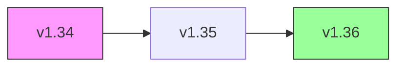
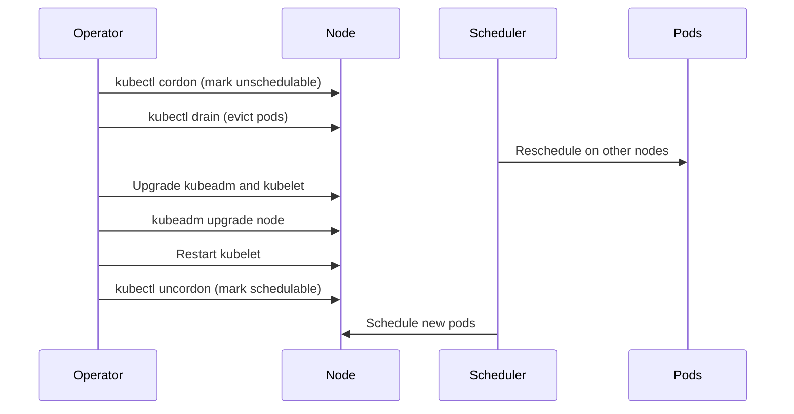

# How to Safely Upgrade Kubernetes Clusters

Author: [nawazdhandala](https://www.github.com/nawazdhandala)

Tags: Kubernetes, Upgrade, Cluster Management, Best Practice, Operation

Description: A practical guide to safely upgrading Kubernetes clusters including pre-upgrade checks, rolling upgrades, and rollback plans.

---

Kubernetes releases a new minor version roughly every four months. Each version drops support for deprecated APIs, changes default behaviors, and introduces new features. Skipping upgrades leads to painful multi-version jumps. Rushing upgrades leads to outages. The safe path is a methodical, tested, one-version-at-a-time upgrade.

This guide covers the full upgrade lifecycle from planning through validation.

## Upgrade Path


```mermaid
graph LR
    A[v1.34] --> B[v1.35]
    B --> C[v1.36]
    style A fill:#f9f,stroke:#333
    style C fill:#9f9,stroke:#333
```

Kubernetes only supports upgrading one minor version at a time. Jumping from v1.34 to v1.36 directly is not supported. Plan each hop as a separate upgrade cycle.

## Pre-Upgrade Checklist

```bash
# pre-upgrade-checks.sh

# Run these checks before starting any upgrade

# 1. Check current cluster version
echo "=== Current Version ==="
kubectl version

# 2. Verify all nodes are Ready
echo "=== Node Status ==="
kubectl get nodes -o wide

# 3. Check for deprecated API usage in the target version
# Install pluto (https://github.com/FairwindsOps/pluto)
echo "=== Deprecated APIs ==="
pluto detect-all-in-cluster --target-versions k8s=v1.35.5

# 4. Check for PodDisruptionBudgets that might block draining
echo "=== PodDisruptionBudgets ==="
kubectl get pdb --all-namespaces

# 5. Verify etcd health
echo "=== etcd Health ==="
ETCDCTL_API=3 etcdctl endpoint health \
  --endpoints=https://127.0.0.1:2379 \
  --cacert=/etc/kubernetes/pki/etcd/ca.crt \
  --cert=/etc/kubernetes/pki/etcd/server.crt \
  --key=/etc/kubernetes/pki/etcd/server.key

# 6. Take an etcd backup before anything else
echo "=== Taking etcd Backup ==="
ETCDCTL_API=3 etcdctl snapshot save /tmp/pre-upgrade-backup.db \
  --endpoints=https://127.0.0.1:2379 \
  --cacert=/etc/kubernetes/pki/etcd/ca.crt \
  --cert=/etc/kubernetes/pki/etcd/server.crt \
  --key=/etc/kubernetes/pki/etcd/server.key
```

## Deprecated API Detection Script

```python
# check_deprecated_apis.py
# Checks API server metrics for recent requests to deprecated API versions
# Reports API versions that are removed by the target Kubernetes version

import subprocess
import re
import sys

TARGET_K8S_VERSION = "1.35"

# Maps old API group/version to the replacement.
REPLACEMENTS = {
    "flowcontrol.apiserver.k8s.io/v1beta2": "flowcontrol.apiserver.k8s.io/v1",
    "autoscaling/v2beta2": "autoscaling/v2",
    "batch/v1beta1": "batch/v1",
}


def parse_minor(version):
    """Parse a Kubernetes minor release like 1.35 or v1.35.1."""
    version = version.lstrip("v")
    major, minor, *_ = version.split(".")
    return int(major), int(minor)


def check_for_deprecated_usage():
    """Check apiserver_requested_deprecated_apis for recent deprecated API use."""
    issues = []
    target = parse_minor(TARGET_K8S_VERSION)
    result = subprocess.run(
        ["kubectl", "get", "--raw", "/metrics"],
        capture_output=True,
        text=True,
        check=True,
    )

    metric_pattern = re.compile(
        r'apiserver_requested_deprecated_apis\{([^}]*)\}\s+([0-9.eE+-]+)'
    )
    label_pattern = re.compile(r'(\w+)="([^"]*)"')

    for labels_raw, value in metric_pattern.findall(result.stdout):
        if float(value) <= 0:
            continue

        labels = dict(label_pattern.findall(labels_raw))
        removed_release = labels.get("removed_release")
        if not removed_release or parse_minor(removed_release) > target:
            continue

        group = labels.get("group", "")
        version = labels.get("version", "")
        api_version = f"{group}/{version}" if group else version
        issues.append(
            {
                "api_version": api_version,
                "resource": labels.get("resource", "<unknown>"),
                "removed_release": removed_release,
                "replacement": REPLACEMENTS.get(api_version, "check the migration guide"),
            }
        )

    return issues


def main():
    issues = check_for_deprecated_usage()

    if not issues:
        print("No deprecated API usage detected. Safe to upgrade.")
        sys.exit(0)

    print("Deprecated API usage found:")
    for issue in issues:
        print(
            f"  - {issue['resource']} using {issue['api_version']} "
            f"(removed in {issue['removed_release']}) "
            f"-> migrate to {issue['replacement']}"
        )
    sys.exit(1)


if __name__ == "__main__":
    main()
```

## Upgrading Control Plane Nodes (kubeadm)

```bash
# upgrade-control-plane.sh
# Upgrade the first control plane node

# Step 1: Update the kubeadm package
# Ensure /etc/apt/sources.list.d/kubernetes.list points to the v1.35 pkgs.k8s.io repository first.
sudo apt-mark unhold kubeadm
sudo apt-get update
sudo apt-get install -y kubeadm='1.35.5-*'
sudo apt-mark hold kubeadm

# Step 2: Verify the upgrade plan
sudo kubeadm upgrade plan

# Step 3: Apply the upgrade to the first control plane node
sudo kubeadm upgrade apply v1.35.5

# Step 4: Drain the node before upgrading kubelet
kubectl drain "$(hostname)" --ignore-daemonsets

# Step 5: Upgrade kubelet and kubectl
sudo apt-mark unhold kubelet kubectl
sudo apt-get update
sudo apt-get install -y kubelet='1.35.5-*' kubectl='1.35.5-*'
sudo apt-mark hold kubelet kubectl

# Step 6: Restart kubelet
sudo systemctl daemon-reload
sudo systemctl restart kubelet

# Step 7: Uncordon and verify the node version
kubectl uncordon "$(hostname)"
kubectl get nodes
```

## Upgrading Worker Nodes


```mermaid
sequenceDiagram
    participant Operator
    participant Node
    participant Scheduler
    participant Pods

    Operator->>Node: kubectl cordon (mark unschedulable)
    Operator->>Node: kubectl drain (evict pods)
    Scheduler->>Pods: Reschedule on other nodes
    Operator->>Node: Upgrade kubeadm and kubelet
    Operator->>Node: kubeadm upgrade node
    Operator->>Node: Restart kubelet
    Operator->>Node: kubectl uncordon (mark schedulable)
    Scheduler->>Node: Schedule new pods
```

```bash
# upgrade-worker.sh
# Upgrade a single worker node with graceful pod migration
# Usage: ./upgrade-worker.sh <node-name>

NODE_NAME=$1

if [ -z "$NODE_NAME" ]; then
  echo "Usage: ./upgrade-worker.sh <node-name>"
  exit 1
fi

echo "=== Cordoning ${NODE_NAME} ==="
# Prevent new pods from being scheduled on this node
kubectl cordon "${NODE_NAME}"

echo "=== Draining ${NODE_NAME} ==="
# Evict all pods, respecting PodDisruptionBudgets
# Timeout after 5 minutes per pod
kubectl drain "${NODE_NAME}" \
  --ignore-daemonsets \
  --delete-emptydir-data \
  --timeout=300s

echo "=== Upgrading packages on ${NODE_NAME} ==="
# SSH to the node and upgrade packages
ssh "${NODE_NAME}" << 'EOF'
  sudo apt-get update
  sudo apt-mark unhold kubeadm
  sudo apt-get install -y kubeadm='1.35.5-*'
  sudo apt-mark hold kubeadm
  sudo kubeadm upgrade node
  sudo apt-mark unhold kubelet
  sudo apt-get install -y kubelet='1.35.5-*'
  sudo apt-mark hold kubelet
  sudo systemctl daemon-reload
  sudo systemctl restart kubelet
EOF

echo "=== Uncordoning ${NODE_NAME} ==="
# Allow pods to be scheduled on this node again
kubectl uncordon "${NODE_NAME}"

echo "=== Verifying ${NODE_NAME} ==="
kubectl get node "${NODE_NAME}"
```

## Post-Upgrade Validation

```bash
# post-upgrade-checks.sh
# Validate the cluster after upgrading all nodes

# 1. All nodes should show the new version and Ready status
echo "=== Node Versions ==="
kubectl get nodes -o wide

# 2. All system pods should be running
echo "=== System Pods ==="
kubectl get pods -n kube-system

# 3. CoreDNS should be resolving
echo "=== DNS Test ==="
kubectl run dns-test --image=busybox --rm -it --restart=Never -- \
  nslookup kubernetes.default.svc.cluster.local

# 4. Run a smoke test deployment
echo "=== Smoke Test ==="
kubectl create deployment smoke-test --image=nginx --replicas=3
kubectl wait --for=condition=available deployment/smoke-test --timeout=60s
kubectl delete deployment smoke-test

# 5. Verify no pods are in CrashLoopBackOff
echo "=== Unhealthy Pods ==="
kubectl get pods --all-namespaces --field-selector=status.phase!=Running,status.phase!=Succeeded
```

## Upgrade Timeline


```mermaid
gantt
    title Kubernetes Upgrade Timeline
    dateFormat  HH:mm
    section Preparation
    Pre-upgrade checks     :a1, 00:00, 30min
    etcd backup            :a2, after a1, 15min
    section Control Plane
    Upgrade CP node 1      :b1, after a2, 20min
    Upgrade CP node 2      :b2, after b1, 20min
    Upgrade CP node 3      :b3, after b2, 20min
    section Workers
    Upgrade worker 1       :c1, after b3, 15min
    Upgrade worker 2       :c2, after c1, 15min
    Upgrade worker 3       :c3, after c2, 15min
    section Validation
    Post-upgrade checks    :d1, after c3, 20min
```

## Rollback Plan

If the upgrade fails on a control plane node, restore from the etcd backup taken before the upgrade. If it fails on a worker node, the node can be rebuilt and rejoined to the cluster.

Key rollback steps:

1. Restore the etcd snapshot to revert cluster state.
2. Restore the previous static Pod manifests and component configuration from backup.
3. Reinstall the previous kubeadm, kubelet, and kubectl package versions if the node packages were already upgraded.
4. Verify all nodes rejoin the cluster successfully.

Never skip the etcd backup. It is the critical rollback mechanism for restoring control plane state after a failed upgrade.

## Key Takeaways

- Upgrade one minor version at a time. Multi-version jumps are unsupported and risky.
- Scan for deprecated APIs before upgrading. A removed API will break workloads immediately.
- Always take an etcd backup before touching the control plane.
- Drain worker nodes one at a time. Ensure pods reschedule successfully before moving to the next node.
- Run post-upgrade validation including DNS tests, deployment smoke tests, and system pod checks.

Cluster upgrades are the highest-risk operational task in Kubernetes. Use [OneUptime](https://oneuptime.com) to monitor your nodes, pods, and API server health during the upgrade window so you catch failures immediately and can roll back before users are affected.
