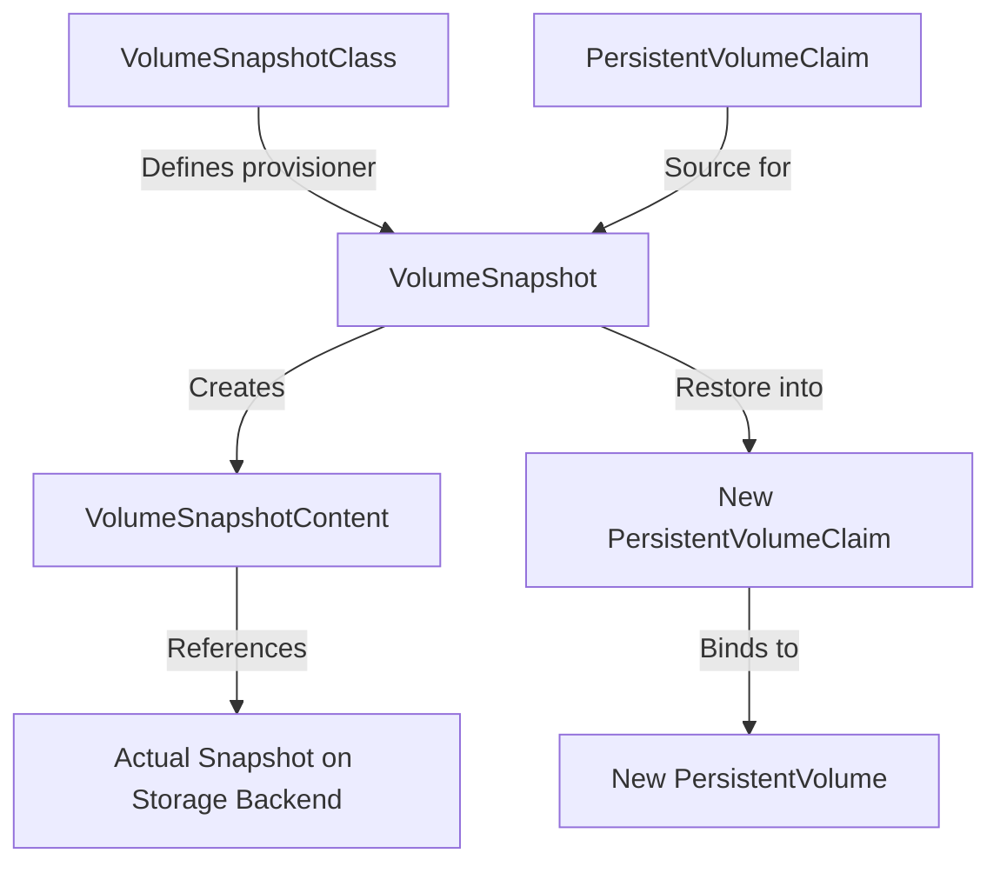
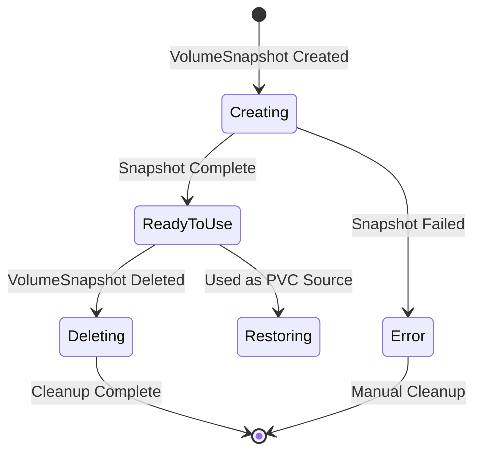

# How to Create and Restore Volume Snapshots in Kubernetes

Author: [nawazdhandala](https://www.github.com/nawazdhandala)

Tags: Kubernetes, Volume Snapshots, Storage, Backup, CSI

Description: Learn how to use Kubernetes VolumeSnapshot and VolumeSnapshotContent resources to create and restore persistent volume snapshots.

---

Backups are essential for stateful workloads. Kubernetes provides a native snapshot API that lets you create point-in-time copies of persistent volumes and restore them when needed. This works through the CSI snapshot controller and requires a CSI driver that supports snapshotting.

## Snapshot Architecture

The Kubernetes snapshot system has three main resources that mirror the PV/PVC model.



| Resource | Role |
|----------|------|
| VolumeSnapshotClass | Defines the CSI driver and deletion policy for snapshots |
| VolumeSnapshot | A user request to snapshot a specific PVC |
| VolumeSnapshotContent | The actual snapshot object bound to a VolumeSnapshot |

## Prerequisites

Before using volume snapshots, you need:

1. A CSI driver that supports snapshots (e.g., EBS CSI, GCE PD CSI, Ceph CSI).
2. The snapshot controller installed in your cluster.
3. The snapshot CRDs registered.

```bash
# Install the snapshot CRDs (if not already present)
kubectl apply -f https://raw.githubusercontent.com/kubernetes-csi/external-snapshotter/v8.0.0/client/config/crd/snapshot.storage.k8s.io_volumesnapshotclasses.yaml
kubectl apply -f https://raw.githubusercontent.com/kubernetes-csi/external-snapshotter/v8.0.0/client/config/crd/snapshot.storage.k8s.io_volumesnapshotcontents.yaml
kubectl apply -f https://raw.githubusercontent.com/kubernetes-csi/external-snapshotter/v8.0.0/client/config/crd/snapshot.storage.k8s.io_volumesnapshots.yaml

# Install the snapshot controller
kubectl apply -f https://raw.githubusercontent.com/kubernetes-csi/external-snapshotter/v8.0.0/deploy/kubernetes/snapshot-controller/rbac-snapshot-controller.yaml
kubectl apply -f https://raw.githubusercontent.com/kubernetes-csi/external-snapshotter/v8.0.0/deploy/kubernetes/snapshot-controller/setup-snapshot-controller.yaml

# Verify the controller is running
kubectl get pods -n kube-system | grep snapshot-controller
```

## Creating a VolumeSnapshotClass

A VolumeSnapshotClass defines the CSI driver and deletion policy for snapshots.

```yaml
# volumesnapshotclass.yaml
# This class uses the AWS EBS CSI driver for snapshots.
apiVersion: snapshot.storage.k8s.io/v1
kind: VolumeSnapshotClass
metadata:
  name: ebs-snapshot-class
  annotations:
    # Mark as the default snapshot class
    snapshot.storage.kubernetes.io/is-default-class: "true"
# Must match the CSI driver used by the StorageClass
driver: ebs.csi.aws.com
# Delete removes the snapshot when VolumeSnapshot is deleted
# Retain keeps the snapshot even after VolumeSnapshot deletion
deletionPolicy: Delete
```

## Taking a Volume Snapshot

Create a VolumeSnapshot that references a source PVC.

```yaml
# volume-snapshot.yaml
# This takes a snapshot of the postgres-data PVC.
# The snapshot is a point-in-time copy of the volume.
apiVersion: snapshot.storage.k8s.io/v1
kind: VolumeSnapshot
metadata:
  name: postgres-snapshot-2026-02-20
  namespace: production
  labels:
    app: postgres
    backup-type: scheduled
spec:
  # Reference the VolumeSnapshotClass
  volumeSnapshotClassName: ebs-snapshot-class
  source:
    # The PVC to snapshot
    persistentVolumeClaimName: data-postgres-0
```

```bash
# Apply the snapshot
kubectl apply -f volume-snapshot.yaml

# Check snapshot status
kubectl get volumesnapshot -n production

# Wait for the snapshot to be ready
kubectl wait volumesnapshot postgres-snapshot-2026-02-20 \
  -n production \
  --for=jsonpath='{.status.readyToUse}'=true \
  --timeout=300s
```

## Snapshot Lifecycle



## Restoring from a Snapshot

To restore a snapshot, create a new PVC with the snapshot as the data source.

```yaml
# pvc-from-snapshot.yaml
# This creates a new PVC pre-populated with data from the snapshot.
# The new volume will be the same size or larger than the original.
apiVersion: v1
kind: PersistentVolumeClaim
metadata:
  name: postgres-restored
  namespace: production
spec:
  storageClassName: gp3-ssd
  accessModes:
    - ReadWriteOnce
  resources:
    requests:
      # Must be >= the size of the original volume
      storage: 50Gi
  dataSource:
    # Specify the snapshot as the data source
    name: postgres-snapshot-2026-02-20
    kind: VolumeSnapshot
    apiGroup: snapshot.storage.k8s.io
```

```bash
# Create the restored PVC
kubectl apply -f pvc-from-snapshot.yaml

# Verify the PVC is bound
kubectl get pvc postgres-restored -n production

# Use the restored PVC in a new pod or StatefulSet
```

## Automated Snapshot Script

Here is a script to automate periodic snapshots with rotation.

```bash
#!/bin/bash
# snapshot-backup.sh
# Creates a snapshot of a PVC and deletes snapshots older than 7 days.

NAMESPACE="production"
PVC_NAME="data-postgres-0"
SNAPSHOT_CLASS="ebs-snapshot-class"
RETENTION_DAYS=7

# Generate a timestamp-based snapshot name
TIMESTAMP=$(date +%Y-%m-%d-%H%M%S)
SNAPSHOT_NAME="postgres-snap-${TIMESTAMP}"

echo "Creating snapshot: ${SNAPSHOT_NAME}"

# Create the snapshot manifest and apply it
cat <<EOF | kubectl apply -f -
apiVersion: snapshot.storage.k8s.io/v1
kind: VolumeSnapshot
metadata:
  name: ${SNAPSHOT_NAME}
  namespace: ${NAMESPACE}
  labels:
    app: postgres
    backup-type: automated
spec:
  volumeSnapshotClassName: ${SNAPSHOT_CLASS}
  source:
    persistentVolumeClaimName: ${PVC_NAME}
EOF

# Wait for snapshot to become ready
echo "Waiting for snapshot to be ready..."
kubectl wait volumesnapshot "${SNAPSHOT_NAME}" \
  -n "${NAMESPACE}" \
  --for=jsonpath='{.status.readyToUse}'=true \
  --timeout=600s

# Delete snapshots older than retention period
echo "Cleaning up old snapshots..."
CUTOFF_DATE=$(date -d "-${RETENTION_DAYS} days" +%Y-%m-%dT%H:%M:%SZ 2>/dev/null || \
              date -v-${RETENTION_DAYS}d +%Y-%m-%dT%H:%M:%SZ)

# List and delete old snapshots
kubectl get volumesnapshot -n "${NAMESPACE}" \
  -l app=postgres,backup-type=automated \
  -o json | \
  jq -r ".items[] | select(.metadata.creationTimestamp < \"${CUTOFF_DATE}\") | .metadata.name" | \
  while read -r old_snap; do
    echo "Deleting old snapshot: ${old_snap}"
    kubectl delete volumesnapshot "${old_snap}" -n "${NAMESPACE}"
  done

echo "Snapshot backup complete."
```

## Pre-Snapshot Hooks

For consistent snapshots of databases, you should freeze writes before snapshotting.

```yaml
# cronjob-snapshot.yaml
# This CronJob freezes Postgres, takes a snapshot, then unfreezes.
apiVersion: batch/v1
kind: CronJob
metadata:
  name: postgres-backup
  namespace: production
spec:
  schedule: "0 2 * * *"
  jobTemplate:
    spec:
      template:
        spec:
          serviceAccountName: snapshot-operator
          containers:
            - name: backup
              image: bitnami/kubectl:1.30
              command:
                - /bin/sh
                - -c
                - |
                  # Freeze Postgres writes using pg_start_backup
                  kubectl exec -n production postgres-0 -- \
                    psql -U postgres -c "SELECT pg_start_backup('snapshot');"
                  
                  # Create the snapshot
                  kubectl apply -f /config/snapshot-template.yaml
                  
                  # Wait for snapshot readiness
                  sleep 30
                  
                  # Unfreeze Postgres writes
                  kubectl exec -n production postgres-0 -- \
                    psql -U postgres -c "SELECT pg_stop_backup();"
          restartPolicy: OnFailure
```

## Cross-Namespace Restore

Snapshots are namespace-scoped, but VolumeSnapshotContent is cluster-scoped. To restore a snapshot in a different namespace, you can create a VolumeSnapshotContent and VolumeSnapshot pair manually.

```yaml
# cross-namespace-restore.yaml
# Step 1: Get the snapshotHandle from the original VolumeSnapshotContent
# kubectl get volumesnapshotcontent -o jsonpath='{.items[0].status.snapshotHandle}'
---
# Step 2: Create a VolumeSnapshotContent in the target namespace context
apiVersion: snapshot.storage.k8s.io/v1
kind: VolumeSnapshotContent
metadata:
  name: restored-content
spec:
  driver: ebs.csi.aws.com
  deletionPolicy: Retain
  source:
    # The actual cloud snapshot ID from the original
    snapshotHandle: snap-0abc123def456789
  volumeSnapshotRef:
    name: restored-snapshot
    namespace: staging
---
# Step 3: Create a VolumeSnapshot in the target namespace
apiVersion: snapshot.storage.k8s.io/v1
kind: VolumeSnapshot
metadata:
  name: restored-snapshot
  namespace: staging
spec:
  source:
    volumeSnapshotContentName: restored-content
```

## Monitoring Snapshots with OneUptime

Snapshot failures can go unnoticed until you need to restore and discover your backups are stale or missing. [OneUptime](https://oneuptime.com) lets you monitor your Kubernetes snapshot jobs, alert on failed or stuck snapshots, and track snapshot age so you always have a recent recovery point. Integrate your backup CronJobs with OneUptime to get notified the moment a backup fails.
