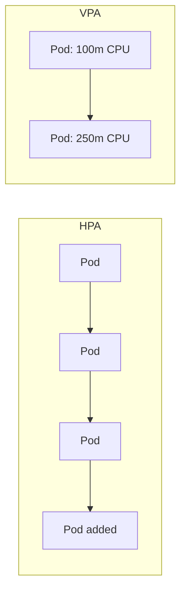
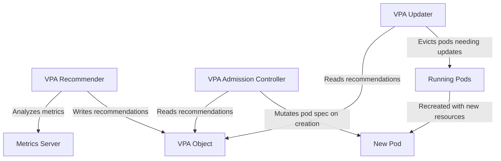
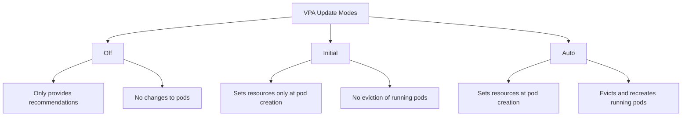

# How to Use Kubernetes Vertical Pod Autoscaler (VPA)

Author: [nawazdhandala](https://www.github.com/nawazdhandala)

Tags: Kubernetes, VPA, Autoscaling, Resource Management, Optimization

Description: Learn how to use Kubernetes VPA to automatically adjust pod resource requests and limits based on actual usage patterns.

---

Setting resource requests and limits correctly is one of the hardest parts of running Kubernetes. Request too little and your pods get OOMKilled or CPU throttled. Request too much and you waste cluster capacity. Vertical Pod Autoscaler (VPA) solves this by watching actual resource consumption and automatically adjusting requests and limits. This post covers how to install, configure, and use VPA effectively.

## How VPA Differs from HPA

HPA scales horizontally by adding or removing pod replicas. VPA scales vertically by changing the resource requests and limits of existing pods. They solve different problems and can be used together in some configurations.



## VPA Components

VPA consists of three main components that work together:



- **Recommender** - Watches resource usage and computes recommended requests
- **Updater** - Evicts pods that need resource adjustments so they get recreated
- **Admission Controller** - Mutates new pods with the recommended resource values

## Step 1: Install VPA

```bash
# Clone the VPA repository
git clone https://github.com/kubernetes/autoscaler.git
cd autoscaler/vertical-pod-autoscaler

# Install VPA components into your cluster
./hack/vpa-up.sh

# Verify all VPA components are running
kubectl get pods -n kube-system | grep vpa

# You should see three pods:
# vpa-admission-controller
# vpa-recommender
# vpa-updater
```

Alternatively, install via Helm:

```bash
# Install VPA using the Helm chart
helm repo add fairwinds-stable https://charts.fairwinds.com/stable
helm repo update

helm install vpa fairwinds-stable/vpa \
  --namespace vpa \
  --create-namespace
```

## Step 2: Deploy an Application

```yaml
# deployment.yaml
# Application with initial resource requests that VPA will optimize
apiVersion: apps/v1
kind: Deployment
metadata:
  name: api-server
  labels:
    app: api-server
spec:
  replicas: 3
  selector:
    matchLabels:
      app: api-server
  template:
    metadata:
      labels:
        app: api-server
    spec:
      containers:
        - name: api-server
          image: your-registry/api-server:latest
          ports:
            - containerPort: 8080
          resources:
            requests:
              cpu: "500m"      # Initial guess - VPA will adjust this
              memory: "512Mi"  # Initial guess - VPA will adjust this
            limits:
              cpu: "1000m"
              memory: "1Gi"
```

## Step 3: Create a VPA in Recommend-Only Mode

Start with `Off` mode to see what VPA recommends without making changes.

```yaml
# vpa-recommend.yaml
# VPA in Off mode - only provides recommendations, does not apply them
apiVersion: autoscaling.k8s.io/v1
kind: VerticalPodAutoscaler
metadata:
  name: api-server-vpa
spec:
  targetRef:
    apiVersion: apps/v1
    kind: Deployment
    name: api-server
  updatePolicy:
    updateMode: "Off"  # Only recommend, do not apply changes
  resourcePolicy:
    containerPolicies:
      - containerName: api-server
        minAllowed:
          cpu: "50m"       # Never recommend less than 50m CPU
          memory: "64Mi"   # Never recommend less than 64Mi memory
        maxAllowed:
          cpu: "2000m"     # Never recommend more than 2 CPU
          memory: "4Gi"    # Never recommend more than 4Gi memory
        controlledResources:
          - cpu
          - memory
```

```bash
# Apply the VPA
kubectl apply -f vpa-recommend.yaml

# Wait a few minutes for recommendations to populate, then check them
kubectl get vpa api-server-vpa -o yaml
```

## Step 4: Read VPA Recommendations

```bash
# Get the VPA recommendations in a readable format
kubectl get vpa api-server-vpa -o jsonpath='{.status.recommendation.containerRecommendations[*]}' | jq .
```

The output shows four recommendation levels:

```json
{
  "containerName": "api-server",
  "lowerBound": {
    "cpu": "80m",
    "memory": "128Mi"
  },
  "target": {
    "cpu": "150m",
    "memory": "256Mi"
  },
  "uncappedTarget": {
    "cpu": "150m",
    "memory": "256Mi"
  },
  "upperBound": {
    "cpu": "400m",
    "memory": "512Mi"
  }
}
```

- **lowerBound** - Below this, the pod is likely underprovisioned
- **target** - The recommended value based on observed usage
- **uncappedTarget** - The recommendation ignoring min/max constraints
- **upperBound** - Above this, resources are likely wasted

## Step 5: Enable Auto Mode

Once you trust the recommendations, switch to `Auto` mode so VPA applies changes.

```yaml
# vpa-auto.yaml
# VPA in Auto mode - automatically adjusts pod resources
apiVersion: autoscaling.k8s.io/v1
kind: VerticalPodAutoscaler
metadata:
  name: api-server-vpa
spec:
  targetRef:
    apiVersion: apps/v1
    kind: Deployment
    name: api-server
  updatePolicy:
    updateMode: "Auto"  # Automatically apply recommendations
    minReplicas: 2      # Keep at least 2 replicas running during updates
  resourcePolicy:
    containerPolicies:
      - containerName: api-server
        minAllowed:
          cpu: "50m"
          memory: "64Mi"
        maxAllowed:
          cpu: "2000m"
          memory: "4Gi"
        controlledResources:
          - cpu
          - memory
        controlledValues: RequestsAndLimits  # Adjust both requests and limits
```

## VPA Update Modes



## Using VPA with HPA

You can use VPA and HPA together, but with a constraint: VPA must not control the same resource that HPA uses for scaling. Typically you let HPA control CPU-based scaling and VPA control memory.

```yaml
# vpa-memory-only.yaml
# VPA that only manages memory, leaving CPU for HPA
apiVersion: autoscaling.k8s.io/v1
kind: VerticalPodAutoscaler
metadata:
  name: api-server-vpa-memory
spec:
  targetRef:
    apiVersion: apps/v1
    kind: Deployment
    name: api-server
  updatePolicy:
    updateMode: "Auto"
  resourcePolicy:
    containerPolicies:
      - containerName: api-server
        controlledResources:
          - memory  # Only manage memory, not CPU
        minAllowed:
          memory: "64Mi"
        maxAllowed:
          memory: "4Gi"
```

## Monitoring VPA Activity

```bash
# Check current VPA status and recommendations
kubectl describe vpa api-server-vpa

# Watch for pod evictions triggered by VPA
kubectl get events --field-selector reason=EvictedByVPA --watch

# Compare actual usage to recommendations
kubectl top pods -l app=api-server
kubectl get vpa api-server-vpa -o jsonpath='{.status.recommendation}'
```

## Summary

VPA takes the guesswork out of setting resource requests and limits. Start in recommend-only mode to build confidence, then switch to auto mode once you are comfortable. Combine it with HPA for a complete autoscaling strategy that handles both horizontal and vertical scaling.

To track your VPA recommendations, resource utilization trends, and pod restarts in one dashboard, use [OneUptime](https://oneuptime.com). OneUptime gives you full observability into your Kubernetes clusters, so you can verify that VPA is right-sizing your workloads and catch resource issues before they cause outages.
