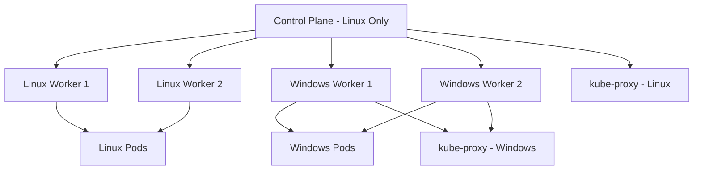
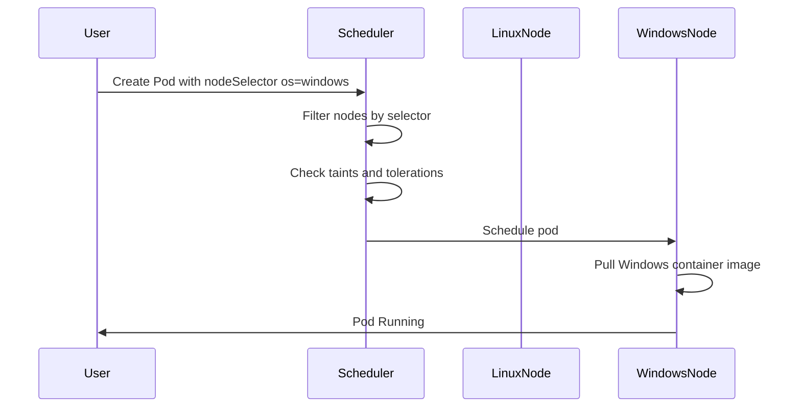
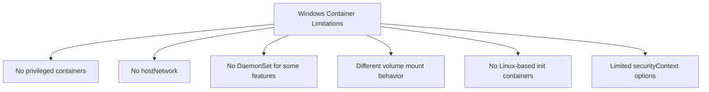

# How to Run Windows Containers on Kubernetes

Author: [nawazdhandala](https://www.github.com/nawazdhandala)

Tags: Kubernetes, Windows Containers, Mixed Workloads, Hybrid, Scheduling

Description: Learn how to run Windows containers alongside Linux containers on Kubernetes with node selectors and taints.

---

Not every workload runs on Linux. Legacy .NET Framework applications, Windows-specific services, and some enterprise software require Windows. Kubernetes supports Windows worker nodes alongside Linux nodes, letting you manage both from a single control plane. But there are constraints and configuration details that trip people up.

This guide covers adding Windows nodes, scheduling workloads correctly, and handling the differences between Linux and Windows containers.

## Mixed Cluster Architecture



The Kubernetes control plane components (API server, scheduler, controller manager, etcd) always run on Linux. Only worker nodes can be Windows.

## Adding a Windows Node Pool (AKS Example)

```bash
# add-windows-nodepool.sh
# Add a Windows node pool to an existing AKS cluster

# Create a Windows node pool with 2 nodes
az aks nodepool add \
  --resource-group my-rg \
  --cluster-name my-cluster \
  --name winpool \
  --node-count 2 \
  --os-type Windows \
  --os-sku Windows2022 \
  --node-vm-size Standard_D4s_v3 \
  --kubernetes-version 1.30.0

# Verify the nodes are ready
kubectl get nodes -o wide
```

## Manual Windows Node Setup (kubeadm)

```powershell
# setup-windows-node.ps1
# Prepare a Windows Server 2022 node to join a Kubernetes cluster

# Install container runtime (containerd)
# Download and extract containerd
$Version = "1.7.11"
curl.exe -LO "https://github.com/containerd/containerd/releases/download/v$Version/containerd-$Version-windows-amd64.tar.gz"
tar xvf "containerd-$Version-windows-amd64.tar.gz"

# Create containerd configuration directory
mkdir -Force "C:\Program Files\containerd"
Copy-Item -Path ".\bin\*" -Destination "C:\Program Files\containerd\" -Force

# Generate default containerd config
cd "C:\Program Files\containerd"
.\containerd.exe config default | Out-File config.toml -Encoding ascii

# Register containerd as a Windows service
.\containerd.exe --register-service
Start-Service containerd

# Install kubelet and kubeadm
$KubeVersion = "1.30.0"
curl.exe -LO "https://dl.k8s.io/release/v$KubeVersion/bin/windows/amd64/kubelet.exe"
curl.exe -LO "https://dl.k8s.io/release/v$KubeVersion/bin/windows/amd64/kubeadm.exe"
curl.exe -LO "https://dl.k8s.io/release/v$KubeVersion/bin/windows/amd64/kubectl.exe"

# Move binaries to a directory in PATH
mkdir -Force "C:\k"
Move-Item -Path "*.exe" -Destination "C:\k\" -Force
$env:Path += ";C:\k"

# Join the cluster using the token from the Linux control plane
kubeadm join 10.0.1.10:6443 --token <token> --discovery-token-ca-cert-hash <hash>
```

## Node Labels and Taints

Windows nodes are automatically labeled with `kubernetes.io/os=windows`. Add taints to prevent Linux pods from accidentally scheduling on Windows nodes.

```bash
# taint-windows-nodes.sh
# Add a taint to Windows nodes so only Windows-tolerant pods schedule there

# Taint all Windows nodes
kubectl taint nodes -l kubernetes.io/os=windows \
  os=windows:NoSchedule

# Verify the taint is applied
kubectl describe node <windows-node-name> | grep Taints
```

## Deploying a Windows Container

```yaml
# windows-deployment.yaml
# Deploy a .NET Framework application on Windows nodes
apiVersion: apps/v1
kind: Deployment
metadata:
  name: dotnet-app
  namespace: default
spec:
  replicas: 2
  selector:
    matchLabels:
      app: dotnet-app
  template:
    metadata:
      labels:
        app: dotnet-app
    spec:
      # Target Windows nodes using node selector
      nodeSelector:
        kubernetes.io/os: windows
      # Tolerate the Windows taint
      tolerations:
        - key: os
          value: windows
          effect: NoSchedule
      containers:
        - name: dotnet-app
          # Use Windows Server Core base image
          image: mcr.microsoft.com/dotnet/framework/aspnet:4.8
          ports:
            - containerPort: 80
          resources:
            requests:
              cpu: "500m"
              memory: "1Gi"
            limits:
              cpu: "1"
              memory: "2Gi"
          # Windows containers use different health check paths
          readinessProbe:
            httpGet:
              path: /health
              port: 80
            initialDelaySeconds: 30
            periodSeconds: 10
          livenessProbe:
            httpGet:
              path: /health
              port: 80
            initialDelaySeconds: 60
            periodSeconds: 15
```

## Linux-Only System Components

Ensure system DaemonSets only run on Linux nodes.

```yaml
# kube-proxy-linux-only.yaml
# Patch existing DaemonSets to target Linux nodes only
apiVersion: apps/v1
kind: DaemonSet
metadata:
  name: fluentd
  namespace: monitoring
spec:
  template:
    spec:
      # Restrict to Linux nodes
      nodeSelector:
        kubernetes.io/os: linux
      containers:
        - name: fluentd
          image: fluent/fluentd:v1.16
```

## Scheduling Flow



## Mixed Workload Service

A single Kubernetes Service can front both Linux and Windows pods if needed, but usually you keep them separate.

```yaml
# mixed-service.yaml
# Service that routes to the Windows backend pods
apiVersion: v1
kind: Service
metadata:
  name: dotnet-app
  namespace: default
spec:
  selector:
    app: dotnet-app
  ports:
    - port: 80
      targetPort: 80
  type: ClusterIP
---
# Ingress works the same regardless of backend OS
apiVersion: networking.k8s.io/v1
kind: Ingress
metadata:
  name: dotnet-app-ingress
  namespace: default
spec:
  rules:
    - host: dotnet.example.com
      http:
        paths:
          - path: /
            pathType: Prefix
            backend:
              service:
                name: dotnet-app
                port:
                  number: 80
```

## Windows Container Limitations



Key differences to keep in mind:

- **No privileged mode** - Windows containers do not support the privileged flag.
- **No hostNetwork** - Pods cannot share the host network namespace on Windows.
- **Volume mounts** - Windows uses backslash paths and does not support all Linux volume types.
- **Container images** - The Windows Server version of the node OS must match the container base image version.
- **No HostProcess pods** - These are supported only on Windows Server 2019 and later with specific configuration.

## Image Version Matching

```yaml
# multi-arch-deployment.yaml
# Use runtime class or node affinity to match OS versions
apiVersion: apps/v1
kind: Deployment
metadata:
  name: dotnet-app
spec:
  template:
    spec:
      nodeSelector:
        kubernetes.io/os: windows
        # Match the specific Windows build version
        node.kubernetes.io/windows-build: "10.0.20348"
      containers:
        - name: app
          # This image must be built on the matching Windows version
          image: registry.example.com/dotnet-app:v1.0-ltsc2022
```

## Monitoring Windows Nodes

```python
# check_windows_nodes.py
# Verifies Windows node health and reports status
# Checks node conditions and resource pressure

import subprocess
import json
import sys


def get_windows_nodes():
    """Fetch all Windows nodes and their conditions."""
    result = subprocess.run(
        [
            "kubectl", "get", "nodes",
            "-l", "kubernetes.io/os=windows",
            "-o", "json",
        ],
        capture_output=True,
        text=True,
    )
    data = json.loads(result.stdout)
    return data.get("items", [])


def check_node_health(nodes):
    """Check each Windows node for unhealthy conditions."""
    issues = []
    for node in nodes:
        name = node["metadata"]["name"]
        conditions = node["status"].get("conditions", [])

        for condition in conditions:
            ctype = condition["type"]
            status = condition["status"]

            # Ready should be True, all pressure conditions should be False
            if ctype == "Ready" and status != "True":
                issues.append(f"{name}: Not Ready - {condition['reason']}")
            elif ctype in ("MemoryPressure", "DiskPressure", "PIDPressure"):
                if status == "True":
                    issues.append(f"{name}: {ctype} detected")

    return issues


def main():
    nodes = get_windows_nodes()
    if not nodes:
        print("No Windows nodes found in the cluster.")
        sys.exit(0)

    print(f"Found {len(nodes)} Windows node(s)")
    for node in nodes:
        name = node["metadata"]["name"]
        version = node["status"]["nodeInfo"]["kubeletVersion"]
        os_image = node["status"]["nodeInfo"]["osImage"]
        print(f"  {name}: {version} ({os_image})")

    issues = check_node_health(nodes)
    if issues:
        print("\nHealth issues detected:")
        for issue in issues:
            print(f"  - {issue}")
        sys.exit(1)
    else:
        print("\nAll Windows nodes are healthy.")
        sys.exit(0)


if __name__ == "__main__":
    main()
```

## Key Takeaways

- The Kubernetes control plane always runs on Linux. Only worker nodes support Windows.
- Use node selectors and taints to ensure Linux pods never schedule on Windows nodes and vice versa.
- Windows container base image versions must match the host OS version exactly.
- Many Linux container features like privileged mode, hostNetwork, and certain volume types are not available on Windows.
- Patch all system DaemonSets with a Linux node selector to prevent scheduling failures on Windows nodes.

Running a mixed Linux-Windows Kubernetes cluster doubles your operational surface area. Use [OneUptime](https://oneuptime.com) to monitor both Linux and Windows nodes, track node health conditions, and get alerted when a Windows node falls behind on updates or becomes unresponsive.
