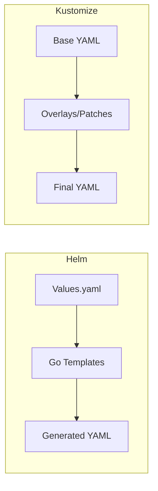
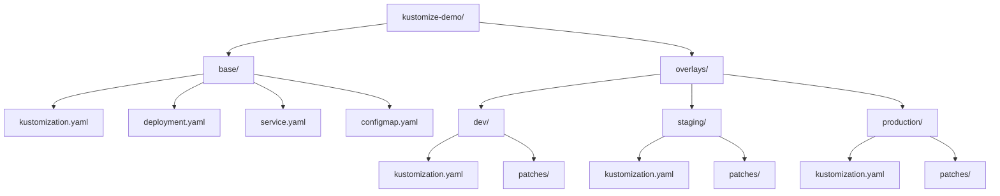

# How to Use Kustomize for Kubernetes Configuration Management

Author: [nawazdhandala](https://www.github.com/nawazdhandala)

Tags: Kustomize, Kubernetes, Configuration, Overlays, Deployment

Description: Learn how to use Kustomize for managing Kubernetes configurations with bases, overlays, and patches without templates.

---

## What is Kustomize?

Kustomize is a Kubernetes-native configuration management tool that lets you customize YAML manifests without using templates. Unlike Helm, which uses Go templates to generate YAML, Kustomize works with plain Kubernetes YAML files and applies transformations on top of them. Kustomize is built into kubectl (via `kubectl apply -k`), so you do not need any additional tools.

## Kustomize vs Helm



| Feature | Kustomize | Helm |
|---------|-----------|------|
| Templating | No templates | Go templates |
| Learning curve | Low | Moderate |
| Package management | No | Yes (charts) |
| Built into kubectl | Yes | No (separate tool) |
| Configuration style | Declarative patches | Template rendering |
| Complexity | Simple | More powerful |

Kustomize is ideal when you want to manage environment-specific configurations (dev, staging, production) without the complexity of a template engine.

## Project Structure



## Creating the Base Configuration

The base contains the common configuration shared across all environments.

```yaml
# base/kustomization.yaml
# This file tells Kustomize which resources to include
apiVersion: kustomize.config.k8s.io/v1beta1
kind: Kustomization

# Common labels applied to all resources
commonLabels:
  app: web-app
  managed-by: kustomize

# Resources to include in the base
resources:
  - deployment.yaml
  - service.yaml
  - configmap.yaml
```

```yaml
# base/deployment.yaml
# Base deployment configuration
apiVersion: apps/v1
kind: Deployment
metadata:
  name: web-app
spec:
  replicas: 1                              # Default replica count
  selector:
    matchLabels:
      app: web-app
  template:
    metadata:
      labels:
        app: web-app
    spec:
      containers:
        - name: web-app
          image: myregistry/web-app:latest  # Base image tag
          ports:
            - containerPort: 8080
          env:
            - name: LOG_LEVEL
              value: "info"                 # Default log level
          resources:
            requests:
              cpu: 100m
              memory: 128Mi
            limits:
              cpu: 500m
              memory: 256Mi
          readinessProbe:
            httpGet:
              path: /health
              port: 8080
            initialDelaySeconds: 5
            periodSeconds: 10
          livenessProbe:
            httpGet:
              path: /health
              port: 8080
            initialDelaySeconds: 15
            periodSeconds: 20
```

```yaml
# base/service.yaml
# Base service configuration
apiVersion: v1
kind: Service
metadata:
  name: web-app
spec:
  type: ClusterIP                          # Default service type
  ports:
    - port: 80
      targetPort: 8080
      protocol: TCP
  selector:
    app: web-app
```

```yaml
# base/configmap.yaml
# Base configuration values
apiVersion: v1
kind: ConfigMap
metadata:
  name: web-app-config
data:
  DATABASE_HOST: "localhost"
  DATABASE_PORT: "5432"
  CACHE_TTL: "300"
  FEATURE_FLAGS: "none"
```

## Creating Environment Overlays

### Development Overlay

```yaml
# overlays/dev/kustomization.yaml
apiVersion: kustomize.config.k8s.io/v1beta1
kind: Kustomization

# Reference the base configuration
resources:
  - ../../base

# Add a name prefix for the dev environment
namePrefix: dev-

# Add environment-specific labels
commonLabels:
  environment: development

# Override the namespace
namespace: dev

# Apply patches to customize for dev
patches:
  # Inline patch: change replica count and log level
  - target:
      kind: Deployment
      name: web-app
    patch: |-
      apiVersion: apps/v1
      kind: Deployment
      metadata:
        name: web-app
      spec:
        replicas: 1
        template:
          spec:
            containers:
              - name: web-app
                env:
                  - name: LOG_LEVEL
                    value: "debug"
                resources:
                  requests:
                    cpu: 50m
                    memory: 64Mi
                  limits:
                    cpu: 200m
                    memory: 128Mi

# Override ConfigMap values for dev
configMapGenerator:
  - name: web-app-config
    behavior: merge                        # Merge with existing ConfigMap
    literals:
      - DATABASE_HOST=dev-db.dev.svc
      - FEATURE_FLAGS=debug,verbose

# Set the image tag for dev
images:
  - name: myregistry/web-app
    newTag: dev-latest                     # Use the dev-latest tag
```

### Production Overlay

```yaml
# overlays/production/kustomization.yaml
apiVersion: kustomize.config.k8s.io/v1beta1
kind: Kustomization

resources:
  - ../../base
  - hpa.yaml                              # Additional resource for production

namePrefix: prod-

commonLabels:
  environment: production

namespace: production

# Production-specific patches
patches:
  - target:
      kind: Deployment
      name: web-app
    patch: |-
      apiVersion: apps/v1
      kind: Deployment
      metadata:
        name: web-app
      spec:
        replicas: 5
        template:
          spec:
            containers:
              - name: web-app
                env:
                  - name: LOG_LEVEL
                    value: "warn"
                resources:
                  requests:
                    cpu: 500m
                    memory: 512Mi
                  limits:
                    cpu: "2"
                    memory: 1Gi
            # Add node affinity for production
            affinity:
              podAntiAffinity:
                preferredDuringSchedulingIgnoredDuringExecution:
                  - weight: 100
                    podAffinityTerm:
                      labelSelector:
                        matchExpressions:
                          - key: app
                            operator: In
                            values:
                              - web-app
                      topologyKey: kubernetes.io/hostname

configMapGenerator:
  - name: web-app-config
    behavior: merge
    literals:
      - DATABASE_HOST=prod-db.production.svc
      - CACHE_TTL=3600
      - FEATURE_FLAGS=none

images:
  - name: myregistry/web-app
    newTag: v2.1.0                         # Pin to a specific version

# Generate a secret for production
secretGenerator:
  - name: web-app-secrets
    literals:
      - DATABASE_PASSWORD=prod-secure-password
      - API_KEY=prod-api-key-12345
```

```yaml
# overlays/production/hpa.yaml
# Horizontal Pod Autoscaler for production
apiVersion: autoscaling/v2
kind: HorizontalPodAutoscaler
metadata:
  name: web-app
spec:
  scaleTargetRef:
    apiVersion: apps/v1
    kind: Deployment
    name: prod-web-app                     # Matches the prefixed name
  minReplicas: 5
  maxReplicas: 20
  metrics:
    - type: Resource
      resource:
        name: cpu
        target:
          type: Utilization
          averageUtilization: 70
```

## Building and Applying

```bash
# Preview the generated YAML for dev environment
# This shows exactly what will be applied
kubectl kustomize overlays/dev

# Apply the dev overlay to the cluster
kubectl apply -k overlays/dev

# Preview the production overlay
kubectl kustomize overlays/production

# Apply the production overlay
kubectl apply -k overlays/production

# Diff against what is currently running
kubectl diff -k overlays/production

# Delete resources created by an overlay
kubectl delete -k overlays/dev
```

## Strategic Merge Patches vs JSON Patches

```yaml
# Strategic Merge Patch (default)
# Merges the patch with the original resource
# Good for adding or modifying fields
patches:
  - target:
      kind: Deployment
      name: web-app
    patch: |-
      apiVersion: apps/v1
      kind: Deployment
      metadata:
        name: web-app
      spec:
        template:
          spec:
            containers:
              - name: web-app
                env:
                  - name: NEW_VAR
                    value: "added"

---
# JSON Patch
# Uses JSON Patch operations (add, remove, replace)
# Good for precise modifications like removing a field
patches:
  - target:
      kind: Deployment
      name: web-app
    patch: |-
      - op: replace
        path: /spec/replicas
        value: 10
      - op: add
        path: /spec/template/spec/containers/0/env/-
        value:
          name: EXTRA_VAR
          value: "json-patch-added"
```

## Using Components for Shared Functionality

```yaml
# components/monitoring/kustomization.yaml
# A reusable component that adds monitoring sidecars
apiVersion: kustomize.config.k8s.io/v1alpha1
kind: Component

patches:
  - target:
      kind: Deployment
    patch: |-
      apiVersion: apps/v1
      kind: Deployment
      metadata:
        name: not-important
      spec:
        template:
          metadata:
            annotations:
              prometheus.io/scrape: "true"
              prometheus.io/port: "9090"
```

```yaml
# overlays/production/kustomization.yaml
# Include the monitoring component
apiVersion: kustomize.config.k8s.io/v1beta1
kind: Kustomization

resources:
  - ../../base

# Include shared components
components:
  - ../../components/monitoring
```

## Best Practices

- Keep your base configurations minimal and environment-agnostic.
- Use overlays only for environment-specific differences.
- Use `configMapGenerator` and `secretGenerator` to create hashed names that trigger pod restarts on config changes.
- Use `images` transformers instead of patching container images directly.
- Pin image tags in production overlays. Never use `latest` in production.
- Use components for cross-cutting concerns like monitoring annotations.
- Store your Kustomize configurations in version control.

## Monitoring with OneUptime

Managing Kubernetes configurations across multiple environments requires visibility into what is deployed and where. OneUptime (https://oneuptime.com) monitors your Kubernetes deployments and alerts you when configuration changes cause issues. Whether you are rolling out a new image tag through Kustomize overlays or scaling replicas for production traffic, OneUptime tracks the health of your services and ensures that configuration changes do not introduce regressions or downtime.
