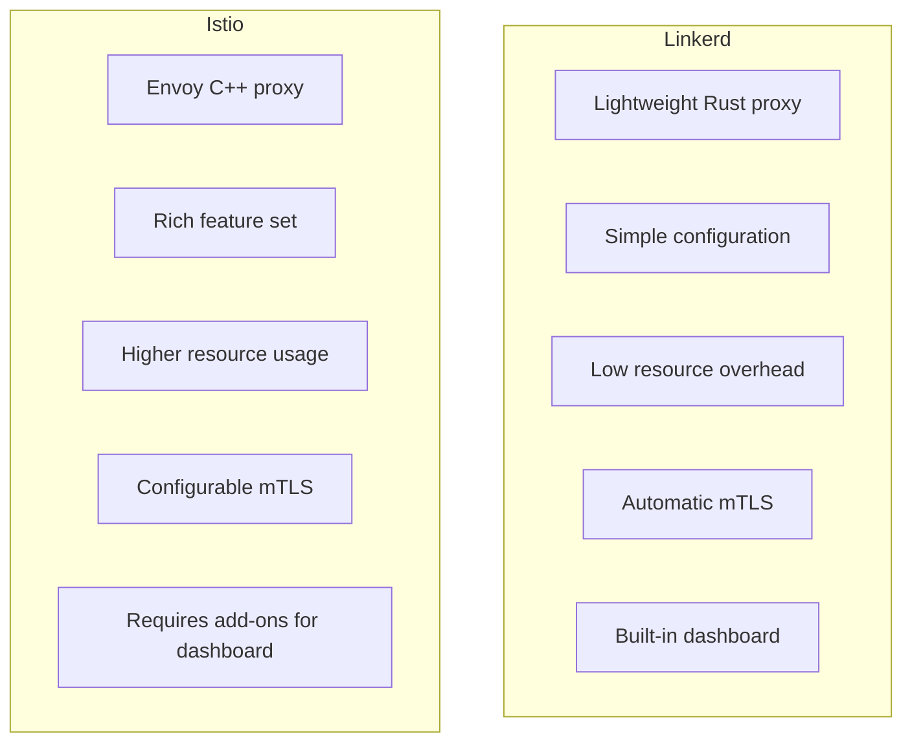
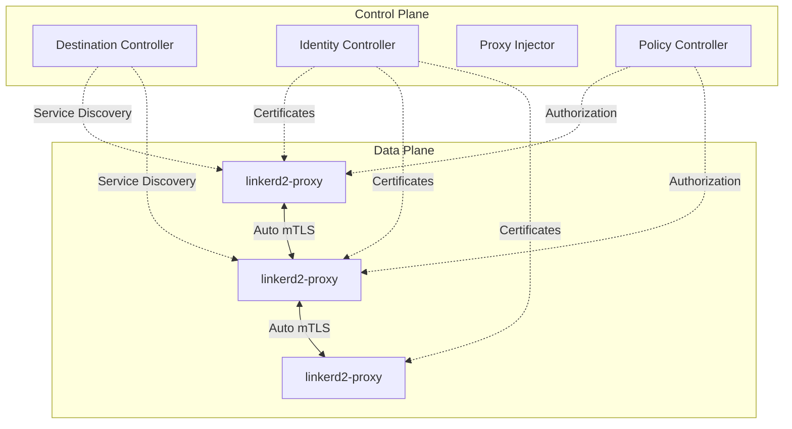
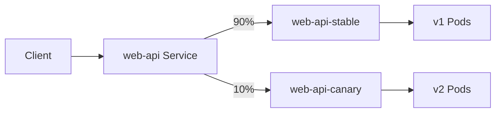
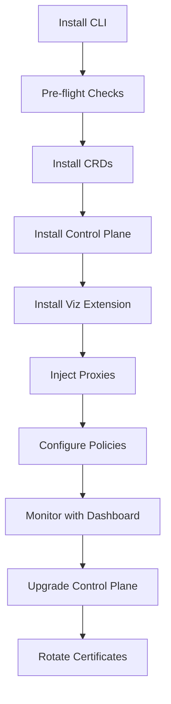

# How to Get Started with Linkerd Service Mesh on Kubernetes

Author: [nawazdhandala](https://www.github.com/nawazdhandala)

Tags: Linkerd, Service Mesh, Kubernetes, Lightweight, Observability

Description: A guide to deploying Linkerd service mesh on Kubernetes for automatic mTLS, observability, and traffic management.

---

## Introduction

Linkerd is a lightweight, ultra-fast service mesh for Kubernetes. Unlike Istio, Linkerd focuses on simplicity and minimal resource overhead. It provides automatic mTLS, observability, and reliability features with a fraction of the configuration. This guide walks you through installing and using Linkerd in production.

## Linkerd vs Istio



## Linkerd Architecture



## Installing Linkerd

### Prerequisites

```bash
# Install the Linkerd CLI
curl --proto '=https' --tlsv1.2 -sSfL https://run.linkerd.io/install | sh

# Add linkerd to your PATH
export PATH=$HOME/.linkerd2/bin:$PATH

# Verify the CLI installation
linkerd version

# Check that your Kubernetes cluster is ready for Linkerd
linkerd check --pre
```

### Install the Control Plane

```bash
# Install Linkerd CRDs (Custom Resource Definitions)
linkerd install --crds | kubectl apply -f -

# Install the Linkerd control plane
linkerd install | kubectl apply -f -

# Wait for the control plane to be ready
linkerd check

# Install the Linkerd Viz extension (dashboard and metrics)
linkerd viz install | kubectl apply -f -

# Verify the Viz extension
linkerd viz check
```

### Production Installation with Helm

```bash
# Add the Linkerd Helm repository
helm repo add linkerd-edge https://helm.linkerd.io/edge
helm repo update

# Generate trust anchor certificate for production
# This certificate is the root of trust for the entire mesh
step certificate create root.linkerd.cluster.local ca.crt ca.key \
  --profile root-ca --no-password --insecure

# Generate issuer certificate signed by the trust anchor
step certificate create identity.linkerd.cluster.local issuer.crt issuer.key \
  --profile intermediate-ca --not-after 8760h --no-password --insecure \
  --ca ca.crt --ca-key ca.key

# Install CRDs
helm install linkerd-crds linkerd-edge/linkerd-crds -n linkerd --create-namespace

# Install control plane with custom certificates
helm install linkerd-control-plane linkerd-edge/linkerd-control-plane \
  -n linkerd \
  --set identityTrustAnchorsPEM="$(cat ca.crt)" \
  --set identity.issuer.tls.crtPEM="$(cat issuer.crt)" \
  --set identity.issuer.tls.keyPEM="$(cat issuer.key)"
```

## Injecting the Data Plane

### Namespace-Level Injection

```yaml
# Enable Linkerd proxy injection for an entire namespace
apiVersion: v1
kind: Namespace
metadata:
  name: production
  annotations:
    linkerd.io/inject: enabled  # All pods in this namespace get the proxy
```

### Per-Deployment Injection

```yaml
# Inject Linkerd proxy into a specific deployment
apiVersion: apps/v1
kind: Deployment
metadata:
  name: web-api
  namespace: production
spec:
  replicas: 3
  selector:
    matchLabels:
      app: web-api
  template:
    metadata:
      labels:
        app: web-api
      annotations:
        linkerd.io/inject: enabled  # Inject proxy into this deployment
        config.linkerd.io/proxy-cpu-request: "100m"
        config.linkerd.io/proxy-memory-request: "64Mi"
        config.linkerd.io/proxy-cpu-limit: "500m"
        config.linkerd.io/proxy-memory-limit: "128Mi"
    spec:
      containers:
        - name: web-api
          image: myregistry.io/web-api:v1.0.0
          ports:
            - containerPort: 8080
```

### Inject Existing Deployments

```bash
# Inject Linkerd proxy into an existing deployment
kubectl get deploy web-api -n production -o yaml | linkerd inject - | kubectl apply -f -

# Inject all deployments in a namespace
kubectl get deploy -n production -o yaml | linkerd inject - | kubectl apply -f -

# Verify injection
linkerd check --proxy -n production
```

## Observability with Linkerd

### Using the Dashboard

```bash
# Open the Linkerd dashboard
linkerd viz dashboard

# View real-time traffic metrics for a namespace
linkerd viz stat deploy -n production

# View per-route metrics
linkerd viz routes deploy/web-api -n production

# Watch live traffic
linkerd viz tap deploy/web-api -n production
```

### Traffic Metrics Output

```bash
# Example output of linkerd viz stat
# NAME       MESHED   SUCCESS   RPS   LATENCY_P50   LATENCY_P95   LATENCY_P99
# web-api    3/3      99.95%    120   5ms           15ms          45ms
# orders     2/2      99.99%    80    3ms           10ms          30ms
# payments   2/2      100.00%   45    8ms           25ms          60ms
```

## Traffic Splitting for Canary Deployments

```yaml
# Linkerd uses the SMI (Service Mesh Interface) TrafficSplit resource
apiVersion: split.smi-spec.io/v1alpha2
kind: TrafficSplit
metadata:
  name: web-api-canary
  namespace: production
spec:
  service: web-api             # The apex service
  backends:
    - service: web-api-stable  # Stable version backend service
      weight: 900              # 90% of traffic
    - service: web-api-canary  # Canary version backend service
      weight: 100              # 10% of traffic
```



## Authorization Policies

```yaml
# Server resource defines a port and protocol for policy
apiVersion: policy.linkerd.io/v1beta3
kind: Server
metadata:
  name: web-api-http
  namespace: production
spec:
  podSelector:
    matchLabels:
      app: web-api
  port: 8080
  proxyProtocol: HTTP/1

---

# AuthorizationPolicy controls who can access the server
apiVersion: policy.linkerd.io/v1alpha1
kind: AuthorizationPolicy
metadata:
  name: allow-frontend
  namespace: production
spec:
  targetRef:
    group: policy.linkerd.io
    kind: Server
    name: web-api-http
  requiredAuthenticationRefs:
    - name: frontend-identity
      kind: MeshTLSAuthentication
      group: policy.linkerd.io

---

# MeshTLSAuthentication specifies which identities are allowed
apiVersion: policy.linkerd.io/v1alpha1
kind: MeshTLSAuthentication
metadata:
  name: frontend-identity
  namespace: production
spec:
  identities:
    # Only allow the frontend service account to connect
    - "frontend.production.serviceaccount.identity.linkerd.cluster.local"
```

## Retries and Timeouts

```yaml
# Service profile for configuring retries and timeouts
apiVersion: linkerd.io/v1alpha2
kind: ServiceProfile
metadata:
  name: web-api.production.svc.cluster.local
  namespace: production
spec:
  routes:
    - name: GET /api/v1/products
      condition:
        method: GET
        pathRegex: /api/v1/products
      responseClasses:
        - condition:
            status:
              min: 500
              max: 599
          isFailure: true  # Mark 5xx as failures for retry logic
      isRetryable: true    # Enable automatic retries
      timeout: 3s          # Request timeout

    - name: POST /api/v1/orders
      condition:
        method: POST
        pathRegex: /api/v1/orders
      isRetryable: false   # Do not retry POST requests (not idempotent)
      timeout: 5s
```

## Monitoring and Debugging

```bash
# Check proxy status for all meshed pods
linkerd viz stat deploy -n production --to deploy/web-api

# View real-time request/response pairs
linkerd viz tap deploy/web-api -n production \
  --method GET \
  --path /api/v1/products

# Check for meshed vs non-meshed pods
linkerd check --proxy -n production

# Debug connectivity issues
linkerd diagnostics endpoints web-api.production.svc.cluster.local:8080
```

## Linkerd Lifecycle Management



## Conclusion

Linkerd provides a lightweight, simple, and secure service mesh for Kubernetes. Its automatic mTLS, built-in dashboard, and minimal configuration make it an excellent choice for teams that want service mesh benefits without the complexity. Start by installing the control plane, inject your workloads, and enjoy automatic encryption, observability, and reliability.

For comprehensive monitoring of your Linkerd-meshed services and Kubernetes clusters, check out [OneUptime](https://oneuptime.com) for uptime monitoring, incident management, and real-time observability.
