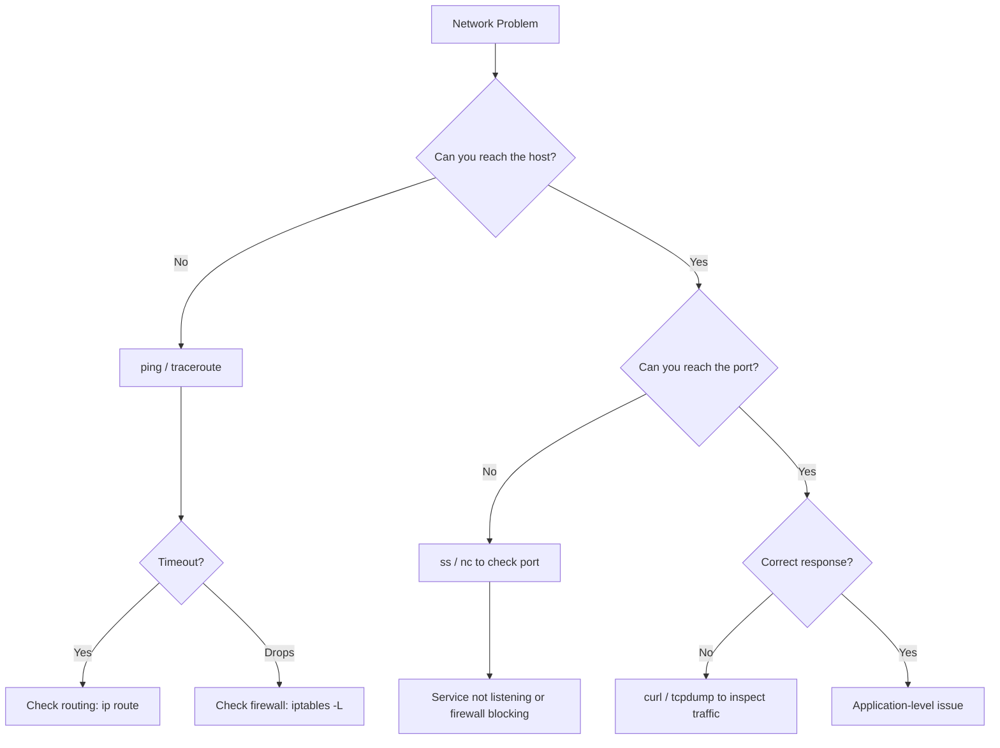
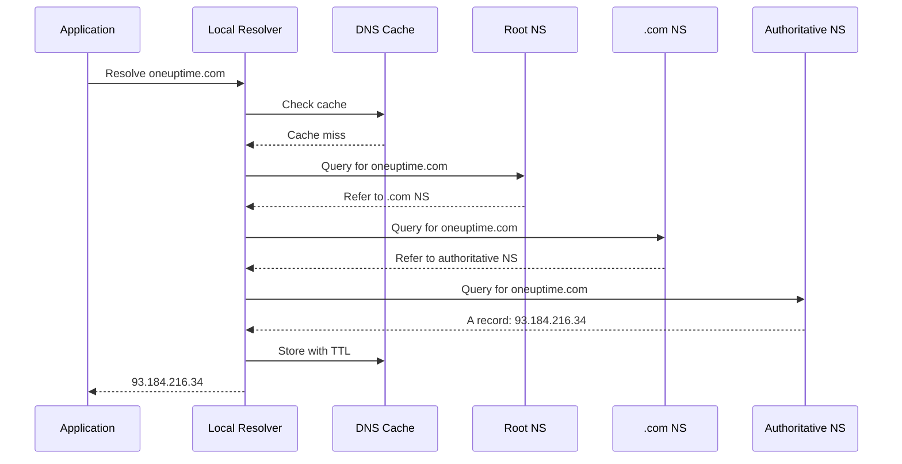
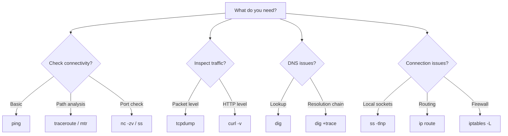

# Essential Linux Networking Tools for DevOps Engineers

Author: [nawazdhandala](https://www.github.com/nawazdhandala)

Tags: Linux, Networking, Tools, DevOps, Troubleshooting

Description: A guide to essential Linux networking tools including ss, ip, dig, traceroute, tcpdump, and curl for DevOps troubleshooting.

---

Every DevOps engineer needs to troubleshoot network issues. Whether it is a service that cannot connect to a database, DNS resolution failures, or mysterious latency spikes, the right tool makes the difference between minutes and hours of debugging. This guide covers the essential Linux networking tools with practical examples.

## Networking Troubleshooting Flow



## ip - Network Interface and Routing

The `ip` command replaces the older `ifconfig` and `route` commands.

```bash
# Show all network interfaces with their IP addresses
ip addr show

# Show only IPv4 addresses in a compact format
ip -4 addr show

# Show a specific interface
ip addr show eth0

# Show the routing table
ip route show

# Show the default gateway
ip route show default

# Find which interface and route is used to reach a host
ip route get 8.8.8.8

# Show neighbor (ARP) table
ip neigh show

# Show link-level statistics (errors, drops)
ip -s link show eth0

# Add a temporary IP address to an interface
sudo ip addr add 192.168.1.100/24 dev eth0

# Add a static route
sudo ip route add 10.0.0.0/8 via 192.168.1.1 dev eth0
```

## ss - Socket Statistics

The `ss` command replaces `netstat` and is significantly faster on systems with many connections.

```bash
# Show all TCP connections
ss -t

# Show all listening TCP sockets with process info
# This is the most common usage
ss -tlnp
# -t = TCP
# -l = listening
# -n = numeric (don't resolve names)
# -p = show process using the socket

# Show all listening UDP sockets
ss -ulnp

# Count connections by state
ss -tan | awk '{print $1}' | sort | uniq -c | sort -rn

# Show connections to a specific port
ss -tn dport = :443

# Show connections from a specific source
ss -tn src 192.168.1.0/24

# Show connections in ESTABLISHED state
ss -t state established

# Show connections in TIME-WAIT state (common connection leak indicator)
ss -t state time-wait | wc -l

# Show detailed TCP socket info including congestion control
ss -ti dst 10.0.0.5

# Show socket memory usage
ss -tm
```

## dig - DNS Lookups

```bash
# Basic DNS lookup
dig oneuptime.com

# Query a specific record type
dig oneuptime.com A        # IPv4 address
dig oneuptime.com AAAA     # IPv6 address
dig oneuptime.com MX       # Mail exchange
dig oneuptime.com TXT      # Text records
dig oneuptime.com NS       # Name servers
dig oneuptime.com CNAME    # Canonical name
dig oneuptime.com SOA      # Start of authority

# Short output - just the answer
dig +short oneuptime.com

# Query a specific DNS server
dig @8.8.8.8 oneuptime.com

# Trace the full DNS resolution path
dig +trace oneuptime.com

# Reverse DNS lookup
dig -x 93.184.216.34

# Check DNS propagation by querying multiple servers
for ns in 8.8.8.8 1.1.1.1 9.9.9.9; do
    echo "=== $ns ==="
    dig @$ns +short oneuptime.com
done

# Check TTL (time to live) for cache planning
dig oneuptime.com | grep -E "^oneuptime" | awk '{print $2}'
```

## DNS Resolution Flow



## curl - HTTP Client

```bash
# Basic GET request
curl https://api.example.com/health

# Show response headers
curl -I https://api.example.com/health

# Show both headers and body
curl -i https://api.example.com/health

# POST request with JSON body
curl -X POST https://api.example.com/data \
  -H "Content-Type: application/json" \
  -d '{"name": "test", "value": 42}'

# Follow redirects
curl -L https://example.com

# Show detailed timing information
curl -o /dev/null -s -w "\
    DNS Lookup:  %{time_namelookup}s\n\
    TCP Connect: %{time_connect}s\n\
    TLS Handshake: %{time_appconnect}s\n\
    First Byte:  %{time_starttransfer}s\n\
    Total Time:  %{time_total}s\n\
    HTTP Code:   %{http_code}\n" \
  https://oneuptime.com

# Set a connection timeout
curl --connect-timeout 5 --max-time 30 https://api.example.com/health

# Verbose output showing the full request/response exchange
curl -v https://api.example.com/health

# Test with a specific DNS resolution (bypass DNS)
curl --resolve api.example.com:443:10.0.0.5 https://api.example.com/health
```

## traceroute / mtr - Path Analysis

```bash
# Show the network path to a host
traceroute oneuptime.com

# Use TCP instead of ICMP (works when ICMP is blocked)
traceroute -T -p 443 oneuptime.com

# mtr combines ping and traceroute for continuous monitoring
# Shows loss percentage and latency at each hop
mtr --report --report-cycles 10 oneuptime.com

# mtr with TCP
mtr --tcp --port 443 oneuptime.com
```

## tcpdump - Packet Capture

```bash
# Capture all traffic on an interface
sudo tcpdump -i eth0

# Capture traffic to/from a specific host
sudo tcpdump -i eth0 host 10.0.0.5

# Capture only TCP traffic on port 443
sudo tcpdump -i eth0 tcp port 443

# Capture DNS traffic
sudo tcpdump -i eth0 port 53

# Capture and save to a file for analysis in Wireshark
sudo tcpdump -i eth0 -w capture.pcap host 10.0.0.5

# Capture with packet contents in ASCII
sudo tcpdump -i eth0 -A port 80

# Capture SYN packets only (new connections)
sudo tcpdump -i eth0 'tcp[tcpflags] & tcp-syn != 0'

# Capture with timestamps and don't resolve names
sudo tcpdump -i eth0 -nn -tttt port 443

# Limit capture to first 100 packets
sudo tcpdump -i eth0 -c 100 host 10.0.0.5
```

## nc (netcat) - Network Swiss Army Knife

```bash
# Test if a port is open
nc -zv 10.0.0.5 5432

# Scan a range of ports
nc -zv 10.0.0.5 80-443

# Send data to a TCP port
echo "PING" | nc 10.0.0.5 6379

# Listen on a port (useful for testing connectivity)
nc -l 8080

# Transfer a file over the network
# On the receiving end:
nc -l 9000 > received_file.tar.gz
# On the sending end:
nc 10.0.0.5 9000 < file.tar.gz

# Test UDP connectivity
nc -uzv 10.0.0.5 53
```

## Tool Selection Guide



## Practical Troubleshooting Scenarios

```bash
# Scenario: Application cannot connect to database
# Step 1: Can you resolve the hostname?
dig +short db.internal.example.com

# Step 2: Can you reach the host?
ping -c 3 db.internal.example.com

# Step 3: Is the port open?
nc -zv db.internal.example.com 5432

# Step 4: Check local connections
ss -tn dst db.internal.example.com:5432

# Scenario: Slow API responses
# Step 1: Measure where time is spent
curl -o /dev/null -s -w "dns:%{time_namelookup} tcp:%{time_connect} tls:%{time_appconnect} total:%{time_total}\n" https://api.example.com/data

# Step 2: Check for packet loss on the path
mtr --report -c 20 api.example.com

# Step 3: Capture traffic for detailed analysis
sudo tcpdump -i eth0 -w slow_api.pcap host api.example.com
```

## Conclusion

Mastering these networking tools turns network debugging from guesswork into a systematic process. Start with `ping` and `dig` for basic connectivity and DNS, use `ss` and `curl` for service-level checks, and reach for `tcpdump` when you need to see exactly what is on the wire.

For continuous network monitoring and alerting across your infrastructure, [OneUptime](https://oneuptime.com) provides HTTP, ping, and port monitors with built-in alerting and status pages so your team knows about network issues as soon as they happen.
