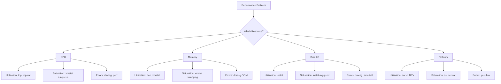
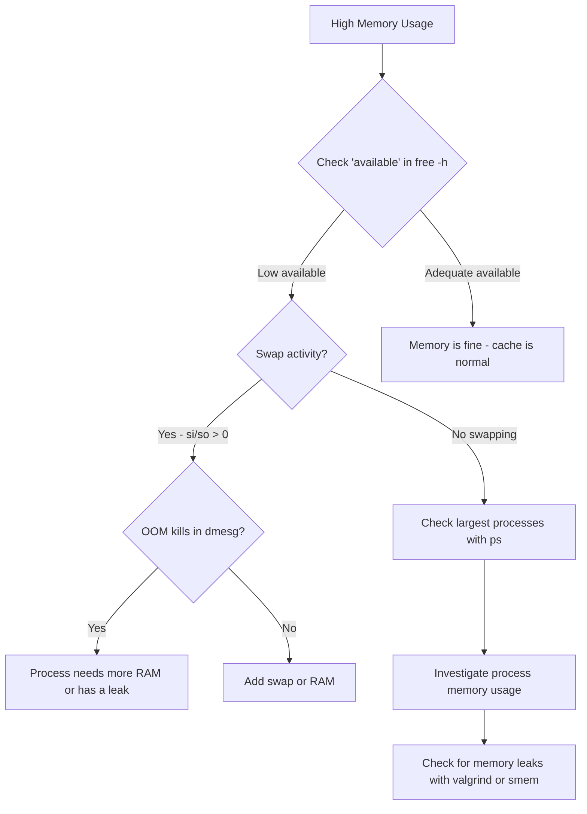
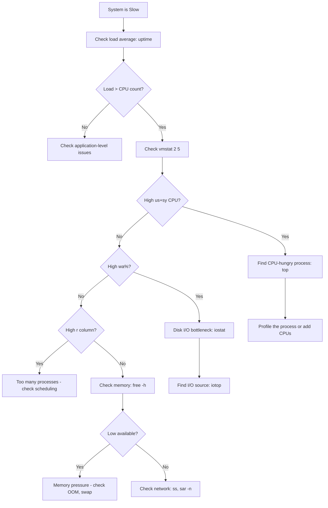

# How to Troubleshoot Linux Performance Issues

Author: [nawazdhandala](https://www.github.com/nawazdhandala)

Tags: Linux, Performance, Troubleshooting, System Administration, Monitoring

Description: A practical guide to troubleshooting Linux performance issues using top, vmstat, iostat, sar, and other system tools.

---

When a Linux server slows down, you need a systematic approach to find the bottleneck. Is it CPU, memory, disk I/O, or network? This guide walks through a practical troubleshooting methodology using tools that are available on every Linux system.

## The USE Method

The USE method (Utilization, Saturation, Errors) provides a structured framework for performance analysis.



## Step 1: Get the Big Picture

Start with a quick overview of the system before diving into specifics.

```bash
# Quick system overview - uptime and load averages
# The three numbers show 1, 5, and 15 minute load averages
# Load average should be less than the number of CPU cores
uptime

# Example output:
# 14:23:01 up 45 days, 3:12, 2 users, load average: 8.52, 4.31, 2.15
# This shows load is rising (8.52 > 4.31 > 2.15)

# Check how many CPU cores you have for context
nproc

# Quick memory overview
free -h

# Disk space check - full disks cause many problems
df -h

# Check for any kernel errors or warnings
dmesg --level=err,warn | tail -20
```

## Step 2: CPU Troubleshooting

High CPU usage is the most common performance bottleneck.

```bash
# Top processes by CPU usage
# Press '1' to see per-core breakdown
# Press 'c' to see full command line
top -o %CPU

# Better alternative: htop with tree view
htop

# Per-CPU utilization breakdown
# Watch for high %iowait (waiting on disk) or %steal (VM contention)
mpstat -P ALL 2 5

# Identify which processes are using the most CPU
# Sort by cumulative CPU time
ps aux --sort=-%cpu | head -20

# Check the run queue length with vmstat
# If 'r' column consistently exceeds CPU count, the system is CPU-saturated
vmstat 2 10
# Columns to watch:
#   r  = processes waiting for CPU (run queue)
#   us = user CPU time
#   sy = system/kernel CPU time
#   id = idle time
#   wa = I/O wait time
#   st = stolen time (in VMs)
```

## Step 3: Memory Troubleshooting

Memory issues can be subtle. Low free memory is normal on Linux because the kernel uses free memory for caches.

```bash
# Detailed memory breakdown
# 'available' is what matters, not 'free'
# available = free + reclaimable caches
free -h

# Watch for active swapping (si and so columns in vmstat)
# Non-zero si/so means the system is under memory pressure
vmstat 2 10
# si = swap in (reading from swap - pages needed from disk)
# so = swap out (writing to swap - pages being evicted)

# Find the top memory consumers
ps aux --sort=-%mem | head -20

# Check for OOM (Out of Memory) killer activity
dmesg | grep -i "oom\|out of memory" | tail -10

# Detailed /proc/meminfo for advanced analysis
cat /proc/meminfo | grep -E "MemTotal|MemFree|MemAvailable|Buffers|Cached|SwapTotal|SwapFree|Dirty"

# Check per-process memory maps
# Replace <PID> with the actual process ID
pmap -x <PID> | tail -5
```

## Memory Analysis Flow



## Step 4: Disk I/O Troubleshooting

Disk I/O bottlenecks cause high load averages and slow application response times.

```bash
# Install sysstat if not present (provides iostat and sar)
sudo apt install sysstat   # Debian/Ubuntu
sudo yum install sysstat   # RHEL/CentOS

# Disk I/O statistics per device
# Key columns:
#   %util  = how busy the device is (100% = fully saturated)
#   await  = average I/O wait time in ms (should be < 10ms for SSDs)
#   r/s, w/s = reads and writes per second
iostat -xz 2 10

# Find which processes are doing the most I/O
iotop -oP

# Check for processes in uninterruptible sleep (D state)
# These are waiting on I/O
ps aux | awk '$8 ~ /D/'

# Check disk health with SMART data
sudo smartctl -a /dev/sda

# Check filesystem-level I/O with strace on a specific process
strace -e trace=read,write,open -c -p <PID>
```

## Step 5: Network Troubleshooting

Network issues can look like application slowness.

```bash
# Check network interface statistics
# Look for errors, drops, and overruns
ip -s link show

# Check for connection issues
# Look at Recv-Q and Send-Q for backed up connections
ss -s

# Count connections by state
ss -tan | awk '{print $1}' | sort | uniq -c | sort -rn

# Check for packet drops at the kernel level
cat /proc/net/softnet_stat

# Network throughput per interface
sar -n DEV 2 5

# Check for TCP retransmissions (indicates network problems)
ss -ti | grep -E "retrans|rto"

# DNS resolution timing
dig oneuptime.com | grep "Query time"
```

## Step 6: Using sar for Historical Analysis

The `sar` tool collects and reports historical system activity.

```bash
# Enable sar data collection (usually in /etc/default/sysstat)
sudo sed -i 's/ENABLED="false"/ENABLED="true"/' /etc/default/sysstat
sudo systemctl restart sysstat

# View CPU usage from today
sar -u

# View CPU usage from a specific date
sar -u -f /var/log/sysstat/sa20

# View memory usage history
sar -r

# View disk I/O history
sar -d

# View network throughput history
sar -n DEV

# View load averages history
sar -q
```

## Troubleshooting Decision Tree



## Quick Reference: One-Liner Diagnostics

```bash
# The 60-second checklist (run these in order)
uptime                          # 1. Load averages
dmesg -T | tail                 # 2. Kernel errors
vmstat 1 5                      # 3. CPU, memory, I/O overview
mpstat -P ALL 1 3               # 4. Per-CPU breakdown
iostat -xz 1 3                  # 5. Disk I/O
free -h                         # 6. Memory
sar -n DEV 1 3                  # 7. Network throughput
ss -s                           # 8. Connection summary
top -bn1 | head -20             # 9. Top processes
df -h                           # 10. Disk space
```

## Conclusion

Linux performance troubleshooting is a skill built on methodology, not memorization. Start with the big picture using `uptime` and `vmstat`, then narrow down to the specific resource that is the bottleneck. The USE method gives you a framework: check utilization, saturation, and errors for each resource type.

For continuous performance monitoring across your entire infrastructure, [OneUptime](https://oneuptime.com) provides real-time alerting, dashboards, and historical trend analysis so you can catch performance issues before they become outages.
