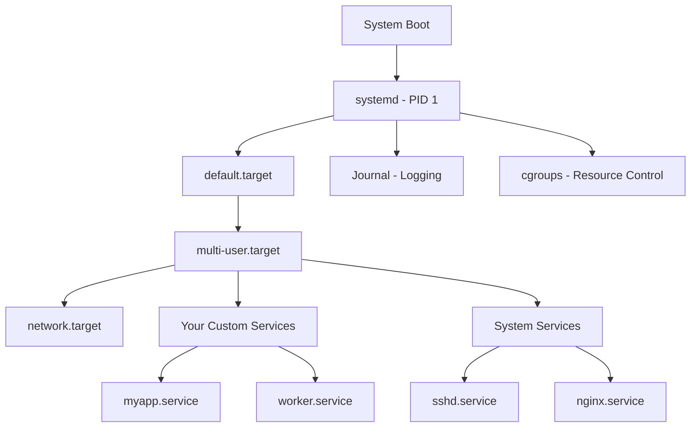
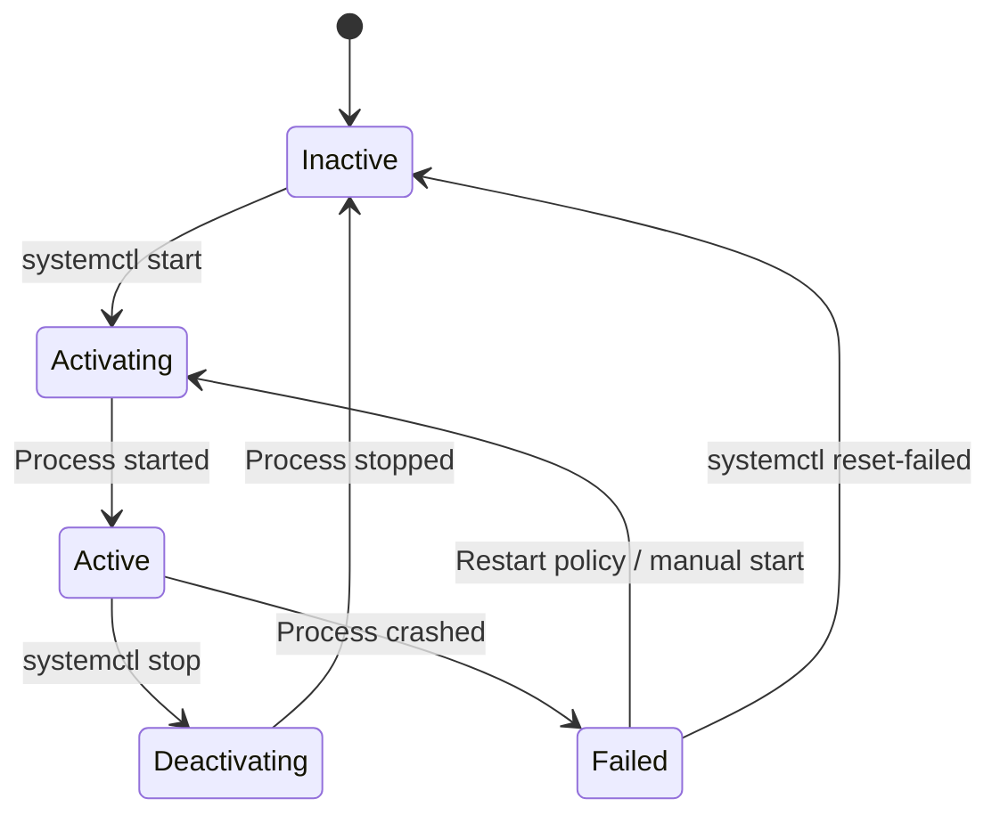
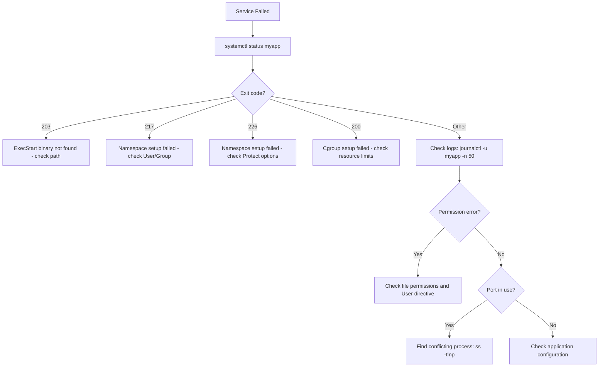

# How to Create and Manage Systemd Services on Linux

Author: [nawazdhandala](https://www.github.com/nawazdhandala)

Tags: Linux, Systemd, Services, System Administration, Automation

Description: Learn how to create, manage, and troubleshoot systemd services on Linux for running applications and daemons.

---

Systemd is the init system and service manager on nearly every modern Linux distribution. Whether you are deploying a web application, running a background worker, or managing a database, systemd handles starting, stopping, restarting, and monitoring your processes. This guide covers everything you need to know about creating and managing systemd services.

## How Systemd Works



## Essential systemctl Commands

```bash
# Start a service
sudo systemctl start nginx

# Stop a service
sudo systemctl stop nginx

# Restart a service (stop then start)
sudo systemctl restart nginx

# Reload configuration without stopping (if supported)
sudo systemctl reload nginx

# Check the status of a service
sudo systemctl status nginx

# Enable a service to start at boot
sudo systemctl enable nginx

# Disable a service from starting at boot
sudo systemctl disable nginx

# Enable and start in one command
sudo systemctl enable --now nginx

# Check if a service is enabled
systemctl is-enabled nginx

# Check if a service is active (running)
systemctl is-active nginx

# List all running services
systemctl list-units --type=service --state=running

# List all failed services
systemctl list-units --type=service --state=failed
```

## Creating a Basic Service

Service unit files go in `/etc/systemd/system/`. Let us create a service for a Node.js application.

```ini
# /etc/systemd/system/myapp.service
# Service unit file for a Node.js web application
[Unit]
# Human-readable description shown in status output
Description=My Node.js Web Application
# Start after networking is available
After=network.target
# Optional: start after the database is ready
After=postgresql.service
Wants=postgresql.service

[Service]
# Type=simple means systemd considers the service started
# as soon as the ExecStart process is running
Type=simple

# Run the service as a non-root user
User=myapp
Group=myapp

# Working directory for the application
WorkingDirectory=/opt/myapp

# Environment variables
Environment=NODE_ENV=production
Environment=PORT=3000

# The command to start the application
ExecStart=/usr/bin/node /opt/myapp/server.js

# Command to reload configuration (optional)
ExecReload=/bin/kill -HUP $MAINPID

# Restart the service if it crashes
Restart=on-failure

# Wait 5 seconds before restarting
RestartSec=5

# Give up after 5 restart attempts in 60 seconds
StartLimitBurst=5
StartLimitIntervalSec=60

# Send SIGTERM to stop, wait 30 seconds, then SIGKILL
TimeoutStopSec=30

# Log stdout and stderr to the journal
StandardOutput=journal
StandardError=journal

# Identifier for log filtering
SyslogIdentifier=myapp

[Install]
# Start this service when the system reaches multi-user mode
WantedBy=multi-user.target
```

```bash
# After creating or modifying a unit file, reload systemd
sudo systemctl daemon-reload

# Start the service
sudo systemctl start myapp

# Enable it for boot
sudo systemctl enable myapp

# Check it is running
sudo systemctl status myapp
```

## Service Lifecycle



## Service Types Explained

```ini
# Type=simple (default)
# systemd considers the service started immediately
# Use for processes that stay in the foreground
Type=simple
ExecStart=/usr/bin/myapp

# Type=exec
# Like simple, but systemd waits for the binary to execute
Type=exec
ExecStart=/usr/bin/myapp

# Type=forking
# For traditional daemons that fork into the background
# Must specify PIDFile so systemd can track the main process
Type=forking
PIDFile=/var/run/myapp.pid
ExecStart=/usr/bin/myapp --daemon

# Type=oneshot
# For tasks that run once and exit
# systemd waits for the process to finish before marking active
Type=oneshot
ExecStart=/usr/local/bin/cleanup.sh
RemainAfterExit=yes

# Type=notify
# The service sends a readiness notification to systemd
# Requires sd_notify() in the application code
Type=notify
ExecStart=/usr/bin/myapp
NotifyAccess=main
```

## Environment Variables and Files

```ini
# Method 1: Inline environment variables
[Service]
Environment=DB_HOST=localhost
Environment=DB_PORT=5432
Environment=DB_NAME=myapp

# Method 2: Load from an environment file
# This is preferred for secrets and many variables
[Service]
EnvironmentFile=/etc/myapp/env

# Method 3: Load from multiple files using a directory
[Service]
EnvironmentFile=-/etc/myapp/env.d/*
# The dash (-) prefix means "don't fail if file is missing"
```

```bash
# /etc/myapp/env
# Environment file for the application
# This file should have restricted permissions
DB_HOST=localhost
DB_PORT=5432
DB_NAME=myapp
DB_PASSWORD=secret123
```

```bash
# Restrict permissions on the environment file
sudo chmod 600 /etc/myapp/env
sudo chown root:root /etc/myapp/env
```

## Resource Limits and Security

```ini
# /etc/systemd/system/myapp.service
[Service]
# Memory limit - service is killed if it exceeds this
MemoryMax=512M

# CPU quota - 200% means 2 full cores on a multi-core system
CPUQuota=200%

# Limit number of open files
LimitNOFILE=65536

# Limit number of processes
LimitNPROC=4096

# Security hardening options
# Prevent the service from gaining new privileges
NoNewPrivileges=yes

# Make the filesystem read-only except for specified paths
ProtectSystem=strict
ReadWritePaths=/var/lib/myapp /var/log/myapp

# Restrict access to home directories
ProtectHome=yes

# Private /tmp directory for this service only
PrivateTmp=yes

# Restrict network access to specific address families
RestrictAddressFamilies=AF_INET AF_INET6 AF_UNIX

# Prevent loading kernel modules
ProtectKernelModules=yes
```

## Viewing Logs with journalctl

Systemd integrates logging through the journal.

```bash
# View all logs for a service
journalctl -u myapp

# Follow logs in real time (like tail -f)
journalctl -u myapp -f

# View logs since the last boot
journalctl -u myapp -b

# View logs from the last hour
journalctl -u myapp --since "1 hour ago"

# View logs between specific times
journalctl -u myapp --since "2026-02-20 10:00" --until "2026-02-20 12:00"

# Show only error-level messages and above
journalctl -u myapp -p err

# Output in JSON format for parsing
journalctl -u myapp -o json-pretty | head -50

# Check how much disk space the journal is using
journalctl --disk-usage

# Limit journal size
sudo journalctl --vacuum-size=500M
```

## Troubleshooting Failed Services



```bash
# Common troubleshooting commands

# Check the service status and recent logs
sudo systemctl status myapp -l --no-pager

# View the last 50 log lines
journalctl -u myapp -n 50 --no-pager

# Check if the binary exists and is executable
ls -la /usr/bin/node

# Check if the user exists
id myapp

# Check if the port is available
ss -tlnp | grep 3000

# Verify the unit file syntax
systemd-analyze verify /etc/systemd/system/myapp.service

# Check service dependencies
systemctl list-dependencies myapp

# Reset the failed state counter
sudo systemctl reset-failed myapp
```

## Timer Units (Systemd Cron)

Systemd timers are a modern alternative to cron jobs.

```ini
# /etc/systemd/system/backup.service
# The service that runs the actual backup
[Unit]
Description=Database Backup

[Service]
Type=oneshot
User=backup
ExecStart=/usr/local/bin/backup-database.sh
```

```ini
# /etc/systemd/system/backup.timer
# The timer that schedules the backup service
[Unit]
Description=Run database backup daily

[Timer]
# Run at 2:00 AM every day
OnCalendar=*-*-* 02:00:00

# Run immediately if a scheduled run was missed (e.g., system was off)
Persistent=true

# Add random delay up to 15 minutes to avoid thundering herd
RandomizedDelaySec=900

[Install]
WantedBy=timers.target
```

```bash
# Enable and start the timer
sudo systemctl enable --now backup.timer

# List all active timers
systemctl list-timers --all

# Check when the timer last ran and will next run
systemctl status backup.timer
```

## Conclusion

Systemd is a powerful service manager once you understand its building blocks. Unit files, journal logging, resource controls, and timer units cover most service management needs. Use the security hardening directives to lock down your services, and lean on `journalctl` for debugging.

For monitoring your systemd services in production, [OneUptime](https://oneuptime.com) provides process monitoring, log aggregation, and alerting that integrates with your existing infrastructure to catch service failures before they impact your users.
