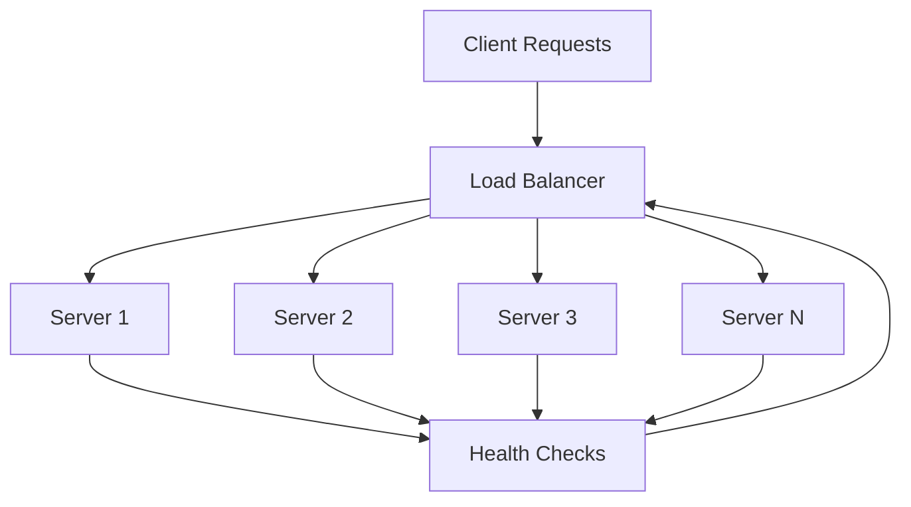
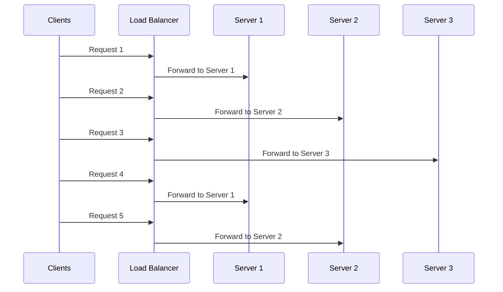
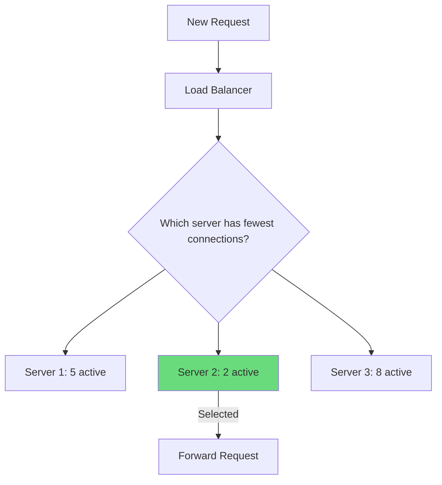
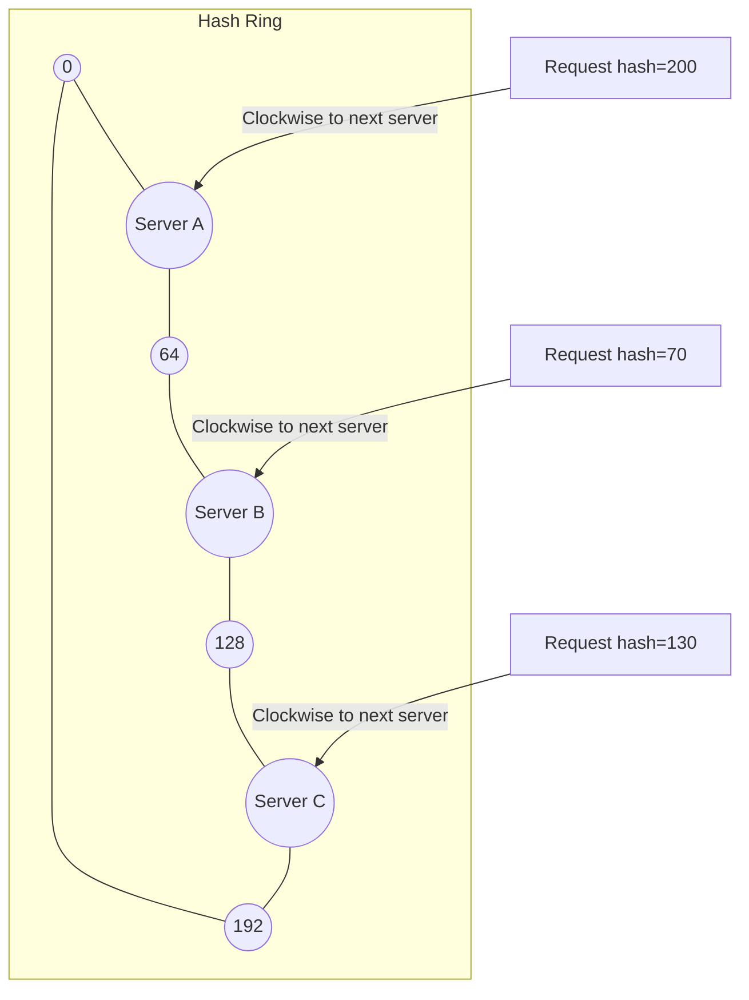
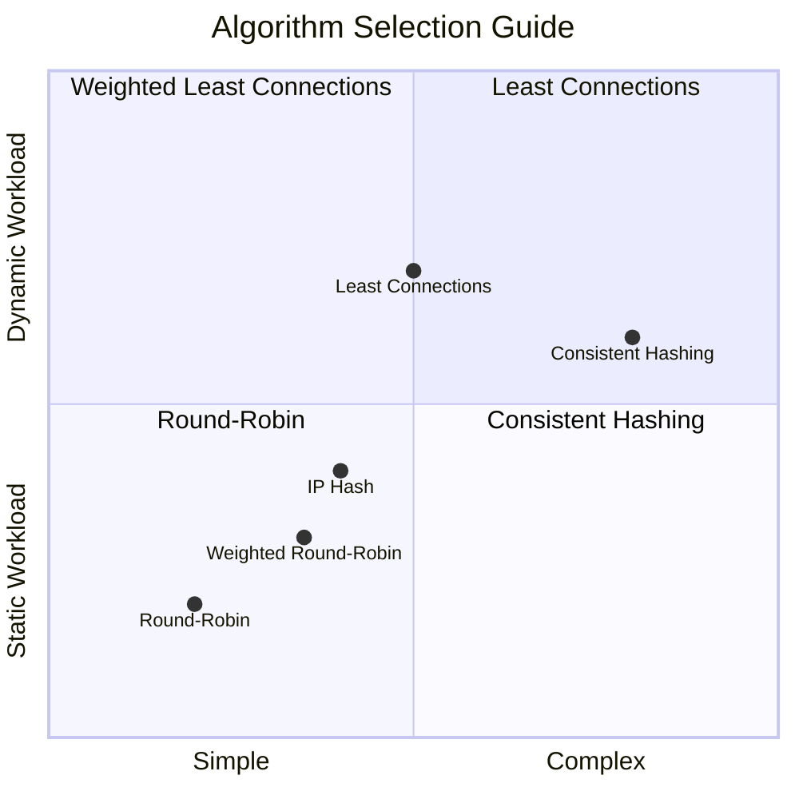
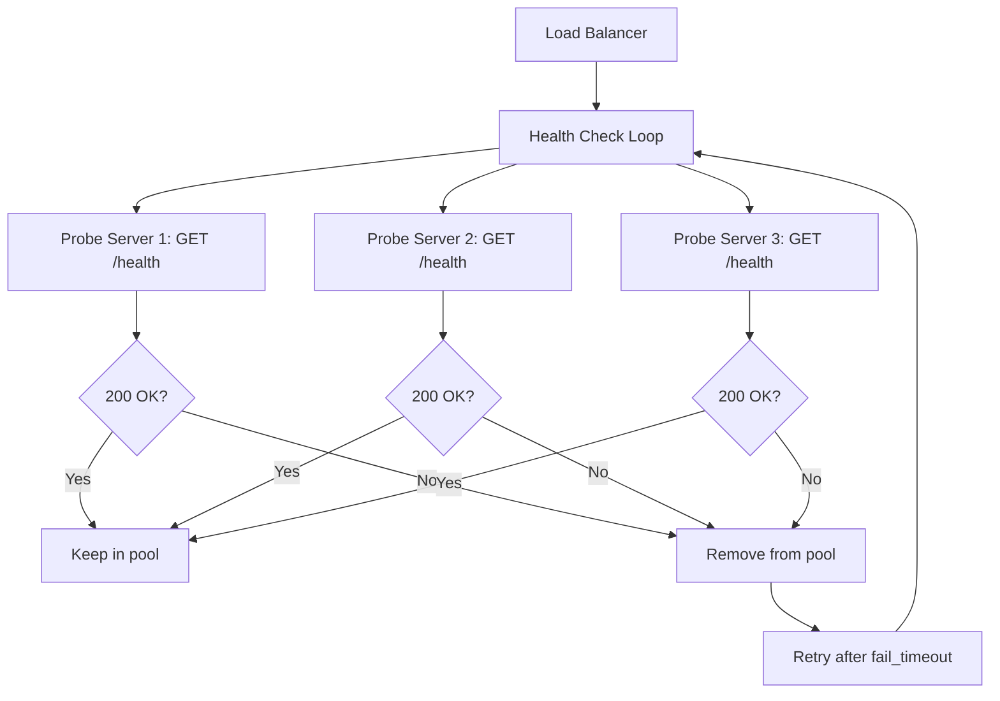

# Understanding Load Balancing Algorithms and Strategies

Author: [nawazdhandala](https://www.github.com/nawazdhandala)

Tags: Load Balancing, Algorithms, High Availability, Scaling, Networking

Description: A comprehensive guide to load balancing algorithms including round-robin, least connections, consistent hashing, and more.

---

Load balancing distributes incoming traffic across multiple servers so that no single server bears too much load. Choosing the right algorithm depends on your application's characteristics: stateless vs stateful, uniform vs variable request costs, and latency sensitivity. This guide breaks down each major algorithm with its tradeoffs.

## Load Balancing Overview



## Round-Robin

The simplest algorithm. Requests are distributed to servers in sequential order.



```python
# round_robin.py
# Simple round-robin load balancer implementation

class RoundRobinBalancer:
    def __init__(self, servers):
        # List of backend server addresses
        self.servers = servers
        # Index tracking which server to use next
        self.current_index = 0

    def get_next_server(self):
        """Return the next server in rotation."""
        server = self.servers[self.current_index]
        # Move to the next server, wrapping around to the start
        self.current_index = (self.current_index + 1) % len(self.servers)
        return server


# Usage
balancer = RoundRobinBalancer(["10.0.0.1", "10.0.0.2", "10.0.0.3"])
for i in range(6):
    print(f"Request {i+1} -> {balancer.get_next_server()}")
# Output: 10.0.0.1, 10.0.0.2, 10.0.0.3, 10.0.0.1, 10.0.0.2, 10.0.0.3
```

**Pros:** Simple, no state needed, even distribution over time.
**Cons:** Ignores server load, ignores request cost differences.
**Best for:** Stateless services with uniform request processing times.

## Weighted Round-Robin

Like round-robin, but servers with more capacity receive more requests.

```python
# weighted_round_robin.py
# Distributes traffic proportional to server weights

class WeightedRoundRobinBalancer:
    def __init__(self, servers):
        # servers is a list of (address, weight) tuples
        self.servers = servers
        # Build an expanded list based on weights
        # Server with weight 3 appears 3 times
        self.rotation = []
        for address, weight in servers:
            self.rotation.extend([address] * weight)
        self.current_index = 0

    def get_next_server(self):
        """Return the next server based on weight distribution."""
        server = self.rotation[self.current_index]
        self.current_index = (self.current_index + 1) % len(self.rotation)
        return server


# Usage: Server 1 has 2x capacity of servers 2 and 3
balancer = WeightedRoundRobinBalancer([
    ("10.0.0.1", 4),  # Large server - gets 4 out of 7 requests
    ("10.0.0.2", 2),  # Medium server - gets 2 out of 7 requests
    ("10.0.0.3", 1),  # Small server - gets 1 out of 7 requests
])
```

**Best for:** Heterogeneous server pools where machines have different capacities.

## Least Connections

Routes each new request to the server with the fewest active connections. This naturally adapts to variable request processing times.



```python
# least_connections.py
# Routes requests to the server with the fewest active connections

import threading

class LeastConnectionsBalancer:
    def __init__(self, servers):
        self.servers = servers
        # Track active connection count per server
        self.connections = {server: 0 for server in servers}
        self.lock = threading.Lock()

    def get_next_server(self):
        """Return the server with the fewest active connections."""
        with self.lock:
            # Find the server with minimum connections
            server = min(self.connections, key=self.connections.get)
            # Increment connection count
            self.connections[server] += 1
            return server

    def release_server(self, server):
        """Decrement connection count when a request completes."""
        with self.lock:
            self.connections[server] = max(0, self.connections[server] - 1)


# Usage
balancer = LeastConnectionsBalancer(["10.0.0.1", "10.0.0.2", "10.0.0.3"])
server = balancer.get_next_server()
# ... handle request ...
balancer.release_server(server)
```

**Pros:** Adapts to slow requests, handles variable workloads well.
**Cons:** Requires tracking connection state, slightly more overhead.
**Best for:** Applications with variable request processing times.

## IP Hash

Uses a hash of the client's IP address to determine which server handles the request. The same client always reaches the same server.

```python
# ip_hash.py
# Routes requests based on client IP hash for session affinity

import hashlib

class IPHashBalancer:
    def __init__(self, servers):
        self.servers = servers

    def get_server(self, client_ip):
        """Return a consistent server for a given client IP."""
        # Hash the client IP to get a deterministic number
        ip_hash = int(hashlib.md5(client_ip.encode()).hexdigest(), 16)
        # Map the hash to a server index
        index = ip_hash % len(self.servers)
        return self.servers[index]


# Usage - same IP always hits the same server
balancer = IPHashBalancer(["10.0.0.1", "10.0.0.2", "10.0.0.3"])
print(balancer.get_server("192.168.1.100"))  # Always the same result
print(balancer.get_server("192.168.1.101"))  # Might be different
```

**Pros:** Simple session affinity without cookies.
**Cons:** Uneven distribution if IP ranges cluster, breaks with NAT.
**Best for:** Legacy applications that need session stickiness without application changes.

## Consistent Hashing

Distributes requests across servers using a hash ring. When servers are added or removed, only a fraction of requests are remapped.



```python
# consistent_hashing.py
# Consistent hashing distributes keys with minimal remapping

import hashlib
import bisect

class ConsistentHashBalancer:
    def __init__(self, servers, replicas=150):
        self.replicas = replicas
        self.ring = []  # Sorted list of hash positions
        self.hash_to_server = {}  # Maps hash positions to servers

        for server in servers:
            self._add_server(server)

    def _hash(self, key):
        """Generate a consistent hash for a string key."""
        return int(hashlib.md5(key.encode()).hexdigest(), 16)

    def _add_server(self, server):
        """Add a server to the hash ring with virtual nodes."""
        for i in range(self.replicas):
            # Create virtual nodes for better distribution
            virtual_key = f"{server}:{i}"
            h = self._hash(virtual_key)
            self.ring.append(h)
            self.hash_to_server[h] = server
        # Keep the ring sorted for binary search
        self.ring.sort()

    def get_server(self, key):
        """Find the server responsible for a given key."""
        if not self.ring:
            return None
        h = self._hash(key)
        # Find the first ring position >= the key hash
        idx = bisect.bisect_left(self.ring, h)
        # Wrap around to the start of the ring if needed
        if idx >= len(self.ring):
            idx = 0
        return self.hash_to_server[self.ring[idx]]


# Usage
balancer = ConsistentHashBalancer(["10.0.0.1", "10.0.0.2", "10.0.0.3"])
print(balancer.get_server("user:12345"))
print(balancer.get_server("session:abcde"))
```

**Pros:** Minimal disruption when servers change, good for caches.
**Cons:** More complex, requires virtual nodes for even distribution.
**Best for:** Distributed caches, databases, any system where key-to-server mapping matters.

## Algorithm Comparison



| Algorithm | Statefulness | Evenness | Server Changes | Use Case |
|-----------|-------------|----------|---------------|----------|
| Round-Robin | None | Good over time | No impact | Stateless APIs |
| Weighted RR | None | Proportional | Manual weight adjustment | Mixed server sizes |
| Least Connections | Per-connection | Excellent | Automatic | Variable workloads |
| IP Hash | None | Depends on IPs | Reshuffles all | Session affinity |
| Consistent Hash | None | Good with vnodes | Minimal remapping | Caches, databases |

## Health Checks

No load balancing algorithm works well without health checks to remove failed servers.

```nginx
# nginx.conf
# Load balancing with health checks
upstream backend {
    # Least connections algorithm
    least_conn;

    # Backend servers with health check parameters
    # max_fails: number of failures before marking unhealthy
    # fail_timeout: how long to wait before retrying a failed server
    server 10.0.0.1:8080 max_fails=3 fail_timeout=30s;
    server 10.0.0.2:8080 max_fails=3 fail_timeout=30s;
    server 10.0.0.3:8080 max_fails=3 fail_timeout=30s;

    # Backup server - only used when all primary servers are down
    server 10.0.0.4:8080 backup;
}

server {
    listen 80;
    location / {
        proxy_pass http://backend;
        proxy_connect_timeout 5s;
        proxy_read_timeout 30s;
        proxy_next_upstream error timeout http_500 http_502 http_503;
    }
}
```

## Health Check Flow



## Conclusion

There is no universally best load balancing algorithm. Round-robin is a solid default for stateless services. Least connections handles variable workloads well. Consistent hashing is essential for caches and sharded databases. The right choice depends on your application's request patterns, statefulness requirements, and infrastructure constraints.

For monitoring your load-balanced applications and detecting when individual backends go unhealthy, [OneUptime](https://oneuptime.com) provides endpoint monitoring, alerting, and status pages that work across your entire infrastructure so you can catch failures no matter where they occur in the stack.
