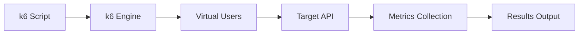
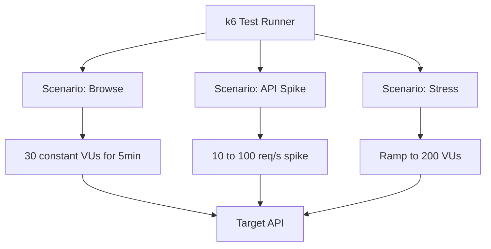

# How to Perform Load Testing with k6

Author: [nawazdhandala](https://www.github.com/nawazdhandala)

Tags: Load Testing, k6, Performance, Stress Testing, API

Description: Learn how to use k6 for load testing APIs including writing test scripts, defining scenarios, and analyzing results.

---

Load testing tells you how your system behaves under traffic. k6 is an open-source load testing tool that uses JavaScript to define test scripts, making it easy for developers to write and maintain performance tests. This guide covers everything from your first script to advanced scenarios.

## Why k6

k6 is developer-friendly. You write tests in JavaScript, run them from the command line, and get results in real time. It is designed for testing APIs, microservices, and websites.



## Your First k6 Script

```javascript
// basic_test.js
// A simple load test that sends GET requests to an API

import http from "k6/http";
import { check, sleep } from "k6";

// Options define how the test runs
export const options = {
  // Ramp up to 10 virtual users over 30 seconds,
  // hold for 1 minute, then ramp down
  stages: [
    { duration: "30s", target: 10 }, // Ramp up
    { duration: "1m", target: 10 },  // Hold steady
    { duration: "10s", target: 0 },  // Ramp down
  ],
};

// The default function runs once per iteration for each virtual user
export default function () {
  // Send a GET request to the API
  const response = http.get("https://api.example.com/users");

  // Validate the response
  check(response, {
    "status is 200": (r) => r.status === 200,
    "response time < 500ms": (r) => r.timings.duration < 500,
    "response has users": (r) => JSON.parse(r.body).length > 0,
  });

  // Simulate user think time between requests
  sleep(1);
}
```

Run it:

```bash
k6 run basic_test.js
```

## Defining Thresholds

Thresholds let you set pass/fail criteria for your test. If any threshold is breached, k6 exits with a non-zero code - perfect for CI/CD pipelines.

```javascript
// threshold_test.js
// Load test with pass/fail thresholds

import http from "k6/http";
import { check, sleep } from "k6";

export const options = {
  stages: [
    { duration: "1m", target: 50 },
    { duration: "3m", target: 50 },
    { duration: "30s", target: 0 },
  ],

  // Thresholds define success criteria
  thresholds: {
    // 95th percentile response time must be under 500ms
    http_req_duration: ["p(95)<500"],

    // 99th percentile must be under 1 second
    "http_req_duration{expected_response:true}": ["p(99)<1000"],

    // Error rate must be below 1%
    http_req_failed: ["rate<0.01"],

    // At least 95% of checks must pass
    checks: ["rate>0.95"],
  },
};

export default function () {
  const response = http.get("https://api.example.com/health");

  check(response, {
    "status is 200": (r) => r.status === 200,
    "response time OK": (r) => r.timings.duration < 300,
  });

  sleep(1);
}
```

## Testing Multiple Endpoints

Use groups to organize requests by endpoint and track their metrics separately.

```javascript
// multi_endpoint_test.js
// Test multiple API endpoints with different request types

import http from "k6/http";
import { check, group, sleep } from "k6";

export const options = {
  vus: 20,
  duration: "2m",
  thresholds: {
    "http_req_duration{group:::List Users}": ["p(95)<400"],
    "http_req_duration{group:::Create User}": ["p(95)<800"],
  },
};

export default function () {
  // Group 1: List users (GET request)
  group("List Users", function () {
    const response = http.get("https://api.example.com/users?limit=20");

    check(response, {
      "list status 200": (r) => r.status === 200,
      "list returns array": (r) => Array.isArray(JSON.parse(r.body).data),
    });
  });

  sleep(1);

  // Group 2: Create a user (POST request)
  group("Create User", function () {
    const payload = JSON.stringify({
      name: `User ${Date.now()}`,
      email: `user-${Date.now()}@example.com`,
    });

    // Set content type header for JSON body
    const params = {
      headers: { "Content-Type": "application/json" },
    };

    const response = http.post("https://api.example.com/users", payload, params);

    check(response, {
      "create status 201": (r) => r.status === 201,
      "create returns id": (r) => JSON.parse(r.body).id !== undefined,
    });
  });

  sleep(2);
}
```

## Advanced Scenarios

k6 scenarios let you define complex traffic patterns with multiple workloads running in parallel.

```javascript
// scenario_test.js
// Multiple scenarios simulating different user behaviors

import http from "k6/http";
import { check, sleep } from "k6";

export const options = {
  scenarios: {
    // Scenario 1: Steady browsing traffic
    browse: {
      executor: "constant-vus",
      vus: 30,
      duration: "5m",
      exec: "browsePages",
    },

    // Scenario 2: Spike of API calls
    api_spike: {
      executor: "ramping-arrival-rate",
      startRate: 10,          // Start at 10 requests per second
      timeUnit: "1s",
      preAllocatedVUs: 50,
      maxVUs: 200,
      stages: [
        { duration: "1m", target: 10 },   // Warm up
        { duration: "30s", target: 100 },  // Spike
        { duration: "1m", target: 10 },    // Cool down
      ],
      exec: "apiCalls",
    },

    // Scenario 3: Gradual ramp for stress testing
    stress: {
      executor: "ramping-vus",
      startVUs: 0,
      stages: [
        { duration: "2m", target: 100 },
        { duration: "3m", target: 100 },
        { duration: "1m", target: 200 },  // Push past normal capacity
        { duration: "2m", target: 200 },
        { duration: "1m", target: 0 },
      ],
      exec: "stressEndpoint",
    },
  },
};

// Each scenario calls a different function
export function browsePages() {
  const response = http.get("https://api.example.com/products");
  check(response, { "browse 200": (r) => r.status === 200 });
  sleep(3);
}

export function apiCalls() {
  const response = http.get("https://api.example.com/users/me");
  check(response, { "api 200": (r) => r.status === 200 });
}

export function stressEndpoint() {
  const response = http.get("https://api.example.com/search?q=test");
  check(response, { "stress 200": (r) => r.status === 200 });
  sleep(1);
}
```



## Custom Metrics

Track business-specific metrics alongside the built-in HTTP metrics.

```javascript
// custom_metrics_test.js
// Define and track custom metrics

import http from "k6/http";
import { check } from "k6";
import { Counter, Trend, Rate } from "k6/metrics";

// Custom metrics for business logic tracking
const orderCount = new Counter("orders_created");
const orderDuration = new Trend("order_creation_time");
const orderSuccess = new Rate("order_success_rate");

export const options = {
  vus: 10,
  duration: "2m",
  thresholds: {
    orders_created: ["count>50"],           // Must create at least 50 orders
    order_creation_time: ["p(95)<1000"],    // 95th percentile under 1s
    order_success_rate: ["rate>0.95"],      // 95% success rate
  },
};

export default function () {
  const payload = JSON.stringify({
    product_id: "prod-123",
    quantity: 1,
  });

  const params = {
    headers: { "Content-Type": "application/json" },
  };

  const response = http.post(
    "https://api.example.com/orders",
    payload,
    params
  );

  // Record custom metrics
  const success = response.status === 201;
  orderCount.add(1);
  orderDuration.add(response.timings.duration);
  orderSuccess.add(success);

  check(response, {
    "order created": (r) => r.status === 201,
  });
}
```

## CI/CD Integration

```yaml
# .github/workflows/load-test.yml

name: Load Test
on:
  schedule:
    - cron: "0 6 * * 1"  # Run every Monday at 6 AM

jobs:
  load-test:
    runs-on: ubuntu-latest
    steps:
      - uses: actions/checkout@v4

      - name: Install k6
        run: |
          sudo gpg -k
          sudo gpg --no-default-keyring --keyring /usr/share/keyrings/k6-archive-keyring.gpg --keyserver hkp://keyserver.ubuntu.com:80 --recv-keys C5AD17C747E3415A3642D57D77C6C491D6AC1D68
          echo "deb [signed-by=/usr/share/keyrings/k6-archive-keyring.gpg] https://dl.k6.io/deb stable main" | sudo tee /etc/apt/sources.list.d/k6.list
          sudo apt-get update && sudo apt-get install k6

      - name: Run load test
        run: k6 run --out json=results.json tests/load/scenario_test.js

      - name: Upload results
        uses: actions/upload-artifact@v4
        with:
          name: k6-results
          path: results.json
```

## Understanding k6 Output

```text
     scenarios: (100.00%) 1 scenario, 50 max VUs, 4m0s max duration
                default: Up to 50 VUs for 3m30s

     checks.....................: 98.50%  4925 out of 5000
     http_req_blocked...........: avg=2.1ms   p(95)=8.2ms
     http_req_connecting........: avg=1.8ms   p(95)=7.1ms
     http_req_duration..........: avg=125ms   p(95)=340ms
     http_req_failed............: 0.30%   15 out of 5000
     http_req_receiving.........: avg=0.5ms   p(95)=1.2ms
     http_req_sending...........: avg=0.2ms   p(95)=0.5ms
     http_req_waiting...........: avg=124ms   p(95)=338ms
     http_reqs..................: 5000    23.8/s
     iteration_duration.........: avg=1.13s   p(95)=1.35s
     iterations.................: 5000    23.8/s
     vus........................: 50      min=1  max=50
     vus_max....................: 50      min=50 max=50
```

Key metrics to watch:

- **http_req_duration p(95)**: 95th percentile response time
- **http_req_failed**: Error rate
- **http_reqs**: Total throughput (requests per second)
- **checks**: Percentage of checks that passed

## Summary

k6 makes load testing accessible to developers. Write tests in JavaScript, define thresholds for pass/fail criteria, use scenarios for complex traffic patterns, and integrate everything into your CI/CD pipeline. Start with simple tests and gradually add more realistic scenarios.

Combine k6 load testing with [OneUptime](https://oneuptime.com) monitoring to observe how your production systems respond under load. Track response times, error rates, and resource usage during and after load tests to validate your performance improvements.
