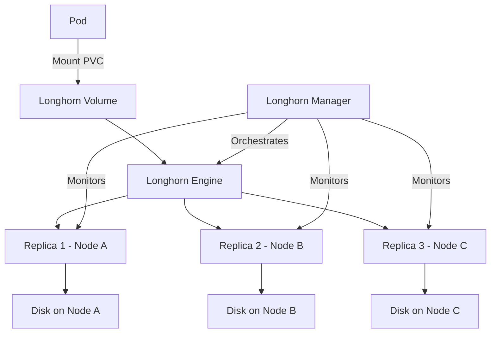
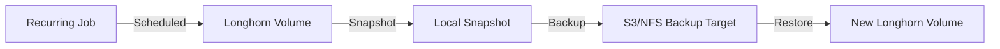
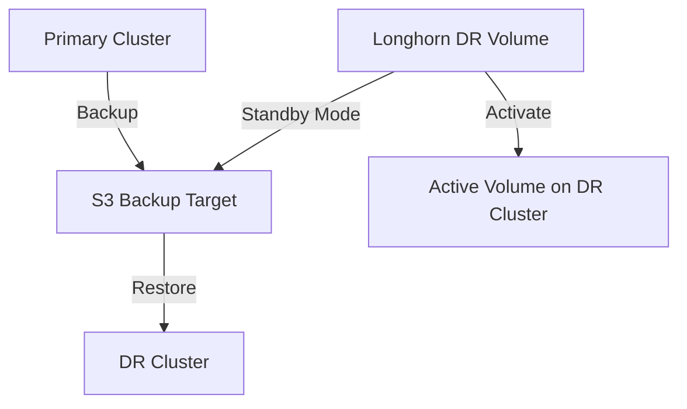

# How to Use Longhorn for Distributed Block Storage on Kubernetes

Author: [nawazdhandala](https://www.github.com/nawazdhandala)

Tags: Longhorn, Storage, Kubernetes, Block Storage, Distributed

Description: Learn how to deploy Longhorn for distributed block storage on Kubernetes with replication, snapshots, and DR.

---

## What is Longhorn?

Longhorn is a lightweight, reliable, and easy-to-use distributed block storage system for Kubernetes. Developed by Rancher Labs (now part of SUSE), Longhorn creates a dedicated storage controller for each block device volume and replicates data across multiple nodes. This gives you highly available persistent storage without needing external storage systems like NFS, Ceph, or cloud provider block storage.

## How Longhorn Works



Each Longhorn volume has its own dedicated storage controller (engine) that replicates data synchronously across multiple nodes. If a node fails, the volume remains available through the remaining replicas. Longhorn automatically rebuilds replicas on healthy nodes.

## Prerequisites

```bash
# Longhorn requires open-iscsi on all nodes
# Install on Ubuntu/Debian
sudo apt-get update
sudo apt-get install -y open-iscsi
sudo systemctl enable iscsid
sudo systemctl start iscsid

# Install on RHEL/CentOS
sudo yum install -y iscsi-initiator-utils
sudo systemctl enable iscsid
sudo systemctl start iscsid

# Verify the environment meets Longhorn requirements
# The Longhorn team provides a check script
curl -sSfL https://raw.githubusercontent.com/longhorn/longhorn/v1.6.0/scripts/environment_check.sh | bash
```

## Installing Longhorn

```bash
# Method 1: Install with Helm (recommended)
helm repo add longhorn https://charts.longhorn.io
helm repo update

# Install Longhorn in its own namespace
helm install longhorn longhorn/longhorn \
  --namespace longhorn-system \
  --create-namespace \
  --set defaultSettings.defaultReplicaCount=3 \
  --set defaultSettings.defaultDataLocality=best-effort \
  --set persistence.defaultClassReplicaCount=3

# Method 2: Install with kubectl
kubectl apply -f https://raw.githubusercontent.com/longhorn/longhorn/v1.6.0/deploy/longhorn.yaml

# Wait for all Longhorn components to be ready
kubectl -n longhorn-system get pods -w

# Verify the StorageClass was created
kubectl get storageclass longhorn
```

## Accessing the Longhorn UI

```bash
# Port-forward to access the Longhorn dashboard
kubectl port-forward -n longhorn-system svc/longhorn-frontend 8080:80 &

# Open the UI in your browser at http://localhost:8080
# The UI shows volumes, nodes, disks, snapshots, and backups
```

For production, expose the UI through an Ingress with authentication:

```yaml
# longhorn-ingress.yaml
# Expose the Longhorn UI with basic auth
apiVersion: networking.k8s.io/v1
kind: Ingress
metadata:
  name: longhorn-ingress
  namespace: longhorn-system
  annotations:
    nginx.ingress.kubernetes.io/auth-type: basic
    nginx.ingress.kubernetes.io/auth-secret: longhorn-basic-auth
    nginx.ingress.kubernetes.io/auth-realm: "Longhorn Dashboard"
spec:
  ingressClassName: nginx
  rules:
    - host: longhorn.internal.example.com
      http:
        paths:
          - path: /
            pathType: Prefix
            backend:
              service:
                name: longhorn-frontend
                port:
                  number: 80
```

## Creating Persistent Volumes

```yaml
# pvc-example.yaml
# Create a PersistentVolumeClaim using Longhorn
apiVersion: v1
kind: PersistentVolumeClaim
metadata:
  name: app-data
  namespace: default
spec:
  accessModes:
    - ReadWriteOnce                        # Block storage is RWO
  storageClassName: longhorn               # Use the Longhorn StorageClass
  resources:
    requests:
      storage: 10Gi                        # Request 10 GB of storage
---
# Pod that uses the PVC
apiVersion: v1
kind: Pod
metadata:
  name: app
  namespace: default
spec:
  containers:
    - name: app
      image: nginx:latest
      volumeMounts:
        - name: data
          mountPath: /data                 # Mount the volume at /data
  volumes:
    - name: data
      persistentVolumeClaim:
        claimName: app-data                # Reference the PVC
```

## Custom StorageClass

```yaml
# longhorn-storageclass.yaml
# Custom StorageClass with specific replication and performance settings
apiVersion: storage.k8s.io/v1
kind: StorageClass
metadata:
  name: longhorn-ha
provisioner: driver.longhorn.io
allowVolumeExpansion: true                 # Allow resizing PVCs
reclaimPolicy: Retain                      # Keep data when PVC is deleted
parameters:
  numberOfReplicas: "3"                    # 3 replicas across nodes
  staleReplicaTimeout: "2880"              # 48 hours before removing stale replicas
  fromBackup: ""
  fsType: "ext4"                           # Filesystem type
  dataLocality: "best-effort"              # Try to keep a replica on the same node
  recurringJobSelector: '[
    {
      "name": "snapshot-daily",
      "isGroup": false
    }
  ]'
---
# StorageClass optimized for databases
apiVersion: storage.k8s.io/v1
kind: StorageClass
metadata:
  name: longhorn-database
provisioner: driver.longhorn.io
allowVolumeExpansion: true
reclaimPolicy: Retain
parameters:
  numberOfReplicas: "3"
  dataLocality: "strict-local"             # Keep a replica on the pod's node
  fsType: "ext4"
```

## Snapshots and Backups



```bash
# Configure a backup target (S3-compatible storage)
# This can be MinIO, AWS S3, or any S3-compatible endpoint
kubectl -n longhorn-system edit settings backup-target

# Set the backup target to an S3 bucket
# Value: s3://longhorn-backups@us-east-1/
```

```yaml
# recurring-snapshot-job.yaml
# Create a recurring job for automatic snapshots and backups
apiVersion: longhorn.io/v1beta2
kind: RecurringJob
metadata:
  name: snapshot-daily
  namespace: longhorn-system
spec:
  cron: "0 2 * * *"                        # Run at 2 AM daily
  task: snapshot                            # Take a snapshot
  retain: 7                                 # Keep the last 7 snapshots
  concurrency: 2                            # Process 2 volumes at a time
  labels:
    app: critical                           # Apply to volumes with this label
---
# Recurring backup job
apiVersion: longhorn.io/v1beta2
kind: RecurringJob
metadata:
  name: backup-weekly
  namespace: longhorn-system
spec:
  cron: "0 3 * * 0"                        # Run at 3 AM every Sunday
  task: backup                              # Create a backup to the remote target
  retain: 4                                 # Keep the last 4 backups
  concurrency: 1                            # Process 1 volume at a time
```

## Volume Operations

```bash
# List all Longhorn volumes
kubectl get volumes.longhorn.io -n longhorn-system

# Check volume details
kubectl describe volumes.longhorn.io <volume-name> -n longhorn-system

# Expand a volume (PVC must have allowVolumeExpansion: true)
kubectl patch pvc app-data -p '{"spec":{"resources":{"requests":{"storage":"20Gi"}}}}'

# View snapshots for a volume
kubectl get snapshots.longhorn.io -n longhorn-system

# Check replica status
kubectl get replicas.longhorn.io -n longhorn-system
```

## Disaster Recovery



Longhorn supports disaster recovery volumes that continuously sync from a backup target:

```yaml
# dr-volume.yaml
# Create a DR volume on the standby cluster
# This volume pulls backup data from the remote target
apiVersion: v1
kind: PersistentVolumeClaim
metadata:
  name: app-data-dr
  namespace: default
  annotations:
    # Restore from the latest backup
    longhorn.io/from-backup: "s3://longhorn-backups@us-east-1/?backup=backup-abc123&volume=app-data"
spec:
  accessModes:
    - ReadWriteOnce
  storageClassName: longhorn
  resources:
    requests:
      storage: 10Gi
```

## Node Maintenance

```bash
# Cordon a node to prevent new replicas from being scheduled
kubectl cordon worker-3

# Drain Longhorn replicas from a node before maintenance
# The replicas will be rebuilt on other nodes
kubectl drain worker-3 --ignore-daemonsets --delete-emptydir-data

# After maintenance, uncordon the node
kubectl uncordon worker-3

# Longhorn will automatically rebalance replicas
```

## Monitoring Longhorn

```bash
# Check overall cluster health
kubectl get nodes.longhorn.io -n longhorn-system

# View disk usage on each node
kubectl get nodes.longhorn.io -n longhorn-system -o json | \
  jq '.items[] | {name: .metadata.name, disks: .spec.disks}'

# Monitor volume health
kubectl get volumes.longhorn.io -n longhorn-system \
  -o custom-columns='NAME:.metadata.name,STATE:.status.state,ROBUSTNESS:.status.robustness'
```

## Monitoring with OneUptime

Persistent storage is one of the most critical components in a Kubernetes cluster. OneUptime (https://oneuptime.com) helps you monitor Longhorn volume health, replica status, disk usage, and backup success rates. With OneUptime alerts, you get notified when a volume becomes degraded, a replica fails to rebuild, or disk space runs low. This proactive monitoring ensures your stateful workloads always have reliable storage.
