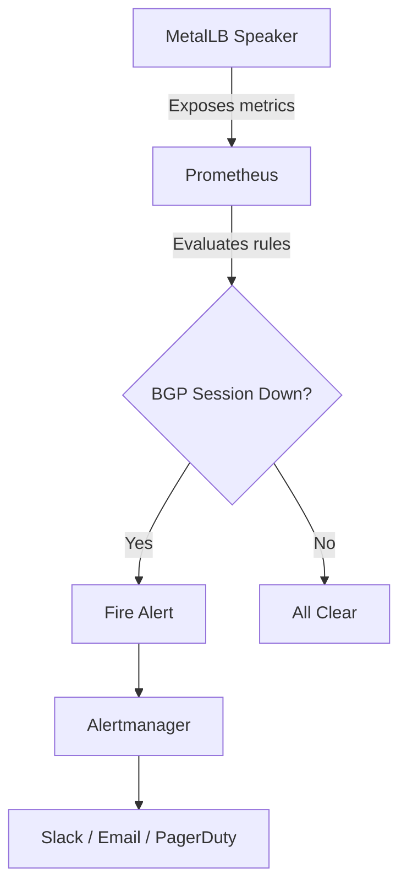
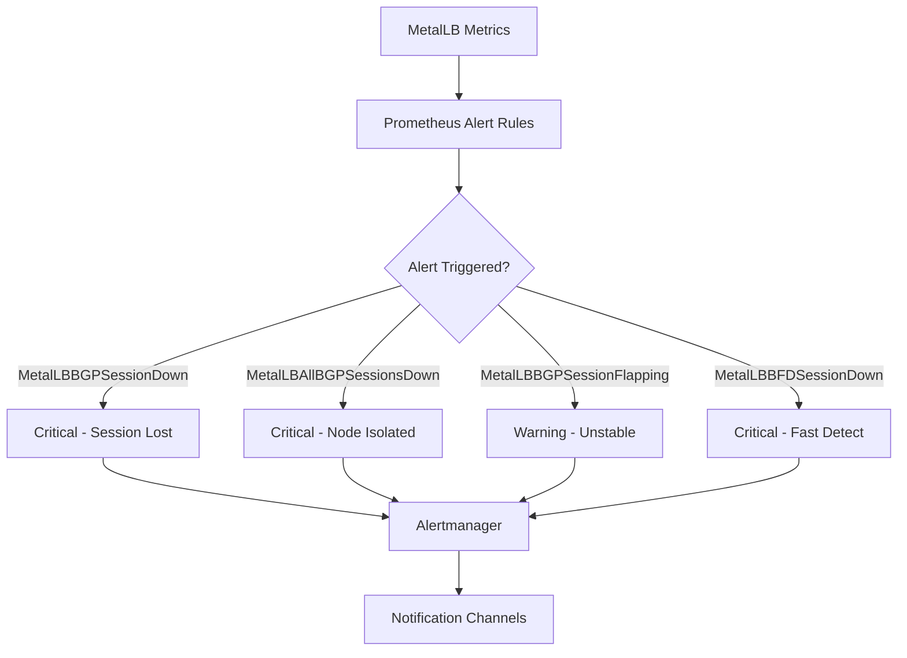

# How to Alert on MetalLB BGP Session Down with Prometheus

Author: [nawazdhandala](https://www.github.com/nawazdhandala)

Tags: Kubernetes, MetalLB, Prometheus, Alerting, BGP

Description: Learn how to set up Prometheus alerts for MetalLB BGP session failures to get notified when peering goes down.

---

When a MetalLB BGP session goes down, your LoadBalancer services lose their route advertisements, and external traffic stops reaching your cluster. A BGP session can drop due to network issues, router restarts, misconfiguration, or speaker pod failures. Setting up Prometheus alerts for BGP session status ensures you get notified within minutes of a session failure, giving you time to respond before users are affected.

## Understanding BGP Session Metrics

MetalLB exposes BGP session metrics through its Prometheus endpoint. The most important metric is `metallb_bgp_session_up`, which reports the state of each BGP peering session.



## Step 1: Verify Metrics Are Available

Before writing alert rules, confirm that Prometheus is scraping MetalLB metrics:

```bash
# Port-forward to Prometheus and query for BGP metrics
kubectl port-forward -n monitoring svc/prometheus 9090:9090

# Query BGP session status
# Each result shows a peer-node combination with value 1 (up) or 0 (down)
curl -s 'http://localhost:9090/api/v1/query?query=metallb_bgp_session_up' \
  | jq '.data.result[] | {peer: .metric.peer, node: .metric.node, value: .value[1]}'
```

```bash
# Example output when all sessions are healthy:
# { "peer": "10.0.0.1", "node": "worker-1", "value": "1" }
# { "peer": "10.0.0.1", "node": "worker-2", "value": "1" }
# { "peer": "10.0.0.1", "node": "worker-3", "value": "1" }
```

## Step 2: Create Prometheus Alert Rules

Create a PrometheusRule resource with alerts for BGP session failures:

```yaml
# metallb-alerts.yaml
# Prometheus alerting rules for MetalLB BGP session monitoring
apiVersion: monitoring.coreos.com/v1
kind: PrometheusRule
metadata:
  name: metallb-bgp-alerts
  namespace: metallb-system
  labels:
    # Match your Prometheus Operator's ruleSelector labels
    prometheus: kube-prometheus
    role: alert-rules
spec:
  groups:
    - name: metallb-bgp
      rules:
        # Alert when any BGP session is down for more than 2 minutes
        # This catches short-lived session resets that resolve on their own
        - alert: MetalLBBGPSessionDown
          expr: metallb_bgp_session_up == 0
          for: 2m
          labels:
            severity: critical
          annotations:
            summary: "MetalLB BGP session down on {{ $labels.node }}"
            description: >
              BGP session between node {{ $labels.node }} and peer
              {{ $labels.peer }} has been down for more than 2 minutes.
              LoadBalancer services announced from this node may be
              unreachable from external networks.
            runbook_url: "https://your-wiki.example.com/metallb-bgp-down"

        # Alert when all BGP sessions on a node are down
        # This is more severe because the node has no external connectivity
        - alert: MetalLBAllBGPSessionsDownOnNode
          expr: >
            count by (node) (metallb_bgp_session_up == 0)
            ==
            count by (node) (metallb_bgp_session_up)
          for: 1m
          labels:
            severity: critical
          annotations:
            summary: "All MetalLB BGP sessions down on {{ $labels.node }}"
            description: >
              All BGP sessions on node {{ $labels.node }} are down.
              No LoadBalancer services can be reached through this node.

        # Alert when BGP sessions are flapping
        # Frequent state changes indicate an unstable connection
        - alert: MetalLBBGPSessionFlapping
          expr: changes(metallb_bgp_session_up[10m]) > 4
          for: 5m
          labels:
            severity: warning
          annotations:
            summary: "MetalLB BGP session flapping on {{ $labels.node }}"
            description: >
              BGP session between node {{ $labels.node }} and peer
              {{ $labels.peer }} has changed state more than 4 times
              in the last 10 minutes. This indicates an unstable connection.
```

```bash
# Apply the alert rules
kubectl apply -f metallb-alerts.yaml

# Verify the rules are loaded by Prometheus
kubectl port-forward -n monitoring svc/prometheus 9090:9090
# Check http://localhost:9090/rules for the metallb-bgp group
```

## Step 3: Alert on BGP Update Anomalies

Beyond session up/down, you should also alert on unusual BGP update patterns:

```yaml
# Additional alerting rules for BGP traffic anomalies
spec:
  groups:
    - name: metallb-bgp-traffic
      rules:
        # Alert when no BGP updates are being sent
        # This could indicate a stuck speaker or configuration issue
        - alert: MetalLBNoBGPUpdates
          expr: >
            rate(metallb_bgp_updates_total[15m]) == 0
            and metallb_bgp_session_up == 1
          for: 30m
          labels:
            severity: warning
          annotations:
            summary: "No BGP updates from {{ $labels.node }} to {{ $labels.peer }}"
            description: >
              Node {{ $labels.node }} has an active BGP session with
              {{ $labels.peer }} but has not sent any updates in 30 minutes.
              This might be normal if no services changed, but could indicate
              a stuck speaker.

        # Alert when BGP notification messages are being sent
        # Notifications indicate protocol errors or session resets
        - alert: MetalLBBGPNotifications
          expr: rate(metallb_bgp_notifications_sent[5m]) > 0
          for: 5m
          labels:
            severity: warning
          annotations:
            summary: "BGP notifications sent from {{ $labels.node }}"
            description: >
              Node {{ $labels.node }} is sending BGP notification messages
              to peer {{ $labels.peer }}. This typically indicates protocol
              errors or intentional session resets.
```

## Step 4: Alert on BFD Session Failures

If you use BFD (Bidirectional Forwarding Detection) for fast failure detection, add BFD-specific alerts:

```yaml
# BFD alerting rules
spec:
  groups:
    - name: metallb-bfd
      rules:
        # Alert when a BFD session goes down
        # BFD detects failures faster than BGP keepalives
        - alert: MetalLBBFDSessionDown
          expr: metallb_bfd_session_up == 0
          for: 1m
          labels:
            severity: critical
          annotations:
            summary: "MetalLB BFD session down on {{ $labels.node }}"
            description: >
              BFD session on node {{ $labels.node }} to peer
              {{ $labels.peer }} is down. The associated BGP session
              may follow shortly.

        # Alert on increasing BFD down events
        - alert: MetalLBBFDSessionFlapping
          expr: rate(metallb_bfd_session_down_events[10m]) > 0
          for: 5m
          labels:
            severity: warning
          annotations:
            summary: "BFD session flapping on {{ $labels.node }}"
            description: >
              BFD session on node {{ $labels.node }} has experienced
              down events in the last 10 minutes, indicating network
              instability.
```



## Conclusion

Prometheus alerting for MetalLB BGP sessions is essential for any production deployment using BGP mode. The four key alerts are: session down (critical), all sessions down on a node (critical), session flapping (warning), and no updates sent (warning). Combined with BFD session alerts, you get comprehensive coverage of MetalLB's BGP health.

Always test your alerts by simulating failures in a staging environment before relying on them in production. An alert that has never fired is an alert you cannot trust.

For an additional layer of monitoring that validates end-to-end connectivity rather than just BGP metrics, consider [OneUptime](https://oneuptime.com). While Prometheus alerts tell you that a BGP session is down, OneUptime tells you that your service is actually unreachable from external networks, providing the user-facing perspective that internal metrics cannot capture. Combining both approaches gives you the most reliable alerting coverage for your MetalLB infrastructure.
