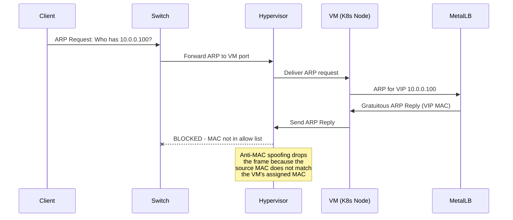
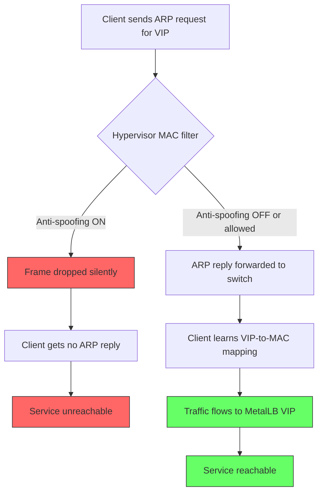

# How to Fix Anti-MAC Spoofing Blocking MetalLB L2 Traffic

Author: [nawazdhandala](https://www.github.com/nawazdhandala)

Tags: Kubernetes, MetalLB, MAC Spoofing, Virtualization, Layer 2, Networking

Description: Learn how to fix MetalLB Layer 2 traffic being blocked by anti-MAC spoofing features on hypervisors like VMware, Hyper-V, and cloud platforms.

---

If you run MetalLB in Layer 2 mode on virtual machines, there is a good chance your LoadBalancer services are silently failing. The culprit is almost always anti-MAC spoofing. Hypervisors like VMware ESXi, Microsoft Hyper-V, and cloud platforms like Proxmox enforce MAC address filtering by default. MetalLB L2 mode relies on gratuitous ARP replies that originate from a MAC address the hypervisor does not recognize, so the traffic gets dropped before it ever reaches the network.

This post walks through exactly why this happens, how to diagnose it, and how to fix it across the most common virtualization platforms.

## Why MetalLB L2 Mode Triggers Anti-MAC Spoofing

MetalLB in Layer 2 mode works by having one node in your cluster claim a virtual IP address. That node responds to ARP requests for the VIP using its own MAC address. When failover occurs, a different node takes over the VIP and sends a gratuitous ARP to update the network.

The problem is that the VIP does not belong to any physical NIC that the hypervisor assigned. The hypervisor sees ARP traffic from a MAC address it did not provision and flags it as MAC spoofing.



## How to Diagnose the Problem

Before changing any hypervisor settings, confirm that anti-MAC spoofing is actually the issue.

### Step 1: Check MetalLB speaker logs

```bash
# Check the MetalLB speaker pods for ARP announcement activity
# The speaker is responsible for sending gratuitous ARP replies
kubectl logs -n metallb-system -l app=metallb-speaker --tail=100
```

If you see lines like `"announcing from node"` but external clients still cannot reach the VIP, the ARP replies are likely being dropped at the hypervisor level.

### Step 2: Verify ARP visibility from outside the cluster

From a machine on the same Layer 2 segment (but outside the cluster), run:

```bash
# Watch for ARP replies on the network interface
# Replace eth0 with your actual interface name
# Replace 10.0.0.100 with your MetalLB VIP
sudo tcpdump -i eth0 -n arp host 10.0.0.100
```

If you see no ARP replies at all, the hypervisor is dropping them.

### Step 3: Check the ARP table on the client machine

```bash
# Display the ARP cache to see if the VIP has a MAC entry
# A missing or incomplete entry confirms ARP replies are not arriving
arp -n | grep 10.0.0.100
```

An incomplete or missing entry confirms the gratuitous ARP never made it through.

## The Flow With and Without the Fix

Here is what happens once anti-MAC spoofing is disabled or configured to allow MetalLB traffic:



## Fix for VMware ESXi / vSphere

VMware calls this feature "Forged Transmits" and "MAC Address Changes." Both must be set to Accept.

### Option A: vSphere Web Client

1. Navigate to the host or distributed switch.
2. Select the port group your VMs use.
3. Under Security Policy, set:
   - **Promiscuous Mode**: Reject (leave as default)
   - **MAC Address Changes**: Accept
   - **Forged Transmits**: Accept

### Option B: ESXi CLI

```bash
# List all virtual switches and their current security policies
# Look for your port group name in the output
esxcli network vswitch standard policy security get -v vSwitch0

# Allow MAC address changes on the virtual switch
# This lets the VM use MAC addresses not originally assigned to it
esxcli network vswitch standard policy security set \
  -v vSwitch0 \
  --allow-mac-change true

# Allow forged transmits on the virtual switch
# This permits outgoing frames with a source MAC different from the vNIC
esxcli network vswitch standard policy security set \
  -v vSwitch0 \
  --allow-forged-transmits true
```

### Option C: PowerCLI (for distributed switches)

```powershell
# Connect to your vCenter server
# Replace vcenter.example.com with your actual vCenter hostname
Connect-VIServer -Server vcenter.example.com

# Get the distributed port group used by your Kubernetes VMs
# Replace "K8s-PortGroup" with your actual port group name
$pg = Get-VDPortgroup -Name "K8s-PortGroup"

# Configure the security policy to allow MetalLB traffic
# ForgedTransmits: allows frames with non-assigned source MAC
# MacChanges: allows the VM to change its effective MAC address
$pg | Get-VDSecurityPolicy | Set-VDSecurityPolicy `
  -ForgedTransmits $true `
  -MacChanges $true
```

## Fix for Microsoft Hyper-V

Hyper-V uses a setting called "Enable MAC address spoofing" on each virtual network adapter.

### PowerShell

```powershell
# Enable MAC spoofing on a specific VM's network adapter
# Replace "k8s-node-1" with your VM name
# This allows the VM to send traffic with any source MAC address
Set-VMNetworkAdapter -VMName "k8s-node-1" -MacAddressSpoofing On

# To apply this to all Kubernetes node VMs at once,
# filter by a naming convention and enable spoofing on each
Get-VM | Where-Object { $_.Name -like "k8s-node-*" } | ForEach-Object {
    # Enable MAC spoofing on every network adapter attached to the VM
    Set-VMNetworkAdapter -VMName $_.Name -MacAddressSpoofing On
    Write-Host "Enabled MAC spoofing on $($_.Name)"
}
```

You can also do this through Hyper-V Manager:

1. Right-click the VM and select Settings.
2. Expand the Network Adapter.
3. Click Advanced Features.
4. Check "Enable MAC address spoofing."

## Fix for Proxmox VE

Proxmox does not have a single toggle for MAC spoofing. Instead, you need to configure the bridge to skip MAC learning or disable the firewall MAC filter.

### Option A: Disable the firewall MAC filter

```bash
# Edit the VM's configuration file
# Replace 100 with your actual VM ID
# The configuration lives in /etc/pve/qemu-server/
nano /etc/pve/qemu-server/100.conf
```

Find the network line and add `macfilter=0`:

```ini
# Before: standard network configuration with MAC filtering enabled
# net0: virtio=AA:BB:CC:DD:EE:FF,bridge=vmbr0

# After: MAC filtering disabled so MetalLB ARP replies pass through
net0: virtio=AA:BB:CC:DD:EE:FF,bridge=vmbr0,macfilter=0
```

### Option B: Use an Open vSwitch bridge

If you use Open vSwitch instead of the default Linux bridge, you can add a rule to allow unknown MACs:

```bash
# Add an OVS port with VLAN trunk mode and no MAC restrictions
# Replace vmbr0 with your OVS bridge name
# Replace tap100i0 with your VM's tap interface
ovs-vsctl set port tap100i0 other-config:mac-restriction=false
```

## Fix for KVM / libvirt (without Proxmox)

If you run KVM with libvirt directly, edit the VM's XML definition:

```xml
<!-- VM network interface configuration for libvirt/KVM -->
<!-- The trustGuestRxFilters='yes' attribute tells libvirt -->
<!-- to trust MAC address changes made by the guest OS -->
<interface type='bridge'>
  <mac address='52:54:00:aa:bb:cc'/>
  <source bridge='br0'/>
  <model type='virtio'/>
  <!-- Allow the guest to use MAC addresses not assigned to this interface -->
  <trustGuestRxFilters>yes</trustGuestRxFilters>
</interface>
```

Apply the change:

```bash
# Edit the VM's XML definition in your default text editor
# Replace k8s-node-1 with your VM's domain name
virsh edit k8s-node-1

# After saving, restart the VM to apply the new network settings
virsh shutdown k8s-node-1
virsh start k8s-node-1
```

## Fix for Cloud Providers (AWS, GCP, Azure)

Cloud environments add another layer of MAC filtering at the virtual network level.

### AWS

AWS does not use traditional Layer 2. MetalLB L2 mode will not work on standard EC2 instances. Use MetalLB in BGP mode or switch to AWS-native load balancers.

### GCP

Same as AWS. GCP does not support gratuitous ARP on its virtual network. Use MetalLB BGP mode or GCP load balancers.

### Azure

Azure VMs do not support promiscuous mode or MAC spoofing on standard virtual networks. If you run Kubernetes on Azure bare-metal or nested virtualization with Hyper-V, apply the Hyper-V fix above.

### On-Premises Cloud (OpenStack)

```bash
# Disable port security on the Neutron port attached to your VM
# This allows the port to send/receive traffic with any MAC or IP
# Replace PORT_ID with the actual Neutron port UUID
openstack port set --no-security-groups --disable-port-security PORT_ID
```

## Verifying the Fix

After making changes, verify that ARP replies are now visible:

```bash
# Step 1: Restart MetalLB speakers to force new ARP announcements
# This triggers fresh gratuitous ARP broadcasts for all VIPs
kubectl rollout restart daemonset/speaker -n metallb-system

# Step 2: Watch for ARP traffic from an external machine
# You should now see ARP replies for your VIP address
sudo tcpdump -i eth0 -n arp host 10.0.0.100

# Step 3: Verify the ARP table has been updated with the VIP
# The entry should show a complete MAC address instead of "incomplete"
arp -n | grep 10.0.0.100

# Step 4: Test connectivity to the LoadBalancer service
# Replace with your actual VIP and service port
curl -v http://10.0.0.100:80
```

## Quick Reference Table

| Platform | Setting | Default | Required Value |
|----------|---------|---------|----------------|
| VMware ESXi | Forged Transmits | Reject | Accept |
| VMware ESXi | MAC Address Changes | Reject | Accept |
| Hyper-V | MAC Address Spoofing | Off | On |
| Proxmox | macfilter | 1 (on) | 0 (off) |
| KVM/libvirt | trustGuestRxFilters | no | yes |
| OpenStack | Port Security | Enabled | Disabled |
| AWS/GCP | N/A | N/A | Use BGP mode |

## Common Mistakes to Avoid

**Changing the wrong port group.** On VMware, each port group has its own security policy. Make sure you change the policy on the port group your Kubernetes VMs are actually connected to, not a different one.

**Forgetting to restart MetalLB.** After changing hypervisor settings, MetalLB may not re-announce immediately. Restart the speaker pods to force new gratuitous ARP broadcasts.

**Applying changes to one node only.** MetalLB can fail over to any node in the cluster. Every node VM needs the anti-MAC spoofing fix applied, not just the current leader.

**Enabling promiscuous mode unnecessarily.** You do not need promiscuous mode for MetalLB. Only "Forged Transmits" and "MAC Address Changes" are required on VMware. Promiscuous mode introduces a security risk with no benefit for this use case.

## Conclusion

Anti-MAC spoofing is a sensible default for hypervisors, but it directly conflicts with how MetalLB Layer 2 mode operates. The fix is straightforward once you know which setting to change on your platform. Disable MAC filtering for your Kubernetes VM port groups, restart the MetalLB speakers, and verify ARP replies are reaching the network.

If you are running Kubernetes on bare metal or in virtualized environments and need full observability into your cluster, services, and network health, check out [OneUptime](https://oneuptime.com). OneUptime provides open-source infrastructure monitoring, incident management, and status pages so you can catch issues like silent traffic drops before your users do.
