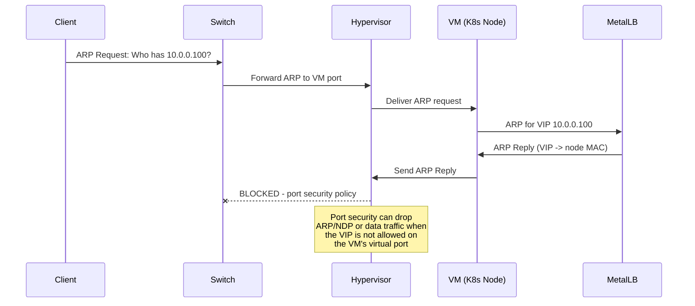
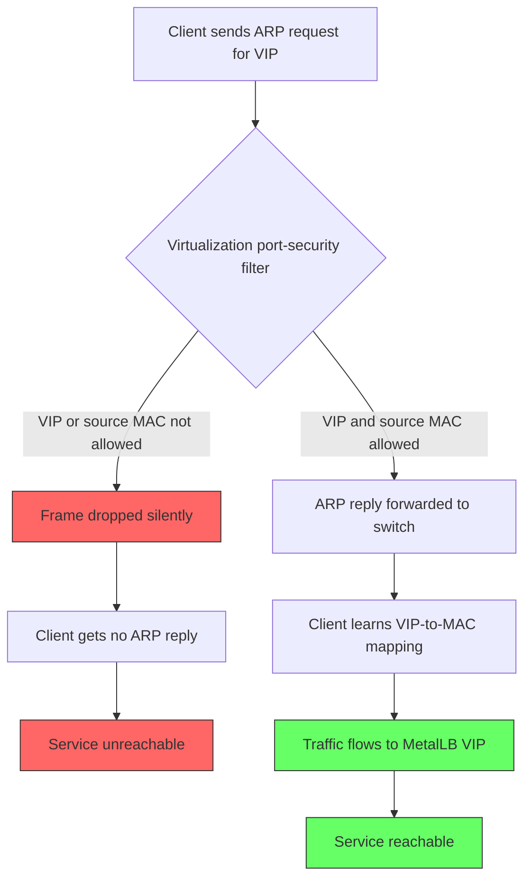

# How to Fix Anti-MAC Spoofing Blocking MetalLB L2 Traffic

Author: [nawazdhandala](https://www.github.com/nawazdhandala)

Tags: Kubernetes, MetalLB, MAC Spoofing, Virtualization, Layer 2, Networking

Description: Learn how to fix MetalLB Layer 2 traffic being blocked by anti-MAC spoofing features on hypervisors like VMware, Hyper-V, and cloud platforms.

---

If you run MetalLB in Layer 2 mode on virtual machines, one possible reason your LoadBalancer services can silently fail is virtualization port security. Normal MetalLB L2 mode does not create a separate virtual MAC address: the elected node answers ARP requests for the service IP with the node interface's MAC address. However, hypervisor firewall rules, IP/MAC spoofing filters, OpenStack port security, or nested virtualization setups can still block the ARP/NDP traffic that MetalLB relies on.

This post walks through exactly why this happens, how to diagnose it, and how to fix it across the most common virtualization platforms.

## Why MetalLB L2 Mode Can Trigger Port-Security Filters

MetalLB in Layer 2 mode works by having one node in your cluster claim a virtual IP address. That node responds to ARP requests for the VIP using its own MAC address. When failover occurs, a different node takes over the VIP and sends a gratuitous ARP to update the network.

The problem is that the VIP is not one of the IP addresses that the virtualization platform assigned to the VM. Strict port-security systems can treat ARP/NDP or data traffic for that unassigned IP address as spoofing. In nested virtualization, bridge, macvtap, or appliance-style configurations, you can also run into MAC anti-spoofing if frames leave the VM with a source MAC different from the VM's configured vNIC MAC.


```mermaid
sequenceDiagram
    participant Client
    participant Switch
    participant Hypervisor
    participant VM as VM (K8s Node)
    participant MetalLB

    Client->>Switch: ARP Request: Who has 10.0.0.100?
    Switch->>Hypervisor: Forward ARP to VM port
    Hypervisor->>VM: Deliver ARP request
    VM->>MetalLB: ARP for VIP 10.0.0.100
    MetalLB->>VM: ARP Reply (VIP -> node MAC)
    VM->>Hypervisor: Send ARP Reply
    Hypervisor--xSwitch: BLOCKED - port security policy
    Note over Hypervisor: Port security can drop<br/>ARP/NDP or data traffic when<br/>the VIP is not allowed on<br/>the VM's virtual port
```

## How to Diagnose the Problem

Before changing any hypervisor settings, confirm that port security is actually the issue.

### Step 1: Check MetalLB speaker logs

```bash
# Check the MetalLB speaker pods for ARP announcement activity

# The speaker is responsible for answering ARP/NDP for advertised services
kubectl logs -n metallb-system -l app=metallb,app.kubernetes.io/component=speaker --tail=100
```

If `kubectl describe svc <service-name>` shows an event like `"announcing from node"` but external clients still cannot reach the VIP, the service is being advertised and you should check whether ARP/NDP traffic is leaving the VM and reaching the client network.

### Step 2: Verify ARP visibility from outside the cluster

From a machine on the same Layer 2 segment (but outside the cluster), run:

```bash
# Watch for ARP replies on the network interface
# Replace eth0 with your actual interface name
# Replace 10.0.0.100 with your MetalLB VIP
sudo tcpdump -i eth0 -n arp host 10.0.0.100
```

If you see no ARP replies at all, the problem may be a MetalLB advertisement issue, a host firewall issue, a wrong Layer 2 segment, or a virtualization port-security rule dropping the packets.

### Step 3: Check the ARP table on the client machine

```bash
# Display the ARP cache to see if the VIP has a MAC entry
# A missing or incomplete entry confirms ARP replies are not arriving
arp -n | grep 10.0.0.100
```

An incomplete or missing entry confirms that the client did not learn a MAC address for the VIP.

## The Flow With and Without the Fix

Here is what happens once the relevant port-security rule is disabled or configured to allow MetalLB traffic:


```mermaid
flowchart TD
    A[Client sends ARP request for VIP] --> B{Virtualization port-security filter}
    B -->|VIP or source MAC not allowed| C[Frame dropped silently]
    C --> D[Client gets no ARP reply]
    D --> E[Service unreachable]

    B -->|VIP and source MAC allowed| F[ARP reply forwarded to switch]
    F --> G[Client learns VIP-to-MAC mapping]
    G --> H[Traffic flows to MetalLB VIP]
    H --> I[Service reachable]

    style C fill:#f66,stroke:#333
    style E fill:#f66,stroke:#333
    style H fill:#6f6,stroke:#333
    style I fill:#6f6,stroke:#333
```

## Fix for VMware ESXi / vSphere

VMware calls MAC anti-spoofing controls "Forged Transmits" and "MAC Address Changes." Normal MetalLB L2 replies use the VM's vNIC MAC, so these settings are only needed if your guest or nested networking setup sends frames with a source MAC address different from the vNIC MAC.

### Option A: vSphere Web Client

1. Navigate to the host or distributed switch.
2. Select the port group your VMs use.
3. Under Security Policy, set:
   - **Promiscuous Mode**: Reject (leave as default)
   - **MAC Address Changes**: Accept
   - **Forged Transmits**: Accept

### Option B: ESXi CLI

```bash
# List all virtual switches and their current security policies
# Look for your port group name in the output
esxcli network vswitch standard policy security get -v vSwitch0

# Allow MAC address changes on the virtual switch
# This lets the VM use MAC addresses not originally assigned to it
esxcli network vswitch standard policy security set \
  -v vSwitch0 \
  --allow-mac-change true

# Allow forged transmits on the virtual switch
# This permits outgoing frames with a source MAC different from the vNIC
esxcli network vswitch standard policy security set \
  -v vSwitch0 \
  --allow-forged-transmits true
```

### Option C: PowerCLI (for distributed switches)

```powershell
# Connect to your vCenter server
# Replace vcenter.example.com with your actual vCenter hostname
Connect-VIServer -Server vcenter.example.com

# Get the distributed port group used by your Kubernetes VMs
# Replace "K8s-PortGroup" with your actual port group name
$pg = Get-VDPortgroup -Name "K8s-PortGroup"

# Configure the security policy when your guest sends non-vNIC source MACs
# ForgedTransmits: allows frames with non-assigned source MAC
# MacChanges: allows the VM to change its effective MAC address
$pg | Get-VDSecurityPolicy | Set-VDSecurityPolicy `
  -ForgedTransmits $true `
  -MacChanges $true
```

## Fix for Microsoft Hyper-V

Hyper-V uses a setting called "Enable MAC address spoofing" on each virtual network adapter. Enable it only when the VM is expected to send frames with source MAC addresses other than its assigned virtual adapter MAC, such as nested virtualization or virtual appliances.

### PowerShell

```powershell
# Enable MAC spoofing on a specific VM's network adapter
# Replace "k8s-node-1" with your VM name
# This allows the VM to send traffic with any source MAC address
Set-VMNetworkAdapter -VMName "k8s-node-1" -MacAddressSpoofing On

# To apply this to all Kubernetes node VMs at once,
# filter by a naming convention and enable spoofing on each
Get-VM | Where-Object { $_.Name -like "k8s-node-*" } | ForEach-Object {
    # Enable MAC spoofing on every network adapter attached to the VM
    Set-VMNetworkAdapter -VMName $_.Name -MacAddressSpoofing On
    Write-Host "Enabled MAC spoofing on $($_.Name)"
}
```

You can also do this through Hyper-V Manager:

1. Right-click the VM and select Settings.
2. Expand the Network Adapter.
3. Click Advanced Features.
4. Check "Enable MAC address spoofing."

## Fix for Proxmox VE

Proxmox does not have a single hypervisor-wide toggle for MAC spoofing. If the Proxmox firewall is enabled for the VM, disable the VM firewall's MAC filter or adjust its IP filter rules so the MetalLB VIP is allowed.

### Option A: Disable the firewall MAC filter

```bash
# Edit the VM's firewall configuration file
# Replace 100 with your actual VM ID
# The configuration lives in /etc/pve/firewall/
nano /etc/pve/firewall/100.fw
```

Add or update the `macfilter` option:

```ini
# Disable the Proxmox firewall MAC address filter for this VM
[OPTIONS]
macfilter: 0
```

### Option B: Use an Open vSwitch bridge

Open vSwitch itself does not have a generic `mac-restriction=false` port option. If you use OVS, inspect the bridge and any OpenFlow or Proxmox firewall rules applied to the VM tap port, then remove or adjust the rule that blocks the VIP traffic.

```bash
# Inspect the OVS bridge and flows
# Replace tap100i0 with your VM's tap interface
ovs-vsctl list port tap100i0
ovs-ofctl dump-flows vmbr0
```

## Fix for KVM / libvirt (without Proxmox)

If you run KVM with libvirt directly and use a macvtap/direct interface where the guest changes its MAC or receive filters, edit the VM's XML definition:

```xml
<!-- VM network interface configuration for libvirt/KVM -->
<!-- trustGuestRxFilters='yes' tells libvirt to trust supported -->
<!-- MAC address and receive-filter changes made by the guest OS. -->
<!-- It is supported for virtio with macvtap/direct connections. -->
<interface type='direct' trustGuestRxFilters='yes'>
  <mac address='52:54:00:aa:bb:cc'/>
  <source dev='eth0' mode='bridge'/>
  <model type='virtio'/>
</interface>
```

Apply the change:

```bash
# Edit the VM's XML definition in your default text editor
# Replace k8s-node-1 with your VM's domain name
virsh edit k8s-node-1

# After saving, restart the VM to apply the new network settings
virsh shutdown k8s-node-1
virsh start k8s-node-1
```

## Fix for Cloud Providers (AWS, GCP, Azure)

Cloud environments add another layer of filtering at the virtual network level, and many public clouds do not expose the Layer 2 broadcast domain that MetalLB L2 mode requires.

### AWS

AWS does not use traditional Layer 2. MetalLB L2 mode will not work on standard EC2 instances. Use MetalLB in BGP mode or switch to AWS-native load balancers.

### GCP

Same as AWS. GCP does not support gratuitous ARP on its virtual network. Use MetalLB BGP mode or GCP load balancers.

### Azure

Azure VMs do not support promiscuous mode or MAC spoofing on standard virtual networks. If you run Kubernetes on Azure bare-metal or nested virtualization with Hyper-V, apply the Hyper-V fix above.

### On-Premises Cloud (OpenStack)

```bash
# Disable port security on the Neutron port attached to your VM
# This disables Neutron port security on the port
# Replace PORT_ID with the actual Neutron port UUID
openstack port set --no-security-group --disable-port-security PORT_ID
```

## Verifying the Fix

After making changes, verify that ARP replies are now visible:

```bash
# Step 1: Restart MetalLB speakers to force new ARP announcements
# This triggers fresh gratuitous ARP broadcasts for all VIPs
kubectl rollout restart daemonset/speaker -n metallb-system

# Step 2: Watch for ARP traffic from an external machine
# You should now see ARP replies for your VIP address
sudo tcpdump -i eth0 -n arp host 10.0.0.100

# Step 3: Verify the ARP table has been updated with the VIP
# The entry should show a complete MAC address instead of "incomplete"
arp -n | grep 10.0.0.100

# Step 4: Test connectivity to the LoadBalancer service
# Replace with your actual VIP and service port
curl -v http://10.0.0.100:80
```

## Quick Reference Table

| Platform | Setting | Default | Required Value |
|----------|---------|---------|----------------|
| VMware ESXi | Forged Transmits | Reject | Accept only if non-vNIC source MACs are used |
| VMware ESXi | MAC Address Changes | Reject | Accept only if guest MAC changes are used |
| Hyper-V | MAC Address Spoofing | Off | On only if non-vNIC source MACs are used |
| Proxmox | macfilter | 1 (on) | 0 (off) |
| KVM/libvirt | trustGuestRxFilters | no | yes for supported macvtap/direct guest MAC changes |
| OpenStack | Port Security | Enabled | Disabled |
| AWS/GCP | N/A | N/A | Use BGP mode |

## Common Mistakes to Avoid

**Changing the wrong port group.** On VMware, each port group has its own security policy. Make sure you change the policy on the port group your Kubernetes VMs are actually connected to, not a different one.

**Forgetting to restart MetalLB.** After changing hypervisor settings, MetalLB may not re-announce immediately. Restart the speaker pods to force new gratuitous ARP broadcasts.

**Applying changes to one node only.** MetalLB can fail over to any node in the cluster. Every node VM that can advertise the service needs the relevant port-security fix applied, not just the current leader.

**Enabling promiscuous mode unnecessarily.** You do not need promiscuous mode for MetalLB. VMware's "Forged Transmits" and "MAC Address Changes" settings are only relevant when your VM actually sends or receives frames with MAC addresses different from the configured vNIC MAC. Promiscuous mode introduces a security risk with no benefit for normal MetalLB L2 mode.

## Conclusion

Anti-spoofing and port-security controls are sensible defaults for virtualized networks, but they can conflict with MetalLB Layer 2 mode when they block ARP/NDP or traffic for the service VIP. The fix is straightforward once you know which setting applies on your platform. Allow the MetalLB VIP or the required guest MAC behavior on every Kubernetes VM that can advertise the service, restart the MetalLB speakers, and verify ARP replies are reaching the network.

If you are running Kubernetes on bare metal or in virtualized environments and need full observability into your cluster, services, and network health, check out [OneUptime](https://oneuptime.com). OneUptime provides open-source infrastructure monitoring, incident management, and status pages so you can catch issues like silent traffic drops before your users do.
