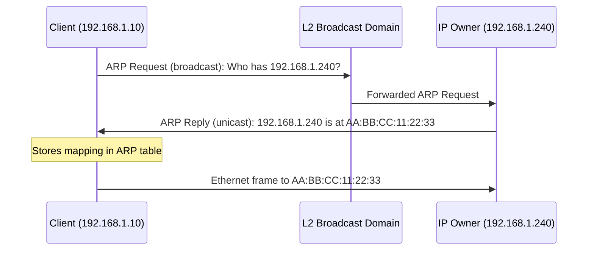
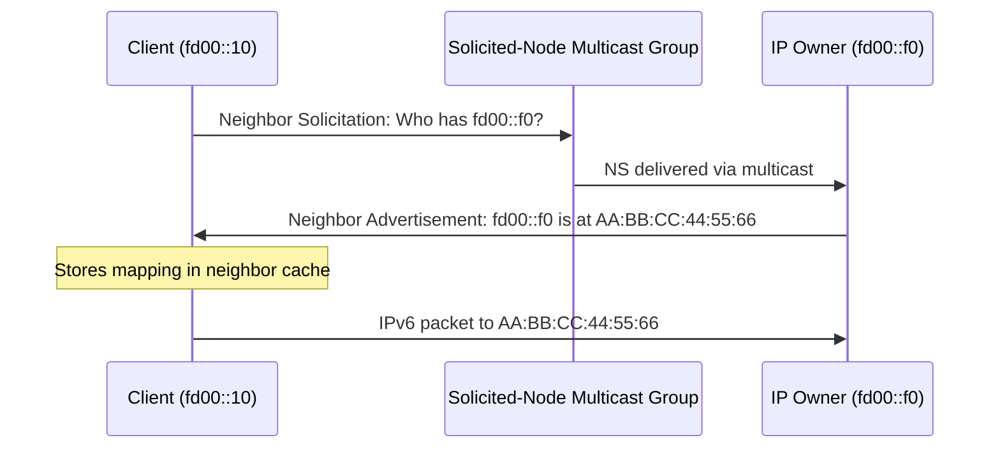
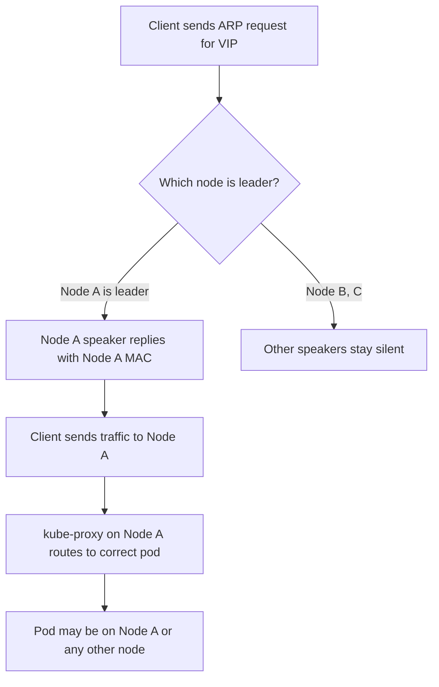
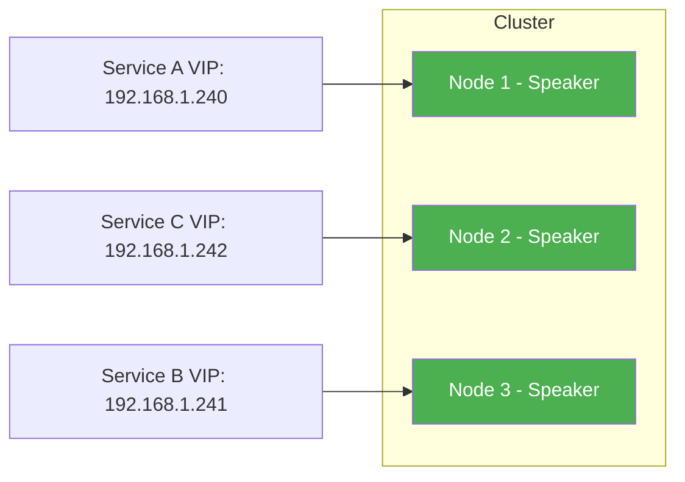
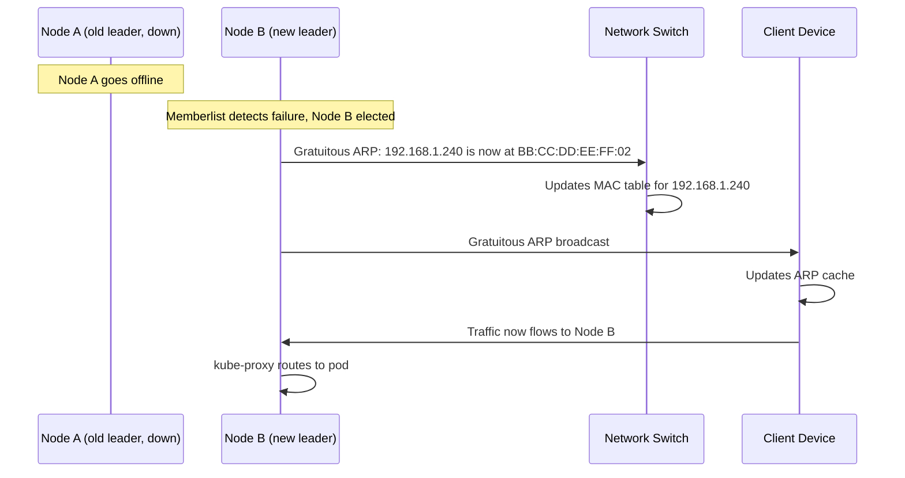
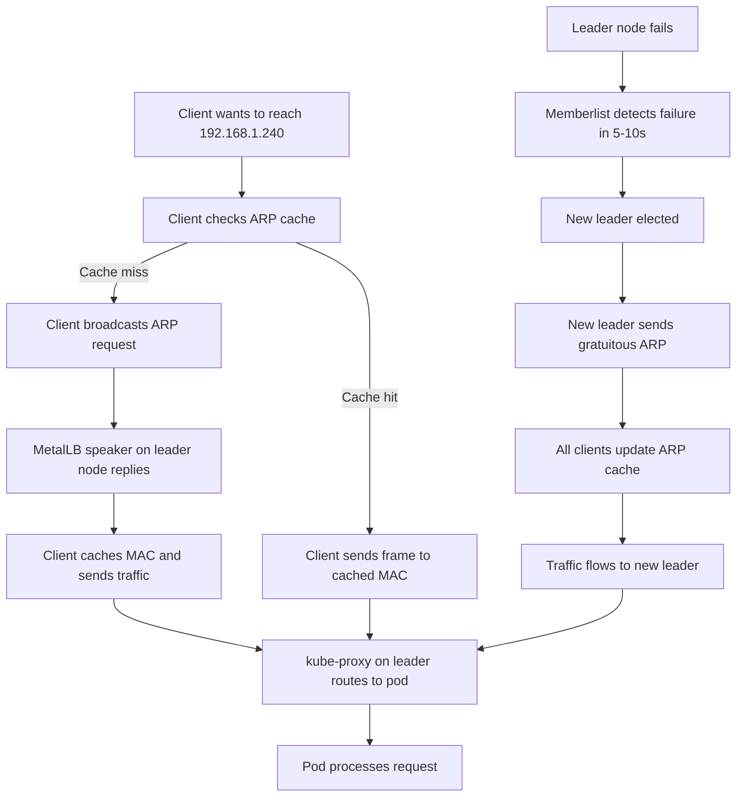

# How to Understand ARP and NDP in MetalLB Layer 2 Mode

Author: [nawazdhandala](https://www.github.com/nawazdhandala)

Tags: Kubernetes, MetalLB, ARP, NDP, IPv6, Layer 2, Networking

Description: Deep dive into how MetalLB uses ARP for IPv4 and NDP for IPv6 in Layer 2 mode. Understand the leader election process, failover behavior, and common networking issues.

---

MetalLB in Layer 2 mode does not need BGP peers or fancy routers. It works by answering questions on the local network: "Who has this IP address?" For IPv4, that question is an ARP request. For IPv6, it is an NDP Neighbor Solicitation. Understanding these two protocols is the key to debugging MetalLB L2 issues.

---

## What Is ARP (Address Resolution Protocol)

ARP maps an IPv4 address to a MAC (hardware) address. Every device on a local Ethernet segment needs the MAC address of the destination before sending a frame. ARP provides that mapping.

The flow is straightforward:

1. A client wants to reach `192.168.1.240`.
2. It broadcasts an ARP request: "Who has 192.168.1.240? Tell me your MAC address."
3. The device that owns `192.168.1.240` replies with its MAC address.
4. The client caches the mapping and sends traffic directly.



The ARP table on the client has a TTL (time to live). Entries expire after a few minutes and get refreshed automatically. You can inspect the table at any time:

```bash
# Show the current ARP table on Linux
# Each entry maps an IPv4 address to a MAC address
arp -n
```

---

## What Is NDP (Neighbor Discovery Protocol)

NDP is the IPv6 equivalent of ARP, but it runs on top of ICMPv6 instead of being its own EtherType. It uses two message types for address resolution:

- **Neighbor Solicitation (NS)** - "Who has this IPv6 address?"
- **Neighbor Advertisement (NA)** - "I have it, here is my MAC address."

NDP uses multicast instead of broadcast. The solicitation goes to a solicited-node multicast address derived from the target IPv6 address, rather than flooding the entire network.



You can inspect the IPv6 neighbor cache (the equivalent of the ARP table) with:

```bash
# Show the IPv6 neighbor cache on Linux
# Displays IPv6-to-MAC mappings and their state (REACHABLE, STALE, etc.)
ip -6 neigh show
```

---

## How MetalLB Uses ARP and NDP

When you create a Kubernetes Service of type `LoadBalancer`, MetalLB assigns it a virtual IP (VIP) from a configured pool. In Layer 2 mode, one node in the cluster becomes the **leader** for that VIP. The leader node's MetalLB speaker responds to ARP requests (IPv4) or NDP Neighbor Solicitations (IPv6) for the VIP, mapping it to the leader node's MAC address.

No node actually configures the VIP on any network interface. The speaker process intercepts and responds to the protocol messages directly.



Key behaviors:

- Only the leader responds. All other speakers ignore ARP/NDP for that VIP.
- Traffic for the VIP always arrives at the leader node first, then kube-proxy distributes it to the correct pod.
- The pod serving the request may be on a different node entirely. In that case, kube-proxy forwards the packet across the cluster network.

---

## Leader Election Per Service

MetalLB does not elect a single leader for all services. It runs a **separate leader election for each service VIP**. This means different services can land on different nodes, spreading the load across the cluster.

The election uses a consistent hash. Each MetalLB speaker announces itself as a candidate, and the speakers converge on a single leader per VIP through memberlist-based coordination.



You can check which node is the current leader for a service by looking at MetalLB speaker logs:

```bash
# Check which node is the leader for a specific VIP
# Look for "handling" or "leader" entries in the speaker logs
kubectl logs -n metallb-system -l app=metallb,component=speaker --all-containers \
  | grep "192.168.1.240"
```

You can also inspect the speaker events on the service:

```bash
# Show events on a LoadBalancer service
# MetalLB attaches events indicating the assigned node
kubectl describe svc my-service | grep -A5 "Events"
```

---

## What Happens During Failover

When the leader node goes down (crash, reboot, network partition), MetalLB must move the VIP to a surviving node. The failover process has three phases:

### 1. Detection

The remaining speakers detect the leader is gone through memberlist health checks. Detection typically takes 5 to 10 seconds, depending on configuration.

### 2. Re-election

A new leader is elected for the orphaned VIP among the surviving speakers.

### 3. Gratuitous ARP / Unsolicited Neighbor Advertisement

The new leader sends a **gratuitous ARP** (IPv4) or an **unsolicited Neighbor Advertisement** (IPv6) to the network. These are special messages that update every device's ARP table or neighbor cache without being asked.



A gratuitous ARP is an ARP reply sent without a preceding request. The sender and target IP in the packet are both the VIP. Its purpose is to force all devices on the network to update their cached MAC address for that IP.

For IPv6, the unsolicited Neighbor Advertisement sets the **Override flag**, telling recipients to replace their existing cache entry immediately.

---

## ARP Table Behavior on Clients

After a failover, clients hold a stale ARP entry until the gratuitous ARP arrives or their entry expires naturally. This creates a brief window where traffic goes to the old (dead) node.

Common ARP cache timeouts:

| Operating System | Default ARP Cache Timeout |
|-----------------|--------------------------|
| Linux           | 30 to 60 seconds         |
| macOS           | 20 minutes               |
| Windows         | 15 to 45 seconds         |

MetalLB's gratuitous ARP typically updates clients within milliseconds of re-election. But some network equipment (managed switches, firewalls) may take longer to flush their MAC tables.

You can force-clear a stale ARP entry on a Linux client:

```bash
# Delete a specific ARP entry to force re-resolution
# Useful when debugging failover issues
sudo arp -d 192.168.1.240

# For IPv6, flush a neighbor cache entry
sudo ip -6 neigh flush fd00::f0
```

---

## Debugging with arping

`arping` sends ARP requests manually and shows you which MAC address responds. This is the single most useful tool for debugging MetalLB L2 issues.

```bash
# Send ARP requests to the VIP and see which MAC responds
# The MAC address tells you which node is the current leader
sudo arping -c 4 192.168.1.240
```

Expected output:

```
ARPING 192.168.1.240 from 192.168.1.10 eth0
Unicast reply from 192.168.1.240 [AA:BB:CC:DD:EE:01]  0.987ms
Unicast reply from 192.168.1.240 [AA:BB:CC:DD:EE:01]  1.023ms
```

If you see replies from **two different MAC addresses**, something is wrong. Either two speakers both think they are the leader, or another device on the network is claiming the same IP. Cross-reference the MAC against `ip link show` on each node to identify which hosts are responding.

---

## Debugging with tcpdump

`tcpdump` lets you capture ARP and NDP traffic on the wire. Run it on a node to see if the speaker is sending and receiving correctly.

```bash
# Capture ARP packets for the VIP on eth0
sudo tcpdump -i eth0 -n arp host 192.168.1.240

# Filter for gratuitous ARP (sender and target IP are the same)
sudo tcpdump -i eth0 -n 'arp and arp[6:2] = 2' | grep "192.168.1.240"

# Capture ICMPv6 NDP packets (type 135 = NS, 136 = NA)
sudo tcpdump -i eth0 -n 'icmp6 and (ip6[40] == 135 or ip6[40] == 136)'
```

---

## Common Issues and Fixes

**VIP not reachable** - Verify speakers are running, the IPAddressPool and L2Advertisement exist, and the service has an external IP:

```bash
# Quick health check for MetalLB L2 setup
kubectl get pods -n metallb-system -l component=speaker -o wide
kubectl get ipaddresspools,l2advertisements -n metallb-system
kubectl get svc my-service -o wide
```

**Duplicate IP on the network** - Another device already claims the VIP, causing intermittent connectivity. Use duplicate address detection to confirm:

```bash
# Returns non-zero if another host responds (IP already in use)
sudo arping -D -c 3 192.168.1.240
```

**Slow failover** - Lower the memberlist probe interval in MetalLB's Helm values or ConfigMap to detect failures faster. Monitor speaker logs during a failover to measure actual detection and re-election times.

---

## Putting It All Together

Here is the complete lifecycle of a request to a MetalLB L2 service, from first connection through a failover event:



The entire failover window is typically under 10 seconds. The gratuitous ARP ensures clients switch over immediately once the new leader is ready, without waiting for their ARP cache to expire.

---

## Summary

ARP and NDP are the foundation of MetalLB Layer 2 mode. On failover, gratuitous ARP (or unsolicited Neighbor Advertisement for IPv6) forces the network to update its mappings instantly. Use `arping` and `tcpdump` to debug which node is responding and whether failover updates are reaching the network.

If you are running MetalLB in production, you need visibility into failover events and service availability. [OneUptime](https://oneuptime.com) provides monitoring, alerting, and status pages for your Kubernetes infrastructure, so you know the moment a VIP fails over and can track how long your services were affected.
